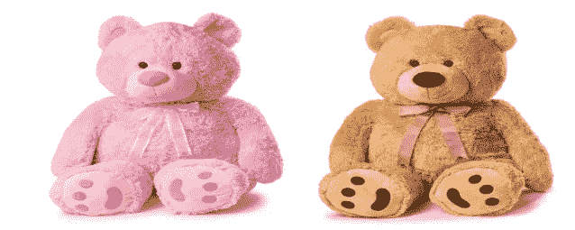
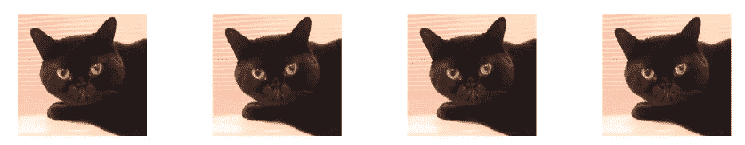
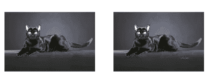
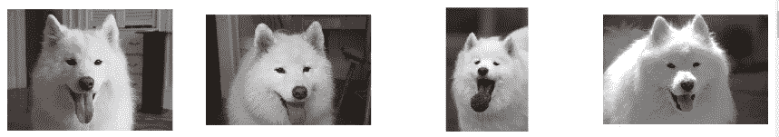
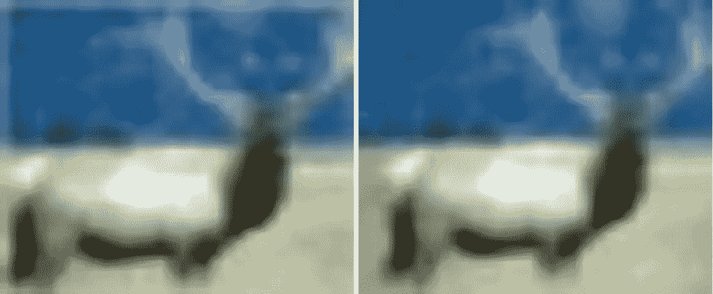
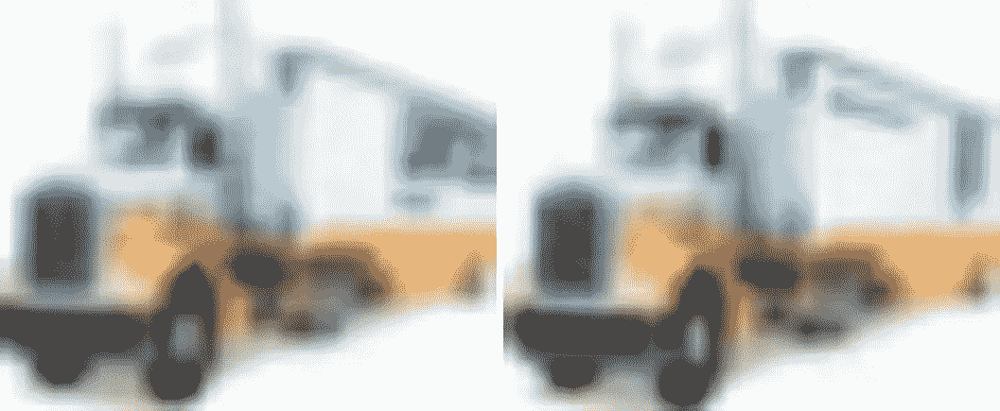
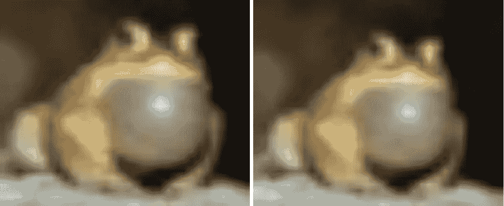
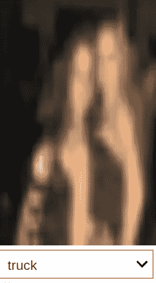

# 如何为数据集构建图像重复查找器

> 原文：<https://towardsdatascience.com/how-to-build-an-image-duplicate-finder-f8714ddca9d2?source=collection_archive---------12----------------------->

## 借助神经网络隐藏层执行图像相似性分析



This is a duplicate found by the algorithm

当你从网上下载图片时，你通常会发现有噪音的数据。此外，流行的图片到处都是。一个接一个地查看它们并试图找到重复项来清理数据集是很乏味的。

考虑到这个问题，我构建了一个重复查找器来为您查找重复项，因此您只需选择是否要删除它们。你可以在 [fastai](https://github.com/fastai/fastai) 库中找到代码。在这篇文章中，我将解释我是如何构建这个工具的。

## 步骤 1:获取激活

我们通常使用 CNN 对图像进行分类，我们只对网络末端 softmax 的输出感兴趣，它会告诉我们网络认为我们图像的标签是什么。在这种情况下，我们将比较网络的内层，希望网络学习的一些特征有助于找到相似的图像。为了实现这一点，我利用了 fastai 库中强大的 [*钩子*](https://docs.fast.ai/callbacks.hooks.html) 功能，它允许我们保存网络中任何子层的激活。

```
hook = hook_output(learn.model[0][7][2])
```

我使用的激活是 Resnet 架构的最后一个卷积块的输出，因为我注意到它们在经验上工作得更好。

## **第二步:合并**

您可能知道，CNN 中的隐藏层有四个维度:批量大小、特征数量、高度和宽度。让我们假设我们正在谈论一个特定的图像，或者 bs=1。例如，在 Resnet 50 的情况下，最后一层的输出将具有维度( *1，512，7，7)。*由于这里的维数非常高，计算相似度将非常耗时，这对用户来说是一种痛苦。这个问题的答案是用[池](http://deeplearning.stanford.edu/tutorial/supervised/Pooling/)。我们将汇集每一个 *7x7* 矩阵，从而得到一个维度为*的张量(1，512，pool_dim，pool_dim)。*

我使用的池函数是 AdaptiveConcatPooling(自适应平均池和自适应最大池连接在一起),我使用的池维数是 4，因为我发现它是速度和性能的良好组合。

## 第三步:展平

我们用一个四维张量结束了最后一步。然而，为了计算不同例子之间的相似性，我们需要一维张量(向量)。我们将展平每个图像的激活，以获得大小为 *pool_dim x pool_dim x 512* 的向量，并将每个图像的向量连接成一个具有维度的矩阵( *n_exs，vector_dim* )。现在我们有了每个 *n_exs* 图像的特征向量。是时候计算相似度了！

```
def get_actns(learn:Learner, dl:DataLoader, hook:Hook, pool=AdaptiveConcatPool2d, pool_dim:int=4, train:bool=True):
"""Gets the activations at the layer specified by `hook`, 
   applies `pool` of dim `pool_dim` and concatenates.""" pool = pool(pool_dim) 

    actns = []
    learn.model.eval()
    with torch.no_grad():
        for i,(xb,yb) in enumerate(dl):
            learn.model(xb)
            actns.append((hook.stored).cpu())

    return pool(torch.cat(actns)).view(len(dl.x), -1)
```

## 第四步:计算相似度

为了计算每个特征向量之间的相似度，我们将使用[余弦相似度函数](https://en.wikipedia.org/wiki/Cosine_similarity)。请注意，如果我们将每个向量与其他向量相结合，所有的相似性都会被计算两次。还要注意，如果我们计算一个向量与其自身的相似性，相似性的度量显然是最高的。因此，对于我们的相似性矩阵，我们将用零替换对角线和右上部分。

```
def comb_similarity(t1: torch.Tensor, t2: torch.Tensor, sim_func=nn.CosineSimilarity(dim=0)):
    """Computes the similarity function `sim_func` between each embedding
       of `t1` and `t2` matrices.
       t1` and `t2` should have dimensions [n_embeddings, n_features]."""

    self_sim = False
    if torch.equal(t1, t2): self_sim = True

    sims = np.zeros((t1.shape[0], t2.shape[0]))
    for idx1 in range(t1.shape[0]):
        for idx2 in range(t2.shape[0]):
            if not self_sim or idx1>idx2:
                ex1 = t1[idx1,:]
                ex2 = t2[idx2,:]
                sims[idx1][idx2] = sim_func(ex1,ex2)

    return sims
```

## 第五步:结果

看看我们的方法行不行！让我们看看我们数据集中最相似的图像，看看我们是否能找出一些重复的(我在这里贴了一些截图，更多请访问我的 [repo](https://github.com/fpingham/duplicate-finder/blob/master/duplicates_v5.ipynb) )。我用来测试算法的数据集是牛津-IIIT 宠物数据集，有 37 种狗和猫。



Perfect duplicates. This image was included 5 times in the dataset.



Duplicates (one has a signature)



Similar but not duplicates

我还用 CIFAR10 测试了该算法，cifar 10 是计算机视觉中一个著名的数据集，看我能否找到一些重复的数据。这些是我发现的一些例子:



Perfect duplicate



Nearly a duplicate truck but with different logos



Not a duplicate, more like data augmentation

我还运行了 relabeler 小部件，这里有一个额外的有趣发现:



Not a truck

一旦我们有了网络对复制品的建议，我们该怎么处理它们呢？嗯，我们应该选择那些实际上是重复的，并从我们的数据集中删除它们，因为有重复会导致网络对这些图像给予太多的重视。怎样才能轻松删除重复？有了 fastai 的互动小工具就非常容易了！您可以通过运行以下命令来尝试一下:

```
from fastai.widgets import *ds, fns_idxs = DatasetFormatter.from_similars('learner')
ImageCleaner(ds, fns_idxs, path, duplicates=True)
```

想用吗？用 CIFAR 查看我的[教程笔记本](https://github.com/fpingham/dataset-cleaner)。