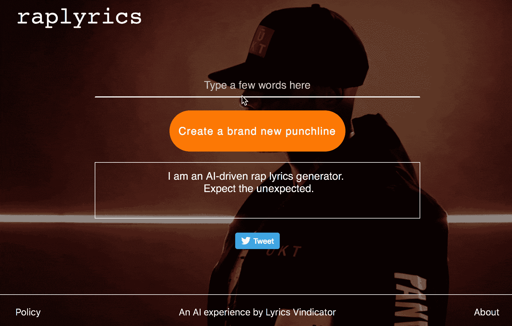
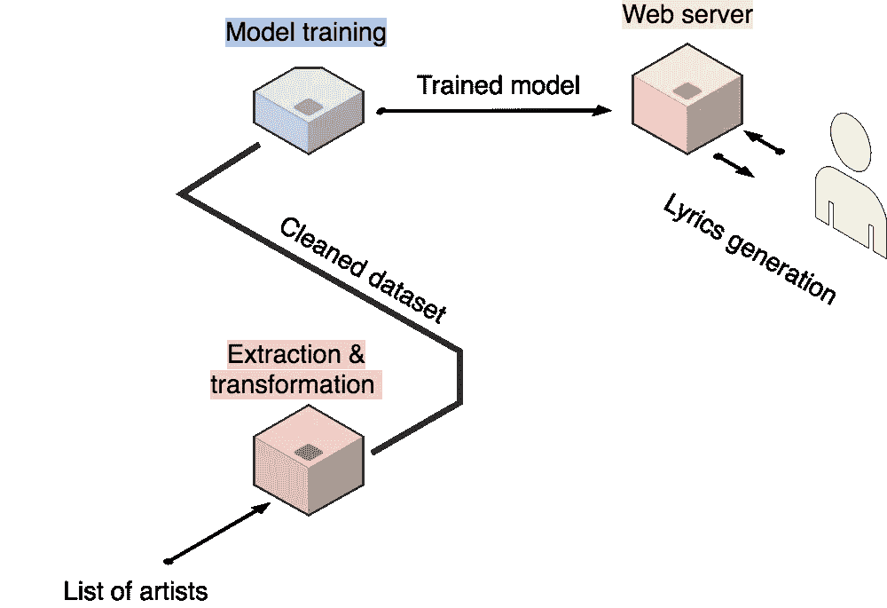
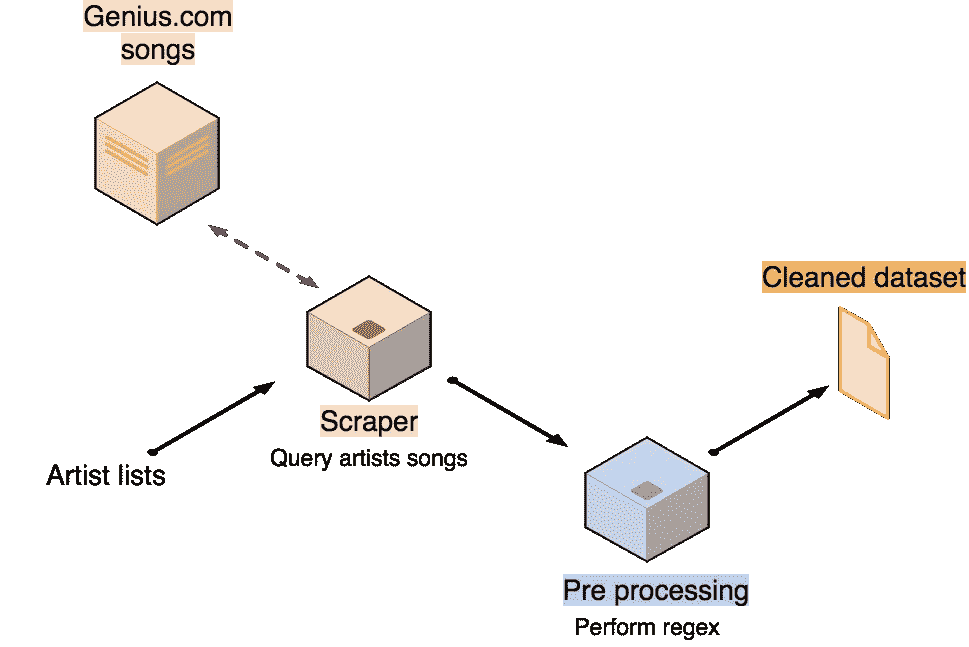
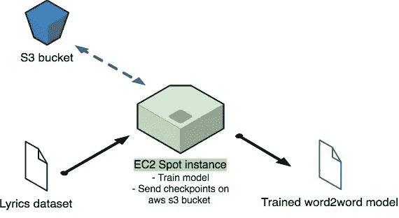
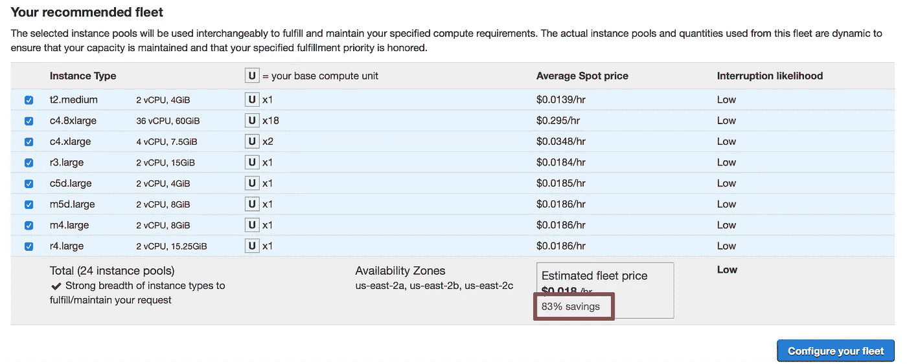
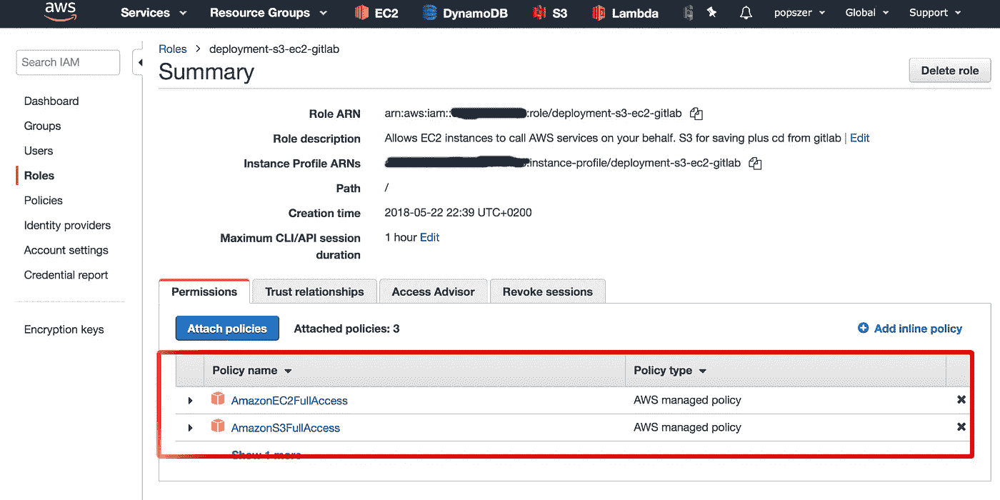
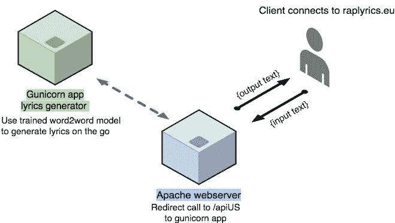
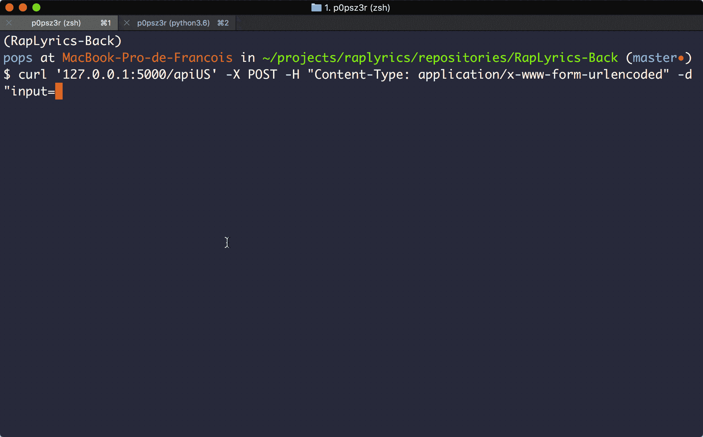

# 如何构建和部署歌词生成模型——与框架无关

> 原文：<https://towardsdatascience.com/how-to-build-and-deploy-a-lyrics-generation-model-framework-agnostic-589f3026fd53?source=collection_archive---------7----------------------->


你会发现大量关于如何建立机器学习模型的文章。你会发现关于如何明智地消费它的文章比较少。而且你会发现几乎没有关于如何从零开始服务它的文章。

我将详细说明我们到上面可以看到的产品的步骤:[rap lytics . eu](https://www.raplyrics.eu/?utm_source=medium.com&utm_medium=article&utm_campaign=article1-medium)所有代码都是开源的，可以在 GitHub 上获得。
- [填词-刮刀](https://github.com/fpaupier/RapLyrics-Scraper)
- [填词-背面](https://github.com/cyrilou242/RapLyrics-Back)
- [填词-正面](https://github.com/fpaupier/RapLyrics-Front)

**更新**:在[这篇](/tips-for-cost-effective-machine-learning-project-6dbc715e7c59?source=friends_link&sk=355e73b806aeec8951f2fc61087144fd)帖子中，我们提出了一种更具成本效益、更直接的方式来为你的机器学习项目服务。

# **什么？**

和我的一个好朋友一起，我们真的很喜欢听说唱音乐。说唱音乐是强大的，因为它有能力只用几个词就创造出野蛮的笑点。
由于仍然很难用 RNN 生成长文本，我们认为说唱音乐是一个很好的候选。



The final product

# 怎么会？

*大局*



Project’s architecture

我不会在帖子中过多描述实现，因为我们试图在代码库中做到详尽，见`READMEs`。我将坚持对我们具有挑战性的转折点。

基本的系统管理员知识和 unix 熟练程度会有所帮助。

# **1-数据提取和处理**

GitHub 库: [RapLyrics-Scraper](https://github.com/fpaupier/RapLyrics-Scraper)

***—刮削***



首先，我们需要一个数据集来训练我们的神经网络。

足够幸运的是，[Genius.com](https://genius.com)有大量的在线歌词，甚至还有一个不错的 [API](https://docs.genius.com) 。

它可能不是为废弃歌词而设计的，但通过一些变通方法，我们设法在它上面建立了一个歌词刮刀。

如果您需要技术细节，请查看源代码或在评论中寻求帮助。
经过多次拍摄，我们意识到专注于高质量的自然语言处理数据集非常重要。我们决定关注 40 位美国艺术家的 60 首最受欢迎的歌曲。

✔:报废了。

*—* ***预处理***

抓取部分为我们提供了一个`.txt`数据集。我们现在必须清理它— *即*删除非抒情内容:*、*、演职员表、错别字和同一单词的各种拼写。想想`gettin'`、`getting`之类的东西。

我们遵循的方法:
1。识别模式以消除
2。手工正则表达式捕捉那些模式— *正则表达式测试资源:*[*pythex.org*](https://pythex.org)
3 .使用文本编辑器直接在数据集上执行这些正则表达式

如果你想自动清理正则表达式，要知道这是有风险的。您必须彻底考虑执行正则表达式的顺序。

*—* ***扩充数据集*** *【可选】*

我们只选择了歌词真正有意义的艺术家，我们选择了他们最受欢迎的歌曲。这并不构成一个庞大的语料库。因此，我们决定执行一个数据扩充步骤，以便*实际上*增加我们数据集的大小。

> 📖数据扩充意味着增加数据点的数量。在我们的上下文中，它意味着增加句子的数量。

我们复制了我们的数据集，打乱了所有的诗句，然后把它粘贴到原始数据集的末尾。

> 你可以在这里找到一个关于如何打乱段落[的片段。](https://gist.github.com/fpaupier/08475906e6bf97035a012a051dbb7b71)

使用这个技巧，我们将数据集的大小加倍。这将对神经网络的训练产生积极的影响。实际上，由于洗牌，每个新批次都是不同的，所以网络权重用不同的输入来更新。

✔:数据扩充到此结束。

# **2-建立歌词生成模型**

*   GitHub 资源库: [RapLyrics-Back](https://github.com/cyrilou242/RapLyrics-Back)

*—* ***标注文本创成式模型***



许多神经网络实现可在线获得。我们选择了一个并对其进行了微调以满足我们的需求: [textgenrnn](https://github.com/minimaxir/textgenrnn) — *一个使用神经网络生成文本的 python 项目*。

您可以在我们的代码库中找到模型超参数和训练设置的基本描述`READMEs`

本文的目的不是深入研究神经网络设计。实现就不细说了。您可以查看源代码或在评论中 ping 我们。

*—* ***训练文本生成模型***

根据您的数据集和配置，您可以考虑使用云计算来加速训练。我们使用 AWS——亚马逊网络服务。

如果您在本地培训您的模型，您可以跳过这一部分。否则，考虑到下面的部分会变得有点技术性。

我会更详细地介绍我们的训练设置，因为这需要我们花时间去适应。

我们启动了 aws ec2 spot 实例来降低成本。我们需要至少 3gb 的内存和 8gb 的默认固态硬盘足够了。训练不是 GPU 加速的(一个改进点)。



83% savings on a spot instance comparing to a classic ec2 instance

ec2 spot 实例与传统 ec2 实例有何不同？

> 您出价购买一个具有特定规格的 ec2 实例，只要您的出价高于平均市场价格，您就拥有了一个行为类似经典 ec2 的实例。
> 
> 如果你的出价低于市场价格，你的实例在一个短时间通知后被终止。关于[聚光灯实例](https://aws.amazon.com/fr/ec2/spot/)的更多信息。

我们提出了一个现场请求，很快就完成了，然后我们克隆了我们的 repo 并安装了一个包含所有项目需求的 python3 虚拟环境。

*注意:如果您想要保存您的模型检查点，您需要使您的实例能够在 s3 存储桶上写入(如图所示👇)*

*texgenrnn* 在每个时期保存一个模型检查点。

*   为了应对实例终止的风险并在安全的地方保存我们的检查点，我们使用`aws cli`在 aws s3 桶中复制检查点。`cd`到您的检查点文件，并将它们复制到您的 s3 存储桶。

```
# run `pip install awscli` beforehand
aws s3 cp my-checkpoint-file.ckpt s3:*//my-s3-bucket/model-saves/*
```

注意:要做到这一点，您需要向实例授予对 ec2 的写权限。为此，向您的 ec2 实例添加一个角色，使用 s3 完全访问和 ec2 完全访问策略，如下图所示。



Attach those 2 policies to the IAM role attached to your ec2 instance.

政策处理中有许多偷偷摸摸的细节，不要犹豫，在评论中问我们。

*——*——**——*测试文本生成*——**

一旦你训练好了你的模型，你就可以使用 Jupyter 笔记本`[RapLyrics-Back/exploration/sample_explorator.ipynb](https://github.com/cyrilou242/RapLyrics-Back/blob/master/exploration/sample_explorator.ipynb)`来生成你的第一首人工智能歌词。

# ***3。服务于文本生成模型***

为了给用户提供更好的歌词，我们使用了一个[自定义生成函数](https://github.com/cyrilou242/RapLyrics-Back/blob/master/sampler.py)。



我们使用 [gunicorn](http://gunicorn.org) 在[烧瓶](http://flask.pocoo.org/docs/1.0/)上提供应用程序。这个想法是不要在每次 API 调用时重新加载模型——这会导致很长的响应时间。
我们只在应用程序初始化时恢复一次会话，它在 API 调用之间持续存在。

API 调用及其响应的演示。



curl on back-end

如果您还没有实现该模型，请随时调用我们的 API:

```
curl '[https://raplyrics.eu/apiUS'](https://raplyrics.eu/apiUS') -X POST -H "Content-Type: application/x-www-form-urlencoded" -d "input=struggle"
```

参见[上`api/serve_us.py`中的`get_model_api_us`函数，了解我们如何建立一个持久的张量流会话](https://github.com/cyrilou242/RapLyrics-Back/blob/master/server.py)。只需从 shell 中运行`gunicorn app:app`来启动应用程序。模型默认在`127.0.0.1:8000`端上。

你现在可以在将被用作网络服务器的机器上克隆 [RapLyrics-Back](https://github.com/cyrilou242/RapLyrics-Back) 。

# 4-插入前端

GitHub 资源库: [RapLyrics-Front](https://github.com/fpaupier/RapLyrics-Front)

本文描述了 apache web 服务器的必要步骤。如果没有它`sudo apt-get install apache`。

将所有要提供的文件从 [RapLyrics-Front](https://github.com/fpaupier/RapLyrics-Front) 移动到`/var/www/html/`
记住在`index.html` 中更新你的端点的`"url"`设置就这样，你就大功告成了(差不多)。现在，您可以通过网络浏览器访问您的服务器`ip`来访问网站。

*—* ***生产设置*** *【可选】*

如果您想让前端和后端在同一台机器上使用 https 连接，下面是几个步骤。

1.让我们加密我们的网站🔒→按照[如何用加密来保护 Apache 的步骤进行](https://www.digitalocean.com/community/tutorials/how-to-secure-apache-with-let-s-encrypt-on-ubuntu-16-04)(数字海洋有非常棒的教程)

2.当用户提交输入时，apache 服务的`index.html`调用`raplyrics.eu/apiUS`。事实上，阿帕奇上没有`/apiUS`航线。我们需要将这个调用重定向到运行在同一台机器上的`gunicorn`服务器。这就是所谓的*反向代理。*

让我们来处理这两个步骤。
由于代码与 apache 配置相关，因此不受版本控制。

*   去`/etc/apache2/sites-available`

您应该会看到一个`000-default.conf`和一个`000-default-le-ssl.conf`文件。它们是模板文件，处理 apache 如何服务于 http 和 https ( `le-ssl`)网站的配置。

我们为我们的网站复制了一份。(用您的域名替换`raplyrics.eu`👇)

`sudo cp 000-default.conf raplyrics.eu.conf`
`sudo cp 000-default-le-ssl.conf raplyrics.eu-le-ssl.conf`

**1。将流量从** `**http**` **重定向到** `**https**`

编辑`raplyrics.eu.conf`以包括以下重写条件:

Rewrite rules to redirect traffic from http to https. Remember to replace raplyrics.eu by your site name.

**2。反向代理 API 调用**

编辑`raplyrics.eu-le-ssl.conf`以包含代理反向指令。

Reverse proxy to redirect the API call to the gunicorn app

在这里，我们处理从`raplyrics.eu/apiUS`到`127.0.0.1:8000`的本地 gunicorn 服务器的代理传递

现在我们告诉 apache 更新网站配置:

`sudo a2ensite raplyrics.eu.conf`
`sudo a2ensite raplyrics.eu-le-ssl.conf`

最后，`sudo systemctl restart apache2`要把变化考虑进去。

就这样，你在制作中。🚀
你可以在 [raplyrics.eu](https://www.raplyrics.eu/?utm_source=medium.com&utm_medium=article&utm_campaign=article1-medium) 上查看我们的

# 参考📚

关于在 heroku 上提供 python 应用的有趣博客文章(Heroku dynos 无法处理我们的应用——没有足够的 ram)很好地描述了步骤。

[Apache 2 上的反向代理](https://httpd.apache.org/docs/2.4/howto/reverse_proxy.html)

数字海洋在 apache 上的反向代理，数字海洋再次做了一个非常值得赞赏的文档工作，非常详细。

非常有趣，所以在[上发布如何用 GitLab 和 AWS 构建 CI / CD 管道](https://stackoverflow.com/questions/38671818/how-to-deploy-with-gitlab-ci-to-ec2-using-aws-codedeploy-codepipeline-s3)

[神经网络参数微调的启示](https://skymind.ai/wiki/lstm)

有趣的[关于微调批量训练参数](https://stats.stackexchange.com/questions/153531/what-is-batch-size-in-neural-network?newreg=e96dc96f976b43e0a6a21955daa54498)的交叉验证帖子。

[谷歌大脑论文提出了一组文本生成 LSTM 的超级参数](https://arxiv.org/pdf/1409.2329v4.pdf)(尤其是 4。我们用例的实验和 4.1 语言建模。)