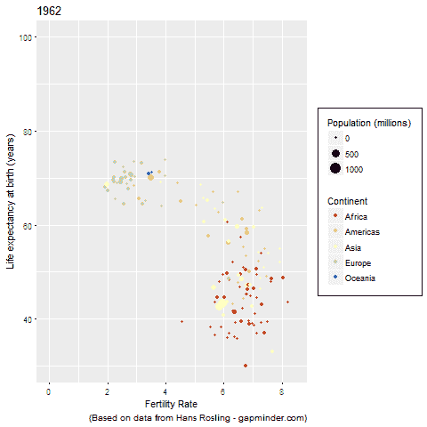
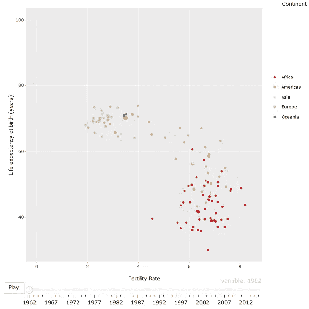

# 如何像汉斯·罗斯林一样制作动画图表——全部用 R 语言完成

> 原文：<https://towardsdatascience.com/how-to-build-animated-charts-like-hans-rosling-doing-it-all-in-r-570efc6ba382?source=collection_archive---------3----------------------->

## 一个学习数据可视化技能的小型教育项目，利用了两个库(gganimate 和 plot . ly)——更新了新的 gganimate 版本


汉斯·罗斯林是统计学大师。他毕生致力于推动使用数据和动画图表来探索发展问题，并分享基于事实的世界观。他最受欢迎的 TED 演讲:“[你见过的最好的统计数据](https://www.ted.com/talks/hans_rosling_shows_the_best_stats_you_ve_ever_seen)”点击量超过 1200 万次。这也是世界上 100 个最受欢迎的 [TED 演讲之一。](https://www.ted.com/talks?sort=popular)

**你曾经梦想过像他的** [**最受欢迎的一张**](https://www.ted.com/talks/hans_rosling_shows_the_best_stats_you_ve_ever_seen#t-185608) **一样免费制作动画图表吗，从零开始，不到 5 分钟，并且可以以不同的格式(gif，html 用于你的网站等)共享。)?**



What we will be building with gganimate ;)

本文将向您展示如何使用两种方法用 R 构建动画图表:

*   将创建 GIF 文件的 R + gganimate 库
*   R + plot.ly 将生成一个 HTML 文件，您可以将它嵌入到您的网站中(参见下面的 plot.ly 版本)



What we will be building with plot.ly ;)

假设您已经安装了 Rstudio，并且了解一些基础知识，因为本文将只介绍生成视觉效果的步骤和代码。完整代码可从 [Github](https://github.com/tristanga/animatedcharts) 上获得，用于教育目的。

**第一步:搜索并下载你需要的数据集**

第一站是在[gapminder.com](https://www.gapminder.org/data/)下载所需的 3 个数据集。这个基金会是罗斯林家族创立的。它有奇妙的可视化和数据集，每个人都应该检查“用每个人都能理解的基于事实的世界观来战胜无知”。

我们将下载 3 个 excel 文件(xlsx):

1.  [每名妇女的子女数(总生育率)](//docs.google.com/spreadsheet/pub?key=phAwcNAVuyj0TAlJeCEzcGQ&output=xlsx)
2.  [人口总数](https://docs.google.com/spreadsheet/pub?key=phAwcNAVuyj0XOoBL_n5tAQ&output=xlsx)
3.  [预期寿命(年)](https://docs.google.com/spreadsheet/pub?key=phAwcNAVuyj2tPLxKvvnNPA&output=xlsx)

一旦文件被下载并保存在你的工作文件夹中，就该清理并合并数据集了。

**第二步:清理并合并数据**

a1)用 xlsx 库加载数据(替换'..'您的文件夹旁)

```
# Please note that loading xlsx in R is really slow compared to csvlibrary(xlsx)population_xls <- read.xlsx("indicator gapminder population.xlsx", encoding = "UTF-8",stringsAsFactors= F, sheetIndex = 1, as.data.frame = TRUE, header=TRUE)fertility_xls <- read.xlsx("indicator undata total_fertility.xlsx", encoding = "UTF-8",stringsAsFactors= F, sheetIndex = 1, as.data.frame = TRUE, header=TRUE)lifeexp_xls <- read.xlsx("indicator life_expectancy_at_birth.xlsx", encoding = "UTF-8", stringsAsFactors= F, sheetIndex = 1, as.data.frame = TRUE, header=TRUE)
```

a2)更新—在 R 版本 5.3+上安装 gganimate 新版本

```
library(devtools)
library(RCurl)
library(httr)
set_config( config( ssl_verifypeer = 0L ) )
devtools::install_github("RcppCore/Rcpp")
devtools::install_github("thomasp85/gganimate", force = TRUE)
```

b)使用 reshape 和 dplyr 库清理和合并数据

```
# Load libraries
library(reshape)
library(gapminder)
library(dplyr)
library(ggplot2)# Create a variable to keep only years 1962 to 2015
myvars <- paste("X", 1962:2015, sep="")# Create 3 data frame with only years 1962 to 2015
population <- population_xls[c('Total.population',myvars)]
fertility <- fertility_xls[c('Total.fertility.rate',myvars)]
lifeexp <- lifeexp_xls[c('Life.expectancy',myvars)]# Rename the first column as "Country"
colnames(population)[1] <- "Country"
colnames(fertility)[1] <- "Country"
colnames(lifeexp)[1] <- "Country"# Remove empty lines that were created keeping only 275 countries
lifeexp <- lifeexp[1:275,]
population <- population[1:275,]# Use reshape library to move the year dimension as a column
population_m <- melt(population, id=c("Country")) 
lifeexp_m <- melt(lifeexp, id=c("Country")) 
fertility_m <- melt(fertility, id=c("Country"))# Give a different name to each KPI (e.g. pop, life, fert)
colnames(population_m)[3] <- "pop"
colnames(lifeexp_m)[3] <- "life"
colnames(fertility_m)[3] <- "fert"# Merge the 3 data frames into one
mydf <- merge(lifeexp_m, fertility_m, by=c("Country","variable"), header =T)
mydf <- merge(mydf, population_m, by=c("Country","variable"), header =T)# The only piece of the puzzle missing is the continent name for each country for the color - use gapminder library to bring it
continent <- gapminder %>% group_by(continent, country) %>% distinct(country, continent)
continent <- data.frame(lapply(continent, as.character), stringsAsFactors=FALSE)
colnames(continent)[1] <- "Country"# Filter out all countries that do not exist in the continent table
mydf_filter <- mydf %>% filter(Country %in% unique(continent$Country))# Add the continent column to finalize the data set
mydf_filter <- merge(mydf_filter, continent, by=c("Country"), header =T)# Do some extra cleaning (e.g. remove N/A lines, remove factors, and convert KPIs into numerical values)
mydf_filter[is.na(mydf_filter)] <- 0
mydf_filter <- data.frame(lapply(mydf_filter, as.character), stringsAsFactors=FALSE)
mydf_filter$variable <- as.integer(as.character(gsub("X","",mydf_filter$variable)))
colnames(mydf_filter)[colnames(mydf_filter)=="variable"] <- "year"
mydf_filter$pop <- round(as.numeric(as.character(mydf_filter$pop))/1000000,1)
mydf_filter$fert <- as.numeric(as.character(mydf_filter$fert))
mydf_filter$life <- as.numeric(as.character(mydf_filter$life))
```

**第三步——升级到新版 gganimate:用 gganimate 构建图表并生成 GIF 文件与你的朋友分享**

现在我们有了一个包含 3 个 KPI(人口、生育率和预期寿命)和 3 个维度(国家、年份、洲)的清晰数据集，我们可以用 gganimate 生成可视化效果。

```
# Load libraries
library(ggplot2)
library(gganimate)
#library(gifski)
#library(png)# Add a global theme
theme_set(theme_grey()+ theme(legend.box.background = element_rect(),legend.box.margin = margin(6, 6, 6, 6)) )# OLD VERSION
# Create the plot with years as frame, limiting y axis from 30 years to 100
# p <- ggplot(mydf_filter, aes(fert, life, size = pop, color = continent, frame = variable)) +
#  geom_point()+ ylim(30,100)  + labs(x="Fertility Rate", y = "Life expectancy at birth (years)", caption = "(Based on data from Hans Rosling - gapminder.com)", color = 'Continent',size = "Population (millions)") + 
#  scale_color_brewer(type = 'div', palette = 'Spectral') 
# gganimate(p, interval = .2, "output.gif")# NEW VERSION# Create the plot with years as frame, limiting y axis from 30 years to 100
p <- ggplot(mydf_filter, aes(fert, life, size = pop, color = continent, frame = year)) +
  labs(x="Fertility Rate", y = "Life expectancy at birth (years)", caption = "(Based on data from Hans Rosling - gapminder.com)", color = 'Continent',size = "Population (millions)") + 
  ylim(30,100) +
  geom_point() +
  scale_color_brewer(type = 'div', palette = 'Spectral') + 
  # gganimate code
  ggtitle("Year: {frame_time}") +
  transition_time(year) +
  ease_aes("linear") +
  enter_fade() +
  exit_fade()# animate
animate(p, width = 450, height = 450)# save as a GIF
anim_save("output.gif")
```


现在你可以享受你当之无愧的 GIF 动画，并与你的朋友分享。

**第四步:用 plot.ly 构建图表并生成一个 HTML 文件嵌入你的网站**

```
# Load libraries
library(plotly)
library(ggplot2)# Create the plot
p <- ggplot(mydf_filter, aes(fert, life, size = pop, color = continent, frame = year)) +
  geom_point()+ ylim(30,100)  + labs(x="Fertility Rate", y = "Life expectancy at birth (years)", color = 'Continent',size = "Population (millions)") + 
  scale_color_brewer(type = 'div', palette = 'Spectral')# Generate the Visual and a HTML output
ggp <- ggplotly(p, height = 900, width = 900) %>%
  animation_opts(frame = 100,
                 easing = "linear",
                 redraw = FALSE)
ggp
htmlwidgets::saveWidget(ggp, "index.html")
```

代码可在 [Github](https://github.com/tristanga/animatedcharts) 上获得。感谢你阅读我的帖子，如果你喜欢，请鼓掌。如果你想在你的组织内制作动画图表，请随时联系我。

其他有趣的链接，了解有关 R 动画图表的更多信息:

 [## 了解关于 Gapminder 的更多信息

### Gapminder 是一个独立的瑞典基金会，没有任何政治、宗教或经济背景。Gapminder 是一个…

www.gapminder.org](https://www.gapminder.org/about-gapminder/)  [## dgrtwo/gganimate

### 用 ggplot2 创建简单的动画

github.com](https://github.com/dgrtwo/gganimate/blob/master/README.md)