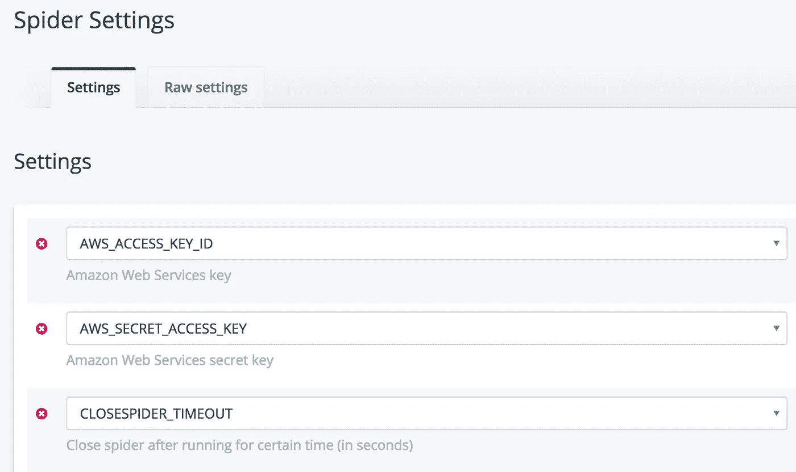

# 如何使用 Scrapy，ScrapingHub 和亚马逊 S3 建立重复的网络蜘蛛工作

> 原文：<https://towardsdatascience.com/how-to-build-recurring-web-spider-jobs-using-scrapy-scrapinghub-and-amazon-s3-43dbe3c73b69?source=collection_archive---------3----------------------->

最近我和一个好朋友一直在尝试自学机器学习。根据许多行业专家的说法，在未来 10-15 年内保持有收入的工作是编程世界的必要的下一步。

*注:如果你听说过同样的事情，但不确定从哪里开始，我会给你指出这个不可思议的* [*中帖*](https://medium.com/machine-learning-for-humans/why-machine-learning-matters-6164faf1df12) *和这个* [*Coursera 课程*](https://www.coursera.org/learn/machine-learning) *来开始。*

我们很快遇到的一个问题是需要一个数据集。虽然世界上有很多令人难以置信的有趣的数据集可以免费下载，但我们有特定的兴趣([火箭发射](https://launchmanifest.io/)，太空探索，火星等等。)并认为通过刮刮来建造我们自己的会很有趣。

就我个人而言，我从来没有构建过一个 scraper(或者使用 Python)，但是我认为这不会太难。我们花了大约一天半的时间来构建我们的蜘蛛，让它们按照每天的时间表运行，并将数据放入 S3 桶中。

很难找到任何关于这个过程的指南，所以我想我应该写下我们是如何做的，并在互联网上公开我们的过程。如果您看到我们做错了什么，请随时告诉我们如何才能做得更好。我们正在学习。

## 建造蜘蛛

1.  安装[Scrapy](https://scrapy.org/)——他们的文档是令人敬畏的。如果您遵循[安装指南](https://docs.scrapy.org/en/latest/intro/install.html)，应该没有问题
2.  安装依赖项: [boto](https://github.com/boto/boto) (可能已经安装，这取决于你如何安装 Scrapy) & [dotenv](https://github.com/theskumar/python-dotenv) (这是为了不检查 AWS 的秘密到我们的 VCS)
3.  用`scrapy startproject directoryname`建立一个新的 Scrapy 项目

您应该有一个`scrapy.cfg`文件和一个目录(在上面的步骤中命名。)在目录内部，您将看到 Scrapy 的工作原理。首先，我们将使用`settings.py`和`/spiders`目录。

让我们开始建造蜘蛛。进入您的`/spiders`目录并创建一个新的`spidername.py`文件。这里有一个使用 CSS 和 XPath 选择器的蜘蛛示例。

这是一个难以置信的简化版本，但让我们现实一点。你的需求会有所不同，Scrapy 的文档比我在这篇文章中写的要好 100 倍。重要的是要认识到，你可以创建多个`spider.py`文件，并为不同的网站有不同的蜘蛛。

一旦你的蜘蛛启动并运行，下一步就是正确设置你的`settings.py`文件。

Scrapy 为您提供了大量样板代码。我只包括我修改过的相关部分。您会注意到几件重要的事情:

1.  通过遵守`robots.txt`并在抓取之前手动检查每个网站的服务条款，我们成为了互联网的好公民。我们不刮那些要求不被刮的网站。
2.  我们使用`dotenv`来保护我们的 AWS 访问密钥 id 和秘密访问密钥。这意味着您将在与`settings.py`相同的目录中拥有一个`.env`文件。您会希望将`.env`包含在您的`.gitignore`中。
3.  Scrapy 的超级合法部分是，你需要的只是为它设置的几个选项，以处理向 S3 的推送。

酷毙了。我们已经准备好了。一旦我们给了它正确的凭证，蜘蛛就被构建好了，并且`settings.py`已经准备好将数据推送到 S3。

## 设置 AWS

如果你不熟悉 AWS，它可能会相当吓人。我们需要做两件事:

1.  创建一个 IAM 用户，并获取访问密钥 id 和秘密访问密钥
2.  设置一个存储桶并添加正确的权限

IAM 用户可能有点棘手，所以我建议阅读 AWS 的[文档](http://docs.aws.amazon.com/IAM/latest/UserGuide/id_users_create.html)。实际上，您需要登录 AWS 控制台，进入 IAM 部分，创建一个新用户，然后[生成一个访问密钥](http://docs.aws.amazon.com/IAM/latest/UserGuide/id_credentials_access-keys.html)。我建议创建这个用户仅仅是为了对您的 bucket 进行 API 调用。您将需要来自您创建的用户的三个字符串。把它们保存在安全的地方。

*   用户 ARN
*   访问密钥 ID
*   秘密访问密钥

现在，让我们设置一个新的铲斗。这很简单。[创建您的存储桶](http://docs.aws.amazon.com/AmazonS3/latest/dev/UsingBucket.html#create-bucket-intro)，然后导航至“权限”选项卡。您需要设置一个 bucket 策略，允许您刚刚创建的 IAM 用户将数据推送到这个 bucket。这是我们的样子:

必要时，交换`[your-user-id]`和`[your-bucket-name]`部件。这可能不言而喻，但不包括[]。

最后，将访问 id 和密钥添加到 Scrapy 项目中的`.env`文件中。

## 部署到报废网络

ScrapingHub 是由支持 Scrapy 和十几个其他开源项目的了不起的人运营的一个漂亮的服务。手动触发蜘蛛抓取是免费的，但它有一个非常合理的价格 [$9 /月计划](https://scrapinghub.com/scrapy-cloud)，允许单个蜘蛛在任何给定时间并发运行。对于我们的需求，它允许我们每 5 分钟调度不同的蜘蛛，即 280+独特的蜘蛛，只要它们的运行时间是< 5 分钟。

我们在最后冲刺阶段。这部分很简单。您将创建一个 ScrapingHub 帐户，登录并生成一个 API 密钥。你将[安装](https://github.com/scrapinghub/shub) `shub`，清除掉 Hub 的命令行界面，并按照指示添加你的密钥和项目 ID。

**注意:**如果你已经用`.env`混淆了你的 AWS id &密钥，那么在部署到 ScrapingHub 之前，你需要在你的`settings.py`中注释掉几行。即上面要点中的第 5-7 行和第 14-18 行。

一旦一切就绪，你就可以使用`shub deploy`将你的项目推向报废。

您需要做的最后一件事是进入蜘蛛设置区域，手动添加 AWS 凭证。您会注意到，我们还添加了一个超时，以确保如果出现任何错误，我们会正常失败。

你完了！嗯，差不多了。

我建议首先至少手动运行一次蜘蛛，检查 S3 桶中生成的文件，并确保您对所有结果都满意。一旦你对此感到满意，转到你的项目的定期作业部分，设置你的蜘蛛在你需要的任何时间间隔运行。例如，世界协调时每天 04:30。

## 摘要

我意识到这并不是对每一行代码或点击的每一个按钮的完全详尽的指导，但希望它能让你步入正轨。接下来，我们将获取生成的 CSV 文件，规范化数据，并将其插入 Postgres 数据库。

请关注我的最新消息！