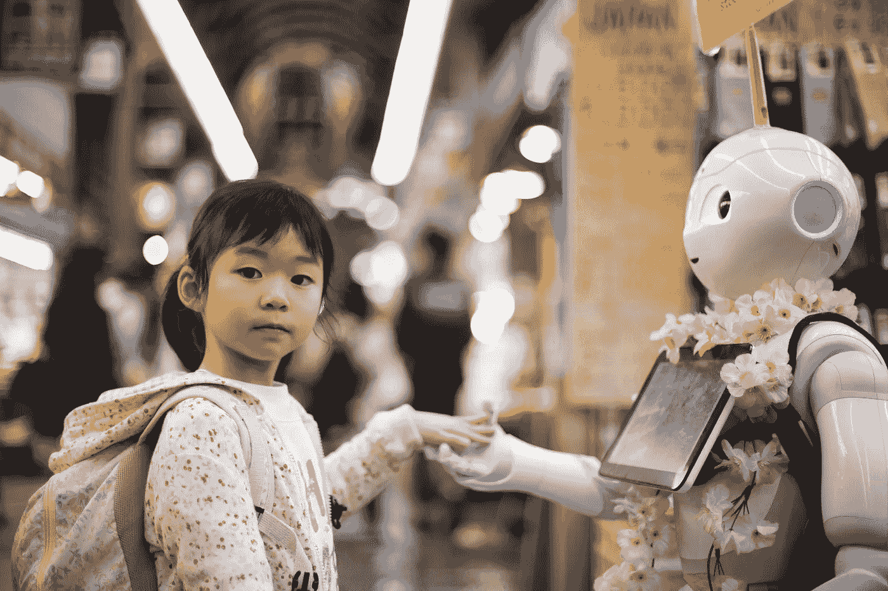
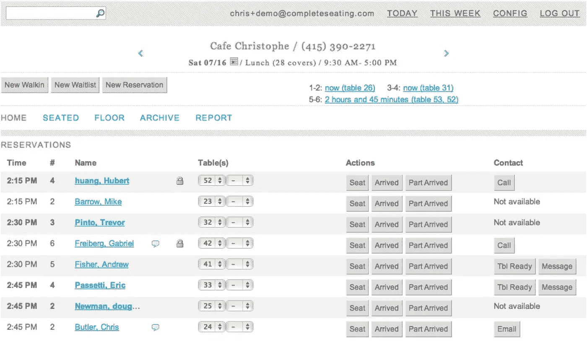

# 如何打造值得信赖的 AI 产品

> 原文：<https://towardsdatascience.com/how-to-build-trustworthy-ai-products-3f49de63209a?source=collection_archive---------7----------------------->

Photo by [Andy Kelly](https://unsplash.com/photos/0E_vhMVqL9g?utm_source=unsplash&utm_medium=referral&utm_content=creditCopyText) on [Unsplash](https://unsplash.com/search/photos/robot-handshake?utm_source=unsplash&utm_medium=referral&utm_content=creditCopyText)

你不能只是在一个项目中添加人工智能，然后指望它能工作。它不是可以洒在产品上的魔法粉。

建立融入人们生活的系统的关键是信任。如果你没有足够的信任，你就会让这个系统被废弃和滥用。

这篇文章(以及下面的这个[对应的对话](https://www.youtube.com/watch?v=PWjV5Ik49kk))最初是为 5 月 30 日作为[产品学校的一部分，开始接触数据科学、机器学习和人工智能的产品人员创建的。虽然对 AI/ML 有一个简单的介绍，但是更有经验的从业者可以学习很多关于 AI 中信任的东西。](https://www.meetup.com/productmanagementNY/events/250980893/)

# 信任 101

信任之所以重要，是因为它有助于促进合作行为。这是我们创造复杂社会的基石。

归结起来有几个关键点:

*   合同——书面或非书面
*   关注对未来的期望
*   基于过去的**绩效、问责制和透明度**
*   构建缓慢，但可能很快丢失

# 信任和机器有什么关系？

当我在一家名为 Complete Seating 的餐厅初创公司工作时，我们开发了许多功能来帮助主人管理他们的餐厅地板。我们包括了智能等候名单时间和自动餐桌推荐。

我们当时称之为分析、商业智能、预测和约束编程，但如果我们今天筹集资金，它应该被称为“人工智能餐厅管理”。

不幸的是，我们没有获得他们的信任，因为我们缺乏信任的三个关键方面中的两个:性能和透明度。

*   性能——这是一个测试版产品，起初它没有达到预期。一旦服务开始发挥应有的作用，我们就有一座大山要爬上去重建信任。
*   责任——当出现问题时，我们总是会接听他们的电话，或者出现在现场提供帮助。他们知道我们在尽力帮忙，但还是没有解决另外两个问题。
*   透明性——我们没有给他们很好的抽象概念，所以他们可以理解幕后发生的事情。他们想应用他们的专业知识，但他们不知道我们涵盖了什么。

我们最初试图通过向主机提供更多的上下文来解决这些问题。

回顾过去，我们应该从指出主持人可能犯的错误开始，而不是混淆整个座位引擎。

# 机器如何与人类建立信任？

当我们考虑与他们建立信任时，我们需要以人为中心。这是我认为未来几年人工智能面临的最大危险之一。

使用相同的框架，我们可以如下考虑机器构建信任:

*   性能——这不像传统的准确度、精确度和召回那么简单。我们需要担心对人类目的来说什么是正确的度量标准。
*   责任——关于系统的设计者在他们的操作中需要承担什么责任，有许多道德和法律问题需要回答。
*   透明度——我们如何构建可解释的系统，提供适应性的行动，提供控制感，允许人类干预，并获得反馈以改进系统。

[查看演讲](https://www.youtube.com/watch?v=PWjV5Ik49kk)深入了解这些关键方面。

# 对于机器来说，什么是正确的信任级别？

在《人类与自动化:使用、误用、废弃、滥用》一书中，他们讨论了人们基于信任使用自动化的各种方式:

*   使用—“[自动]由操作员激活或解除自动化。”这是信任达到“正确”程度的时候。
*   误用—“[过度]依赖自动化，这可能导致监控失败或决策偏差。”这是人类过于信任系统的时候。
*   当人类对自动化不够信任时，就会出现弃用——“[忽视]或未充分利用自动化……”。
*   滥用—“[自动化]功能…没有适当考虑对人的表现的后果…”当设计自动化时没有考虑操作者(或那些受影响的人)时，就会发生这种情况。从我的角度来看，这是[我认为未来几年人工智能面临的最大危险之一。](http://qr.ae/TUTEMY)

# 我们怎样才能了解对机器的信任？

我们可以通过[原型和研究](https://uxdesign.cc/testing-ai-concepts-in-user-research-b742a9a92e55)来了解对信任的期望和需求。

在构建原型时，您不需要实际构建和训练模型。你只需要考虑几种不同的情况，然后假装:

*   正确操作或“快乐路径”
*   不正确的操作—自动化的误报/漏报
*   理解“正确”信任级别的误用/废弃边界的两边
*   从人到机器的反馈的适当场景
*   为你的抽象陈述从机器到人类的交流

我还发现，当开始构建[时，使用“绿野仙踪”或“门房”方法来开发人工智能的 MVPs】可以帮助你专注于你真正需要学习的东西。](/should-your-customers-be-conned-by-a-human-or-ai-6a87fbecdefe)

# 最后

请记住:

*   使用人工智能就像任何其他有权衡的技术一样…你应该意识到其中的细微差别。
*   建立适量的信任——不多也不少。
*   信任基于绩效、责任和对人类的透明性。

[请观看视频](https://www.youtube.com/watch?v=PWjV5Ik49kk)了解完整的演讲以及每一点的更多细节。

# 关于克里斯·巴特勒

我帮助团队理解他们应该用以人工智能为中心的解决方案解决的真正的商业问题。我们工作的团队通常被要求用他们拥有的数据做一些有趣的事情(T2)。我们通过偶发事件相关性帮助他们避免局部极值，并专注于解决巨大的业务问题。我的背景包括在微软、KAYAK 和 Waze 等公司超过 18 年的产品和业务开发经验。在 Philosophie，我创造了像[机器移情映射](https://uxdesign.cc/robots-need-love-too-empathy-mapping-for-ai-59585ad3548d)和[混淆映射](/robots-are-wrong-too-confusion-mapping-for-the-worst-case-2e01b7e19936)这样的技术，以在构建人工智能产品时创建跨团队对齐。如果你想了解更多或者通过[邮箱](mailto:chrisbutler@philosophie.is)、 [LinkedIn](https://www.linkedin.com/in/chrisbu/) 联系，或者访问[http://philosophie.is/human-centered-ai](http://philosophie.is/human-centered-ai)。

幻灯片:

 [## 克里斯·巴特勒- PS 演示

### 旧金山、硅谷、洛杉矶、纽约、奥斯汀、波士顿、西雅图的兼职产品管理课程…

docs.google.com](https://docs.google.com/presentation/d/e/2PACX-1vQt1aD_sq_zvVC9ulRgEWBUpasLb07gjss6VVTHQHu5Rsw6yJq8_XuBruyIJhsHJPx8an4lI5e1d-LB/pub?start=false&loop=false&delayms=3000) 

参考资料:

*   [数据科学、机器学习、人工智能有什么区别？](http://varianceexplained.org/r/ds-ml-ai/)
*   [回路中的机器接近](https://medium.com/@ChenhaoTan/human-centered-machine-learning-a-machine-in-the-loop-approach-ed024db34fe7)
*   [星球大战社交网络](http://evelinag.com/blog/2015/12-15-star-wars-social-network)
*   [以人为中心的机器学习](https://medium.com/google-design/human-centered-machine-learning-a770d10562cd)
*   [机器的移情映射](https://uxdesign.cc/robots-need-love-too-empathy-mapping-for-ai-59585ad3548d)
*   [混淆映射](/robots-are-wrong-too-confusion-mapping-for-the-worst-case-2e01b7e19936)
*   [你的顾客应该被人类还是人工智能欺骗？
    “礼宾”vs“绿野仙踪”MVP](/should-your-customers-be-conned-by-a-human-or-ai-6a87fbecdefe)
*   [WoZ 方式:实现实时远程交互原型&在路上车辆中观察](https://dl.acm.org/citation.cfm?id=3023271)
*   康奈尔大学的温迪·朱
*   [TWiML & AI 播客#110 与 Ayanna Howard](https://twimlai.com/twiml-talk-110-trust-human-robot-ai-interactions-ayanna-howard/)
*   [急救机器人视频](https://www.youtube.com/watch?v=frr6cVBQPXQ)
*   [安慰剂按钮(假恒温器)](https://99percentinvisible.org/article/user-illusion-everyday-placebo-buttons-create-semblance-control/)
*   [控制偏差错觉](https://en.wikipedia.org/wiki/Illusion_of_control)
*   那是我们的出口！
*   [道德崩溃区](https://papers.ssrn.com/sol3/papers.cfm?abstract_id=2757236)
*   [计算机化社会中的问责制](https://link.springer.com/article/10.1007/BF02639315)
*   [在用户研究中测试人工智能概念](https://uxdesign.cc/testing-ai-concepts-in-user-research-b742a9a92e55)
*   对心智模型的一些观察(1987)
*   [人类与自动化:使用、误用、废弃、滥用](http://web.mit.edu/16.459/www/parasuraman.pdf) (1997)
*   [紧急疏散场景下机器人的过度信任](https://www.cc.gatech.edu/~alanwags/pubs/Robinette-HRI-2016.pdf) (2016)
*   [自动化中的信任:整合影响信任因素的经验证据](http://journals.sagepub.com/doi/abs/10.1177/0018720814547570) (2015)
*   [零、一或无穷大规则](https://en.wikipedia.org/wiki/Zero_one_infinity_rule)
*   [中数定律](https://www.johndcook.com/blog/2010/02/25/the-law-of-medium-numbers/)
*   [谢恩·勒温，精益人工智能产品开发](https://conferences.oreilly.com/artificial-intelligence/ai-ny/public/schedule/speaker/264612)
*   [NYT MTA 地铁危机篇](https://www.nytimes.com/interactive/2018/05/09/nyregion/subway-crisis-mta-decisions-signals-rules.html)