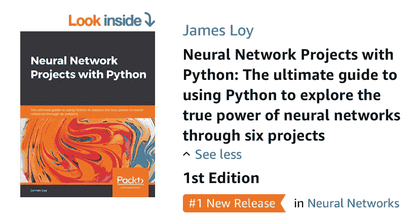
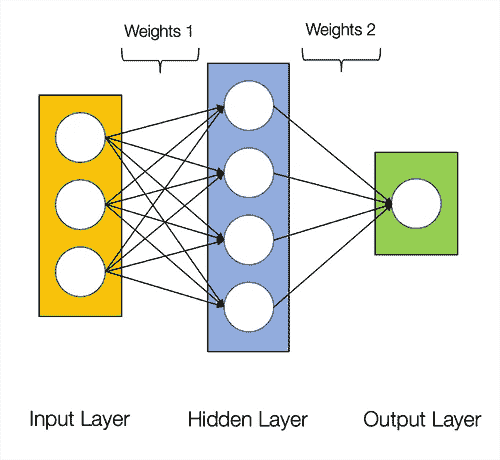
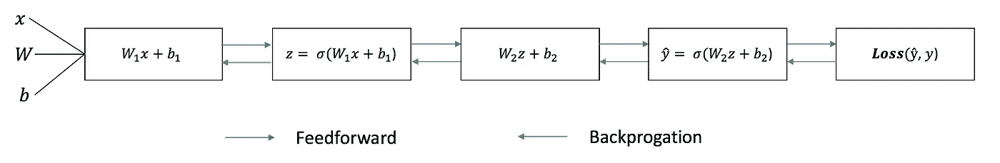
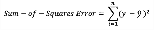
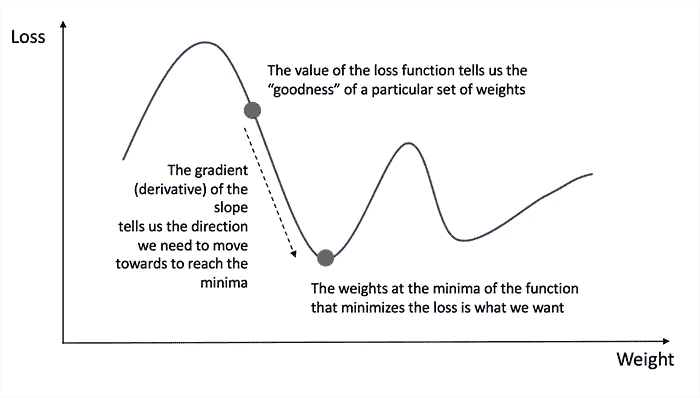
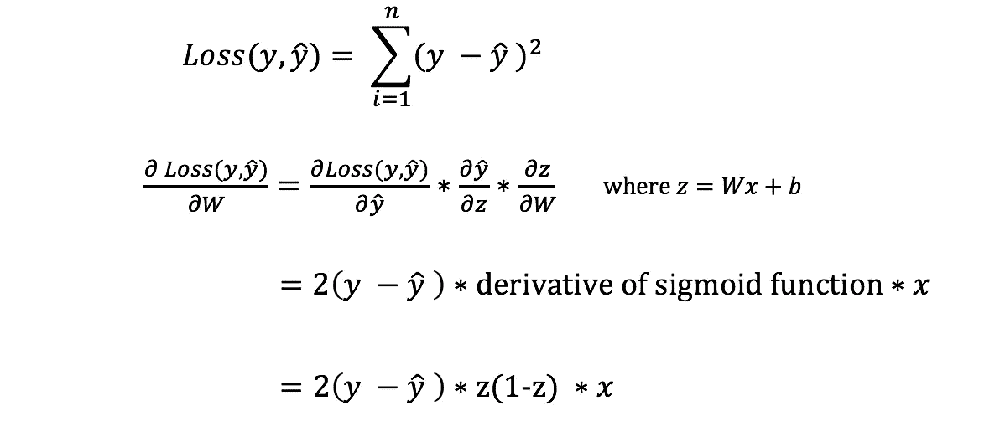
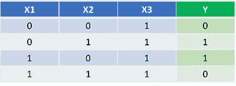
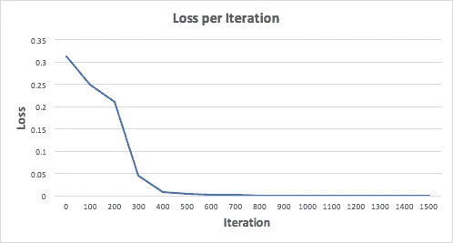
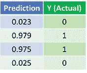

# 如何用 Python 从零开始构建自己的神经网络

> 原文：<https://towardsdatascience.com/how-to-build-your-own-neural-network-from-scratch-in-python-68998a08e4f6?source=collection_archive---------0----------------------->

## 理解深度学习内部运作的初学者指南

**更新**:当我一年前写这篇文章的时候，我没有想到它会受到*这个*的欢迎。从那以后，这篇文章被观看了超过 45 万次，有超过 3 万次鼓掌。它还登上了谷歌的首页，并且是“*神经网络*”的前几个搜索结果之一。你们中的许多人都联系过我，这篇文章对你们学习之旅的影响让我深感谦卑。

这篇文章也引起了 Packt 出版社编辑的注意。这篇文章发表后不久，我就被提出作为《用 Python 做 *的 [***神经网络项目》一书的唯一作者。*今天，很高兴和大家分享我的书出版了！**](https://www.amazon.com/Neural-Network-Projects-Python-ultimate-ebook/dp/B07P77QWW7/)*

这本书是这篇文章的延续，它涵盖了神经网络项目在人脸识别、情感分析、噪声消除等领域的端到端实现。每章都有一个独特的神经网络结构，包括卷积神经网络，长期短期记忆网络和暹罗神经网络。如果你正在寻找用深度学习项目创建一个强大的机器学习组合，请考虑购买这本书！

你可以从亚马逊得到这本书: [**用 Python 做的神经网络项目**](https://www.amazon.com/Neural-Network-Projects-Python-ultimate-ebook/dp/B07P77QWW7/)

**动机:**作为我个人更好地理解深度学习之旅的一部分，我已经决定从零开始建立一个神经网络，而不需要像 TensorFlow 这样的深度学习库。我认为，理解神经网络的内部工作对任何有抱负的数据科学家都很重要。

这篇文章包含了我所学到的东西，希望对你也有用！

# 什么是神经网络？

大多数介绍神经网络的文章在描述它们时都会提到大脑类比。在不深究大脑类比的情况下，我发现简单地将神经网络描述为将给定输入映射到期望输出的数学函数更容易。

神经网络由以下组件组成

*   一个**输入层**、**、 *x* 、**
*   任意数量的**隐藏层**
*   一个**输出层**，**，*，*，**
*   一组**权重**和**在各层之间偏置**、**W 和 b**
*   选择**激活功能**用于每个隐藏层，*。在本教程中，我们将使用一个 Sigmoid 激活函数。*

*下图显示了 2 层神经网络的架构(*注意，在计算神经网络的层数时，输入层通常被排除在外**

**

*Architecture of a 2-layer Neural Network*

*用 Python 创建神经网络类很容易。*

***训练神经网络***

*简单 2 层神经网络的输出 ***ŷ*** 为:*

**

*您可能会注意到，在上面的等式中，权重 ***W*** 和偏差 ***b*** 是影响输出 ***ŷ.的唯一变量****

*自然，权重和偏差的正确值决定了预测的强度。从输入数据中微调权重和偏差的过程称为**训练神经网络。***

*训练过程的每次迭代包括以下步骤:*

*   *计算预测输出 ***ŷ*** ，称为**前馈***
*   *更新权重和偏差，称为**反向传播***

*下面的序列图说明了这个过程。*

**

## *前馈*

*正如我们在上面的序列图中看到的，前馈只是简单的微积分，对于一个基本的 2 层神经网络，神经网络的输出是:*

**

*让我们在 python 代码中添加一个前馈函数来做到这一点。注意，为了简单起见，我们假设偏差为 0。*

*然而，我们仍然需要一种方法来评估我们预测的“好性”(即我们的预测有多远)？**损失函数**允许我们这样做。*

## *损失函数*

*有许多可用的损失函数，我们问题的性质决定了我们对损失函数的选择。在本教程中，我们将使用简单的**平方和误差**作为我们的损失函数。*

**

*也就是说，平方和误差就是每个预测值和实际值之间的差值之和。差值是平方的，因此我们可以测量差值的绝对值。*

***我们训练的目标是找到使损失函数最小化的最佳权重和偏差集。***

## *反向传播*

*既然我们已经测量了预测的误差(损失)，我们需要找到一种方法来**传播**误差回来，并更新我们的权重和偏差。*

*为了知道调整权重和偏差的合适量，我们需要知道损失函数相对于权重和偏差的导数。*

*回想一下微积分，函数的导数就是函数的斜率。*

**

*Gradient descent algorithm*

*如果我们有导数，我们可以简单地通过增加/减少来更新权重和偏差(参考上图)。这就是所谓的**梯度下降**。*

*然而，我们不能直接计算损失函数关于权重和偏差的导数，因为损失函数的方程不包含权重和偏差。因此，我们需要**链式法则**来帮助我们计算它。*

**

*Chain rule for calculating derivative of the loss function with respect to the weights. Note that for simplicity, we have only displayed the partial derivative assuming a 1-layer Neural Network.*

*唷！这很难看，但它让我们得到了我们需要的东西——损失函数相对于权重的导数(斜率)，这样我们就可以相应地调整权重。*

*现在我们有了这个，让我们把反向传播函数添加到我们的 python 代码中。*

*为了更深入的了解微积分的应用和反向传播中的链式法则，我强烈推荐 3Blue1Brown 的这个教程。*

# *把所有的放在一起*

*现在我们已经有了完整的 python 代码来进行前馈和反向传播，让我们将我们的神经网络应用于一个例子，看看它做得有多好。*

**

*我们的神经网络应该学习一组理想的权重来表示这个函数。请注意，仅仅通过检查来计算重量对我们来说并不简单。*

*让我们训练神经网络 1500 次迭代，看看会发生什么。查看下面的每次迭代损失图，我们可以清楚地看到损失**朝着最小值单调递减。**这与我们之前讨论过的梯度下降算法是一致的。*

**

*让我们看看神经网络经过 1500 次迭代后的最终预测(输出)。*

**

*Predictions after 1500 training iterations*

*我们做到了！我们的前馈和反向传播算法成功地训练了神经网络，并且预测收敛于真实值。*

*请注意，预测值和实际值之间略有不同。这是可取的，因为它防止**过度拟合**，并允许神经网络**更好地将**推广到看不见的数据。*

# *下一步是什么？*

*幸运的是，我们的旅程还没有结束。关于神经网络和深度学习，还有很多东西需要学习。例如:*

*   *除了 Sigmoid 函数之外，我们还可以使用什么其他的**激活函数**？*
*   *训练神经网络时使用**学习率***
*   *使用**卷积**进行图像分类任务*

*我很快会写更多关于这些话题的文章，所以请在 Medium 上关注我，留意它们！*

# *最后的想法*

*从零开始编写自己的神经网络，我确实学到了很多。*

*尽管 TensorFlow 和 Keras 等深度学习库可以在不完全了解神经网络内部工作原理的情况下轻松构建深度网络，但我发现，对有抱负的数据科学家来说，更深入地了解神经网络是有益的。*

*这个练习花费了我大量的时间，我希望它对你也有用！*