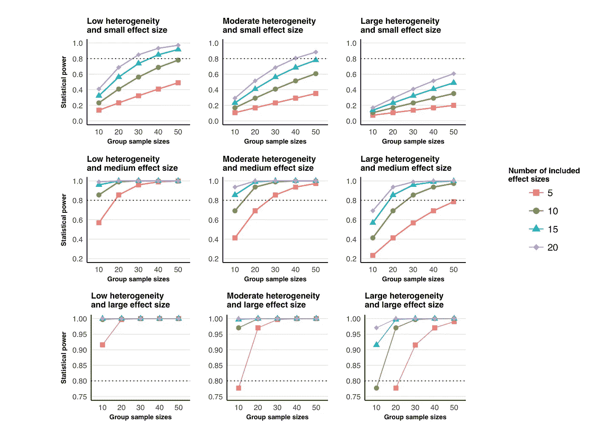

# 如何计算你的荟萃分析的统计功效

> 原文：<https://towardsdatascience.com/how-to-calculate-statistical-power-for-your-meta-analysis-e108ee586ae8?source=collection_archive---------3----------------------->

生物行为科学领域的大多数研究[在统计上不够有力](https://www.ncbi.nlm.nih.gov/pubmed/28706080?dopt=Abstract)，这降低了具有统计显著性的发现反映真实效果的可能性。

元分析是一种流行的方法，用来综合解决特定研究问题的大量研究。然而，在规划或解释荟萃分析时，很少考虑统计能力。这可能是因为没有可访问的软件或 R 脚本来计算元分析功效，像 [G*Power](http://www.gpower.hhu.de/en.html) 或[“PWR”R package](https://cran.r-project.org/web/packages/pwr/pwr.pdf)，它们是计算主要研究的统计功效的伟大选项。

多亏了这篇论文中的公式，我写了自己的脚本来计算随机效应元分析的功效。只需在下面的脚本中输入您预期的汇总效应大小、每组参与者的平均人数、效应大小的总数以及研究异质性。

下面是一系列异质性水平、汇总效应大小、分组样本大小和包含样本大小总数的统计功效。

Effect sizes of d = 0.2, d = 0.5, and d = 0.8 are considered small, medium, and large effect sizes. As per convention, 80% statistical power is considered sufficient.

有趣的是，在大多数情况下，荟萃分析足以检测大的汇总效应大小(底部一行)。然而，在大多数情况下，它们很难有足够的能力来检测微小的影响(顶行)。检测中等效应的能力(中间一行)是一个大杂烩，似乎很大程度上取决于研究的异质性。

**更新:**感谢 [Jakob Tiebel](https://www.researchgate.net/profile/Jakob_Tiebel) ，他组装了一个 [Excel 计算器](https://osf.io/5c7uz/)来使用相同的公式计算您的元分析的统计功效。对于不熟悉 r 的人来说是一个很好的选择。

想要一步一步的指导来执行你自己的相关性元分析吗？看看我的[论文](http://journal.frontiersin.org/article/10.3389/fpsyg.2015.01549/full)和相关的[视频](https://www.youtube.com/watch?v=d1pYHfCKhyA)。如果你已经在*度过了这个*，你可能会喜欢[万物赫兹](https://soundcloud.com/stream)，这是我共同主持的元科学播客。这是我们关于元分析的[集。](https://soundcloud.com/everything-hertz/4-meta-analysis-or-mega-silliness)