# 如何计算你公司的增长率

> 原文：<https://towardsdatascience.com/how-to-calculate-your-companys-growth-rate-63b6852638c6?source=collection_archive---------0----------------------->

你的业务是否在增长是一个重要的事实，但了解它的增长速度可能很难确定。正如我们在客户流失调查中看到的那样，甚至很难定义一个像增长这样的简单指标，甚至更难计算它。那么你的业务增长有多快呢？

你的增长率是未来分配资源的一个重要指标。如果你的业务增长速度超过了你的承受能力，你可能会发现自己的负担太重了。如果增长太慢，你的企业可能无法生存。增长对你意味着什么将影响你如何计算你的增长率，以及你如何使用这个指标。

误导性的正增长率可能代表数据的阴暗面，使人们认为你的业务比实际增长得更快。有时这是有目的欺骗的结果，有时是基于计算增长的复杂性的诚实错误。赌注很高，因为大多数企业的增长率与其整体盈利能力一样重要。

在这里，我们将深入探讨是什么让增长率难以定义，以及如何确保增长率指标的可靠性。具体来说，我们将涵盖:

*   **第一部分** —定义增长
*   **第二部分** —复合增长率
*   **第三部分** —季节性增长
*   **第四部分** —预测增长

让我们从定义增长开始…

> [**离群值**](http://outlier.ai/about-outlier/) **监控您的业务数据，并在发生意外变化时通知您。**我们帮助营销/发展&产品团队从他们的业务数据中获取更多价值。[今天安排一次演示](http://outlier.ai/about-outlier/)。

直觉上，定义增长似乎应该很简单。给定一个像收入这样的指标，计算今天的收入比过去高多少应该很容易:

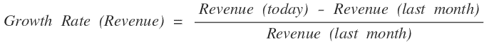

用这个简单的方法，增长率就是一个月到下一个月收入的百分比变化。如果我们要绘制一段时间内的收入图表，增长率就是每个数据点之间的变化率。以下面一家样本公司的收入随时间变化的图表为例:

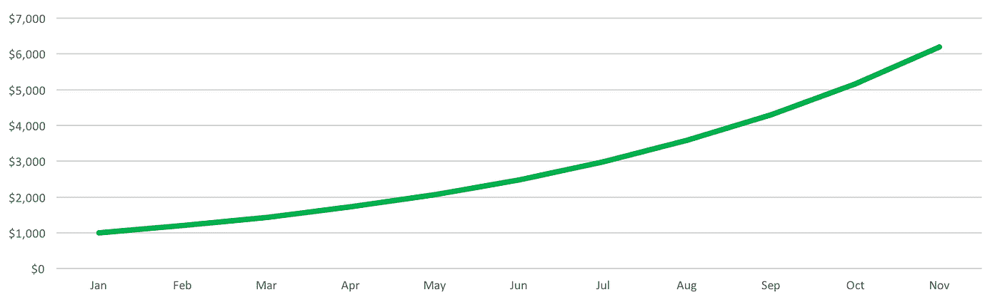

Chart of simple growth rate: revenue over time

根据我们的简单公式，这家公司的增长率将是每月 10%的直线。

然而，如果我们透过表面看，上面简单的图表可以告诉我们许多不同的故事，因为这样一个简单的增长率可以隐藏许多事情。如果你的价格改变了呢？这一个月你获得和失去的客户呢？例如，考虑下面的两个图表，其中旧客户收入反映了每个月初之前的所有客户的收入，新客户收入反映了该月的新收入。

示例 A:

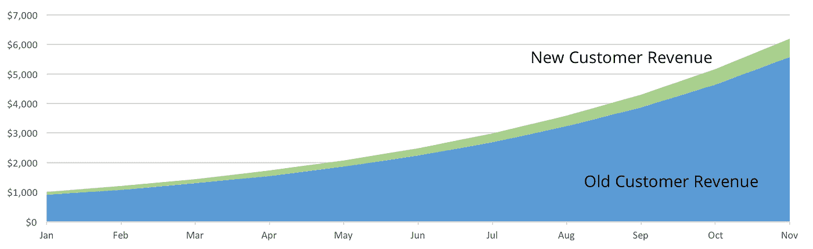

Segmented growth rate of revenue over time: new vs. old customers where old customers drive most growth

示例 B:

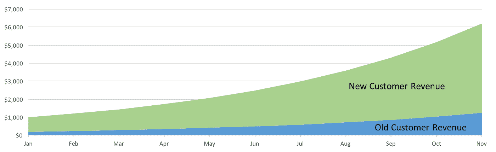

Segmented growth rate of revenue over time: new vs. old customers where new customers drive most growth

在示例 A 中，除了现有客户之外，业务还在稳步增长，新客户也在健康增长。在示例 B 中，企业正在快速流失客户，但却隐藏在新客户快速增加的背后！使用我们的简单公式，这两个示例将导致相同的增长率(两个示例中的面积图顶部)。

新老客户之间的这种混淆是增长率的一个重要问题，需要解决。零售店普遍存在这个问题，因为开设新店可以很容易地抵消老店销售额下降的影响。因此，零售商店的增长率是用一种叫做“[同店销售额](https://en.wikipedia.org/wiki/Same-store_sales)的指标来衡量的，这种指标只衡量开业至少一年的商店的增长率。这将真正的销售增长与新开业率区分开来。

你可以类似地修改你的增长率计算，并通过考虑你的流失率来隔离现有业务和新业务的增长。你需要做的就是从上面我们的增长率公式中减去它:

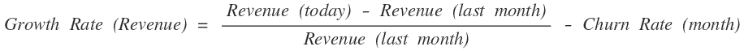

Growth rate calculation, including churn

正如我们上周讨论的，你的流失率实际上可能是负数，在这种情况下，它会增加你的增长率！

这种新的增长率公式可能是对我们业务的更好衡量，因为它清楚地告诉我们，在保留客户价值方面，我们的增长情况如何。然而，这种方法仍然存在挑战:

*   **短月**。有些月份的天数(31)比其他月份(28 或 30)多，这意味着产生收入的时间更长。因此，二月看起来总是像一个缓慢增长的月份！由于假期的原因，几周的时间可能会变短，这使得我们的增长率超出了应有的范围。
*   **公制组件**。理解增长的驱动因素和增长率本身一样重要。你将增长率分解成几个部分的能力与你如何计算增长率直接相关。

就像客户流失一样，增长率没有神奇的公式，你需要自己决定如何最好地衡量你的业务增长。到目前为止，我们所介绍的内容应该足以让您开始定义业务增长，并找到相应的计算方法。

# 第二部分。**复合增长率**

很容易想到一个月到下一个月(或几天或几周)的增长率。然而，增长率通常会被考虑更长的时间，因为在你的增长中可能会有很多变化。

为了说明这一点的重要性，让我们以一家公司为例，这家公司每月收入稳定增长 1，000 美元(每月流失率为 0)。他们的总收入图表是一条简单的直线，显示了持续增长的业务:

linear growth over time — a straight line

然而，如下图所示，这个线性增长率正在随着时间的推移而降低！

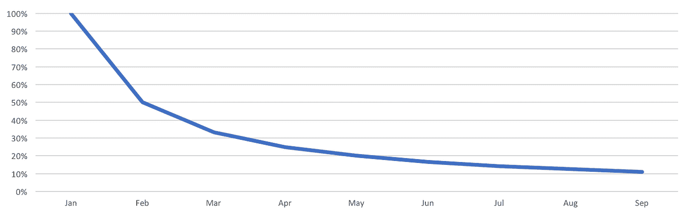

linear growth over time means a decreasing growth RATE!

这是因为随着公司的发展，1000 美元在总收入中所占的比例越来越小。最终，如果公司每月收入达到 100 万美元，他们每月增加的 1000 美元将只有 0.1%的增长！

每月 10%的持续增长率意味着你实际上在产生复合增长，也就是说你每个月都在更快地增长。同一家公司，从 1，000 美元的初始收入开始，以 50%的增长率持续增长，其总收入将增长如下:

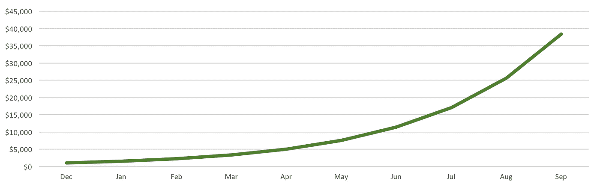

Revenue growth on $1,000, with a consistent 50% monthly growth rate.

为了在一段时间内保持一个增长率，你的规模越大，你的增长速度就越快。对于那些设定未来增长率目标的公司来说，这是一个隐藏的陷阱——随着时间的推移，你设定的具体增长率目标越往后，就越难保持。

# 第三部分。**季节性增长**

到目前为止，在我们对增长率的探索中，我们做了一个隐含的假设，即您的业务全年将以大致相同的速度增长。大部分商家都不是这样！有些业务会在某些月份快速增长，而在其他月份收缩。以一辆冰淇淋车为例:在夏季的几个月里，生意会很兴隆，增长很快，只是在秋季和冬季，随着室外天气变冷，生意会萎缩。

在季节性很强的企业中，理解增长更难，但也更重要。从你的图表上看不出你是否在增长，以下连续两年季节性业务的收入图表就证明了这一点:

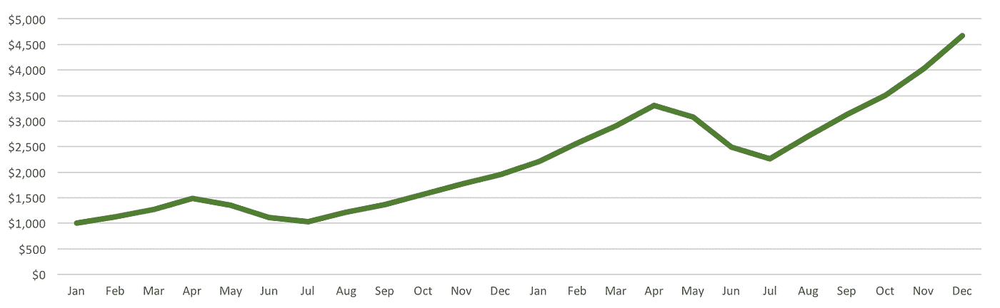

Growth in seasonal business becomes more complex to understand

我们需要重新思考我们最初关于增长的假设，因为在这些业务中，通过比较一个月与前一个月来计算增长并不是一个很好的增长衡量标准。如果你不相信我，这是上例中的业务在第二年的天真增长率:

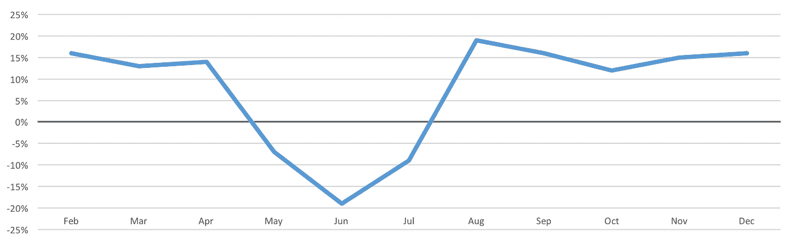

Understanding growth becomes more complex with ups and downs!

很难从这张图表中获得太多，因为它从正增长率跳到负增长率，然后再跳回来。我们所能看到的是，夏季的几个月对生意不利，但我们在增长吗？

我们可以做得更好！让我们将每个月与前一年的同一个月进行比较，前一年是一年中的同一时间(季节)。你可以在下面看到:

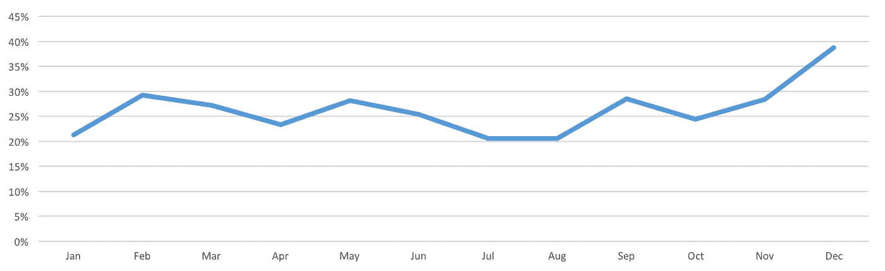

For seasonal businesses consider modeling growth year over year to adjust for seasonality

我们的增长率稳定在 20%到 30%之间，直到 12 月份出现大幅增长。

这非常有用，我们可以利用它来了解我们的决策是如何影响业务的。

如果你的业务是季节性的，你可能想使用类似的方法，因为它使增长更容易理解，与你的业务更相关。

# 第四部分。**预测增长**

几乎在你定义了你的成长指标之后，你会想把它投射到未来。今年你会长得更快吗？你目前的增长速度会持续多久？你越能预测你未来的成长，你就能越准确地分配你的资源和提前计划。

不幸的是，真实世界的增长很难预测。例如，给定以下每日收入数据，让我们尝试预测下周每天的收入:

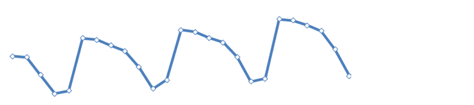

Forecasting growth can be difficult when looking at daily numbers.

像大多数真实世界的数据一样，这些数据中隐藏着模式和趋势，这使得外推变得困难。幸运的是，有一个简单的方法来模拟周期性周数据的增长。我们可以观察到，重复的循环意味着我们可以独立地关注一周中的每一天，而不是试图从整体上理解数据。这样一来，way 就可以使用像[线性回归](http://outlier.ai/2016/09/09/simple-statistics-linear-regression/)这样的技术来给我们一个下周每天的预测([阅读更多关于这个](http://outlier.ai/2016/08/29/predicting-the-future/))。

例如，如果我们只分析周一，趋势实际上是一条直线！

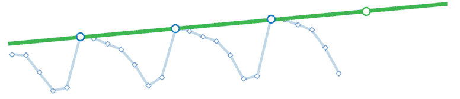

consider forecasting trends by day of week to smooth out the noise from day of week fluctuations

通过为一周中的每一天创建单独的趋势，我们可以以相当高的准确度为我们认为下周每天的收入建立一个模型(我们可以使用更高级的技术，如[双指数平滑](http://www.itl.nist.gov/div898/handbook/pmc/section4/pmc434.htm)来平滑单个估计值):

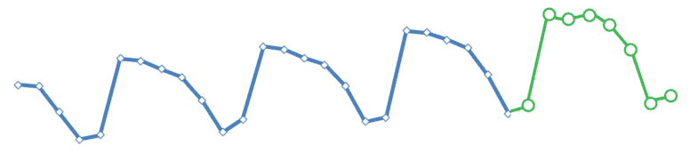

Aggregate your day of week trends into a single model to smooth out the noise from day of week fluctuations

有了这个预测，我们就可以像本周前几章那样计算未来的增长率了！

回顾:你的业务是否在增长是一个重要的事实，但是增长速度有多快却很难确定。您计算和预测增长的方式将取决于您对业务增长的定义，最好尽早做出决定。

> [**离群值**](http://outlier.ai/about-outlier/) **监控您的业务数据，并在发生意外变化时通知您。**我们帮助营销/发展&产品团队从他们的业务数据中获取更多价值。[安排今天的演示](http://outlier.ai/about-outlier/)。
> 
> - Outlier 是 Strata+Hadoop World 2017 观众奖得主。