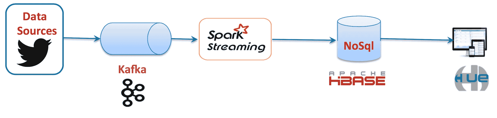
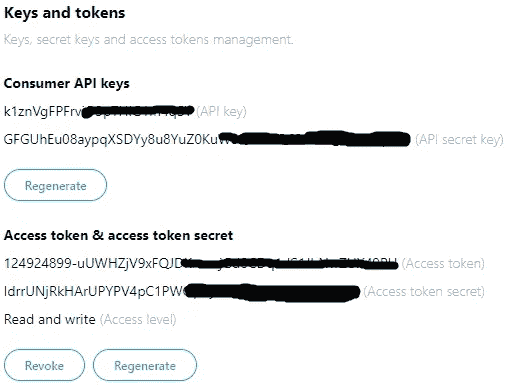
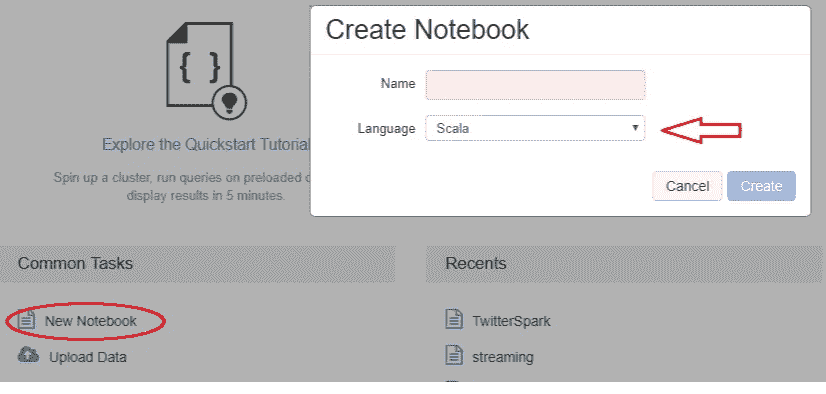
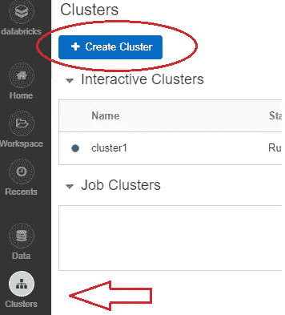
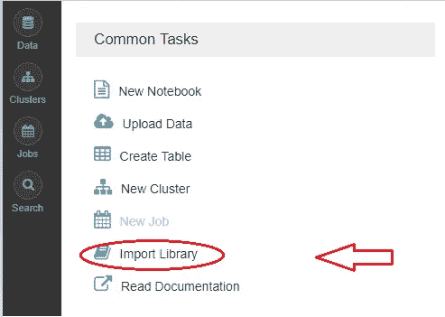
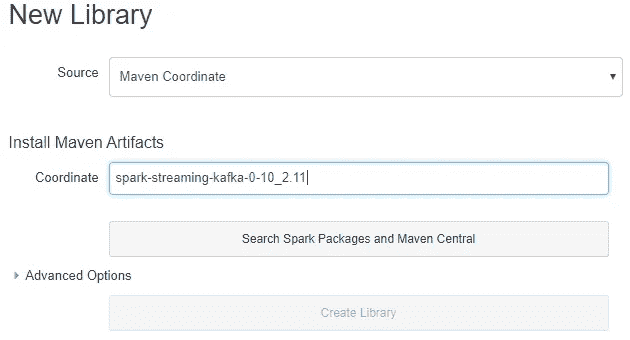
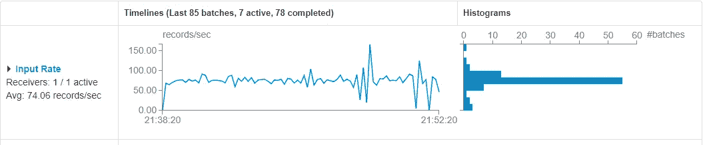
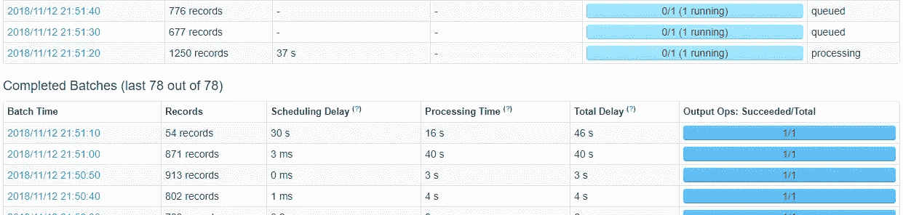

# 如何用 Apache Spark 和 Apache Kafka 实时捕捉和存储推文？使用云平台，比如 Databricks 和 GCP(第 1 部分)

> 原文：<https://towardsdatascience.com/how-to-capture-and-store-tweets-in-real-time-with-apache-spark-and-apache-kafka-e5ccd17afb32?source=collection_archive---------8----------------------->

## 包含代码和教程的可重复的端到端解决方案

大家好，借此机会我想分享一个关于如何使用云平台如 **Databricks** 和**谷歌云平台**实时捕获和存储 Twitter 信息的例子 **Spark Streaming** 和 **Apache Kafka** 作为开源工具。

这次我们将使用 Spark 与 Twitter 进行交互，并通过 Producer 的 API 将数据带到 Kafka 主题。



在开始开发之前，必须理解一些基本概念:

**Spark Streaming:** 它是 Apache Spark core API 的扩展，以可扩展的方式响应近实时(微批处理)的数据处理。Spark Streaming 可以连接不同的工具，如 Apache Kafka、Apache Flume、Amazon Kinesis、Twitter 和 IOT 传感器。

**Apache Kafka:** 这是一个快速、可伸缩、持久、容错的发布订阅消息系统。Kafka 通常用于使用流数据提供实时分析的实时架构中。

*我们开始吧！*

1.  **Twitter 应用:**要获取推文，我们必须在[**Twitter devs**](https://apps.twitter.com/)**注册并创建一个应用。Twitter 会给我们 4 个重要的价值观，让我们能够消费信息:**

*   **消费者密钥(API 密钥)**
*   **消费者秘密(API 秘密)**
*   **访问令牌**
*   **访问令牌秘密**

****

**2.**Spark data bricks:**data bricks 平台允许我们创建一个免费的 Spark-Scala 集群。我们必须注册 [**Databricks**](https://databricks.com/signup#signup/community) ，然后创建一个 scala 笔记本，我们将在其中编写代码。**

****

**在编写代码之前，我们必须创建一个集群并导入两个库，[**Twitter library**](https://mvnrepository.com/artifact/org.apache.bahir/spark-streaming-twitter_2.11/2.2.1)**将允许我们将 Twitter API 与 Spark 和 [**KafkaLibrary**](https://mvnrepository.com/artifact/org.apache.bahir/spark-streaming-twitter_2.11/2.2.1) 一起使用，这有助于我们连接 Apache Kafka。****

****这里是如何使用 Maven 导入库的文档:[https://docs.databricks.com/user-guide/libraries.html](https://docs.databricks.com/user-guide/libraries.html)****

****创建集群:****

********

****然后，我们必须选择选项:导入库****

********

****然后，我们选取漫威坐标为源，写出库名:**spark-streaming-Kafka-0–10 _ 2.11。******

****之后，我们对**spark-streaming-Twitter _ 2.11**做同样的事情****

********

****现在，我们只需要让我们的 Kafka 集群开始执行我们的开发。****

****3.**Google 云平台中的 Apache Kafka:**要创建集群，我们必须遵循以下步骤****

****a)在 GCP 创建一个实例并安装 Kafka，遵循下一个[**Kafka-Cloud**](https://www.datasciencecentral.com/profiles/blogs/setting-up-your-first-kafka-development-environment-in-google)**教程。******

******b)启用并创建规则以公开端口 2181(zookeeper)和 9092(kafka)。从我们虚拟机的 ssh 控制台输入以下命令:(记住要更改变量 **NAME_VM********

```
***gcloud compute firewall-rules create rule-allow-tcp-9092 --source-ranges 0.0.0.0/0 --target-tags allow-tcp-9092 --allow tcp:9092**gcloud compute firewall-rules create rule-allow-tcp-2181 --source-ranges 0.0.0.0/0 --target-tags allow-tcp-2181 --allow tcp:2181**gcloud compute instances add-tags NAME_VM --tags allow-tcp-2181
gcloud compute instances add-tags NAME_VM --tags allow-tcp-9092***
```

****c)配置 Kafka 属性文件以公开其服务，在 SSH 的下一个配置文件 **server.properties** 中添加以下参数。****

```
***vi /usr/local/kafka/config/server.properties**listeners=PLAINTEXT://your_internal_ip_vm:9092
advertised.listeners=PLAINTEXT://your_external_ip_vm:9092***
```

****d)最后，重新启动 Kafka 服务以使所做的更改生效。****

```
***sudo /usr/local/kafka/bin/kafka-server-stop.sh**sudo /usr/local/kafka/bin/kafka-server-start.sh -daemon /usr/local/kafka/config/server.properties***
```

****现在我们准备消费来自 Twitter 的数据，并将其存储在 Apache Kafka 的一个主题中，走吧！****

****在我们的笔记本中，我们输入以下代码:****

****你可以从 [jmgcode](https://databricks-prod-cloudfront.cloud.databricks.com/public/4027ec902e239c93eaaa8714f173bcfc/2128544101033400/1904549159880935/6372373427624332/latest.html) 下载完整的笔记本****

****要查看 Kafka 中的消息，您可以在 GCP 环境中启动以下命令:By **SSH******

```
**sudo /usr/local/kafka/bin/kafka-console-consumer.sh --bootstrap-server your_internal_ip_vm:9092 --topic llamada**
```

********

****working :)****

****在 Databricks 中，我们可以跟踪我们处理的推文:****

********

****number of tweets per second****

********

****这就是目前的全部内容，在第二部分中，我们将看到如何在 rt 中对这些信息进行一些转换，并将结果存储在 Apache Hbase、Cassandra 或 Apache Kudu 等数据库中。****

****下期帖子再见:)…****

****[](https://github.com/jmendezgal/kafka-twitter-spark-streaming-cloud/blob/master/KafkaTwitterSparkStreaming.scala) [## jmendezgal/卡夫卡-twitter-spark-streaming-cloud

### 通过在 GitHub 上创建帐户，为 jmendezgal/Kafka-Twitter-spark-streaming-cloud 开发做出贡献。

github.com](https://github.com/jmendezgal/kafka-twitter-spark-streaming-cloud/blob/master/KafkaTwitterSparkStreaming.scala)****