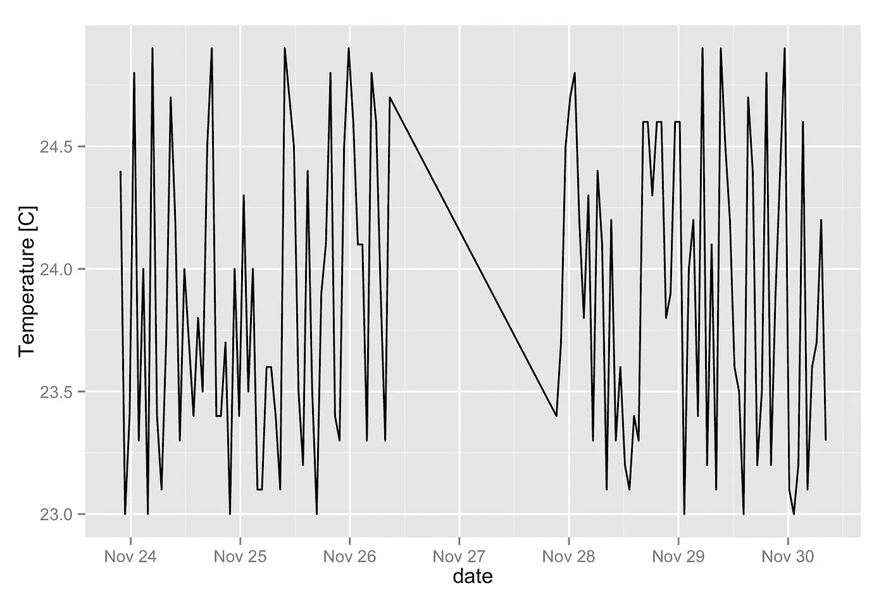
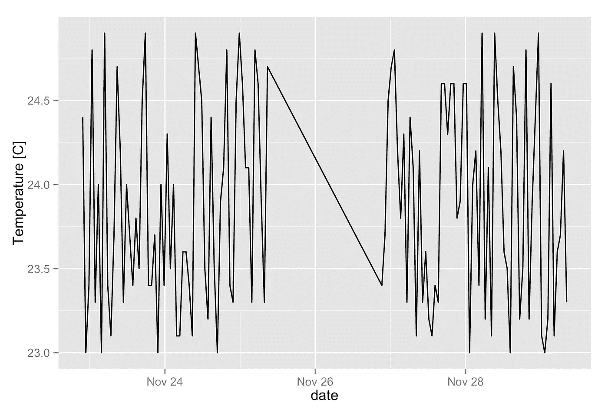
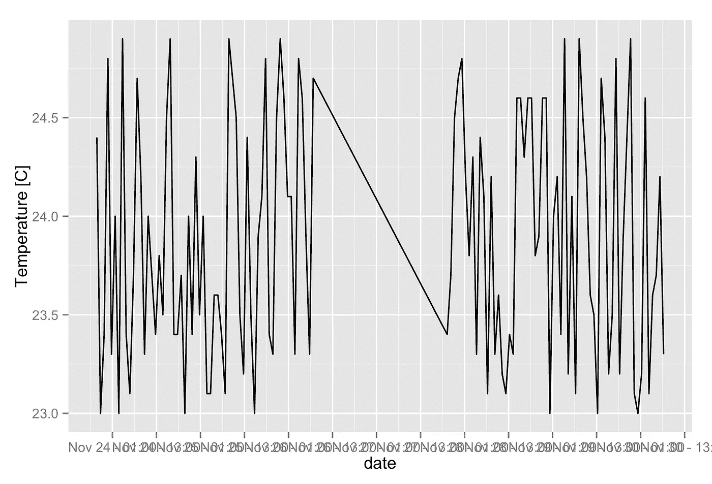
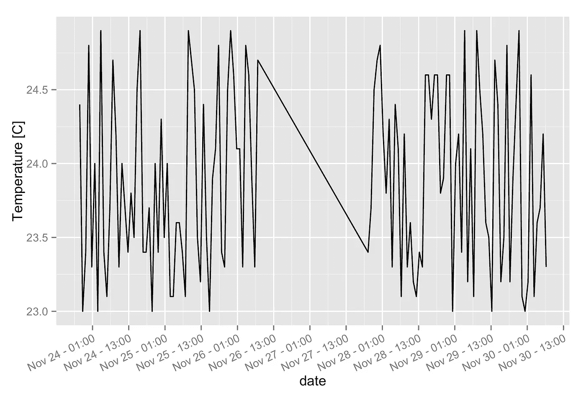

# 如何使用 R 和 ggplot2 更改日期时间轴上的中断数

> 原文：<https://towardsdatascience.com/how-to-change-the-number-of-breaks-on-a-datetime-axis-with-r-and-ggplot2-douglas-watson-338f0d353f05?source=collection_archive---------5----------------------->

我花了惊人的时间才找到如何在 ggplot2 日期时间轴上更改刻度间隔，而无需手动指定每个位置的日期。一旦你知道了语法，解决方案就出奇的简单明了:

```
scale_x_datetime(breaks = date_breaks("12 hours"))
```

这意味着每 12 小时休息一次。间隔可以是`scales`包接受的任何值:“秒”、“分”、“小时”、“天”、“周”、“月”或“年”。尾部的`s`被忽略。请阅读如何旋转标签文本的示例和说明。

# 例子

我们用一些假数据来说明。我重用了我的闪亮教程中的 CSV 数据。你可以在这里下载文件。格式如下所示:

```
"timestamp","date","origin","variable","value" 
1448315085.07,2015-11-23 21:44:45,"kitchen","temperature",24.4 
1448315085.07,2015-11-23 21:44:45,"kitchen","humidity",44.9 
1448315085.07,2015-11-23 21:44:45,"bedroom","temperature",24.8 
1448315085.07,2015-11-23 21:44:45,"bedroom","humidity",46.1 
1448318685.07,2015-11-23 22:44:45,"kitchen","temperature",23 
1448318685.07,2015-11-23 22:44:45,"kitchen","humidity",41.1 
1448318685.07,2015-11-23 22:44:45,"bedroom","temperature",23.6 
1448318685.07,2015-11-23 22:44:45,"bedroom","humidity",45.7 
1448322285.07,2015-11-23 23:44:45,"kitchen","temperature",23.4 
...
```

让我们将它加载到 R dataframe 中，确保将 date 列转换为 R datetime 对象(参见我的[上一篇关于这个主题的文章](http://douglas-watson.github.io/posts/gdocs_2_R)，然后创建一个简单的温度-时间图:

```
library(ggplot2) 
library(dplyr) data <- read.csv("data.csv") 
data$date <- as.POSIXct(data$date) 
temperatures <- filter(data, variable == "temperature", 
                       origin == "kitchen") qplot(date, value, data = temperatures, geom="line", 
      ylab = "Temperature [C]")
```



默认的休息时间很合理，但是为了便于说明，让我们将它们改为每两天休息一次。标签格式遵循 strftime 语法(见[http://www.foragoodstrftime.com/](http://www.foragoodstrftime.com/)帮助构建它们):

```
qplot(date, value, data = temperatures, 
      geom="line", ylab = "Temperature [C]") + 
    scale_x_datetime(breaks = date_breaks("2 day"), 
                     labels = date_format("%b %d"))
```



你可以看到休息的次数已经改变了。很多时候，我更感兴趣的是增加它们的密度。让我们切换到以小时为单位的时间间隔，并在标签中包括时间:

```
qplot(date, value, data = temperatures, 
      geom="line", ylab = "Temperature [C]") + 
    scale_x_datetime(breaks = date_breaks("12 hour"), 
                     labels = date_format("%b %d - %H:%M"))
```



哎哟！标签不可读。幸运的是，我们可以旋转文本以防止它们重叠:

```
qplot(date, value, data = temperatures, 
      geom="line", ylab = "Temperature [C]") + 
    scale_x_datetime(breaks = date_breaks("12 hour"), 
                     labels = date_format("%b %d - %H:%M")) +
    theme(axis.text.x = element_text(angle = 25, 
                                     vjust = 1.0, hjust = 1.0))
```



那好多了！如果您将角度设置为 90 度，或者如果您有一个旧版本的 R，您将需要调整`vjust`和`hjust`值，直到标签正确排列。尝试将`debug = TRUE`添加到`element_text`来显示文本锚点。

# 包括图书馆里的这些

我发现自己在许多 R 笔记本上加载相同的数据格式并制作类似的图形，所以我编写了一个小型函数库，可以在我的所有分析中重用。[希拉里·帕克的指南](https://hilaryparker.com/2014/04/29/writing-an-r-package-from-scratch/)解释了你自己写作所需要的一切。我的函数类似于下面的代码，我可以选择指定一个刻度间隔。如果我以小时为单位指定时间间隔，标签会自动包含时间。如果我将参数留空，ggplot 将保持其默认值:

```
plot_temperature <- function(data, title = "", breaks = "", angle = 25) {
    p <- ggplot2::qplot(date, value, data = data, 
                        ylab="Temperature [C]") 

    if (title != '') {
      p <- p + ggplot2::ggtitle(title)
    }

    if ( breaks != '' ) {
      if ( grepl("hour", breaks) ) {
        fmt <- "%b %d - %H:%M"
      } else {
        fmt <- "%b %d"
      }
      p <- p + ggplot2::scale_x_datetime(date_breaks = breaks, 
                                         date_labels = fmt) +
        ggplot2::theme(axis.text.x = ggplot2::element_text(
          angle = angle, vjust = 1.0, hjust = 1.0
        ))
    }
    return(p)
}
```

当您将函数移动到外部库时，指定您调用的每个函数的名称空间非常重要。于是`ggplot2::`分散各处。

*原载于*[*Douglas-Watson . github . io*](http://douglas-watson.github.io/post/2017-05_ggplot_datetime/)*。*