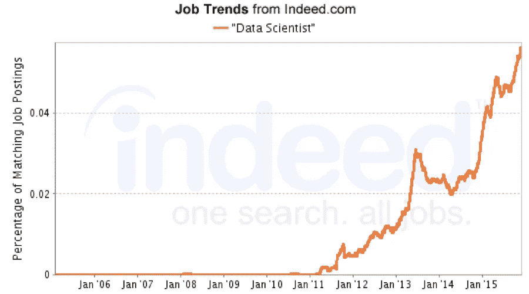

# 如何选择数据科学工作？

> 原文：<https://towardsdatascience.com/how-to-choose-a-data-science-job-53007d7f195f?source=collection_archive---------2----------------------->

这是数据科学的全盛时期…

Yes! Yes!Yes!

**1。世界各地大学最热门的新课程都在这个领域。**

**2。数据科学家毕业生的起薪中值为 93，000 美元，令人印象深刻。**

**3。六位数数据科学工作的广告很常见。**

数据科学似乎无愧于 21 世纪最性感工作的称号。”

但是随着这个领域的所有这些骚动，许多人想知道数据科学职业的趋势是否只是一种时尚。为什么要拿你的教育、职业和未来做赌注呢？

有这些犹豫是合理的。所有称职的数据科学家都应该知道用事实而不是直觉工作的重要性。

这就是为什么在下面的文章中，我们将揭示五种新兴角色如何产生公司不能忽视的已被证明的价值。

此外，我们将解释每个职位的共同期望和责任，以帮助你专注于获得你真正想要的工作。

在我们详细研究这五个角色之前，让我们先明确一下为什么数据科学工作如此有前途。

# 为什么从事数据科学职业是值得的？

## *数据科学角色将呈指数级增长*

在我们热爱的领域里，工作是时尚的，但是不要让这种认为趋势是短暂的想法阻止你去学习更多关于这个主题的知识。

So far — So good (source: Indeed.com)

我们生活在数字时代，随着技术的进步，获取、存储和处理数据的能力也会提高。

公司需要人来管理和控制这些阶段。因此，随着工作领域的技术义务变得更加苛刻，对数据科学家的需求只会增加，这是合乎逻辑的一步。

但不要相信我的话:专家预测，未来三年内，新的数据和分析工作将增加 364，000 个。这不是一个可以掉以轻心的数字。

## 数据科学工作的竞争较少

预计的 364，000，000 个新工作岗位将需要人员来填补。

尽管在线和传统机构的数据科学课程数量惊人增长，但由于其快速增长，未来十年该领域不太可能出现员工过剩。

公司正在努力填补职位空缺。数据科学职位的开放时间比更传统的职位发布时间更长，例如，专业服务行业的分析经理职位平均需要 53 天，比该领域的平均时间多 8 天。

因此，众所周知，确实缺乏合适的候选人，现在是在就业市场上利用这一需求的时候了。

各行各业都感受到了数据工作爆炸的余震，包括:

**休闲&旅游:** Airbnb 建立了一所内部大学，专门研究数据科学。
**金融:**人工智能将被会计师用于减轻审计负担。
**医学:** IBM 计划在其大获成功的沃森人工智能的基础上，创建一个跨学科的数据科学网络。

除此之外，在这些领域和许多其他领域，公司需要熟练的工人来带领他们穿越数据科学的波涛汹涌的水域。

## 数据科学可能是你未来工作保障的最佳选择

机器人有一天将取代许多目前由人类完成的工作，这种想法不再是科幻小说中的东西，对于任何开始职业生涯的人来说，这都应该是一个值得关注的问题。

> 德意志银行首席执行官 John Cryan 在接受美国消费者新闻与商业频道采访时表示，在通过技术简化工作流程的过程中，金融领域的非技术性工作将不可避免地受到影响。
> 
> 《卫报》最近报道称，在未来 10 年内，英国私营部门的 400 万份工作可能会被机器人取代。

虽然很少有工作不存在未来自动化的风险，但数据科学的吸引力在于它直接分析、管理和改变工作流程和公司信息的数字后端。

对于那些在未来不确定时期寻找工作保障的人来说，这是一个合理的——如果不是完全可靠的——计划。

> 我很高兴给你一个数据科学工作的顶级概述。为了更深入地了解这一领域，请参加 2018 年 10 月 12 日至 14 日在圣地亚哥举办的[数据科学大会。](https://www.datasciencego.com/)
> 
> 在本次会议上，您将从该领域的专家那里获得有价值的信息，帮助您开启数据科学职业生涯。

# 开启您的数据科学职业生涯

这三个原因应该会激起你对这个领域的兴趣…

但是数据科学家实际上是做什么的呢？什么是数据分析师与数据科学家？

不喜欢数据科学技术方面的人有什么选择？

查看以下五个关键角色及其职权范围，以表明该领域不仅对公司越来越重要，而且数据科学是 21 世纪最令人振奋的工作领域。

## 选择适合您的数据科学工作:

有许多职业道路可供选择，并且很难驾驭。为了帮助你找到理想的角色，以下是大多数广告中常见的五个头衔，以及对他们可能承担的职责的描述。

商业分析师:
这些类型的角色对许多公司来说都是舒适的领域，因为商业智能的概念在数据繁荣之前已经存在了很长时间。

因此，它们可能比更具分析性或需要编程知识的职位更具竞争力。

商业分析师不太可能自己分析数据。相反，他们应该将准备好的数据转化为公司未来运营的引人注目的视觉效果。

无论你的职责是什么，如果你有兴趣成为一名商业分析师，强大的表达能力是很重要的。

***数据分析师(数据准备):***
数据准备方面的专家才是真正的数据科学项目的中坚力量。数据准备不是一件容易的事情，在项目的这个阶段出现失误会导致失败。

在这些职位上，工作人员必须手动在无尽的数据行中搜寻，根据需要进行清理和结构化。这使得它成为一个繁琐而困难的过程，需要一些技术知识，更重要的是，相当注意细节。尽管有这些职责，这些角色通常被称为入门级职位。

这些工作对于那些可能已经上过数据科学课程并希望实践他们新获得的技能的人来说可能是理想的“实习”，以在承担其他责任之前增加他们在该领域的信心。在这个职位上证明你自己，你将比其他寻求立足之地的候选人更有竞争力。

***数据分析师(建模)/数据建模师:***
虽然名字相似，但数据分析师在建模方面实际上要比他们的数据分析师(数据准备)同行负责更多。

数据建模师的任务是开发能够管理和处理公司数据库的系统。编程专业知识对于这些角色来说是必不可少的。

虽然数据准备可能不是工作描述中的要求，但如果你准备数据集的技能不稳定，请谨慎从事:较小的公司可能会整合数据分析师的角色，这意味着除了数据建模员之外，你还可能被赋予数据准备员的职责。

***数据科学家/高级分析师/机器学习(ML)从业者/高级数据科学家:***
这些角色是数据科学跳动的心脏。任何想要解决这些问题的人都必须是一个多面手…并且是所有人的主人！对于这些职位，你必须精通数据科学项目的所有阶段。

对于普通读者来说，我们对这些迷人的角色垂涎三尺并不奇怪。这些工作需要人们跳出框框思考问题，然后为公司未来的健康发展创造可行的解决方案。

说了这么多，这些职位只适合喜欢主动的人。如果你想遵循一套严格的规则，在 5 点钟结束一天的工作，这些规则不适合你。

如果你喜欢挑战，如果你有创造力，如果你在工作中渴望编程和分析任务，立即申请吧！

***数据科学经理/分析经理:***
这些角色为回避更多技术职位的人开了绿灯。他们只是浏览了数据科学的表面——重点是客户和团队的一般管理。

管理职位自然最适合喜欢跨团队交流和与客户交流的人。由于它们不直接处理数据科学的技术方面，它们可能不适合希望成为“严肃”数据科学家的人。

这是因为经理们将忙于员工和预算控制，因此没有时间参与编程或分析。

然而，由于他们的管理职责，这些职位可能是那些已经在另一个领域进入职业生涯并计划转向数据科学的人的合理解决方案。

# 最终外卖

当你在寻找一份利润丰厚的数据科学职业时，把这些细目分类放在身边作为工作备忘单——它将帮助你快速剔除不太适合的职位。

请记住，虽然我们尽了最大努力来强调对每个角色的总体期望，但每个角色的实际工作规范会因公司而异。

和其他职位一样，在申请之前一定要通读说明书。数据科学家注重细节——确保你在应用中证明了这一点！

有关如何改善您的数据科学职业生涯的更多信息，[点击此处](https://www.datasciencego.com/)参加我们 2018 年 10 月 12 日至 14 日的直播。

[**Click here to reserve your seat!**](https://bit.ly/2JjxDbK)

## 参考资料:

*以下是领英 2017 届毕业生的前 15 份工作-*[https://tech.co/linkedin-jobs-grads-2017-05](https://tech.co/linkedin-jobs-grads-2017-05)

*数据科学家:21 世纪最性感的工作*——[https://HBR . org/2012/10/Data-Scientist-21 世纪最性感的工作](https://hbr.org/2012/10/data-scientist-the-sexiest-job-of-the-21st-century)

*量子危机:对数据科学技能的需求正在扰乱就业市场*—[https://www . IBM . com/analytics/us/en/technology/data-science/Quant-Crunch . html](https://www.ibm.com/analytics/us/en/technology/data-science/quant-crunch.html)

*IBM 预测到 2020 年对数据科学家的需求将飙升 28%*—[https://www . Forbes . com/sites/louiscumbus/2017/05/13/IBM-Predicts-Demand-For-Data-Scientists-Will-Soar-28-By-2020/# 4 e5d 9 a 9 e 7 e 3 b](https://www.forbes.com/sites/louiscolumbus/2017/05/13/ibm-predicts-demand-for-data-scientists-will-soar-28-by-2020/#4e5d9a9e7e3b)

*Airbnb 正在运营自己的内部大学，教授数据科学*—[https://TechCrunch . com/2017/05/24/Airbnb-is-running-its-own-internal-university-to-teach-data-science/](https://techcrunch.com/2017/05/24/airbnb-is-running-its-own-internal-university-to-teach-data-science/)

*IBM 的 Watson 数据平台旨在成为数据科学操作系统*—[http://www . zdnet . com/article/ibms-Watson-Data-Platform-aims-to-be-Data-science-operating-system/](http://www.zdnet.com/article/ibms-watson-data-platform-aims-to-become-data-science-operating-system/)

*德意志银行首席执行官直言不讳地谈到自动化将对银行业的工作岗位产生什么影响*—[https://www . CNBC . com/2017/09/17/jobs-and-automation-Deutsche-Bank-CEO-cry an-warns-at-Singapore-summit . html](https://www.cnbc.com/2017/09/17/jobs-and-automation-deutsche-bank-ceo-cryan-warns-at-singapore-summit.html)

*机器人“可能在 10 年内夺走 400 万份英国私营部门工作岗位*”——[https://www . the guardian . com/technology/2017/sep/19/Robots-can-take-400 万份私营部门工作岗位——10 年内](https://www.theguardian.com/technology/2017/sep/19/robots-could-take-4m-private-sector-jobs-within-10-years)