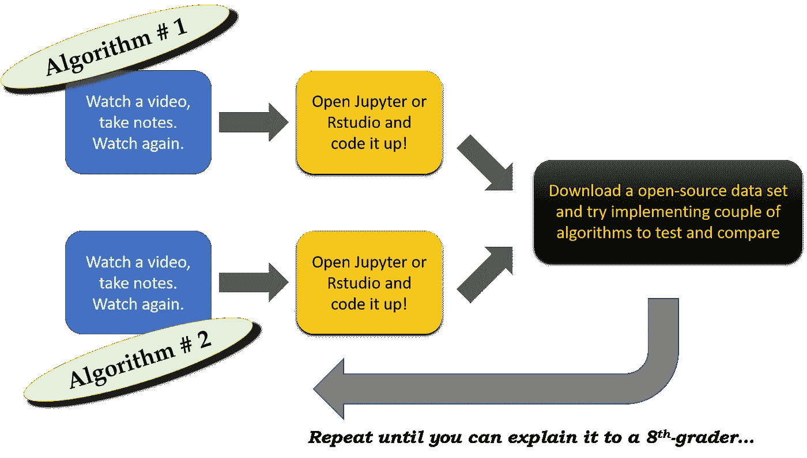

# 如何选择有效的机器学习和数据科学课程

> 原文：<https://towardsdatascience.com/how-to-choose-effective-moocs-for-machine-learning-and-data-science-8681700ed83f?source=collection_archive---------1----------------------->

## 给希望学习数据科学/机器学习并为之做出贡献的非 CS 领域的年轻专业人士的建议。根据个人经验策划。

## 动机

比尔·盖茨[在最近的毕业典礼上宣称，人工智能(AI)、能源和生物科学是当今年轻的大学毕业生可以选择的三个最令人兴奋和最有回报的职业。](http://fortune.com/2017/05/16/bill-gates-college-graduation-advice/)

我完全同意。

我坚信，我们这一代人面临的一些最重要的问题——与可持续性、能源生产和分配、交通、获得基本生活设施等有关。取决于我们如何明智地将盖茨先生提到的前两个知识分支结合起来。

> 换句话说，在物理电子世界(半导体行业构成了这个世界的核心部分)，必须做更多的事情来充分享受信息技术的成果以及人工智能或数据科学的新发展。

## 我想学，但是从哪里开始呢？

我是一名半导体专业人士，在一家顶级科技公司拥有超过 8 年的博士后工作经验。我感到自豪的是，我在物理电子学的交叉领域工作，这直接有助于能源部门。我开发[功率半导体器件](https://en.wikipedia.org/wiki/Power_semiconductor_device)。它们能够高效可靠地传输电力，从智能手机内部的微型传感器到处理日常消费食品或布料的大型工业电机驱动器，它们都可以供电。

因此，很自然地，我想学习和应用现代数据科学和机器学习的技术来改进这种设备和系统的设计、可靠性和操作。

但我不是计算机科学毕业生。我分不清[链表](https://en.wikipedia.org/wiki/Linked_list)和[堆](https://en.wikipedia.org/wiki/Heap_(data_structure))。[支持向量机](https://en.wikipedia.org/wiki/Support_vector_machine)听起来像(几个月前)一些残疾人专用设备。我记得的人工智能的唯一关键词(来自我大三的选修课)是' [*一阶谓词演算*](https://en.wikipedia.org/wiki/First-order_logic) '，这是所谓的'*旧人工智能*或*知识工程*方法的残余，与较新的基于[机器学习](https://en.wikipedia.org/wiki/Machine_learning)的方法相对。

> 我必须从某个地方开始学习基础知识，然后深入学习。显而易见的选择是 **MOOC** ( [大规模开放在线课程](https://en.wikipedia.org/wiki/Massive_open_online_course))。我仍然处于学习阶段，但我相信我至少已经积累了一些选择适合这条道路的 MOOC 的好经验。在这篇文章中，我想分享我在这方面的见解。

## 了解你的“气”和你的“敌人”

这是 Netlfix 最新的超级英雄系列剧——《守卫者》。

> 但确实，在开始通过 MOOC 学习之前，你应该非常清楚自己的优势、劣势和技术倾向。

因为，让我们面对现实吧，时间和精力是有限的，你不能把你宝贵的资源浪费在你在当前工作或未来工作中不太可能实践的事情上。这是假设你想走 ***(几乎)免费的学习道路，即旁听 MOOCs 而不是花钱买证书*** 。我有一个“*差不多*”在这里，因为在本文的最后，我想列出几个我认为你应该付费来展示证书的 MOOCs。就我个人而言，我不得不为我参加的几门 Udemy 课程付费，因为它们从来都不是免费的，但你可以在促销时以一份美味午餐三明治的价格购买它们。

What you can and cannot learn from MOOCs

在这幅图中，我只是想展示这个过程的可能性和不可能，即你希望通过自学和实践学到什么，以及无论你的职业是什么，在工作中必须学到什么或必须培养什么样的心态。然而，话虽如此，这些圈子广泛包含了一个人可以学习的核心技能，以便从非 CS 背景进入数据科学/机器学习领域。请注意，即使你在信息技术(IT)领域，你可能会有一个陡峭的学习曲线，因为传统的 IT 正在被这些新领域所破坏，核心技能和良好的实践往往是不同的。

就我而言，我认为数据科学领域比许多其他专业领域(例如我自己的工作领域半导体技术)更民主，在那里进入门槛低，只要足够努力和热情，任何人都可以获得有意义的技能。就我个人而言，我并没有“闯入”这个领域的强烈愿望，相反，我只是有一种热情，想借用这些成果来应用到我自己的专业领域。然而，这个最终目标并不影响人们必须经历的初始学习曲线。因此，你可以瞄准成为数据工程师、商业分析师、机器学习科学家或可视化专家——领域和选择都是敞开的。如果你的目标和我一样——停留在当前的专业领域，应用新学到的技术——你也很好。

## 你可以从真正的基础开始，这没什么不好意思的:)

我从真正的基础开始— [**在 Codeacademy 上学习 Python**](https://www.codecademy.com/learn/learn-python)。十有八九，你不能比这更基本:-)。但它成功了。我讨厌编码，但 Codeacademy 免费课程简单有趣的界面和正确的节奏足以让我继续下去。我本可以在 Coursera 或 Datacamp 或 Udacity 上选择 Java 或 C++课程，但一些阅读和研究告诉我，Python 是平衡学习复杂性和实用性(特别是对于数据科学)的最佳选择，我决定相信这种洞察力。

## 过了一段时间，你渴望更深层次的知识(*但速度很慢)*

odeacademy 的推出是一个良好的开端。我可以从这么多在线 MOOC 平台上选择，不出所料，我同时注册了多门课程。然而，在涉猎了几天 Coursera 课程后，我意识到我还没有准备好向教授学习 Python！我一直在寻找一门由一些热情的讲师讲授的课程，他们会花时间详细讲解概念，教我其他基本工具，如 Git 和 Jupyter notebook system，并在课程的基本概念和高级主题之间保持适当的平衡。我找到了这份工作的合适人选:[何塞·马西亚尔·波尔蒂利亚](https://www.udemy.com/user/joseporitlla/)。他在 Udemy 上为[提供多门课程，并且是该平台上最受欢迎和最受好评的讲师之一。我报名完成了他的](https://www.udemy.com/user/joseporitlla/)[**Python boot camp**](https://www.udemy.com/complete-python-bootcamp/)**课程。这是对这门语言的惊人介绍，速度、深度和严谨都恰到好处。我向新学员强烈推荐这门课程，即使你不得不支付 10 美元( *Udemy 课程通常不是免费的，它们的正常价格是 190 美元或 200 美元，但你总是可以等待几天，以获得经常性的推广周期，并注册 10 美元或 15 美元*)。**

## **保持对数据科学的关注非常重要**

**下一步对我来说至关重要。我可能会误入歧途，尝试学习 Python 上的任何东西。尤其是面向对象和类定义部分，很容易就能让你陷入漫长而艰难的旅程。现在，没有从 Python 世界的关键领域带走任何东西，可以有把握地说，您可以在不能够在 Python 中定义自己的类和方法的情况下实践深度学习和良好的数据科学。 [Python 作为数据科学的首选语言](https://jaxenter.com/python-robinson-interview-137474.html)越来越受欢迎的一个根本原因是，大量高质量、经过同行评审、由专家编写的库、类和方法的可用性，正等待着以一种良好的打包形式下载，并展开以无缝集成到您的代码中。**

> **因此，对我来说，快速进入数据科学最广泛使用的包和方法非常重要——[NumPy](http://www.numpy.org)、 [Pandas](http://pandas.pydata.org) 和 [Matplotlib](https://matplotlib.org) 。**

**我是通过 edX 的一个简洁的小课程被介绍给这些人的。虽然 edX 上的大部分课程都是来自大学，性质严谨(而且长*ish】*，但是像微软这样的科技公司提供的短而多动手/少理论的课程很少。其中之一就是 [**微软数据科学专业计划**](https://www.edx.org/microsoft-professional-program-data-science) 。你可以在这个项目下注册任意多的课程。然而，我只学了以下课程(我打算以后再来学其他课程)**

*   **[**数据科学方向**](https://courses.edx.org/courses/course-v1:Microsoft+DAT101x+1T2017/course/) :讨论典型的数据科学家的日常生活，并触及一个人在这个角色中应该具备的核心技能，以及对构成主题的基本介绍。**
*   **[**数据科学 Python 入门**](https://courses.edx.org/courses/course-v1:Microsoft+DAT208x+1T2017/course/) :讲授 Python 基础知识——数据结构、循环、函数，然后介绍 *NumPy* 、 *Matplotlib* 、 *Pandas* 。**
*   **[**Excel**](https://courses.edx.org/courses/course-v1:Microsoft+DAT205x+3T2016/course/)数据分析入门:教授 Excel 的基本和少量高级数据分析函数、绘图和工具(例如*透视表*、 *power pivot* 和*求解器插件*)。**
*   **[**数据科学用 R 简介**](https://courses.edx.org/courses/course-v1:Microsoft+DAT204x+2T2017/course/) :用 *ggplot2* 介绍 R 语法、数据类型、向量和矩阵运算、因子、函数、数据帧、图形。**

**虽然这些课程以一种基本的方式呈现材料，并且只涵盖最基本的例子，但它们足以激发灵感！好家伙，我被迷住了！**

## **我转而详细学习 R——有一段时间了**

**最后一门课程让我意识到几件重要的事情:(a)统计学和线性代数是数据科学过程的核心，(b)我不知道/已经忘得够多了，以及(c) R 自然适合于我想用我的数据集做的那种工作——由受控晶圆厂实验或 [TCAD 模拟](https://en.wikipedia.org/wiki/Technology_CAD)生成的几 MB 大小的数据，为基本的推理分析做好准备。**

**这促使我寻找一个坚实的 R 语言入门课程，还有谁比何塞·波尔蒂利亚更好呢！我报名参加了他的“ [**数据科学和机器学习训练营与 R**](https://www.udemy.com/data-science-and-machine-learning-bootcamp-with-r/) ”班。这是一笔“买一送一”的交易，因为课程在前半部分涵盖了 R 语言的基础知识，并转向教授基本的机器学习概念(入门课程中预期的所有重要概念都得到了足够的关注)。与使用基于服务器的动手实验室环境的 edX 微软课程不同，本课程涵盖了 R Studio 和必要软件包的安装和设置，向我介绍了 [kaggle](http://www.kaggle.com) ，并为我从被动学习者(也称为 MOOC 视频观察者)转变为不怕玩数据的人提供了必要的推动力。它还遵循了加雷斯·詹姆斯、丹妮拉·威滕、特雷弗·哈斯蒂和罗伯特·蒂布拉尼所著的《》(ISLR)中的《统计学习导论》一章一章地讲述。**

> **如果让你一生只看一本书学习机器学习，别的什么都不看，那就挑这本书，看完所有章节，无一例外。对了，这本书里没有神经网络或者深度学习的材料，所以有那个…**

**有了课程材料、ISLR 的书、从 kaggle 下载的随机数据集的练习，甚至是从 PG&E 下载的我自己的用电数据，我不再害怕编写小字节的代码，这些代码实际上可以模拟一些有趣或有用的东西。我分析了一些[美国县级犯罪数据](https://www.linkedin.com/pulse/regression-r-explorative-analysis-us-crime-pattern-data-sarkar/)，为什么一个[大型实验设计会导致虚假关联](https://www.linkedin.com/pulse/spurious-statistical-significance-why-large-doe-could-sarkar/)，甚至[我公寓过去 3 个月的用电量](https://github.com/tirthajyoti/ElectricityBillAnalysis)。我还成功地使用 R 建立了基于我工作中的一些真实数据集的预测模型。语言的统计/功能性质和各种模型(回归或分类)的置信区间(p 值或 z 值)的现成估计确实有助于新手在统计建模领域轻松立足。**

## **尽可能多学习数学基础知识**

**这方面的学习怎么强调都不为过——特别是对于非计算机专业的毕业生和 IT 工程师来说，他们在职业生涯中几年都没有接触过严谨的数学。我甚至写过一篇关于[机器学习和数据科学](https://medium.com/towards-data-science/how-much-maths-does-an-it-engineer-need-to-learn-to-get-into-data-science-machine-learning-7d6a42f79516)需要具备哪些数学知识的中等文章。**

****

**Mathematics necessary to learn/refresh for gaining foothold in data science/machine learning**

**为此，我从 Cousera 和 edX 选择了几门课程。很少有作品在深度和严谨性上脱颖而出。那些是，**

*   **[**数据科学和分析的统计思维**](https://courses.edx.org/courses/course-v1:ColumbiaX+DS101X+1T2016/course/) **(哥伦比亚大学):**哥伦比亚大学 edX 上的数据科学高管证书课程的基础统计课程。严谨，但以结构化的方式很好地深化了概念。**
*   **[**计算概率与推理**](https://courses.edx.org/courses/course-v1:MITx+6.008.1x+3T2016/course/) **(麻省理工):**这是麻省理工出的硬题，要注意！它以无与伦比的深度涵盖了贝叶斯模型和图形模型等高级主题。**
*   **[**统计学与 R 专业化**](http://Statistics with R Specialization) ( **杜克大学**):这是杜克大学的 5 门课程(最后一门是顶点项目，你可以忽略它)专业化，通过动手编程练习来增强你的统计学基础。推荐平衡难度和严格程度。**
*   **[**LAFF:线性代数——前沿基础**](https://courses.edx.org/courses/course-v1:UTAustinX+UT.5.05x+2T2017/course/)**(**UT Austin**):这是一门令人惊叹的线性代数基础课程(以及关于线性代数例程高性能计算的深入讨论)，你必须尝试一下。由德克萨斯大学奥斯汀分校在 edX 平台上提供。相信我，在学完这门课程后，你将永远不会想求矩阵的逆来解一个线性方程组，即使这很诱人也很容易理解，但你会试图找到一种 [QR 分解](https://en.wikipedia.org/wiki/QR_decomposition)或[乔莱斯基分解](https://en.wikipedia.org/wiki/Cholesky_decomposition)来降低计算复杂度。****
*   ****[**商业分析中的优化方法**](https://courses.edx.org/courses/course-v1:MITx+15.053x+3T2016/course/) ( **麻省理工**):这是麻省理工的一门商业分析优化/运筹学方法的课程。我报名是因为这是我能找到的关于线性和动态编程技术的唯一一门在 good platform (edX)上评价很高的课程。我相信学习这些技术会非常有帮助，因为**优化问题会出现在几乎所有的机器学习算法**中。****

****请注意，我没有搜索和注册任何微积分课程，因为我对我能记得的知识水平(从大学时代)和我期望对任何机器学习或数据科学研究和实践有用的知识感到满意。如果你在这方面生疏，请寻找一个好的。****

****更新:这是我写的一篇专门关注数据科学数学的文章。这篇文章被放在 KDNuggets 和 Medium editorial choice 的显著位置。所以，试试吧…****

## ****机器学习——各种各样的个性让它变得丰富多彩****

****在所有这些业余学习中，我设法完成了被认为是所有 MOOCs 先驱之一的课程——[吴恩达在 Coursera 上的机器学习课程](https://www.coursera.org/learn/machine-learning/home/welcome)。我猜已经有很多关于它的文章了，因此，我不会再浪费你的时间来描述这个课程了。拿着它，做所有的家庭作业和编程作业，**学会用你知道的所有主要机器学习算法**的矢量化代码来思考，并保存笔记以备将来工作时参考。****

****哦，对了，如果你想温习/从头学习 MATLAB(这门课你会需要写 MATLAB 代码，不是 R 或者 Python)，那么你可以看看这门课:[**MATLAB 编程入门**](https://www.coursera.org/learn/matlab/home/welcome) 。****

****现在，我想谈谈个性。****

> ****我参加了多门机器学习课程，我最喜欢的方面是意识到对同一基础学科的处理如何成为不同讲师的个性和世界观的函数:)这是一次迷人的经历。****

****我列出了我注册并参与的各种机器学习 MOOCs****

*   ****[**【机器学习(斯坦福大学)】**](https://www.coursera.org/learn/machine-learning/home/welcome) :吴恩达广为人知的课程。上一段讲到了。****
*   ****[**【机器学习专业化(华盛顿大学)**](https://www.coursera.org/specializations/machine-learning) :这和 ng 的味道不一样。Emily Fox 和 Carlos Guestrin 分别从统计学家和从业者的角度介绍了这些概念。我不能安装 Carlos 的公司提供的免费许可 Python 包，但是这个专门化对于它的理论讲座来说是值得完成的。**一些基本概念的证明和讨论，如偏差-方差权衡、成本计算以及成本函数最小化的解析方法与数值方法的比较，甚至比 ng 教授的课程**更直观、更仔细(鉴于 Ng 教授的教学质量非常高，这也说明了一些问题)。****
*   ****[**【哥伦比亚大学】**](https://courses.edx.org/courses/course-v1:ColumbiaX+DS102X+1T2017/course/) :这门课程的教学大纲与一般的机器学习课程有些不同，它将整个前半部分都用于传统算法讲座。它涵盖了基本的排序、搜索、图遍历和调度算法。关于这些算法如何准确地用于机器学习问题，没有太多一对一的讨论，但研究它们会让你了解传统的计算机科学知识，这是理解如何解决大规模数据科学问题所必需的。**当你要乘矩阵时，想想**[**【o(n^3】)**](https://en.wikipedia.org/wiki/Big_O_notation)**当你要对一个列表排序时，想想 O(nlog(n))。**你可能不会在日常工作中专门使用这些知识，但是了解这些计算过程的具体细节肯定会拓宽你对手头问题的世界观。****
*   ****[**数据科学:Data to Insights (MIT xPro 6 周在线课程)**](https://mitxpro.mit.edu/courses/course-v1:MITProfessionalX+DSx+2016_T1/about?utm_source=idss&utm_medium=web&utm_content=rotator&utm_campaign=dp-2016-dsx) :这是我上过的为数不多的付费课程之一(MOOCs 我一般走审计路线)。这在公共 edX 网站上不可用，尽管它使用 edX 平台来传送内容。为期 6 周的课程结构合理，充满有趣的内容，为门外汉打开了数据科学和机器学习的广阔世界。案例研究非常有趣，但编纂起来相当困难和耗时。讲座非常引人入胜，展示了这些案例研究。我特别喜欢的模块是关于推荐系统的。**上完这门课后，我真的开始在我的笔记本电脑上用邻接矩阵查看** [**网飞屏幕了**！](http://www.businessinsider.com/how-the-netflix-recommendation-algorithm-works-2016-2)****
*   ****[**【T2 大学】**](https://www.coursera.org/learn/neural-networks/home/info)用于机器学习的神经网络:这是 Coursera 上一门有些被低估的课程，即使有神经网络先驱 Jeff Hinton 作为指导老师。我意识到吴恩达新的深度学习专业将直接与这门课程竞争，如果 Coursera 在不久的将来删除它，我不会感到惊讶。然而，当它还在的时候，**一个深度学习的热心人应该耐着性子看完这一关，即使只是为了揣摩深度网络的历史发展模式。******
*   ****[**【Deep Learning . ai】**](https://www.coursera.org/specializations/deep-learning):这是最新的一个孩子，但它站在吴恩达的肩膀上，因此拥有非常强壮的腿:)我已经完成了第二个课程，现在正在进行第三个课程。陪审团仍然存在，但如果你想重温深度学习的最新趋势，你肯定应该考虑完成这个系列。即使编程任务看起来很难，并且你不想手工编程一个深度网络(你可以争辩说总有优秀的开源包，如 TensorFlow、Keras、Theranos，它们可以解决实际问题)，**深入理解正则化、爆炸梯度、超参数调整、批处理规范化等基本概念是必不可少的。来有效地使用那些高级的深度学习框架。******

## ****两个伞式数据科学 MOOCs，包含 R 和 Python****

****随着这篇长文的结尾越来越近，我想列出两个我觉得有趣和有用的多课程 MOOCs，以配合上面提到的特定主题领域。****

*   ****[**【约翰·霍普斯金大学】**](https://www.coursera.org/specializations/jhu-data-science) :这是 Coursera 上提供的一个知名的 10 门课程的专业。不是每门课程都会吸引每个学习者。我个人只完成了 10 个中的 5 个。**关键是时机，即何时开始这种专业化**。当人们研究数据科学的 MOOC 时，这经常出现在谷歌搜索结果的顶部，因此这成为许多新学习者的第一个 MOOC。就我个人而言，如果我那样做了，我将很难从这门课程中获得全部价值。微软和 Udemy 关于 R 的入门课程，以及在此之前的一些统计学和线性代数课程极大地帮助了我从这些课程中获得最大的收益。由于专业化是由 JHU 生物统计系的教授指导的，**人们在数据科学的两个方面得到了很好的处理，这两个方面在许多课程中往往是不足的——研究性学习和实验设计。******
*   ****[**【数据科学微硕士证书课程(加州大学圣地亚哥分校)**](https://www.edx.org/micromasters/data-science) :我刚刚注册并开始了这个系列/证书课程 4 门课程中的第 1 门。我喜欢这一事实，即它在广度和目标上与约翰·霍普斯金专业化相似，只是它选择 Python 作为动手部分的工作语言。结构和内容似乎经过深思熟虑，涵盖了 Python、Git、Jupyter 的基础知识，一直到 Apache Spark framework 的大数据处理(中间是统计学和机器学习课程)。案例研究和实践示例来自数据科学的现实应用，如野火建模、霍乱爆发或世界发展指标分析。首席讲师之一是 Ilkay Altintas，他创建了一个帮助野火动态预测的惊人平台，并将数据科学研究的成果用于追求社会公益。我确信我的专业化之旅将会是一次令人兴奋和有益的经历。欢迎你来参加聚会！****
*   ****[**数据科学顶点项目(Simplilearn)**](https://www.simplilearn.com/data-science-capstone-project-training-program) :通过专门的辅导课程，您将学习如何解决现实世界中与行业一致的数据科学问题，从数据处理和模型构建到报告您的业务成果和见解。****

## ****混合机器学习和大数据****

****随着大数据(Pb 级)的使用在商业和分析的每个方面都在增长，那些能够有效混合大数据和机器学习技能的工程师将会非常受欢迎。因此，关注围绕这一组合的几门课程是有意义的。****

****[**Simplilearn 的机器学习认证课程**](https://www.simplilearn.com/big-data-and-analytics/machine-learning-certification-training-course) :该课程通过动手实践的方式帮助你掌握有监督和无监督学习、推荐引擎和时间序列建模的概念，包括从事四个主要的端到端项目和 25 个以上的动手练习。优步和梅赛德斯-奔驰等主要行业合作伙伴对他们的课程提出建议。****

****[**谷歌基于云的 TensorFlow 专业化(Coursera)**](https://www.coursera.org/specializations/advanced-machine-learning-tensorflow-gcp) :这一 5 门课程的专业化专注于使用谷歌云平台的高级机器学习主题，在实践实验室中，您将获得优化、部署和扩展各种类型的生产 ML 模型的实践经验。****

## ****学习是相当大众化的——好好利用它****

****随着 MOOCs、开源编程平台、协作工具和几乎无限的免费云端存储的出现，学习变得越来越民主化、无处不在和普遍可用。如果你不是数据科学/机器学习方面的专家，但想学习这门学科，编写一些代码以提高工作效率，争取职业发展，或者只是寻找一些乐趣，现在是开始学习的时候了。几句离别的话，****

*   *******你是一名数据科学家*** :不要让任何所谓的专家说“*mooc 是给孩子们的，你不会像那样学到真正的数据科学”之类的话来打击你的士气。你试图通过参加 MOOC 学习数据科学，这一事实意味着两件事:(a)你已经在职业生涯中处理过数据;( b)你想学习从数据中提取最大价值的科学、结构化的方式，并围绕这些数据提出智能问题。这意味着你，我的朋友，已经是一个数据科学家了。如果仍然不相信，请阅读布兰登·罗勒 的博客，他是我所知道的最受尊敬和鼓舞人心的数据科学家之一。*****
*   *******你不必花一大笔钱来学习*** :我知道我列了很多课程，对你来说它们可能看起来很贵。但是，幸运的是，大多数(如果不是全部的话)可以免费注册。edX 课程总是免费注册的，它们通常在课程内容方面没有任何限制，即你可以查看、执行、提交所有评分作业(不像 Coursera，它让你观看所有视频，但隐藏评分材料)。如果你认为某个证书值得在你的简历上展示，你可以在完成一些视频并判断其价值和效用后，在课程中途支付费用。****
*   *******练习、编码、构建东西来补充你的在线学习*** :在机器学习的背景下有一种真正的算法叫做‘在线学习’。在这种技术中，该算法不是处理数百万个数据点的完整矩阵，而是处理最近的几个数据点并更新预测。你也可以在这种模式下工作。停顿问题/停车问题总是一个迷人的问题，它也适用于学习。我们总是想知道在构建东西之前要学习和吸收多少东西，即在哪里停止学习并开始实施。不要犹豫，不要拖延。学习一个概念，通过简单的编码来测试它。使用你看过的视频中最新的技巧或技术，不要等到掌握了整个主题。你会惊讶地发现，简单的 20 行代码可以让你在观看视频时学到的最复杂的概念上进行扎实的练习(并让你流汗)。****

********

*   *******那里有大量的数据*** :你也会惊讶于网络上有多少丰富的免费数据来源。不要去 Kaggle，尝试不同的乐趣。试试[**data.gov**](https://www.data.gov/)或者 [**联合国数据门户**](http://data.un.org/) 。前往 [**UCI 机器学习资源库**](http://archive.ics.uci.edu/ml/) 。感觉更冒险？那么 [**从 CIA**](https://www.cia.gov/library/publications/the-world-factbook/) 下载各个国家的数据，并尝试所有你在最新的 Matplotlib 或 ggplot2 讲座中学到的很酷的可视化效果呢？如果没有别的，从你的能源供应商那里下载你自己的用电数据，分析如果你在不同的时间打开空调或洗碗机，你是否可以节省一些钱。****

****本文中关于各种课程/讲师的观点完全是作者本人的观点。如果您有任何问题或想法要分享，请通过[**tirthajyoti【AT】Gmail[DOT]com**](mailto:tirthajyoti@gmail.com)联系作者。你可以查看作者的 [**GitHub 资源库**](https://github.com/tirthajyoti) 中其他有趣的 Python、R 或 MATLAB 代码片段和机器学习资源。此外，如果你像我一样对机器学习/数据科学/半导体充满热情，请随时[在 LinkedIn 上添加我](https://www.linkedin.com/in/tirthajyoti-sarkar-2127aa7/)或[在 Twitter 上关注我](https://twitter.com/tirthajyotiS)。****