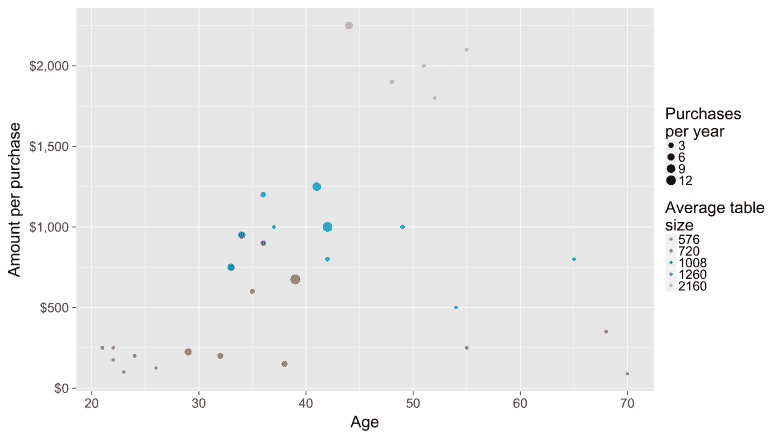
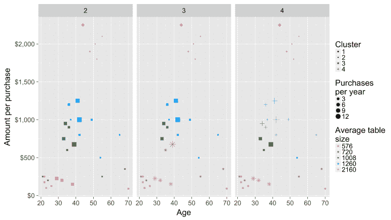
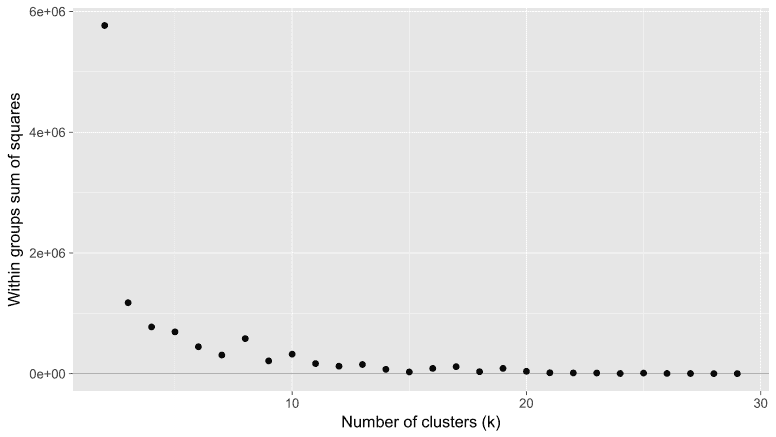
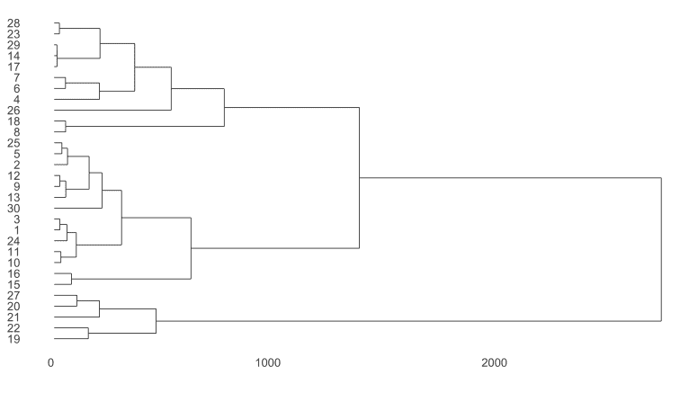

# 如何对您的客户数据进行聚类——使用 R 代码示例

> 原文：<https://towardsdatascience.com/how-to-cluster-your-customer-data-with-r-code-examples-6c7e4aa6c5b1?source=collection_archive---------2----------------------->

## ***聚类客户数据通过为你分组相似的东西，帮助你发现数据中隐藏的模式。例如，您可以根据活动创建客户角色，并为这些群体定制产品。***

[在另一篇文章](http://outlier.ai/2017/01/30/customer-personas/)中，我们讨论了如何利用你所了解的客户特征，通过手动标记客户群来建立人物角色。另一种方法是让计算机创建人物角色集群。这被称为无监督分类，因为您让计算机决定如何使用您的数据的值和特征。

无监督分类的另一个名称是“聚类”。有许多不同的聚类技术，根据它们解决问题的方法来区分。最常见的区别之一是由算法确定的聚类是否可以嵌套。嵌套的聚类算法被称为“分层的”，而非嵌套的被称为“分区的”。

在这里，我们将深入研究每种算法的示例，并在实践中观察它:

*   [K-means 聚类，理论上](http://outlier.ai/2017/02/07/clustering-k-means-clustering-in-theory)
*   [K-均值聚类，实际上](http://outlier.ai/2017/02/08/clustering-k-means-clustering-in-practice)
*   [理论上的凝聚层次聚类](http://outlier.ai/2017/02/09/clustering-agglomerative-hierarchical-clustering-in-theory)
*   [凝聚式层次聚类，实际上](http://outlier.ai/2017/02/10/clustering-agglomerative-hierarchical-clustering-in-practice)

> [**离群值**](http://outlier.ai/about-outlier/) 监控您的业务数据，并在发生意外变化时通知您。我们帮助营销/发展&产品团队从他们的业务数据中获取更多价值。 [**注册每日数据驱动**](http://outlier.ai/datadrivendaily/) **获取工作中更多数据驱动的每日提示。**
> 
> - Outlier 是 Strata+Hadoop World 2017 观众奖得主。

也许从 k-means 聚类算法开始的最好地方是分解它的名字，因为它有助于理解算法在做什么。让我们从头开始；“k”是指该算法将创建的聚类数。因此，尽管该算法在如何创建聚类方面是无人监督的，但它确实将您想要创建的聚类的数量(k)作为输入。k-means 中的术语“均值”指的是如何将每个数据点加入到一个聚类中，即将每个数据点分配到具有最接近均值的聚类中。综上所述，k-means 聚类为您提供了“k”个数据点聚类，其中每个数据点都被分配到其最接近的聚类中。

该算法首先选择“k”个点作为初始中心值(通常称为质心)[1]。接下来，数据中的每个点都被分配到它最接近的中心值。现在每个点都被分配了一个聚类，但是我们需要检查中心值的初始猜测是否是最好的(不太可能！).检查的方法是计算每个聚类的新中心值-如果所有重新计算的中心值都与原始值相同，则您处于最佳解，算法可以停止。否则，该算法通过将点重新分配给新计算的中心值来再次尝试。这将持续到重新计算的中心值不变。

> k-means 聚类为您提供了“k”个数据点聚类，其中每个数据点都被分配到与其最接近的聚类中。

该算法的结果是“k”个聚类，其中您拥有的每个数据点都被唯一地分配给一个且仅一个聚类。这就是为什么这种算法被称为“分区”或“非嵌套”算法——每个点只在一个簇中。

以上都是理论——接下来，让我们看看实践中的 k-means。

# 实际上，k-均值聚类

昨天，我谈到了 k-means 理论，但让我们将它付诸实践，使用一些样本客户销售数据为我们之前谈到的理论上的在线表格公司构建。假设我们收集了关于最近销售的数据，我们试图将这些数据分组为客户角色:年龄(年)、平均餐桌尺寸购买量(平方英寸)、每年购买的数量以及每次购买的金额(美元)。绘制数据，我们看到我们的客户可能有一些有趣的分组。

An example exploratory grouping using purchase attributes vs. purchase frequency

在这种情况下，看起来最年轻和最年长的顾客通常购买较小、较便宜的桌子，购买量低于中年顾客购买较大型号的数量，有时购买量更大。

现在，让我们针对 k、2、3 和 4 的几个不同值对这些数据运行 k-means 算法，看看该算法会产生什么结果。

An example running k-means with several different k values

在所有情况下，2160 cm 餐桌的购买者都属于自己的顾客群，但其他顾客则根据各自的特点更加混杂。当 k 等于 2 时，集群看起来是合理的，但是对于购买较小表的客户来说，可能有更多的粒度可以区分。当 k 等于 3 和 4 时，这些客户被分成更小的部分。

那么，选择什么样的 k 数比较合适呢？没有很好的算法方法来回答这个问题，但通常的做法是对不同的 k 值运行 k-means 算法，并测量通过添加更多的聚类而减少的误差量[2]——权衡的结果是，随着添加更多的聚类，你减少了误差，但随着添加更多的聚类，你有过度拟合数据的风险(在极端情况下，最终每个数据点都有自己的聚类！).

在我们的例子中，k 等于 2 和 3 之间的误差大幅下降，因此我们应该非常有信心至少有 3 个集群。在 3 和 4 个簇之间有另一个下降，但是比第一个下降小得多。随后的下降似乎没有太大的改善，所以在这种情况下，我会考虑创建 3 或 4 个客户角色。

> 如果你有兴趣看我用来运行 k-means 算法和创建这些图的 R 代码，一切都可以在我们的[数据驱动每日 GitHub 页面](https://github.com/OutlierAI/datadrivendaily/tree/master/Clustering)上找到。

接下来，我们将回到理论，讨论一种不同类型的聚类算法，凝聚层次聚类。

# 理论上，凝聚层次聚类

我们刚刚在讨论一种分割聚类算法，k-means。现在，我将谈论[凝聚层次聚类](https://en.wikipedia.org/wiki/Hierarchical_clustering)算法。像 k-means 一样，让我们分解算法的名称，以便更好地了解它的作用。先说“层级”这个词。这是指聚类分析算法的总体类型，在这种情况下，这意味着该算法通过不断嵌套数据点来创建聚类。“凝聚”这个词描述了我们正在做的层次聚类的类型。层次聚类有两种基本方法，凝聚法和分裂法。更常见的方法是聚集聚类，这意味着该算法通过自下而上的构建来嵌套数据点。换句话说，每个数据点都是它自己的聚类，然后它们被连接在一起以创建更大的聚类。分裂聚类意味着该算法通过自顶向下构建来嵌套数据点。换句话说，所有的数据点都从一个簇开始，然后被分解成更小的簇。

该算法通过合并两个最接近的聚类并重复直到只剩下一个聚类来工作。凝聚层次聚类的结果是每个聚类如何在每一步中合并在一起的映射。

k-means 和凝聚层次聚类之间的最大差异是由于它们解决问题的核心方法。特别是，在 k-means 聚类中，随着算法在每次迭代中提高其中心值，数据点可以在聚类之间移动。凝聚层次聚类算法不允许撤消任何以前的合并。这两种算法之间的另一个区别是，使用 k-means 时，因为它对其初始中心值使用猜测，所以每次使用相同的 k 值运行该算法时，您都可以得到不同的答案。另一方面，凝聚层次聚类将始终产生相同的结果，因为数据点之间的距离不会改变。

接下来，我将向您展示一个凝聚层次聚类的实际例子！

# 实际上，凝聚层次聚类

现在我们已经了解了凝聚层次聚类，让我们使用我们用于 k-means 的相同数据来实践它:年龄(年)、平均表大小购买(平方英寸)、每年购买的次数和每次购买的金额(美元)。绘制层次聚类结果的最常见方法之一是通过树形图或树状图。

Clustering customer data using adendogram (tree diagram)

左侧的值是指原始数据集的行号(底部的值是指距离[3]的测量值)。从左向右阅读时，您可以看到群集合并在一起以创建更大群集的顺序。将该算法与 k-means 聚类进行比较，我们发现结果是相似的。例如，树状图底部的值 19、22、21、20 和 27 被分组在一起，这些都是购买了 2160 cm 表的客户，这些表在 k-means 算法中被类似地分组。

将这种聚类算法的结果显示为树状图加强了这种算法和 k-means 之间的结构差异-每个数据点都嵌套在一起以创建更大的聚类，这与 k-means 不同，k-means 每次迭代都创建新的非重叠聚类。

> 如果你有兴趣看我用来运行凝聚层次聚类算法和创建这些图的 R 代码，一切都可以在我们的 [**数据驱动每日 GitHub 页面**](https://github.com/OutlierAI/datadrivendaily/tree/master/Clustering) 上找到。

我希望这篇关于聚类算法的综述对您有所帮助。正如您所知，即使这些是无监督的分类技术，仍然需要一些人工监督和解释，例如，决定应该使用多少个聚类(以及许多其他决定，如如何初始化 k-means 或距离的度量，我鼓励您阅读更多信息)。虽然聚类算法通常不能用来告诉你“正确”的答案，只要按一下按钮，他们是一个伟大的方式来探索和理解您的数据！

> [**离群值**](http://outlier.ai/about-outlier/) **监控您的业务数据，并在发生意外变化时通知您。**我们帮助营销/发展&产品团队从他们的业务数据中获取更多价值。 [**今天安排试玩。**](http://outlier.ai/)
> 
> - Outlier 是 Strata+Hadoop World 2017 观众奖得主。在下面的 39 秒中了解更多关于离群值的信息。

[1]k 均值的挑战之一是确定从哪里开始。有许多不同的算法可以单独解决这个问题，例如，选择一个随机的值子集并取这些值的平均值。计算 k-means 的计算机程序应该可以帮你做这个初始化。

[2]对于此处所示的数字数据，通常以每个点与其聚类中心值之间距离的平方误差之和来衡量。

[3]有许多方法可以测量两个集群之间的距离。例如，它可以是不同聚类中任意两点之间的最小距离，不同聚类中任意两点之间的最大距离，或者不同聚类中所有点对的平均距离。