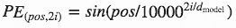
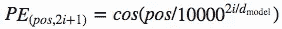
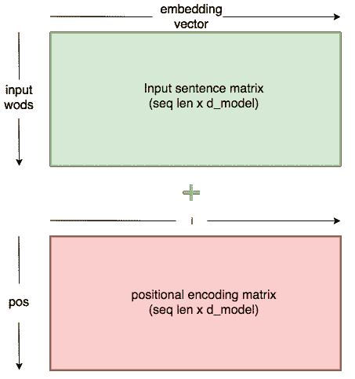
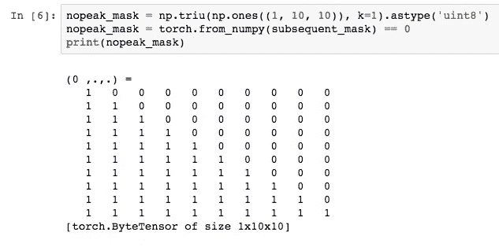
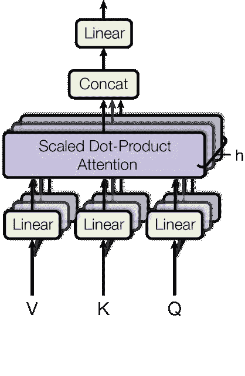
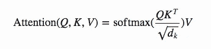
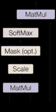
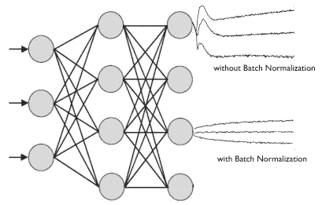
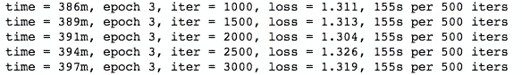

# 如何在 Pytorch 中编写变压器代码

> 原文：<https://towardsdatascience.com/how-to-code-the-transformer-in-pytorch-24db27c8f9ec?source=collection_archive---------1----------------------->


变压器会不会是 RNNs 棺材上的另一颗钉子？

去掉了笨重的 for 循环，它找到了一种方法，允许整个句子同时成批地进入网络。奇迹；NLP 现在重新利用了 python 高效的线性代数库的优势。节省下来的时间可以用于在模型中部署更多的层。

到目前为止，结果似乎是更快的收敛和更好的结果。有什么不喜欢的？

我个人的经历非常有希望。它对 200 万个法语-英语句子对进行训练，仅用三天时间就能创造出一个复杂的翻译器。

如果你去我在 Github [这里](https://github.com/SamLynnEvans/Transformer)的实现，你可以在语言翻译任务中自己玩这个模型。也请查看[我的下一篇文章](/found-in-translation-building-a-top-draw-language-translator-from-scratch-with-deep-learning-787a979ebc57)，在那里我将分享我构建翻译器的旅程和结果。

或者最后，你可以自己造一个。这是如何做的指南，以及它是如何工作的。

*本指南仅解释如何对模型进行编码和运行，有关如何获取数据并为 seq2seq 处理数据的信息，请参见我的指南* [*此处*](https://medium.com/@samuellynnevans/how-to-use-torchtext-for-neural-machine-translation-plus-hack-to-make-it-5x-faster-77f3884d95) *。*

# 变形金刚


上图显示了变压器模型的概况。编码器的输入将是英语句子，进入解码器的“输出”将是法语句子。

实际上，我们需要了解五个流程来实施这一模型:

*   [嵌入输入](#b0ed)
*   [位置编码](#d554)
*   [创建遮罩](#1b3f)
*   [多头关注层](#3fa3)
*   [前馈层](#45e9)

# 把...嵌入

嵌入单词已经成为 NMT 的标准做法，给网络提供了比一个热门编码更多的单词信息。关于这方面的更多信息，请看我的帖子[这里](/found-in-translation-building-a-top-draw-language-translator-from-scratch-with-deep-learning-787a979ebc57)。

pytorch 中的嵌入操作非常简单:

```
class Embedder(nn.Module):
    def __init__(self, vocab_size, d_model):
        super().__init__()
        self.embed = nn.Embedding(vocab_size, d_model)
    def forward(self, x):
        return self.embed(x)
```

当每个单词被输入到网络中时，这个代码将执行一个查找并检索它的嵌入向量。然后，这些向量将被模型学习为参数，并随着梯度下降的每次迭代进行调整。

# 给我们的话语语境:位置编码

为了让模型理解一个句子，它需要知道每个单词的两件事:这个单词是什么意思？它在句子中的位置是什么？

每个单词的嵌入向量将学习意思，所以现在我们需要输入一些东西来告诉网络这个单词的位置。

*Vasmari 等人*通过使用这些函数创建一个特定于位置的常量值来解决这个问题:



这个常数是一个二维矩阵。 *Pos* 是指句子中的顺序， *i* 是指沿着嵌入向量维的位置。pos/i 矩阵中的每个值随后使用上述等式计算出来。



The positional encoding matrix is a constant whose values are defined by the above equations. When added to the embedding matrix, each word embedding is altered in a way specific to its position.

位置编码器的直观编码方式如下:

```
class PositionalEncoder(nn.Module):
    def __init__(self, d_model, max_seq_len = 80):
        super().__init__()
        self.d_model = d_model

        # create constant 'pe' matrix with values dependant on 
        # pos and i
        pe = torch.zeros(max_seq_len, d_model)
        for pos in range(max_seq_len):
            for i in range(0, d_model, 2):
                pe[pos, i] = \
                math.sin(pos / (10000 ** ((2 * i)/d_model)))
                pe[pos, i + 1] = \
                math.cos(pos / (10000 ** ((2 * (i + 1))/d_model)))

        pe = pe.unsqueeze(0)
        self.register_buffer('pe', pe)

    def forward(self, x):
        # make embeddings relatively larger
        x = x * math.sqrt(self.d_model)
        #add constant to embedding
        seq_len = x.size(1)
        x = x + Variable(self.pe[:,:seq_len], \
        requires_grad=False).cuda()
        return x
```

上面的模块让我们将位置编码添加到嵌入向量中，为模型提供关于结构的信息。

我们在加法之前增加嵌入值的原因是为了使位置编码相对较小。这意味着当我们将它们加在一起时，嵌入向量中的原始含义不会丢失。

# 创造我们的面具

屏蔽在变压器中起着重要的作用。它有两个目的:

*   在编码器和解码器中:只要输入句子中有填充，就把注意力输出归零。
*   在解码器中:防止解码器在预测下一个单词时在翻译句子的剩余部分提前“到达峰值”。

为输入创建掩码很简单:

```
batch = next(iter(train_iter))
input_seq = batch.English.transpose(0,1)
input_pad = EN_TEXT.vocab.stoi['<pad>']# creates mask with 0s wherever there is padding in the input
input_msk = (input_seq != input_pad).unsqueeze(1)
```

对于 target_seq，我们做了同样的事情，但是创建了一个额外的步骤:

```
# create mask as beforetarget_seq = batch.French.transpose(0,1)
target_pad = FR_TEXT.vocab.stoi['<pad>']
target_msk = (target_seq != target_pad).unsqueeze(1)size = target_seq.size(1) # get seq_len for matrixnopeak_mask **=** np**.**triu(np**.**ones(1, size, size),
k**=**1)**.**astype('uint8')
nopeak_mask = Variable(torch**.**from_numpy(nopeak_mask) **==** 0)target_msk = target_msk & nopeak_mask
```

解码器的初始输入将是目标序列(法语翻译)。解码器预测每个输出单词的方式是利用所有编码器输出和法语句子，直到每个单词的预测点。

因此，我们需要防止第一个输出预测能够看到后面的句子。为此，我们使用 nopeak_mask:



When the mask is applied in our attention function, each prediction will only be able to make use of the sentence up until the word it is predicting.

如果我们稍后将这个掩码应用于注意力分数，那么在计算输出时，输入前面的值将不能起作用。

# 多头注意力

一旦我们有了嵌入值(带位置编码)和掩码，我们就可以开始构建模型的层了。

以下是多头注意力层的概述:



Multi-headed attention layer, each input is split into multiple heads which allows the network to simultaneously attend to different subsections of each embedding.

v、K、Q 分别代表“键”、“值”和“查询”。这些是在注意力函数中使用的术语，但老实说，我不认为解释这些术语对理解模型特别重要。

在编码器的情况下， *V，K* 和 *G* 将只是嵌入向量的相同副本(加上位置编码)。它们的尺寸为 Batch_size * seq_len * d_model。

在多头注意力中，我们将嵌入向量分成 *N 个*头，因此它们将具有尺寸 batch _ size * N * seq _ len *(d _ model/N)。

这个最后的维度(d_model / N)我们称之为 d_k。

让我们看看解码器模块的代码:

```
class MultiHeadAttention(nn.Module):
    def __init__(self, heads, d_model, dropout = 0.1):
        super().__init__()

        self.d_model = d_model
        self.d_k = d_model // heads
        self.h = heads

        self.q_linear = nn.Linear(d_model, d_model)
        self.v_linear = nn.Linear(d_model, d_model)
        self.k_linear = nn.Linear(d_model, d_model)
        self.dropout = nn.Dropout(dropout)
        self.out = nn.Linear(d_model, d_model)

    def forward(self, q, k, v, mask=None):

        bs = q.size(0)

        # perform linear operation and split into h heads

        k = self.k_linear(k).view(bs, -1, self.h, self.d_k)
        q = self.q_linear(q).view(bs, -1, self.h, self.d_k)
        v = self.v_linear(v).view(bs, -1, self.h, self.d_k)

        # transpose to get dimensions bs * h * sl * d_model

        k = k.transpose(1,2)
        q = q.transpose(1,2)
        v = v.transpose(1,2)# calculate attention using function we will define next
        scores = attention(q, k, v, self.d_k, mask, self.dropout)

        # concatenate heads and put through final linear layer
        concat = scores.transpose(1,2).contiguous()\
        .view(bs, -1, self.d_model)

        output = self.out(concat)

        return output
```

# 计算注意力



Equation for calculating attention



Diagram from paper illustrating equation steps

这是我们今天要考虑的唯一一个等式，这张来自论文的图表很好地解释了每一步。

图中的每个箭头反映了等式的一部分。

最初，我们必须将 Q 乘以 k 的转置，然后通过将输出除以 d_k 的平方根来“缩放”。

等式中没有显示的一个步骤是屏蔽操作。在执行 Softmax 之前，我们应用掩码，从而减少输入填充的值(或者在解码器中，输入在当前字之前的值)。

另一个未显示的步骤是 dropout，我们将在 Softmax 之后应用。

最后，最后一步是在目前为止的结果和 v 之间做点积。

下面是注意力功能的代码:

```
def attention(q, k, v, d_k, mask=None, dropout=None):

    scores = torch.matmul(q, k.transpose(-2, -1)) /  math.sqrt(d_k)if mask is not None:
        mask = mask.unsqueeze(1)
        scores = scores.masked_fill(mask == 0, -1e9)scores = F.softmax(scores, dim=-1)

    if dropout is not None:
        scores = dropout(scores)

    output = torch.matmul(scores, v)
    return output
```

# 前馈网络

好了，如果你已经理解了，给自己一个大大的鼓励，因为我们已经完成了最后一层，从这里开始一切都很简单了！

这一层仅由两个线性操作组成，其间有一个 relu 和 dropout 操作。

```
class FeedForward(nn.Module):
    def __init__(self, d_model, d_ff=2048, dropout = 0.1):
        super().__init__() 
        # We set d_ff as a default to 2048
        self.linear_1 = nn.Linear(d_model, d_ff)
        self.dropout = nn.Dropout(dropout)
        self.linear_2 = nn.Linear(d_ff, d_model)
    def forward(self, x):
        x = self.dropout(F.relu(self.linear_1(x)))
        x = self.linear_2(x)
        return x
```

前馈层只是深化我们的网络，使用线性层来分析注意力层输出的模式。

# 最后一件事:正常化

规范化在深度神经网络中非常重要。它可以防止层中值的范围变化太大，这意味着模型训练速度更快，泛化能力更强。



我们将对编码器/解码器中各层之间的结果进行归一化，因此在构建模型之前，让我们定义该函数:

```
class Norm(nn.Module):
    def __init__(self, d_model, eps = 1e-6):
        super().__init__()

        self.size = d_model
        # create two learnable parameters to calibrate normalisation
        self.alpha = nn.Parameter(torch.ones(self.size))
        self.bias = nn.Parameter(torch.zeros(self.size))
        self.eps = eps
    def forward(self, x):
        norm = self.alpha * (x - x.mean(dim=-1, keepdim=True)) \
        / (x.std(dim=-1, keepdim=True) + self.eps) + self.bias
        return norm
```

# 把所有的东西放在一起！

如果你理解了上面的细节，你现在就理解了这个模型。剩下的就是简单地把所有东西放回原位。

让我们再看一看整体架构，然后开始建造:


**最后一个变量:**如果您仔细观察图表，您会发现编码器和解码器架构旁边有一个“Nx”。实际上，上图中的编码器和解码器代表编码器的一层和解码器的一层。n 是层数的变量。例如，如果 N=6，数据通过六个编码器层(具有上述架构)，然后这些输出被传递到解码器，该解码器也由六个重复的解码器层组成。

我们现在将使用上面模型中所示的架构构建 EncoderLayer 和 DecoderLayer 模块。然后，当我们构建编码器和解码器时，我们可以定义有多少层。

```
# build an encoder layer with one multi-head attention layer and one # feed-forward layerclass EncoderLayer(nn.Module):
    def __init__(self, d_model, heads, dropout = 0.1):
        super().__init__()
        self.norm_1 = Norm(d_model)
        self.norm_2 = Norm(d_model)
        self.attn = MultiHeadAttention(heads, d_model)
        self.ff = FeedForward(d_model)
        self.dropout_1 = nn.Dropout(dropout)
        self.dropout_2 = nn.Dropout(dropout)

    def forward(self, x, mask):
        x2 = self.norm_1(x)
        x = x + self.dropout_1(self.attn(x2,x2,x2,mask))
        x2 = self.norm_2(x)
        x = x + self.dropout_2(self.ff(x2))
        return x

# build a decoder layer with two multi-head attention layers and
# one feed-forward layerclass DecoderLayer(nn.Module):
    def __init__(self, d_model, heads, dropout=0.1):
        super().__init__()
        self.norm_1 = Norm(d_model)
        self.norm_2 = Norm(d_model)
        self.norm_3 = Norm(d_model)

        self.dropout_1 = nn.Dropout(dropout)
        self.dropout_2 = nn.Dropout(dropout)
        self.dropout_3 = nn.Dropout(dropout)

        self.attn_1 = MultiHeadAttention(heads, d_model)
        self.attn_2 = MultiHeadAttention(heads, d_model)
        self.ff = FeedForward(d_model).cuda()def forward(self, x, e_outputs, src_mask, trg_mask):
        x2 = self.norm_1(x)
        x = x + self.dropout_1(self.attn_1(x2, x2, x2, trg_mask))
        x2 = self.norm_2(x)
        x = x + self.dropout_2(self.attn_2(x2, e_outputs, e_outputs,
        src_mask))
        x2 = self.norm_3(x)
        x = x + self.dropout_3(self.ff(x2))
        return x# We can then build a convenient cloning function that can generate multiple layers:def get_clones(module, N):
    return nn.ModuleList([copy.deepcopy(module) for i in range(N)])
```

我们现在准备构建编码器和解码器:

```
class Encoder(nn.Module):
    def __init__(self, vocab_size, d_model, N, heads):
        super().__init__()
        self.N = N
        self.embed = Embedder(vocab_size, d_model)
        self.pe = PositionalEncoder(d_model)
        self.layers = get_clones(EncoderLayer(d_model, heads), N)
        self.norm = Norm(d_model)
    def forward(self, src, mask):
        x = self.embed(src)
        x = self.pe(x)
        for i in range(N):
            x = self.layers[i](x, mask)
        return self.norm(x)

class Decoder(nn.Module):
    def __init__(self, vocab_size, d_model, N, heads):
        super().__init__()
        self.N = N
        self.embed = Embedder(vocab_size, d_model)
        self.pe = PositionalEncoder(d_model)
        self.layers = get_clones(DecoderLayer(d_model, heads), N)
        self.norm = Norm(d_model)
    def forward(self, trg, e_outputs, src_mask, trg_mask):
        x = self.embed(trg)
        x = self.pe(x)
        for i in range(self.N):
            x = self.layers[i](x, e_outputs, src_mask, trg_mask)
        return self.norm(x)
```

最后…变形金刚！

```
class Transformer(nn.Module):
    def __init__(self, src_vocab, trg_vocab, d_model, N, heads):
        super().__init__()
        self.encoder = Encoder(src_vocab, d_model, N, heads)
        self.decoder = Decoder(trg_vocab, d_model, N, heads)
        self.out = nn.Linear(d_model, trg_vocab)
    def forward(self, src, trg, src_mask, trg_mask):
        e_outputs = self.encoder(src, src_mask)
        d_output = self.decoder(trg, e_outputs, src_mask, trg_mask)
        output = self.out(d_output)
        return output# we don't perform softmax on the output as this will be handled 
# automatically by our loss function
```

# 训练模型

随着变压器的建立，剩下的就是在 EuroParl 数据集上训练这个傻瓜。编码部分相当容易，但是要准备好等待大约 2 天，这个模型才开始收敛！

让我们先定义一些参数:

```
d_model = 512
heads = 8
N = 6
src_vocab = len(EN_TEXT.vocab)
trg_vocab = len(FR_TEXT.vocab)model = Transformer(src_vocab, trg_vocab, d_model, N, heads)for p in model.parameters():
    if p.dim() > 1:
        nn.init.xavier_uniform_(p)# this code is very important! It initialises the parameters with a
# range of values that stops the signal fading or getting too big.
# See [this blog](http://andyljones.tumblr.com/post/110998971763/an-explanation-of-xavier-initialization) for a mathematical explanation.optim = torch.optim.Adam(model.parameters(), lr=0.0001, betas=(0.9, 0.98), eps=1e-9)
```

现在我们可以开始训练了:

```
def train_model(epochs, print_every=100):

    model.train()

    start = time.time()
    temp = start

    total_loss = 0

    for epoch in range(epochs):

        for i, batch in enumerate(train_iter): src = batch.English.transpose(0,1)
            trg = batch.French.transpose(0,1) # the French sentence we input has all words except
            # the last, as it is using each word to predict the next

            trg_input = trg[:, :-1]

            # the words we are trying to predict

            targets = trg[:, 1:].contiguous().view(-1)

            # create function to make masks using mask code above

            src_mask, trg_mask = create_masks(src, trg_input)

            preds = model(src, trg_input, src_mask, trg_mask)

            optim.zero_grad()

            loss = F.cross_entropy(preds.view(-1, preds.size(-1)),
            results, ignore_index=target_pad) loss.backward()
            optim.step()

            total_loss += loss.data[0]
            if (i + 1) % print_every == 0:
                loss_avg = total_loss / print_every
                print("time = %dm, epoch %d, iter = %d, loss = %.3f,
                %ds per %d iters" % ((time.time() - start) // 60,
                epoch + 1, i + 1, loss_avg, time.time() - temp,
                print_every))
                total_loss = 0
                temp = time.time()
```



Example training output: After a few days of training I seemed to converge around a loss of around 1.3

# 测试模型

我们可以使用下面的功能来翻译句子。我们可以直接从我们的批处理中输入句子，或者输入自定义字符串。

翻译器通过运行一个循环来工作。我们从对英语句子进行编码开始。然后，我们向解码器提供<sos>令牌索引和编码器输出。解码器对第一个字进行预测，我们用 sos 标记将其添加到解码器输入中。我们重新运行循环，获得下一个预测，并将其添加到解码器输入，直到我们到达<eos>标记，让我们知道它已经完成翻译。</eos></sos>

```
def translate(model, src, max_len = 80, custom_string=False):

    model.eval()if custom_sentence == True:
        src = tokenize_en(src)
        sentence=\
        Variable(torch.LongTensor([[EN_TEXT.vocab.stoi[tok] for tok
        in sentence]])).cuda()src_mask = (src != input_pad).unsqueeze(-2)
    e_outputs = model.encoder(src, src_mask)

    outputs = torch.zeros(max_len).type_as(src.data)
    outputs[0] = torch.LongTensor([FR_TEXT.vocab.stoi['<sos>']])for i in range(1, max_len):    

        trg_mask = np.triu(np.ones((1, i, i),
        k=1).astype('uint8')
        trg_mask= Variable(torch.from_numpy(trg_mask) == 0).cuda()

        out = model.out(model.decoder(outputs[:i].unsqueeze(0),
        e_outputs, src_mask, trg_mask))
        out = F.softmax(out, dim=-1)
        val, ix = out[:, -1].data.topk(1)

        outputs[i] = ix[0][0]
        if ix[0][0] == FR_TEXT.vocab.stoi['<eos>']:
            breakreturn ' '.join(
    [FR_TEXT.vocab.itos[ix] for ix in outputs[:i]]
    )
```

仅此而已。看我的 Github [这里](https://github.com/SamLynnEvans/Transformer)我已经写了这个代码作为一个程序，它将接受两个平行文本作为参数，并在它们上面训练这个模型。或者把知识实践出来，自己去实施！