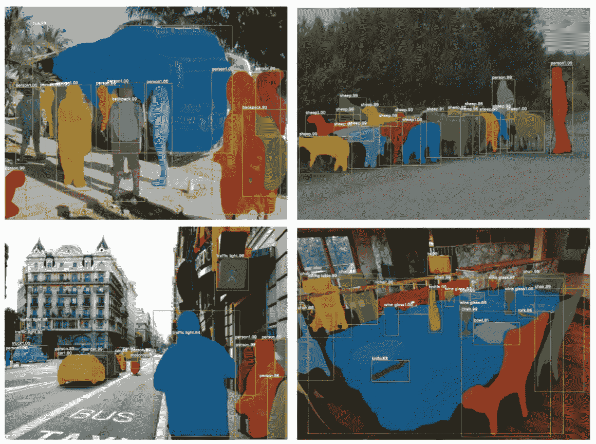

# 如何收集你的深度学习数据集

> 原文：<https://towardsdatascience.com/how-to-collect-your-deep-learning-dataset-2e0eefc0ba24?source=collection_archive---------7----------------------->

> 想获得灵感？快来加入我的 [**超级行情快讯**](https://www.superquotes.co/?utm_source=mediumtech&utm_medium=web&utm_campaign=sharing) 。😎

深度学习已经成为解决许多具有挑战性的现实世界问题的首选方法。这绝对是迄今为止执行计算机视觉任务的最佳方法。上图展示了深度学习对计算机视觉的强大作用。通过足够的训练，深度网络可以分割和识别图像中每个人的“关键点”。

这些一直运行良好的深度学习机器需要燃料——大量的燃料；这种燃料就是数据。我们拥有的**标签** **数据**越多，我们的模型表现就越好。更多的数据导致更好的性能的想法甚至已经被谷歌用 3 亿张图像的数据集进行了大规模的探索！

[重新审视深度学习时代数据的不合理有效性](https://arxiv.org/abs/1707.02968)

当在现实世界的应用中部署你的深度学习模型时，你真的应该**不断地给它提供更多的数据**以继续提高它的性能。喂野兽:如果你想提高你的模型的性能，获得更多的数据！

但是我们从哪里得到这些数据呢？获得良好注释的数据既昂贵又耗时。雇人手动*收集图像并贴上标签根本没有效率。而且，在深度学习时代，数据无疑是你最有价值的资源。*

在这里，我将向您展示获取标签数据的 3 种方法。这将比手动下载和标记图片更有效，让你节省时间和金钱。一旦你有了你的基本数据集，就很容易滚雪球，建立一个大规模的数据集，以创建一个高性能和强大的深度学习模型。

我们开始吧！

## 从网上抓取

手动查找和下载图像需要很长时间，这仅仅是因为涉及到大量的人工工作。那么，作为给计算机编程的人，当一项任务需要大量手工工作时，我们该怎么办呢？…当然是我们编程的！我们编写代码来自动完成任务！

我们将使用为计算机视觉任务收集某种数据的示例，例如对象检测或分割。嗯，我们的任务可能有某种我们想要检测的公共对象。所以这就成了我们抓取网页的关键词。它也成为该对象的类名。

从声音上看，这对于图像分类这样的图像注释非常粗糙的任务来说当然是非常容易的。但是如果我们想做类似实例分割的事情呢？我们需要图像中每个像素的标签！为了得到这些，最好使用一些已经存在的非常棒的图像注释工具！

[Polygon-RNN++](https://arxiv.org/abs/1803.09693) 论文展示了如何创建一个模型，给定一个对象周围的多边形点的粗略集合，就可以生成用于分割的像素标签。[深度极限切割](https://arxiv.org/abs/1711.09081)也很相似，除了他们只使用物体周围的四个极限点。这将给你一些漂亮的包围盒和分割标签！他们在 GitHub 上的代码也非常好用。

另一种选择是使用现有的图像注释 GUI。LabelMe 是一个非常受欢迎的工具，你可以在其中绘制边界框并为分割图设置多边形点。如果你不想自己动手，亚马逊土耳其机器人也是一个便宜的选择！

## 第三方

由于数据在深度学习时代已经成为如此宝贵的商品，许多初创公司已经开始提供自己的图像标注服务:他们将为你收集和标记数据！你所要做的就是告诉他们你需要什么样的数据和注释。

[Mighty AI](https://mty.ai/) 是一个一直在做自动驾驶汽车图像标注，在空间上已经变得蛮大的；他们也在 2018 年 CVPR 奥运会上。 [Playment AI](https://playment.io/) 没有 Mighty AI 专业，提供任何领域的图像标注。他们还提供了更多的工具，如视频和地标注释。

## 预训练网络

许多人已经知道迁移学习的概念:从一个在大型数据集上预先训练好的网络开始，然后我们自己进行微调。我们可以用同样的想法来收集我们的新数据集！

这些预训练网络被训练的数据集是巨大的。只需查看[开放图像](https://storage.googleapis.com/openimages/web/index.html)数据集，该数据集包含超过 1500 万张图像，并标有来自 600 个类别的边界框！在这个数据集上训练的网络已经非常擅长检测物体了。所以我们可以用它在图像中的物体周围画一些边界框。这使我们的工作减半，因为我们接下来要做的就是将盒子里的物品分类。此外，由于有 600 个类别，你想要检测和分类的一些对象可能已经通过这个预先训练的网络以高精度被挑选出来。 [TensorFlow 对象检测 API](https://github.com/tensorflow/models/blob/master/research/object_detection/g3doc/detection_model_zoo.md#open-images-trained-models-open-images-models) 实际上已经有了一个对开放图像进行预训练的网络，如果你想试试的话！

## 雪球效应

现在你已经收集了一个初始数据集。你用它来训练你的网络，并把它应用到你的产品中。它的性能足以满足您的需求，但它并不像您希望的那样精确。现在您已经有了一个运行中的基线网络，您可以使用该网络来收集更多的数据！这个网络将比一般的预先训练的网络更好地完成你的任务，因为你已经针对你的具体问题对它进行了微调。因此，你可以用它来收集越来越多的数据甚至更快，使您的网络更好；一个漂亮的雪球效应！

# 喜欢学习？

在推特[上关注我，我会在这里发布所有最新最棒的人工智能、技术和科学！也请在 LinkedIn](https://twitter.com/GeorgeSeif94)[上与我联系！](https://www.linkedin.com/in/georgeseif/)