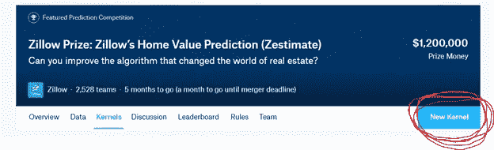
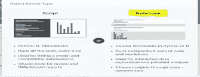
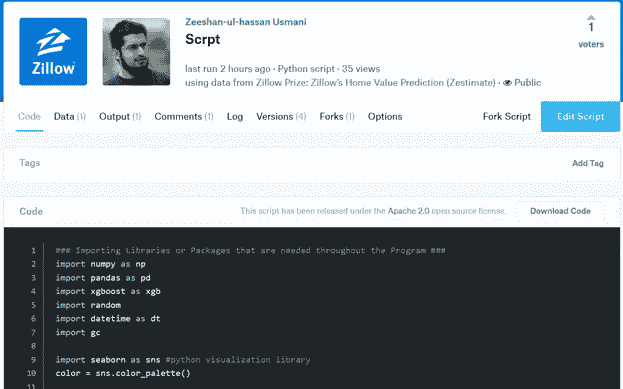

# 如何在 Kaggle 竞争 Zillow 奖

> 原文：<https://towardsdatascience.com/how-to-compete-for-zillow-prize-at-kaggle-535852243906?source=collection_archive---------2----------------------->


Kaggle 是数据科学家的 AirBnB 这是他们度过夜晚和周末的地方。这是一个众包平台，旨在吸引、培养、培训和挑战来自世界各地的数据科学家，通过机器学习解决数据科学和预测分析问题。它拥有来自 194 个国家的 536，000 多名活跃成员，每月收到近 150，000 份申请。从墨尔本开始，卡格尔于 2011 年搬到硅谷，从哈尔·瓦里安(谷歌首席经济学家)、麦克斯·拉夫琴(Paypal)、Index 和科斯拉风险投资公司等公司筹集了约 1100 万美元，最终在 2017 年 3 月被谷歌收购。Kaggle 是全球数据科学爱好者争夺奖项和提升 Kaggle 排名的第一站。迄今为止，世界上只有 94 位卡格勒大师。有关 Kaggle Progression 系统的详细信息，请查看[此链接](https://www.kaggle.com/general/22208)和[此链接](https://www.kaggle.com/general/22285)。下面是 Anthony Goldbloom (Kaggle 创始人)关于如何赢得 [Kaggle 比赛](https://www.import.io/post/how-to-win-a-kaggle-competition/)的精彩文章和视频。我也会看 Marios Michailidis [从预测赛马到成为 Kaggle 第一的旅程，以及模型赌注是如何帮助的。](https://www.youtube.com/watch?v=9Vk1rXLhG48)

Zillion Pillows (Zillow)是世界上最大的美国家庭数字库存和估计。美国住房存量超过 27.5 万亿美元。Zillow 覆盖了美国 1.1 亿个家庭，每个家庭有 103 个变量。每月有 7300 万独立访客，20 TBs 的数据和 120 万个每天晚上运行的统计和机器学习模型来预测下一个 [Zestimates](https://www.zillow.com/zestimate/) ，这无疑是天底下最好的房地产机器学习案例研究。Zillow 在预测房屋销售价值(Zestimate)时的平均误差从 14%降至 5%，但考虑到不可预测的异常值和看不见的金融衰退，这仍有很长的路要走。Zillow 最近因其误差幅度和给潜在卖家或买家带来的麻烦而受到批评，据估计，一栋典型房屋的价格误差高达 14，000 美元。

Zillow 于 2017 年 5 月 24 日在 Kaggle 上推出了其 [Zillow Prize 竞赛](https://www.kaggle.com/c/zillow-prize-1)。它分为两个阶段，将持续八个月。虽然百万美元似乎是一个很大的奖项，但它是 10 名数据科学工程师在硅谷工作 8 个月的成本，每人 10 万美元，而迄今为止，世界各地有 2900 个团队参与并竞争这一奖项，通常每个团队有 3 名成员，8700 人，每个工程师只有 114 美元，相当于每个数据科学家每月 14 美元或每小时 1.7 美元。这就是众包和 Kaggle 的魅力和力量。

要开始比赛，请浏览[温迪·坎](https://www.kaggle.com/c/zillow-prize-1/discussion/33485)的欢迎信息和[常见问题](https://www.kaggle.com/c/zillow-prize-1/discussion/33899)和[任意提问](https://www.kaggle.com/c/zillow-prize-1/discussion/39073)线程。他是 Zillow 的研究主管。这是他的另一个不错的博客([训练、得分和重复](http://blog.kaggle.com/2017/08/30/train-score-repeat-watch-out-zillows-andrew-martin-on-modeling-pitfalls-in-a-dynamic-world))，其中包含一些关于如何在竞争中排名的提示。这是 Zillow 创始人兼首席经济学家关于 Zillow 创新和竞争的一个炉边聊天视频。

在 Kaggle 上创建您的帐户，加入竞赛并接受规则。提交你的第一个内核，可以分叉我的公共内核— [如何争夺 Zillow prize —第一个内核](https://www.kaggle.com/zusmani/scrpt)运行。一旦你得到结果，请将文件提交给 Zillow。欢迎来到齐洛奖挑战赛。我不知道谁会赢，但我肯定会通过特征选择、集成和外部数据集的结合。

为了让第一次提交对你来说超级简单，这里有所有的步骤和完整的源代码

第一步:在 Kaggle 上创建你的账户，加入[竞赛](https://www.kaggle.com/c/zillow-prize-1)

第二步:进入内核标签，点击新内核



第三步:选择笔记本



步骤 4:在代码窗口中复制粘贴以下代码(XGB)



```
### Importing Libraries or Packages that are needed throughout the Program ###import numpy as npimport pandas as pdimport xgboost as xgbimport randomimport datetime as dtimport gcimport seaborn as sns #python visualization librarycolor = sns.color_palette()#%matplotlib inlinenp.random.seed(1)###Load the Datasets #### We need to load the datasets that will be needed to train our machine learning algorithms, handle our data and make predictions. Note that these datasets are the ones that are already provided once you enter the competition by accepting terms and conditions #train = pd.read_csv(‘../input/train_2016_v2.csv’ , parse_dates=[“transactiondate”])properties = pd.read_csv(‘../input/properties_2016.csv’)test = pd.read_csv(‘../input/sample_submission.csv’)test= test.rename(columns={‘ParcelId’: ‘parcelid’}) #To make it easier for merging datasets on same column_id later### Analyse the Dimensions of our Datasets.print(“Training Size:” + str(train.shape))print(“Property Size:” + str(properties.shape))print(“Sample Size:” + str(test.shape))### Type Converting the DataSet #### The processing of some of the algorithms can be made quick if data representation is made in int/float32 instead of int/float64\. Therefore, in order to make sure that all of our columns types are in float32, we are implementing the following lines of code #for c, dtype in zip(properties.columns, properties.dtypes):if dtype == np.float64:properties[c] = properties[c].astype(np.float32)if dtype == np.int64:properties[c] = properties[c].astype(np.int32)for column in test.columns:if test[column].dtype == int:test[column] = test[column].astype(np.int32)if test[column].dtype == float:test[column] = test[column].astype(np.float32)### Let’s do some feature engineering#living area proportionsproperties[‘living_area_prop’] = properties[‘calculatedfinishedsquarefeet’] / properties[‘lotsizesquarefeet’]#tax value ratioproperties[‘value_ratio’] = properties[‘taxvaluedollarcnt’] / properties[‘taxamount’]#tax value proportionsproperties[‘value_prop’] = properties[‘structuretaxvaluedollarcnt’] / properties[‘landtaxvaluedollarcnt’]###Merging the Datasets #### We are merging the properties dataset with training and testing dataset for model building and testing prediction #df_train = train.merge(properties, how=’left’, on=’parcelid’)df_test = test.merge(properties, how=’left’, on=’parcelid’)### Remove previos variables to keep some memorydel properties, traingc.collect();print(‘Memory usage reduction…’)df_train[[‘latitude’, ‘longitude’]] /= 1e6df_test[[‘latitude’, ‘longitude’]] /= 1e6df_train[‘censustractandblock’] /= 1e12df_test[‘censustractandblock’] /= 1e12### Let’s do some pre-exploratory analysis to identify how much missing values do we have in our datasets.### Thanks to Nikunj-Carefully dealing with missing values. Ref. [https://www.kaggle.com/nikunjm88/carefully-dealing-with-missing-values](https://www.kaggle.com/nikunjm88/carefully-dealing-with-missing-values)### Label Encoding For Machine Learning & Filling Missing Values #### We are now label encoding our datasets. All of the machine learning algorithms employed in scikit learn assume that the data being fed to them is in numerical form. LabelEncoding ensures that all of our categorical variables are in numerical representation. Also note that we are filling the missing values in our dataset with a zero before label encoding them. This is to ensure that label encoder function does not experience any problems while carrying out its operation #from sklearn.preprocessing import LabelEncoderlbl = LabelEncoder()for c in df_train.columns:df_train[c]=df_train[c].fillna(0)if df_train[c].dtype == ‘object’:lbl.fit(list(df_train[c].values))df_train[c] = lbl.transform(list(df_train[c].values))for c in df_test.columns:df_test[c]=df_test[c].fillna(0)if df_test[c].dtype == ‘object’:lbl.fit(list(df_test[c].values))df_test[c] = lbl.transform(list(df_test[c].values))### Rearranging the DataSets #### We will now drop the features that serve no useful purpose. We will also split our data and divide it into the representation to make it clear which features are to be treated as determinants in predicting the outcome for our target feature. Make sure to include the same features in the test set as were included in the training set #x_train = df_train.drop([‘parcelid’, ‘logerror’, ‘transactiondate’, ‘propertyzoningdesc’,‘propertycountylandusecode’, ], axis=1)x_test = df_test.drop([‘parcelid’, ‘propertyzoningdesc’,‘propertycountylandusecode’, ‘201610’, ‘201611’,‘201612’, ‘201710’, ‘201711’, ‘201712’], axis = 1)x_train = x_train.valuesy_train = df_train[‘logerror’].values### Cross Validation #### We are dividing our datasets into the training and validation sets so that we could monitor and the test the progress of our machine learning algorithm. This would let us know when our model might be over or under fitting on the dataset that we have employed. #from sklearn.model_selection import train_test_splitX = x_trainy = y_trainXtrain, Xvalid, ytrain, yvalid = train_test_split(X, y, test_size=0.2, random_state=42)###Implement the Xgboost#### We can now select the parameters for Xgboost and monitor the progress of results on our validation set. The explanation of the xgboost parameters and what they do can be found on the following link [http://xgboost.readthedocs.io/en/latest/parameter.html](http://xgboost.readthedocs.io/en/latest/parameter.html) #dtrain = xgb.DMatrix(Xtrain, label=ytrain)dvalid = xgb.DMatrix(Xvalid, label=yvalid)dtest = xgb.DMatrix(x_test.values)# Try different parameters!xgb_params = {‘min_child_weight’: 5, ‘eta’: 0.035, ‘colsample_bytree’: 0.5, ‘max_depth’: 4,‘subsample’: 0.85, ‘lambda’: 0.8, ‘nthread’: -1, ‘booster’ : ‘gbtree’, ‘silent’: 1, ‘gamma’ : 0,‘eval_metric’: ‘mae’, ‘objective’: ‘reg:linear’ }watchlist = [(dtrain, ‘train’), (dvalid, ‘valid’)]model_xgb = xgb.train(xgb_params, dtrain, 1000, watchlist, early_stopping_rounds=100,maximize=False, verbose_eval=10)###Predicting the results#### Let us now predict the target variable for our test dataset. All we have to do now is just fit the already trained model on the test set that we had made merging the sample file with properties dataset #Predicted_test_xgb = model_xgb.predict(dtest)### Submitting the Results #### Once again load the file and start submitting the results in each column #sample_file = pd.read_csv(‘../input/sample_submission.csv’)for c in sample_file.columns[sample_file.columns != ‘ParcelId’]:sample_file[c] = Predicted_test_xgbprint(‘Preparing the csv file …’)sample_file.to_csv(‘xgb_predicted_results.csv’, index=False, float_format=’%.4f’)print(“Finished writing the file”)
```

第五步:发布内核。Kaggle 服务器需要一些时间来渲染内核。在内核的 output 选项卡中完成后，提交文件就准备好了。下载并提交

一旦你完成了这个，祝贺你自己提交了你的第一个内核，并开始成为一个骄傲的 Kaggler。现在，是时候进行一些繁重的工作和考虑来改进您的模型了。这是 Zillow 数据科学的一个精彩的幻灯片演示，详细介绍了 Zestimate 模型。这篇[评估期刊文章](http://web.a.ebscohost.com/abstract?direct=true&profile=ehost&scope=site&authtype=crawler&jrnl=00037087&AN=48589881&h=rlMP3dWm5iNnfN05mYhyunAg3KGeE1vOLyTEBwmt7hFG72Rmt8go3N%2fl8dX67y6tjwWf0Pf2%2frdTcSKIM5D2XA%3d%3d&crl=c&resultNs=AdminWebAuth&resultLocal=ErrCrlNotAuth&crlhashurl=login.aspx%3fdirect%3dtrue%26profile%3dehost%26scope%3dsite%26authtype%3dcrawler%26jrnl%3d00037087%26AN%3d48589881)应该是你的下一站，以获得一些关于这个问题的外部观点。这是 Zillow 自己的 Zestimates 的[作品](https://www.zillow.com/research/zestimate-forecast-methodology/)，这是 Lynda 的一个关于预测房屋价值的很棒的入门[课程。点击链接了解 Zillow 的](https://www.lynda.com/Data-Science-tutorials/Machine-Learning-Essential-Training-Value-Estimations/548594-2.html?srchtrk=index%3a1%0alinktypeid%3a2%0aq%3ahome+value+prediction%0apage%3a1%0as%3arelevance%0asa%3atrue%0aproducttypeid%3a2)[房屋价值指数](https://www.zillow.com/research/zhvi-methodology-6032/)和[房屋价值预测方法](https://www.zillow.com/research/zillow-home-value-forecast-methodology-2-3740/)。

为最后一个月的比赛做准备，并进入第二阶段，我强烈推荐阅读 Zillow 创始人兼首席经济学家写的书 [Zillow 的谈话——房地产的新规则](https://www.amazon.com/Zillow-Talk-Rules-Real-Estate/dp/1455574740/ref=sr_1_1?ie=UTF8&qid=1505588624&sr=8-1&keywords=zillow+talk)。

美国的住房发生了很大的变化——1950 年，人均住宅面积为 300 平方英尺，到 2000 年已经增加到 900 平方英尺。有趣的是，人均办公室面积从 1970 年的 600 平方英尺减少到 100 平方英尺。制成 2000 年。美国家庭不仅更大，还拥有一个办公空间(远程办公)，一个健身房和游戏室(买家找房子时的首选之一)。)

我们需要记住，房价和购买不仅仅是统计数据，它是一个人生活进步的象征，因此它与情绪和其他任何事情一样重要，我们需要找到一种方法来挖掘这些情绪，以便能够预测房子的正确价值。

Zillow talk 提供了更多的线索，然后你可以在你的模型中处理:例如，靠近市中心的邻近社区的房子比城市中的任何其他社区升值更多(我在这里想到了 Kim Rossmo 的等式)，星巴克四分之一英里内的房子比远离咖啡店的房子平均溢价高达 37，000 美元，名校排名可以影响房价， 与地下室的重新建模相比，浴室的重新建模是房屋销售价格的一个积极指标，地下室的重新建模产生了改造投资的一半资金，作为销售价格的一个附加部分，而且名称——命名街道上的房屋比编号街道上的房屋平均多卖 2%,“湖泊”和“日落”是比“主街道”或“杰斐逊”更有价值的街道名称。 下面是书中的一些图表，用来强调外部数据集的价值。

我希望你喜欢这个博客，请继续关注更多更新和更好的代码。做 ***UpVote*** 如果有用的话。