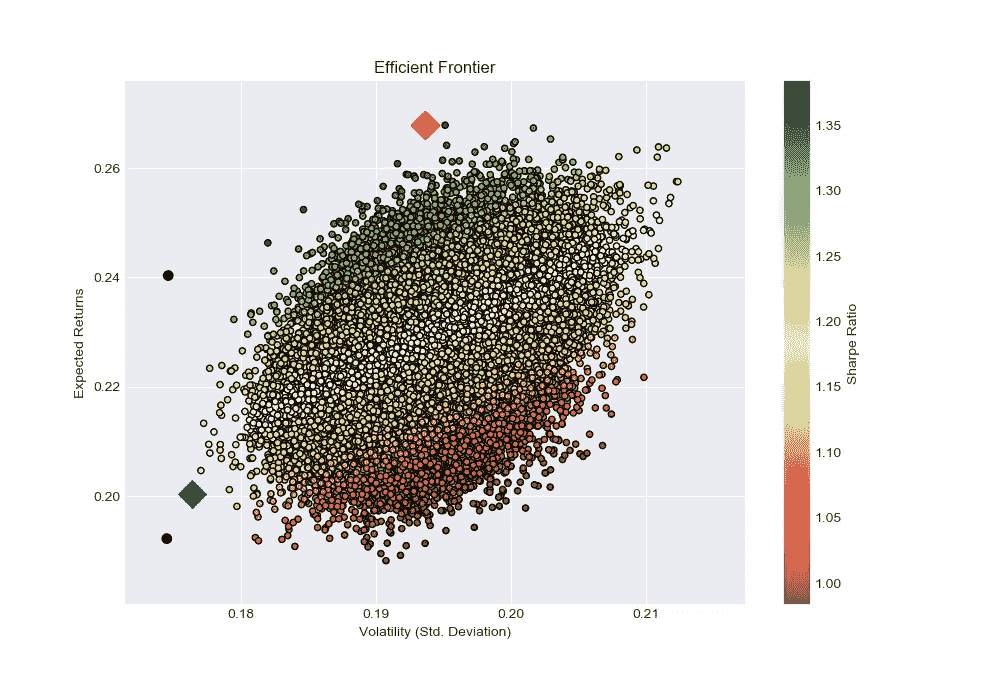
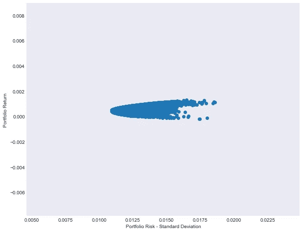

# 如何在 Python 中运用现代投资组合理论构建高效的投资组合？

> 原文：<https://towardsdatascience.com/how-to-construct-an-efficient-portfolio-using-the-modern-portfolio-theory-in-python-5c5ba2b0cff4?source=collection_archive---------8----------------------->

在我的[上一篇文章](https://medium.com/@saadahmed387/simple-portfolio-optimization-harry-markowitz-mean-variance-model-using-excel-part-1-efc3f19a347)中，我们讨论了使用 Harry Markowitz 均值-方差分析构建一个最优的股票投资组合。在这篇文章中，我们将通过为五只股票的组合生成随机投资组合来构建一个有效边界。

那么什么是*有效前沿*？

简而言之，在给定风险水平下，提供最佳投资组合回报的权重组合(财富份额)。

例如，请看下图，它描绘了使用随机权重生成的数千个随机投资组合回报和波动性。注意到黑色的痕迹了吗？回报较高的是曲线有效的一边，因为在同样的风险水平下，它能提供更多的回报。



Random Portfolios

所以现在我们知道什么是有效边界，因此我们将开始用 Python 来编码它。这篇博文使用的数据可以在[这里](https://pern-my.sharepoint.com/:x:/g/personal/saad_2078433_talmeez_pk/EfFTVI0F66RMrHwY2IOcep8B4CFK86kcZuD3yVfk4vGgqw?e=sNxiuP)找到。

```
import pandas as pd
import numpy as np
import matplotlib.pyplot as plt
# loading the returns datadaily_returns = pd.read_csv("Returns.csv", index_col ="Date")
mean_ret = daily_returns.mean().reshape(4,1)#Generating a random matrix of 1000 rows and 4 Columns
matrix = np.random.rand(1000,4)#Converting to a data frame
matrix_df = pd.DataFrame(matrix, columns = daily_returns.columns)matrix_sum = matrix_df.sum(axis = 1)#Calculating portfolio weights
weights  = matrix_df.divide(matrix_sum , axis ="rows")#transpose
weights_t= np.transpose(weights)#Using the portfolio return formula
portfolio_return = np.dot(weights, mean_ret)
```

为了生成有效边界，我们需要随机投资组合，对于随机投资组合，我们需要随机权重分别乘以它们的平均回报率，以获得投资组合回报。上面的代码块做了需要做的事情。

我们还需要有效边界的投资组合风险，它是从下面的代码中计算出来的。

```
#Variance covariance
cov_mat = daily_returns.cov()portfolio_risk = []
for one_port in range(weights.shape[0]):

    risk = np.sqrt(np.dot(weights.iloc[one_port,:],np.dot(cov_mat,weights_t.iloc[:,one_port])))

    portfolio_risk.append(risk)
```

现在我们已经做好了规划投资组合的一切准备。下面的代码绘制了一个简单的投资组合回报与投资组合风险的散点图。

```
plt.figure(figsize = (10,8))
plt.scatter(portfolio_risk, portfolio_return)plt.xlabel("Portfolio Risk - Standard Deviation")
plt.ylabel("Portfolio Return")plt.show()
```



就这么简单。因为我不习惯用 Python 绘图，所以我决定也用 Tableau 绘图，以获得更好的交互式可视化效果。

```
#converting to a csv file
portfolio_risk = pd.DataFrame(portfolio_risk, columns = ["portfolio risk"])portfolio_return = pd.DataFrame(portfolio_return, columns = ["portfolio return"])random_portfolio = pd.concat([portfolio_return, portfolio_risk, weights], axis =1)random_portfolio.to_csv("Random_Portfolios.csv")
```

[](https://public.tableau.com/views/EfficientFrontier/Sheet2?:embed=y&:display_count=yes&publish=yes) [## 效率限界

### 效率限界

高效 Frontierpublic.tableau.com](https://public.tableau.com/views/EfficientFrontier/Sheet2?:embed=y&:display_count=yes&publish=yes) 

接下来，我将讲述我们如何在投资组合优化以及其他金融领域应用不同的机器学习，而不是仅仅进行价格预测，这在现实中几乎没有实际重要性。

参考资料:

[**https://towards data science . com/efficient-frontier-portfolio-optimization-in-python-e 7844051 e7f**](/efficient-frontier-portfolio-optimisation-in-python-e7844051e7f)

[](https://medium.com/python-data/efficient-frontier-portfolio-optimization-with-python-part-2-2-2fe23413ad94) [## 用 Python 实现高效前沿和投资组合优化[第 2/2 部分]

### 在这个系列的第一部分，我们看了现代投资组合理论的基础，并产生了一个有效的…

medium.com](https://medium.com/python-data/efficient-frontier-portfolio-optimization-with-python-part-2-2-2fe23413ad94) 

[https://medium . com/python-data/efficent-frontier-in-python-34 b0c 3043314](https://medium.com/python-data/effient-frontier-in-python-34b0c3043314)