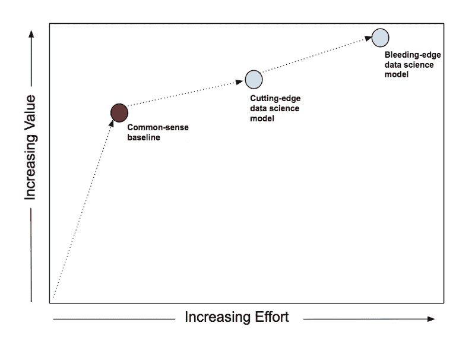
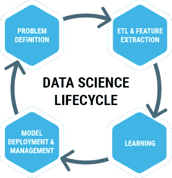

# 如何在现实世界中构建有价值的数据科学项目

> 原文：<https://towardsdatascience.com/how-to-construct-valuable-data-science-projects-in-the-real-world-203a4f520d54?source=collection_archive---------5----------------------->

## 从几次错误中吸取的教训

# 介绍

大多数关于如何“完成”一个数据科学**任务**的文章通常讨论如何编写一个算法来解决一个问题。例如，如何分类文本文档或预测财务数据。如果属于数据科学家的职权范围，学习如何做这些事情对他们来说可能是至关重要的知识。然而，**任务**只是**在现实世界中完成数据科学项目**过程的一小部分。即使你能编码出一个多类文本分类问题的完美解决方案，它对商业有价值吗？这个问题目前的解决方案是什么？你必须超越什么样的基准才能让用户相信它的输出？当算法在生产中启动并运行时，您是否得到反馈以了解输出是否持续产生可用的结果？

在这篇文章中，我想列出一些关于开发和实施有效和可持续的数据科学项目的指导方针。这个指南是我在自己的数据科学项目中犯了几个错误，并看到其他人也犯了自己的错误后得出的。其中一些不适用于所有数据科学家，因为并非所有这些都属于他们的职权范围。然而，在我所在的团队中，我们没有专门的业务分析师、产品经理甚至数据科学经理。这意味着我不得不自己承担这些角色的一些责任，而且经常做得不好。但这是一次宝贵的学习经历，以下是我学到的一些东西。

*   **特别提及:**不管你是否同意我的胡言乱语，你都应该[看看这篇文章](https://blog.dominodatalab.com/stakeholder-driven-data-science-warby-parker/?utm_campaign=Revue%20newsletter&utm_medium=Newsletter&utm_source=Self%20Driven%20Data%20Science)中的视频，关于如何进行利益相关者驱动的数据科学，作者是 [Max Shron，](https://www.linkedin.com/in/mshron/)Warby Parker 的数据科学主管。这太棒了，为在现实世界中做好数据科学项目树立了一个伟大的标杆。

## 一个项目需要解决哪些问题才能被认为是成功的？

当想出一个问题的解决方案时，我发现描绘成功是什么样子是很有用的(这里我们假设我们已经知道问题是什么，但是不要低估找出一个你的团队目前能够解决的问题有多难)。这有助于我制定达到最终目标的策略。在这种情况下，我想写下一组问题，如果项目成功，我可以立即回答。他们在这里:

1.  你为什么要做这个项目？即项目带来了什么价值，它如何为更广泛的数据科学团队目标做出贡献？
2.  谁是项目的主要利益相关者？
3.  目前解决问题的方法是什么？
4.  有没有简单有效的可以快速执行的解决问题的方法？
5.  你是否努力让合适的人参与进来，并提供足够的通知和信息？
6.  你和其他人一起对你的解决方案进行过感官检查吗？
7.  你努力确保代码是健壮的了吗？
8.  你有没有努力确保这个项目能被别人轻松理解并交给别人？
9.  你如何在生产中验证你的模型？
10.  您如何从解决方案中收集反馈？

根据我的经验，如果这些问题能够得到充分的回答，那么这个项目很可能会成功。情况可能并不总是这样，根据项目的不同，这个列表可能远非详尽，但它至少是一个好的起点。

[Kate Strachnyi](https://medium.com/u/fc065d3295b8?source=post_page-----203a4f520d54--------------------------------) 在开始数据分析之前有一组 [20 个问题要问](/20-questions-to-ask-prior-to-starting-data-analysis-6ec11d6a504b)在一篇很短的文章中，如果你决定不通过我庞大的大脑放屁(我不会怪你)。

以下步骤有助于解决这些问题。

# 数据科学项目的 5 步指南

## 步骤 1:获得项目潜在价值的初步评估

*   **为什么这么做？它帮助你区分项目的优先次序。你应该能够充分解释为什么一个项目应该在另一个之前完成。它还允许我们理解项目如何与团队和公司的目标保持一致。此外，这还将为我们应该为模型优化什么指标提供一些指导。**
*   这涉及到什么？收益的粗略量化，例如节省的资金、增加的收入、减少花费在体力劳动上的时间。反对这种观点的理由是，这很难做到，而且不总是可以量化的。我的回答是:*如果你或你的利益相关者不能算出项目的价值，那么你为什么允许你自己或你的利益相关者* ***浪费*** ***你的时间呢？*** 数值不一定要完美，只是一个大概的估计。这一步还包括确定谁是主要的利益相关者？
*   **如果没做到会怎么样？** *我们可能会花很长时间做一个对谁都没有好处的项目*。我认为可以更好地确定范围的一个项目示例是，数据科学团队的任务是确定最有可能从我们的营销团队联系中受益的人员列表。模型已经建成，但我们决定花几个月的时间来改进它。尽管新模型提供了更好的结果，但团队不得不调整他们的阈值，因为企业并不关心为每个客户生成的分数，相反，他们希望确保他们联系固定数量的人。因此，花费在改进模型上的时间是没有意义的，这是有争议的，如果我们与利益相关者一起更好地确定项目的范围，我们就会知道这一点。(有一种观点认为，由于模型更好，联系的固定人数实际上是一个更好的细分群体，但这没有进行测量，因此我们不知道情况是否如此)。
*   这一步的结果是什么？对项目价值的粗略量化估计，并附有一段简短的段落，提供更多的背景信息(项目的执行摘要)。需要注意的是，根据公司和项目的不同，仅仅是拥有数据模型的感知价值收益就足以让企业认为项目是成功的。在这种情况下，没有必要进行定量评估。但这更多的是关于公司政治，在你需要确凿的数字来展示你团队的价值之前，这种情况只会持续很久。
*   **有用的资源:**这篇题为“[一种对任何新特性的投资回报率进行建模的简单方法](https://uxdesign.cc/a-simple-way-to-model-roi-of-any-new-feature-a9828fbba27e)很有帮助。给个简单的公式:*预期 ROI =(用户触达量*新增或增量使用量*对业务的价值)-开发成本*。其他有用的阅读材料有"[优先考虑数据科学工作](/prioritizing-data-science-work-936b3765fd45)"和"[产品和优先考虑](https://medium.com/@gpat_uk/product-and-prioritisation-e76122b2dcf9)"

## 步骤 2: **确定当前方法/创建基线模型**

[Source: Create a Common-Sense Baseline First](/first-create-a-common-sense-baseline-e66dbf8a8a47)

*   **为什么这么做？**当前的方法为我们提供了一个目标基准。所有有用的模型都应该胜过当前的方法，如果有的话。如果当前没有解决问题的方法，那么你应该开发一个基线模型。基线模型本质上是没有机器学习的问题的解决方案。很可能一个复杂的解决方案只能提供增量价值，所以你需要评估是否值得构建更复杂的东西。
*   **这涉及到什么？**与利益相关者交流，确定他们目前在做什么以及取得了哪些成功。很可能他们没有衡量他们的成功率，所以这是你必须估计/计算的事情。构建基线模型不应该涉及任何复杂的方法。它应该是相当快速和基本的。可能使用计数方法。
*   这个阶段的结果是什么？对利益相关者来说成功/有用的绩效的基准评估数。对复杂模型是否值得构建的评估。
*   **如果不这样做，会发生什么:**你可能会浪费时间构建一个复杂的模型，这在最好的情况下，可能不值得花费时间来获得额外的准确性，或者在最坏的情况下，甚至不如当前的方法。这是我们在构建推荐引擎时所忽略的。我们没有检查算法是否优于合理的基线(推荐最受欢迎的内容)。可能是因为推荐算法没有提供足够的价值来保证我们做这件事。
*   **资源帮助:**标题为“[首先创建常识基线](/first-create-a-common-sense-baseline-e66dbf8a8a47)”和“[总是从一个愚蠢的模型开始，没有例外。强调这一点的好文章。](https://blog.insightdatascience.com/always-start-with-a-stupid-model-no-exceptions-3a22314b9aaa)

# 3.进行“团队”讨论

*   为什么要这么做？此时，您已经得出结论，该项目值得做(步骤 1)并且成功是可行的(步骤 2)，因此是时候与参与项目成功的人员交流了，例如工程师和/或其他数据科学家是显而易见的候选人。你应该更清楚你应该写什么代码，你需要什么数据，你应该测试什么，使用什么性能度量，你应该尝试什么模型方法。你很容易认为自己知道自己需要什么，但与他人讨论往往有助于突出你错过的事情或可以改进的事情。不要低估让不同观点的人参与讨论的重要性。
*   **它涉及什么？**至少与另一位数据科学家交谈，并向他们展示你迄今为止取得的成果。也许他们知道如何改进你的想法。在开始模型之前做这件事是至关重要的，因为一旦模型写好了，你就不太可能去修改它。此外，与你交谈的数据科学家可能就是你的代码审查者，所以这将有助于他们了解上下文。与将参与生产你的作品的工程师交谈。他们可能需要知道会发生什么，并且可能会有一些使代码生产更容易的建议。
*   **这个阶段的结果是什么？**没什么具体的！只是一些确保质量尽可能好的第一轮。确保相关人员了解并参与项目。
*   **如果没有做到会怎样:** *最好的情况*:你已经设法自己思考并避免了所有的陷阱。然而，更有可能的是，你没有考虑到所有的事情，你会错过一些重要的事情。这里的典型问题包括当模型进入生产时，存储文件的不可管理的传输和处理。模型输出没有达到目标，并且不是最有用的形式。我制作的一个模型就是这种情况。我编写了进行多次 API 调用的代码，其中许多都是不必要的。我在本地运行的小数据集上运行得很好，但是服务器在生产环境中与负载斗争。直到我与一位帮助我诊断问题的工程师交谈后，问题才得以解决。

# 4.模型开发

*   **为什么这么做？**这是我们用来最终解决问题的模型。
*   它包括什么？区别在于涉及的内容。不仅仅是创造一个模型。关于如何编写机器学习算法来解决特定问题的文章数不胜数，所以我不会在这里解释。相反，重要的是强调一些应该执行的步骤，以产生高质量的产品代码。在开发过程中，你应该定期进行**代码审查。**记住，你可能不是唯一一个看到代码的人，你也不是唯一一个投资成功项目的人，所以应该有好的**代码文档。这对于项目的长久性至关重要。生产中几乎肯定会有错误和意想不到的输入，因此您可以通过执行**代码测试**来改善代码的健壮性，从而缓解这些问题。这包括单元测试、集成测试、系统测试和用户验收测试(UAT)。如何使您的代码可生产的细节可能因团队而异，但其他有帮助的事情是:在隔离的环境中工作(虚拟环境或 Docker 容器)，使用日志记录来写日志文件，使用配置文件使配置独立于主代码。**
*   **这一阶段的结果是什么？**一个共享的(Github)存储库，包含所需的文件和解决项目中定义的问题的工作模型。
*   **如果没有完成会发生什么:**模型必须完成，否则问题将无法解决。如果你的代码没有经过测试，就会出现逻辑上的错误，直到生产出来才会被发现。如果代码没有被其他人审查或者没有被记录，当你不可避免地离开公司或者休年假时，其他人将很难接手。这些问题中的一些会在我以前做过的不健壮的项目中不断出现。在我参与的一个项目“完成”9 个月后，我仍然在修复它的错误，因为代码不够健壮。这会消耗掉你本可以用来做其他有价值的事情的时间，并且会给相关的每个人带来很多挫败感。确保在开发期间花费额外的时间使代码健壮，因为从长远来看这将节省您的时间。
*   **资源**有很多，但这些是我读过的一些我非常喜欢的:
*   在列表的最顶端有一篇名为“[如何在数据科学中编写生产级代码？“它涵盖了我能想到的几乎所有东西。如果你是一个构建生产级代码的数据科学家，那么你应该读一读。](/how-to-write-a-production-level-code-in-data-science-5d87bd75ced)
*   代码评审:[代码评审数据科学工作](https://medium.com/apteo/code-reviewing-data-science-work-774747248e33)和一篇关于如何“自己进行代码评审”的[文章，即以一种被评审的方式编写代码(这不能代替实际的代码评审，它只是帮助你思考如何写出好的代码)](https://medium.com/@starkja/doing-code-review-solo-writing-good-code-tips-from-srccon-2017-d408fdbaa350)
*   代码文档:关于[如何正确编写代码文档的好指南](https://medium.com/@alexevakimov/code-documentation-guide-9a846669944b)。我也很喜欢 [numpy 风格的文档串](http://sphinxcontrib-napoleon.readthedocs.io/en/latest/example_numpy.html)
*   代码测试:如何为机器学习代码编写[单元测试的指南。这是使用 Python 的 Pytest 库](https://medium.com/@keeper6928/how-to-unit-test-machine-learning-code-57cf6fd81765)编写[单元测试的好指南。我用它来帮助我为我的一个项目编写我的第一组测试。同一家公司也有一篇关于](https://semaphoreci.com/community/tutorials/testing-python-applications-with-pytest)[模拟测试数据的文章](https://semaphoreci.com/community/tutorials/getting-started-with-mocking-in-python)。这是另一个关于 Pytest 和嘲讽的[指南](https://medium.com/@bfortuner/python-unit-testing-with-pytest-and-mock-197499c4623c)

# 5.模型监控和反馈

*   **为什么这么做？**这是为了确保我们的产品在生产中按预期运行。解决方案的输出应该稳定可靠。如果出了问题，我们应该第一个知道。模型性能是否低于预期？数据的格式是否与培训数据不同？数据是否有误？这为我们节省了大量手动检查输出和检查代码以确保事情按预期运行的时间。当利益相关者开始质疑我们的数据时尤其如此。我们的业务是为公司提供价值，因此我们也应该衡量我们的解决方案的影响。有用吗？它需要调整吗？我们赚了多少钱？该解决方案的使用频率。这些是我们可以向高管报告的数字，以展示数据科学为业务带来的价值。
*   它包括什么？这涉及到模型投入生产后的一段时间(可能是几周),以手动和主动检查一切是否正常。这也包括**自动化**监控过程。也许创建一个仪表板和自动电子邮件警报和/或异常检测系统。也许利益相关者也需要进行监控，因此监控解决方案可能需要调整，以方便非技术人员使用。出于反馈的目的，这可能包括与利益相关方讨论您将如何接收反馈。会是定性还是定量？你可以在产品中写一些记录使用的东西，这样你就不必明确地询问涉众的使用习惯。
*   **这个阶段的结果是什么？**确保模型正常工作的方法和产品，并提供关于解决方案的使用和价值的定性或定量反馈。如果出现问题，它还可能包括某种形式的通知/警报。
*   **如果不这样做，会发生什么:**如果我们的产品没有得到适当的监控，当我们的产品出现问题时，我们可能会面临商业利益相关者对我们产品失去信任的风险。这也可能会耗费企业的资金和我们团队的大量时间来解决问题。我遇到的一个例子是，当我们构建的分析工具中的数据开始给出非常不正确的数字。原来原始数据的提供者搞砸了。但重要的是，是我们的利益相关者在我们的数据团队之前发现了这个问题。健壮的测试(如上面模型开发步骤中所述)和自动警报应该已经发现了这一点，但是我们没有做到。当数据最终回来时，涉众认为数据仍然不正确。我们的数据团队花了 2 周的时间检查数据，结果却是没有任何问题！这是我们在为企业提供价值方面损失的两周时间。自动化监控可以将 2 周时间缩短到 2 分钟！此外，如果我们没有得到反馈，那么我们就不知道我们的项目有多有用，或者它们是否还在被使用。一个例子是在与营销团队的会议中，我们不得不提出问题“*您正在使用该模型吗？*”。我们不应该问这个问题，因为 1)我们应该在步骤 1 和 2 中正确地确定项目的范围，这样我们就知道价值，并且我们确信我们的模型改进了当前的解决方案/基线模型 2)我们应该将监控作为项目的一部分，而不是在不相关的会议中进行。这表明我们没有衡量模型的影响。

# 明显的遗漏

我的一个好朋友( [Michael Barber](https://medium.com/u/e6245ed8ac48?source=post_page-----203a4f520d54--------------------------------) )提到我错过了重要的一步:**评估**。模型评估是流程中极其重要的一部分，如果处理不当，可能会导致生产中模型的意外退化。这里有一篇[的好文章](http://www.fast.ai/2017/11/13/validation-sets/)，作者是 [Rachel Thomas](https://medium.com/u/ee56d0bac1b7?source=post_page-----203a4f520d54--------------------------------) 在 [Fast.ai](http://www.fast.ai/) 关于使用合适的训练、测试和验证集进行模型评估。

此外，我完全错过了实验。确定您的数据科学解决方案是否产生了预期影响的最佳方式之一是进行实验和 A/B 测试。这里有一篇关于堆栈溢出时的 A/B 的文章，作者是 Julia Silge。

我不打算详细讨论这些，因为这篇文章已经太长了，这些事情应该在与利益相关者讨论项目如何为企业增加价值时提出来(参见步骤 3，在完成项目之前与相关人员进行讨论)😂。也许我第一次会包括这些要点)。

所以我们有它。这是我认为开发一个成功的数据科学项目所需的 5 个高级步骤。我应该注意的是，并非所有这些步骤都需要由数据科学家完全执行，因为一些团队可能会有专门的成员来执行一些任务。例如，业务分析师或产品经理可能是与利益相关者联络以确定项目是否有价值以及需求是什么的人。此外，有些步骤并不是所有项目都需要的。如果一个项目是一次性的分析，那么就没有必要创建一个仪表板来持续监控输出。

实际上，您不需要遵循所有这些步骤来创建一个成功的数据科学项目。在大多数情况下，除了为涉众建立一个监控仪表板，并在出现异常时自动报警之外，编写一整套测试和文档是不实际的。更有可能的是，你必须权衡这些事情中哪些是值得做的，这样你才能在设定的(可能不合理的)最后期限前完成一个项目。我承认我从来没有完成过任何一个特定项目的每一个步骤，但是，我知道我没有做什么，为什么不在这个特定的时间做是一个务实的决定。

我想强调的另一件重要的事情是，这些步骤只是帮助项目成功的指南。但是要成为一名成功的数据科学家，你还必须具备其他的 T2 特质和 T4 技能。

我很清楚，我不是最有经验的数据科学家，我不知道我不知道什么，所以如果有人有任何意见、问题或建议，请随时在评论中提出。感谢您的阅读:)