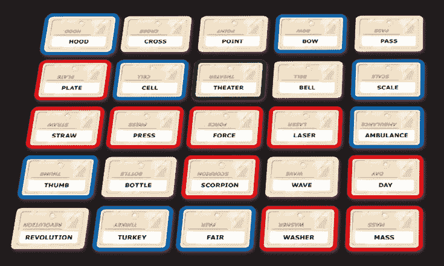

# 如何创建代号机器人第 1 部分:Word2vec

> 原文：<https://towardsdatascience.com/how-to-create-a-codenames-bot-part-1-word2vec-62701de38e66?source=collection_archive---------1----------------------->


([https://psychedforgames.com/home/2017/7/9/codenames](https://psychedforgames.com/home/2017/7/9/codenames))

作为一名桌游爱好者和程序员，我想到设计一种算法来玩流行游戏 [Codenames](https://boardgamegeek.com/boardgame/178900/codenames) 会是一件有趣的事情，如果不是值得努力的话。在这一系列的博客文章中，我将分享我在产生基于单词联想的线索方面的各种尝试，这些线索是代号的组成部分。所以！让我们开始吧。

# 代号解释

玩家被分成两队，红队和蓝队。一块由 25 个随机选择的单词块组成的板，排列成 5×5 的网格，如下所示:



An example board ([http://spiralingcadaver.blogspot.com/2017/09/everybody-knows-that-bird-is-word.html](http://spiralingcadaver.blogspot.com/2017/09/everybody-knows-that-bird-is-word.html))

每支队伍都有一名玩家作为*间谍头子*，只有间谍头子知道哪些牌属于他们的队伍。每个间谍头子的任务是给她的小组提供线索，让他们猜自己的牌，同时避开其他小组的牌。

对于上面的棋盘，红色间谍首领可能会给出诸如“第二盘”的线索“Dish”是相关的单词,“2”是与之相关的卡片数，在本例中是“plate”和“washer”

“重量 3”可能是一个不好的线索，因为它可能指的是“压力”、“力”或“盘子”，也可能指的是布鲁卡的“秤”如果一个队意外猜中了对手的牌，他们的回合就结束了。

间谍头子们轮流提供线索，直到一个小组猜出了他们所有的单词。

其他一些重要的规则:

*   以黑色突出显示的“剧院”是刺客，如果猜对了，意味着猜对了的队伍会立即输。所以间谍头子必须不惜一切代价让她的团队远离那张牌。
*   线索必须是一个单词或专有名词，如名称。
*   正如猜测的那样，它们被一张相关的牌覆盖——蓝色、红色、黑色(刺客)或白色(中性)。
*   一条线索不能包含或成为黑板上可见的任何单词的形式。例如，“波浪”和“侍者”是无效的线索。一旦卡被猜中，就可以使用它们。

如果你有 45 分钟的时间来消磨，并且想更好地了解这个游戏，[桌面制作了一集关于它的](https://www.youtube.com/watch?v=emlI43ZE9-c)。

创建间谍软件机器人的任务本质上可以归结为自动化单词关联。给定单词 X，最相似的单词有哪些？那么，给定一组单词 X、Y 和 Z，与所有这些单词最相似的单词是什么？同时避免出现与我对手的单词 A、B 和 c 相似的单词，而不是棋盘上任何其他可见单词的一部分。当然也和刺客没有任何关系。

但是，首先，问题的本质是找到单词联想。有许多方法可以做到这一点，我们将在本系列的课程中探讨。其中第一个是 word2vec。

# Word2vec:正如它听起来的那样

Word2vec 是表示一个*单词*的一种方式，比如“猫”作为数字(0，5，1，3，7，1，…)的*向量。我不会详细说明这些向量是如何创建的，但是[这篇文章](https://www.tensorflow.org/tutorials/word2vec)很好地解释了它。*

一旦创建，向量有一些有趣和有用的属性。对我们来说，最重要的是，相关的单词向量在向量空间中的位置往往很接近。例如，“猫”的向量可能与“小猫”、“宠物”和“狗”等词接近这正是我们要找的。通过寻找最近的向量，我们找到了最相关的单词。

# 方法学

*(以下代码和附加信息都可以在一个* [*Jupyter 笔记本*](https://github.com/docmarionum1/codenames_blog/blob/master/Codenames%201%20-%20Word2Vec.ipynb) *中找到，很容易复制和运行。)*

我使用了 python3、 [gensim](https://radimrehurek.com/gensim/) 和一个预先构建在谷歌新闻语料库上的 word2vec 模型。首先，我们加载模型，将它限制在 500，000 个最常见的单词中，以过滤掉一些无意义的单词。

```
import gensim
model = gensim.models.KeyedVectors.load_word2vec_format(
    'GoogleNews-vectors-negative300.bin', binary=True, limit=500000
)
```

这是我们将要使用的代码板示例。`blue`是一队的字，`red`是另一队，`assassin`是刺客的字。

```
board = {
    '**blue**': [
        'ambulance', 'hospital', 'spell', 'lock', 
        'charge', 'tail', 'link', 'cook', 'web'
    ],
    '**red**': [
        'cat', 'button', 'pipe', 'pants', 
        'mount', 'sleep', 'stick', 'file', 'worm'
    ],
    '**assassin**': 'doctor'
}
```

首先，给定一个单词，最相似的单词是什么？获得与“救护车”最相似的 10 个单词:

```
model.similar_by_word('ambulance', topn=10)
```

这产生了:

```
[('paramedics', 0.7590752243995667),
 ('ambulances', 0.7493595480918884),
 ('Ambulance', 0.7236292362213135),
 ('paramedic', 0.662133514881134),
 ('Ambulance_paramedics', 0.6315338611602783),
 ('Ambulances', 0.6211477518081665),
 ('LifeFlight_helicopter', 0.6147335171699524),
 ('hospital', 0.6099206209182739),
 ('Paramedics', 0.6081751585006714),
 ('Ambulance_Service', 0.6080097556114197)]
```

每一行都是单词，后面跟着这个单词和“救护车”有多相似其中一些单词很有用，例如“护理人员”，但许多只是“救护车”的其他形式

gensim 可以让我们一次直接找到与一整组单词最相似的单词。

```
model.most_similar(
    positive=board['blue'],
    restrict_vocab=50000,
    topn=20
)
```

生产

```
[('For_Restrictions', 0.43488097190856934),
 ('bed', 0.39588358998298645),
 ('links', 0.38411831855773926),
 ('hook', 0.38367366790771484),
 ('paramedics', 0.38072746992111206),
 ('emergency', 0.37950167059898376),
 ('jail', 0.3759669065475464),
 ('log', 0.37062549591064453),
 ('intensive_care', 0.3661930561065674),
 ('call', 0.36543411016464233),
 ('webpage', 0.3649423122406006),
 ('tow_truck', 0.3592333197593689),
 ('click', 0.35906946659088135),
 ('cooked', 0.3552851676940918),
 ('care', 0.3537469208240509),
 ('handcuff', 0.35027384757995605),
 ('then', 0.34921103715896606),
 ('stay', 0.3478427529335022),
 ('turn', 0.34607696533203125),
 ('bookmark', 0.3458564579486847)]
```

这看起来好多了，并产生了一些像样的线索。

*   “床”、“护理人员”、“紧急情况”都与“救护车”和“医院”有关
*   “监狱”可能与“锁”和“指控”有关
*   点击“网页”和“链接”

但是“床”也与另一组的单词“睡眠”有关；用“按钮”来“点击”给出可能指向对手底牌的线索是不好的。

gensim 也允许包含负面例子，以帮助避免这种情况。

```
model.most_similar(
    positive=board['blue'],
    negative=board['red'],
    restrict_vocab=50000
)
```

生产

```
[('Hospital', 0.27265793085098267),
 ('ambulances', 0.2605472207069397),
 ('hospitals', 0.24624229967594147),
 ('outpatient', 0.24339225888252258),
 ('inpatient', 0.2404019981622696),
 ('paramedics', 0.23482689261436462),
 ('escort', 0.23161748051643372),
 ('Partnerships', 0.23104971647262573),
 ('Medical_Center', 0.2306305170059204),
 ('telemedicine', 0.22638411819934845)]
```

我很喜欢“远程医疗”这个线索这并不明显，但与四个词有关:“网络”、“链接”、“救护车”和“医院”**这显示了这种方法产生新颖线索的潜力。**

假设线索是“远程医疗”,这四个字从黑板上去掉了，那么下一个小组就有机会了。他们的线索可能是什么？

```
board = {
    '**blue**': ['spell', 'lock', 'charge', 'tail', 'link'],
    '**red**': [
        'cat', 'button', 'pipe', 'pants', 
        'mount', 'sleep', 'stick', 'file', 'worm'
    ],
    '**assassin**': 'doctor'
}model.most_similar(
    positive=board['red'],
    negative=board['blue'],
    restrict_vocab=50000
)
```

这将返回:

```
[('pillow', 0.43686941266059875),
 ('bra', 0.3842337727546692),
 ('couch', 0.38342970609664917),
 ('tub', 0.37922778725624084),
 ('closet', 0.36959999799728394),
 ('sofa', 0.36713898181915283),
 ('bathroom', 0.366258829832077),
 ('bed', 0.36348700523376465),
 ('crotch', 0.36245280504226685),
 ('spoon', 0.36179912090301514)]
```

这似乎不太成功。最热门的词似乎大多只与一个词相关，即使如此，它们也是延伸的:

*   “枕头”与“睡眠”有关
*   “胸罩”可能是“裤子”，因为它们都是衣服？
*   “沙发？”也许是为了“睡觉”或“猫？”

# 关键要点

这里肯定有潜力。鉴于这一切都是在短短几行代码中完成的，它的表现相当不错。但是目前这种方法存在许多问题:

*   作为代号间谍大师的目标是让你的团队第一个猜出所有的线索。速度很重要。这意味着，只要有可能，好的线索必须尽可能与你的词汇相关。我们在第一组线索(护理人员、远程医疗)中看到了这一点，但在第二组线索(枕头、胸罩)中看不到。这是因为一个单词与单个单词的关系可能比任何一个单词与一组词的关系都要密切。但是，在代号中，最好是选择一个与你的单词足够相关的单词，这样可以清楚地表明你指的是哪个单词，而不是选择一个与 T4 最相似的单词。在这种幼稚的尝试中，没有偏好最大化字数。
*   规则需要强制执行——“救护车”不能作为“救护车”的线索，多词短语必须删除(除非是专有名词)。
*   不清楚有多少单词与给定的单词“相关”。线索必须由一个单词和一个数字组成，如“远程医疗 4”最终的算法也必须有一种方法来指示这个数字。

下一次我们将开始尝试通过建立一个允许单词的主词典来解决无效线索的问题。

感谢 Jonathan Grundy、Robert Hundley、David Leonard 和 Abigail Pope-Brooks 的编辑和反馈。

*所有用到的代码和数据都可以在*[*github*](https://github.com/docmarionum1/codenames_blog)*上找到。杰里米·内曼在他的网站上做着同样毫无意义的事情:*[*http://jeremyneiman.com/*](http://jeremyneiman.com/)