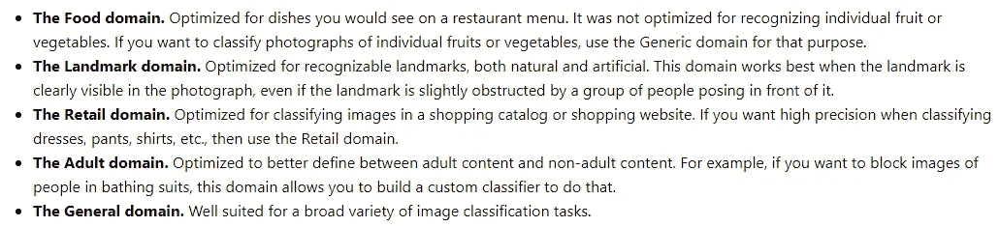
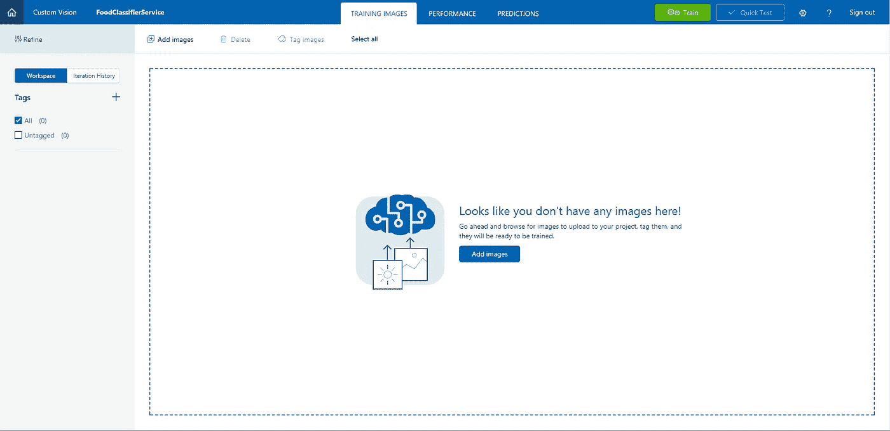
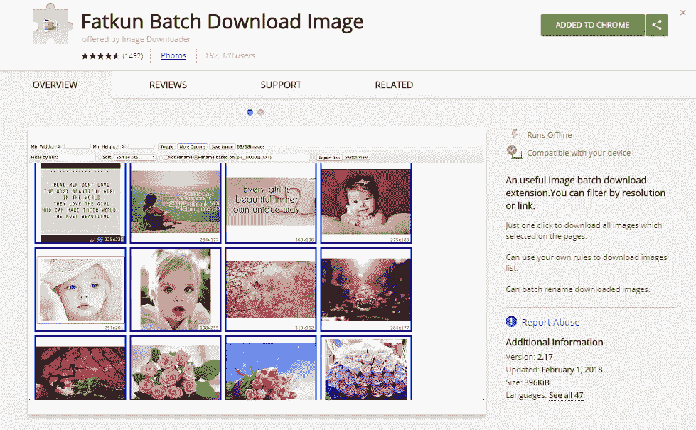
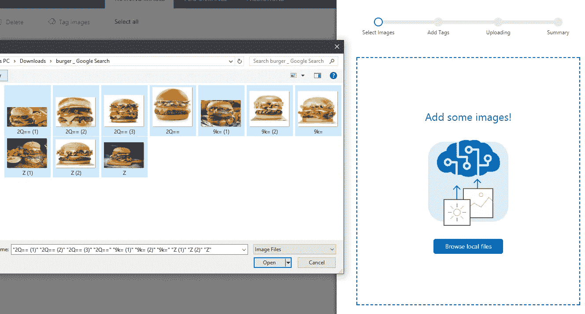
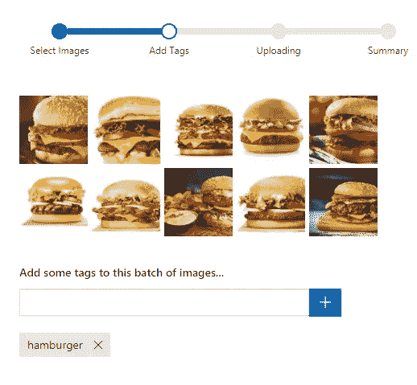
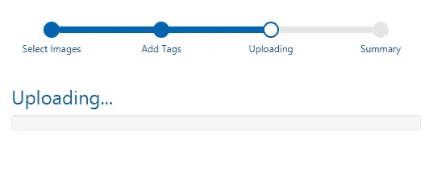
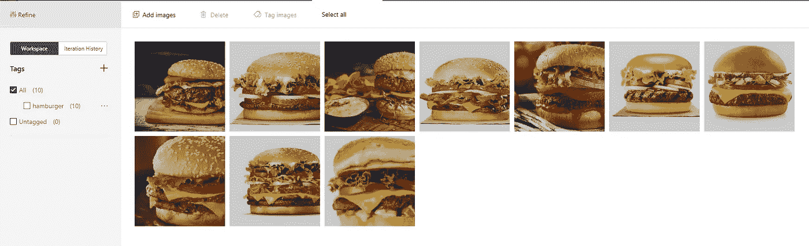
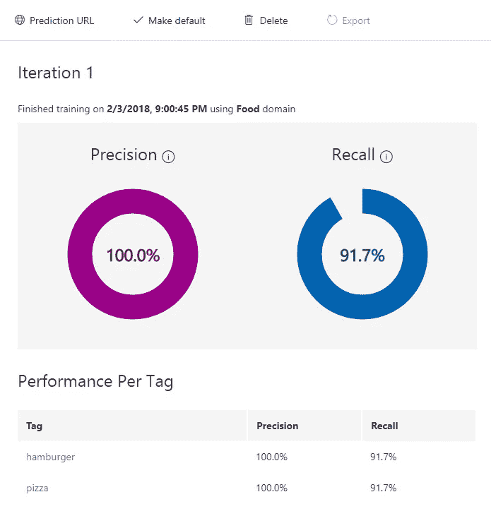
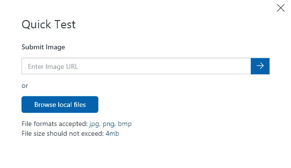
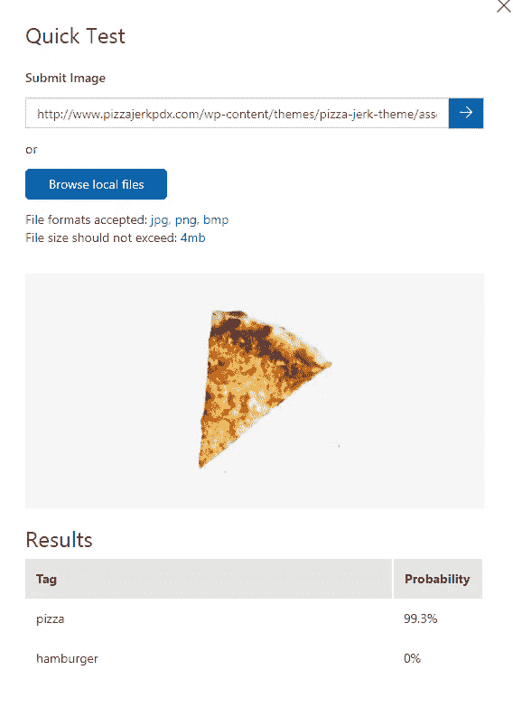

# 如何使用 CustomVision.ai 创建自定义图像分类器

> 原文：<https://towardsdatascience.com/how-to-create-a-custom-image-classifier-with-customvision-ai-fe3df6fd219b?source=collection_archive---------5----------------------->

去年，当我在为微软菲律宾学生合作伙伴(MSPs)准备关于机器人+认知服务的演讲时，我发现了一个有趣的认知服务，名为 [Custom Vision](https://www.customvision.ai/) ，我发现它真的很容易使用，因为就像任何其他认知服务一样，Custom Vision 是一个*黑盒*工具，你可以使用它轻松开始你的人工智能开发，即使你对机器学习知之甚少。

> 自定义视觉服务是一个用于构建自定义图像分类器的工具。它使得构建、部署和改进图像分类器变得简单而快速。

在本教程中，我们将创建一个图像分类器，它可以从发送到服务的图片中识别某种食物。如果你不想这样，请随意创建一个不同的图像分类器，因为步骤几乎是相同的。

# 入门指南

这很容易开始，所有你需要使用自定义视觉服务是一个微软帐户。如果你还没有的话，可以去这个[链接](https://outlook.live.com/owa/)。完成后，请执行以下操作:

1.  打开你的浏览器，进入[https://www.customvision.ai/](https://www.customvision.ai/)
2.  登录您的 Microsoft 帐户
3.  点击“新建项目”
4.  输入项目名称。描述为**可选**
5.  从域类别中点击“食物”选项
6.  点击“创建项目”

如果你想知道这些“域”是做什么用的，它基本上是用来优化一个分类器的，你将在你的图像中使用一个特定类型的对象。以下是一些域的定义:

Screenshot taken from [https://docs.microsoft.com/en-us/azure/cognitive-services/custom-vision-service/glossary-of-terms](https://docs.microsoft.com/en-us/azure/cognitive-services/custom-vision-service/glossary-of-terms)

一旦您创建了项目，您应该能够看到这个页面:

# 收集数据

下一步我们需要的是，收集与我们将要创建的分类器相关的图像，在我的例子中是与食物相关的图像。现在，你可以去谷歌搜索你需要的特定图片，然后一张一张地下载。

但如果你像我一样，觉得这样做有点麻烦，尤其是如果你打算下载大量的图像，你可以从谷歌 Chrome 下载一个名为[**fat Kun Batch Download Image**](https://chrome.google.com/webstore/detail/fatkun-batch-download-ima/nnjjahlikiabnchcpehcpkdeckfgnohf?hl=en)的扩展，从名称本身来看，它可以让你从特定页面批量下载图像。多方便啊。

Fatkun Batch Download Image extension from Chrome Web Store

至于在自定义视觉中训练我们的分类器的要求，**我们需要至少 2 个标签，每个标签至少 5 个图像**。所以我准备下载 10 张图片(图片越多越好！)的图片，然后我们将使用这些图片来训练我们的分类器。

**重要提示:**定制视觉服务接受训练图像。jpg，。png，还有。bmp 格式，每张图片最多 6 MB。

# 上传并标记您的图像

## 第一步:

点按“添加图像”以添加您之前下载的图像

## 第二步:

为您的图像指定标签(您可以添加多个标签)

## 第三步:

上传您的图像

成功上传并标记图像后，您应该能够看到图像和标记现在已添加到您的自定义 Vision 项目中。

Images and Tag(s) are now added to your project

现在，添加您为第二个标签下载的另一组图像，然后再次执行步骤 1。

# 训练你的分类器

上传并标记完图片后，点击“培训”按钮继续培训。

完成培训后，您应该能够看到如下所示的图表:

你可能想知道这个“精确”和“回忆”图表是什么意思，对吗？他们在这里:

1.  精度:您的分类器能够正确分类您用来训练它的训练图像的百分比。
2.  回想一下:根据在训练期间分类的图像，您的**分类器模型**能够正确识别的百分比是多少？

# 测试您的模型

一旦你完成了训练，下一步就是测试你的模型是否能够正确识别某个图像。要做到这一点，点击“快速测试”,你要么输入一个图像的网址或只是上传一个图像从您的本地机器。

**重要提示:**测试你的模型时，确保**而不是**使用你用来训练你的分类器的图像。这是为了防止有偏见的结果，并让您看到您的模型在完全看不见的“真实世界”数据上的表现。

下面是您完成模型测试后的样子:

正如你在这里看到的，它能够正确地识别出我上传的图片确实是一个比萨饼。那么你怎么看待定制视觉认知服务？你觉得它有用并且容易使用吗？请在评论中告诉我。

我将写这篇博客的第 2 部分，向你展示如何使用和消费我们刚刚为你的应用程序创建的分类器模型，特别是在聊天机器人中。