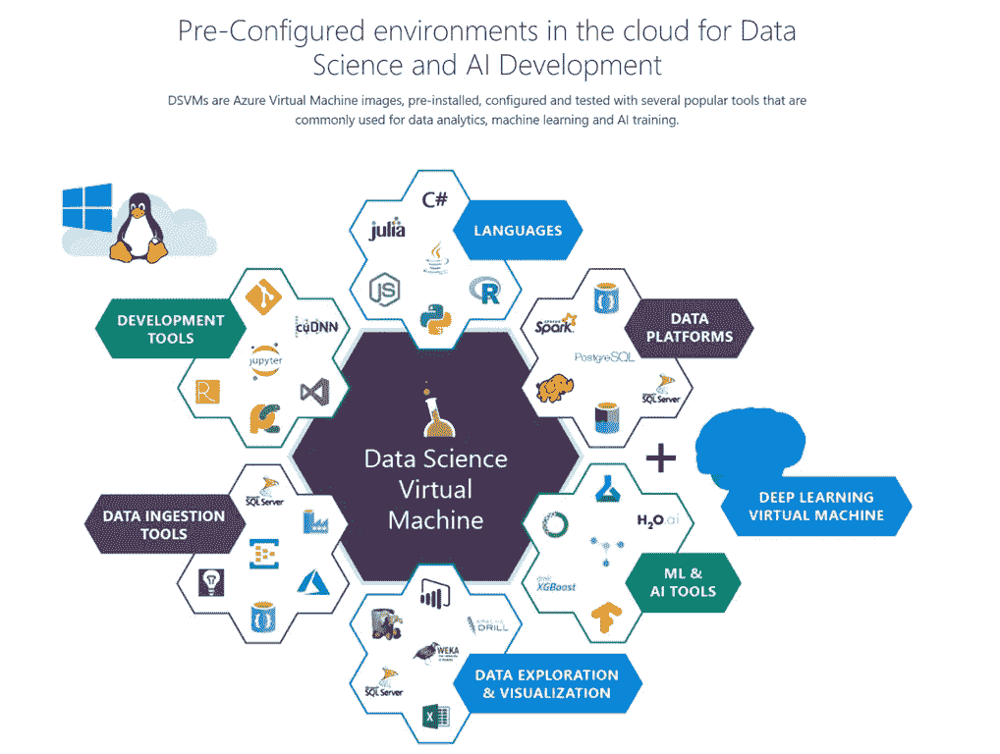
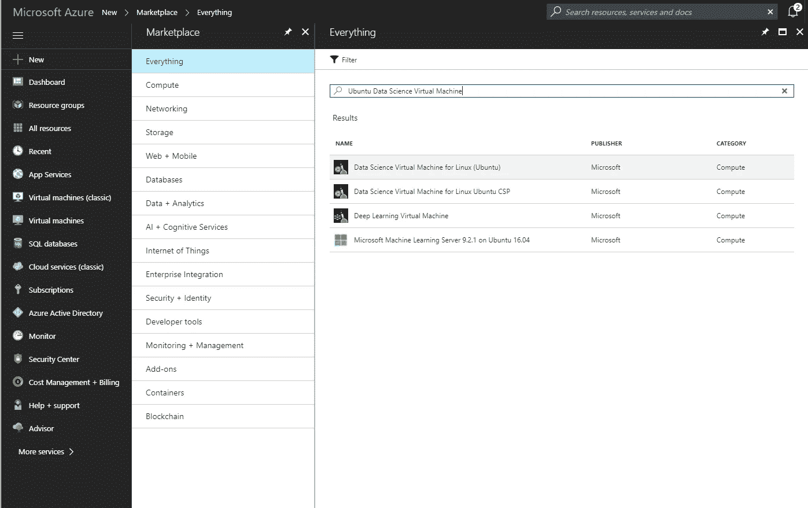
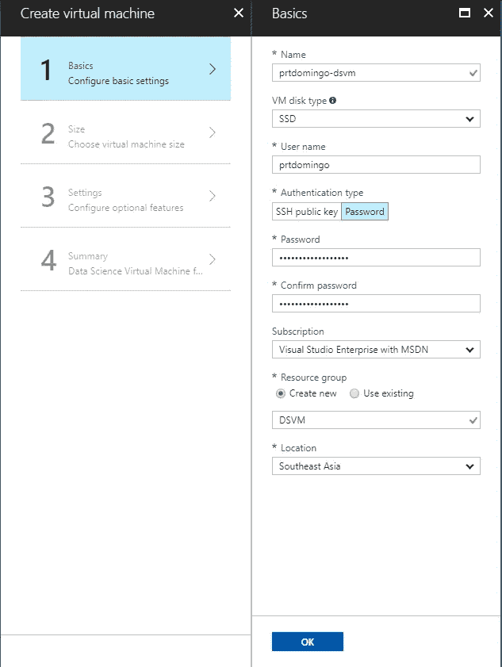
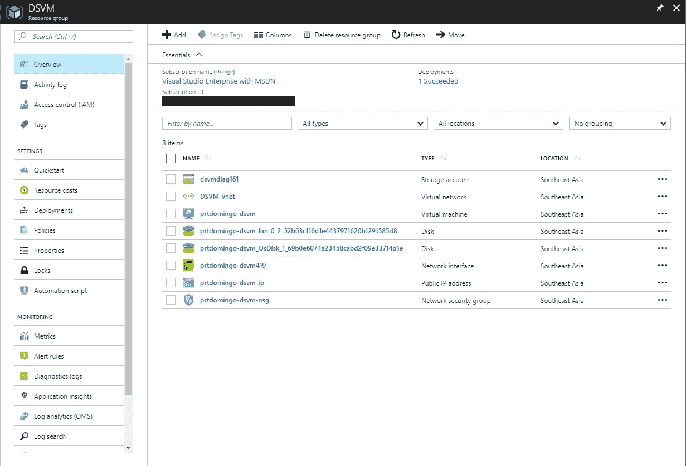

# 如何在 Azure 中创建用于 AI 开发的预配置虚拟机

> 原文：<https://towardsdatascience.com/how-to-create-a-pre-configured-virtual-machine-for-ai-development-in-azure-484edd7e22a2?source=collection_archive---------2----------------------->

正如我在之前的博客中提到的，过去几个月我一直在练习机器学习和深度学习。我开始实验时需要的一些东西是:

1.  一台拥有相当计算能力的机器来训练机器学习，特别是深度学习建模的速度要快得多。
2.  一台拥有所有工具(即 Python、TensorFlow、OpenCV 等)的机器..)我需要开始我的小人工智能实验。

这就是 Azure 数据科学虚拟机或 Azure DSVM 的用武之地。

Image Source: [https://blogs.msdn.microsoft.com/uk_faculty_connection/2017/09/29/microsoft-deep-learning-virtual-machine/](https://blogs.msdn.microsoft.com/uk_faculty_connection/2017/09/29/microsoft-deep-learning-virtual-machine/)

> [数据科学虚拟机](https://docs.microsoft.com/en-us/azure/machine-learning/data-science-virtual-machine/overview) (DSVM)是微软 Azure cloud 上专门为数据科学构建的定制虚拟机映像。它预安装和预配置了许多流行的数据科学和其他工具，可以快速构建用于高级分析的智能应用程序。

Azure DSVM 还提供了 3 个版本:

1.  [Windows Server 2016 DSVM](https://azuremarketplace.microsoft.com/en-us/marketplace/apps/microsoft-ads.windows-data-science-vm)
2.  [Linux Ubuntu DSVM](https://azuremarketplace.microsoft.com/en-us/marketplace/apps/microsoft-ads.linux-data-science-vm-ubuntu)
3.  [深度学习虚拟机](https://azuremarketplace.microsoft.com/en-us/marketplace/apps/microsoft-ads.dsvm-deep-learning)

在这篇博文中，我们将创建一个基于 Linux Ubuntu 的数据科学虚拟机。

# 先决条件

开始使用的唯一先决条件是拥有有效的 Azure 订阅。如果你还没有 Azure 订阅，你可以点击[这里](https://azure.microsoft.com/en-us/free/)获得免费试用。

# 创建基于 Linux Ubuntu 的 DSVM

1.  在你的 [Azure 门户](http://portal.azure.com)中，点击“+新建”
2.  搜索“Ubuntu 数据科学虚拟机”

3.选择“适用于 Linux (Ubuntu)的 Data Science 虚拟机”

4.点击“创建”

5.填写“基本信息”表格，然后点击“确定”

6.选择您想要的虚拟机大小

7.对于第 3 步“设置”,您可以点击“确定”继续默认设置

8.在第 4 步“总结”中，单击“创建”创建虚拟机

一旦成功创建了 DSVM，您应该能够看到资源组中的资源。

现在，您可以通过 SSH 连接到您的 DSVM，并开始您的 AI 开发。

# 预装工具列表

包含的预装工具将取决于您用来创建 Azure DSVM 的版本或操作系统。在我们的例子中，因为我们使用了基于 Linux Ubuntu 的 DSVM 版本，所以这里列出了可用的预安装工具:

1.  咖啡
2.  咖啡 2
3.  微软 CNTK
4.  H2O
5.  克拉斯
6.  MXNet
7.  NVIDIA 数字
8.  张量流
9.  Theano
10.  火炬
11.  CUDA、cuDNN 和 NVIDIA 驱动程序
12.  带有 Microsoft R Open 的 Microsoft R Server 开发人员版
13.  Anaconda Python 发行版(版本 2.7 和 3.5)
14.  朱丽亚普罗
15.  独立 Spark 实例和单节点 Hadoop (HDFS、Yarn)
16.  朱庇特枢纽
17.  Azure 存储浏览器
18.  Azure CLI
19.  Java、Python、node.js、Ruby、PHP 版本的 Azure SDK
20.  用于 Python 和 R 的 Azure 机器学习库
21.  文本编辑器和 ide(即 Vim、RStudio、Emacs、PyCharm 和 IntelliJ)

仅此而已。那么你怎么看待 Azure 数据科学虚拟机呢？如果你想了解更多，可以查看他们的官方文件[这里](https://docs.microsoft.com/en-us/azure/machine-learning/data-science-virtual-machine/overview)。

我还写了一些博客文章，可以帮助你开始使用 Azure DSVM 进行人工智能开发，尤其是使用 Linux 版本时，效率更高。你可以在这里查看:

*   [用远程 VSCode 在你的 Linux 虚拟机上编辑文件变得容易多了](https://medium.com/@prtdomingo/editing-files-in-your-linux-virtual-machine-made-a-lot-easier-with-remote-vscode-6bb98d0639a4)
*   [用 Python 和 Azure DSVM 创建 Azure 机器学习 Web 服务](/create-an-azure-machine-learning-web-service-with-python-and-azure-dsvm-f7a16a925c4b)