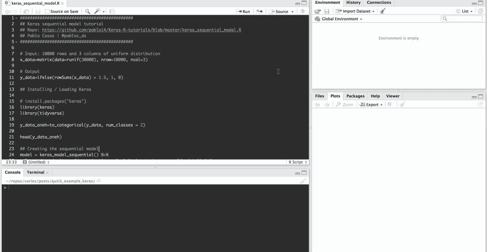
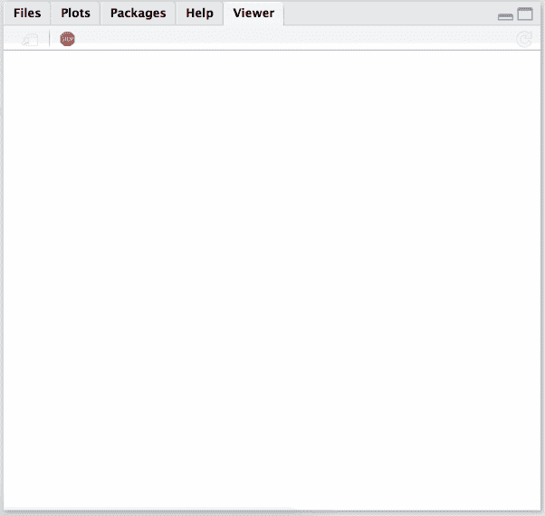
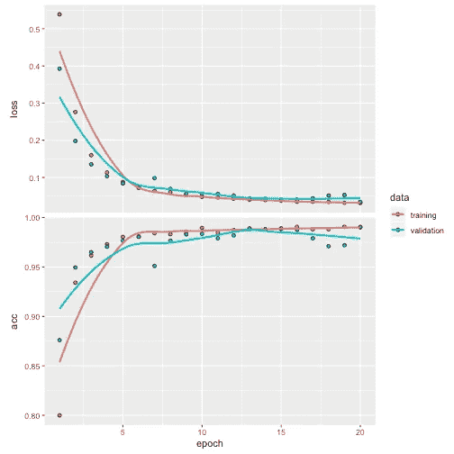

# 如何在 Keras 中为 R 创建序列模型

> 原文：<https://towardsdatascience.com/how-to-create-a-sequential-model-in-keras-for-r-1437aaf778e2?source=collection_archive---------14----------------------->

TL；dr:本教程将介绍 Keras 的深度学习分类任务。我们将特别关注数组的形状，这是最常见的陷阱之一。

我们将讨论的主题有:

*   如何进行一键编码
*   选择层中的输入和输出形状/尺寸
*   如何训练模型
*   如何评估模型(培训与测试)

你可以在 Github 上找到[这个教程的完整代码👇](https://github.com/pablo14/Keras-R-tutorials/blob/master/keras_sequential_model.R)



# 创建数据

输入数据将是来自均匀分布的 10000 行和 3 列。

# 创建数据

输入数据将是来自均匀分布的 10000 行和 3 列。

该模型将识别出这三个数字的总和高于阈值`1.5`，否则将为 0。

```
# Input: 10000 rows and 3 columns of uniform distribution
x_data=matrix(data=runif(30000), nrow=10000, ncol=3)# Output
y_data=ifelse(rowSums(x_data) > 1.5, 1, 0)head(x_data)##            [,1]      [,2]      [,3]
## [1,] 0.49224109 0.6096538 0.7855929
## [2,] 0.56710301 0.8707570 0.3428543
## [3,] 0.08246592 0.7504529 0.6979251
## [4,] 0.79197829 0.6330420 0.7307403
## [5,] 0.65170373 0.9052915 0.1395298
## [6,] 0.23479406 0.2611791 0.2780037head(y_data)## [1] 1 1 1 1 1 0
```

# 安装/加载 Keras

```
# install.packages("keras")
library(keras)
library(tidyverse)
```

# Keras 中的一键编码

深度学习的一个关键点是理解模型需要的向量、矩阵和/或数组的维数。我发现这些都是 Keras 支持的类型。

用 Python 的话说，就是数组的形状。

为了完成二进制分类任务，我们将创建一个单热点向量。对于 2 个以上的类，它以相同的方式工作。

例如:

*   值`1`将是矢量`[0,1]`
*   值`0`将是矢量`[1,0]`

Keras 提供了`to_categorical`函数来实现这个目标。

```
y_data_oneh=to_categorical(y_data, num_classes = 2)head(y_data_oneh)##      [,1] [,2]
## [1,]    0    1
## [2,]    0    1
## [3,]    0    1
## [4,]    0    1
## [5,]    0    1
## [6,]    1    0
```

很容易得到分类变量，如:“是/否”、“CatA、CatB、CatC”等。但是`to_categorical`不接受非数值作为输入。我们需要首先转换它们。

`num_classes`是创建矢量长度所必需的。

`to_categorical`的替代品:

*   包`CatEncoders`， [OneHotEncoder](https://cran.r-project.org/web/packages/CatEncoders/CatEncoders.pdf) (同 Python `scikit-learn`)。
*   封装`caret`，功能 [dummyVars](https://amunategui.github.io/dummyVar-Walkthrough/) 。

注意:我们不需要转换**输入变量**，因为它们是数值。

# 在 Keras 中创建顺序模型

Keras 中最简单的模型是**序列**，它是通过顺序堆叠层而构建的。

在下一个示例中，我们堆叠了三个密集图层，keras 使用 input_shape 参数用您的数据构建了一个隐式输入图层。因此，我们总共有一个输入层和一个输出层。

```
model = keras_model_sequential() %>%   
  layer_dense(units = 64, activation = "relu", input_shape = ncol(x_data)) %>%
  layer_dense(units = 64, activation = "relu") %>%
  layer_dense(units = ncol(y_data_oneh), activation = "softmax")
```

目前最重要的参数是:

*   在第一层中，`input_shape`代表一个值为 3 ( `ncol(x_data)`)的向量，表示输入变量的数量。在深度学习中，几乎所有东西都是向量(或张量)。
*   第二层没有`input_shape`，因为 Keras 是从前一层推断出来的。
*   第三个`layer_dense`，代表最终输出，有 2 个(`ncol(y_data_oneh)`)单位代表两种可能的结果。

您可以检查每个图层的模型和形状:

```
model## Model
## ___________________________________________________________________________
## Layer (type)                     Output Shape                  Param #     
## ===========================================================================
## dense_28 (Dense)                 (None, 64)                    256         
## ___________________________________________________________________________
## dense_29 (Dense)                 (None, 64)                    4160        
## ___________________________________________________________________________
## dense_30 (Dense)                 (None, 2)                     130         
## ===========================================================================
## Total params: 4,546
## Trainable params: 4,546
## Non-trainable params: 0
## ___________________________________________________________________________
```

现在是时候定义损失和优化器函数，以及要优化的指标了。

虽然它说的是“准确性”，但 keras 识别输出的性质(分类)，并在后端使用`categorical_accuracy`。

```
compile(model, loss = "categorical_crossentropy", optimizer = optimizer_rmsprop(), metrics = "accuracy")
```

让我们来拟合(训练)模型:

```
history = fit(model,  x_data, y_data_oneh, epochs = 20, batch_size = 128, validation_split = 0.2)
```



搞定了。

绘图结果:

```
plot(history)
```



Keras results in ggplot2

# 用看不见的数据验证

创建“看不见的”输入测试数据(1000 行，3 列):

```
x_data_test=matrix(data=runif(3000), nrow=1000, ncol=3)
dim(x_data_test)## [1] 1000    3
```

预测新病例:

```
y_data_pred=predict_classes(model, x_data_test)glimpse(y_data_pred)##  num [1:1000(1d)] 0 0 1 1 1 1 0 1 0 1 ...
```

请注意，维度是 1000 行和 2 列。`predict_classes`自动执行一键解码。

相反，`predict`返回训练时收到的相同维度(n 行，n 类预测)。

```
y_data_pred_oneh=predict(model, x_data_test)dim(y_data_pred_oneh)## [1] 1000    2head(y_data_pred_oneh)##                     [,1]              [,2]
## [1,] 0.99207872152328491 0.007921278476715
## [2,] 1.00000000000000000 0.000000001157425
## [3,] 0.00000002739444227 1.000000000000000
## [4,] 0.41273152828216553 0.587268412113190
## [5,] 0.03470309823751450 0.965296924114227
## [6,] 0.00000000007147296 1.000000000000000
```

在分类中，总是建议返回每个类别的概率，就像我们对`predict`所做的那样(行和为 1)。更多信息请访问: [DSLB -得分数据](https://livebook.datascienceheroes.com/model-performance.html#scoring_data)。

# softmax 激活

多亏了最后一层的`activation = "softmax"`,我们得到了概率。

对于每个类，softmax 的输出范围从 0 到 1，所有类的总和自然是 1。

# 评估模型(培训与测试)

创建“真实”y 目标，与预测目标进行比较:

```
y_data_real=ifelse(rowSums(x_data_test) > 1.5, 1, 0)
y_data_real_oneh=to_categorical(y_data_real)## Training data
evaluate(model, x_data, y_data_oneh, verbose = 0)## $loss
## [1] 0.03008356
## 
## $acc
## [1] 0.9918## Test data (we need the one-hot version)
evaluate(model, x_data_test, y_data_real_oneh, verbose = 0)## $loss
## [1] 0.03146484
## 
## $acc
## [1] 0.991
```

看不见的数据的精度几乎是完美的:大约在`1`(以及接近 0 的损失，这比精度更重要)。

神经网络学习了我们一开始定义的模式🎉！


# 一些问题🤔

*需要多少层？*我们尝试了 3，但是 4 怎么样？它将学习同样的东西，但是需要更多的时间。但是在其他情况下，性能会提高。这取决于每个案例。

*每层需要多少个神经元？*和以前一样的推理。我们应该期望用最简单的网络获得最大的精度。倾向于进行良好的标准拟合的一种方法是从具有(即)128 个神经元的层开始。然后加一层 64，另一层 16。模式是减少每层神经元的数量。

# 你自己试试🙌

阅读只是学习的一个很小的部分，你可以自己尝试，比如改变我们使用的函数(我们尝试了`y > 1.5 = 1`)并让网络来学习它。

通过编码学习，并暴露你的实践中的错误🙂

# 进一步阅读

*   [系列车型指南](https://keras.rstudio.com/articles/sequential_model.html)(来自 Rstudio)
*   [R 中深度学习入门](https://blog.rstudio.com/2018/09/12/getting-started-with-deep-learning-in-r)(来自 Rstudio)
*   [样本大小和类别对模型性能的平衡](https://blog.datascienceheroes.com/sample-size-and-class-balance-on-model-performance)(底层模型是用 Keras 构建的)

*本帖最初发布于:*[*https://blog . datascienceheroes . com/how-to-create-a-sequential-model-in-keras-for-r/*](https://blog.datascienceheroes.com/how-to-create-a-sequential-model-in-keras-for-r/)

有什么问题吗？把它们留在下面📩

**感谢**阅读！🚀

📗[数据科学 Live Book](http://livebook.datascienceheroes.com/) —学习机器学习的在线书籍

[更多数据故事:博客](https://blog.datascienceheroes.com/how-to-create-a-sequential-model-in-keras-for-r/blog.datascienceheroes.com)|[Linkedin](https://www.linkedin.com/in/pcasas/)|[Twitter](https://twitter.com/pabloc_ds)