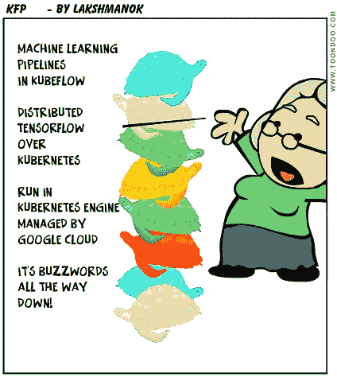
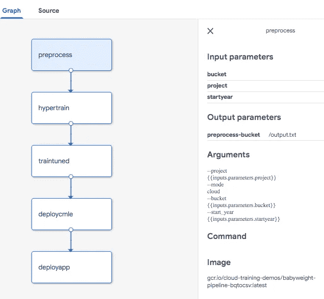
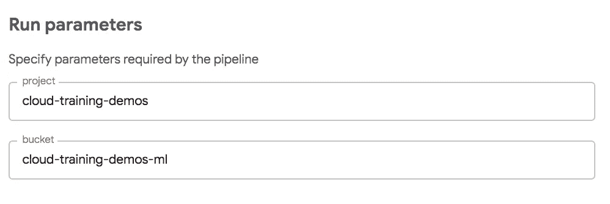
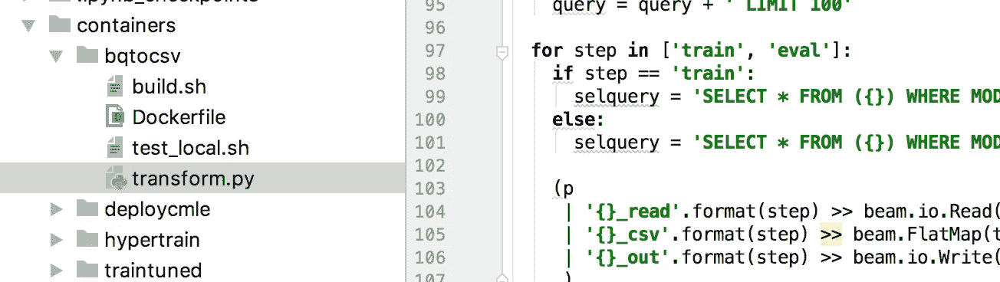
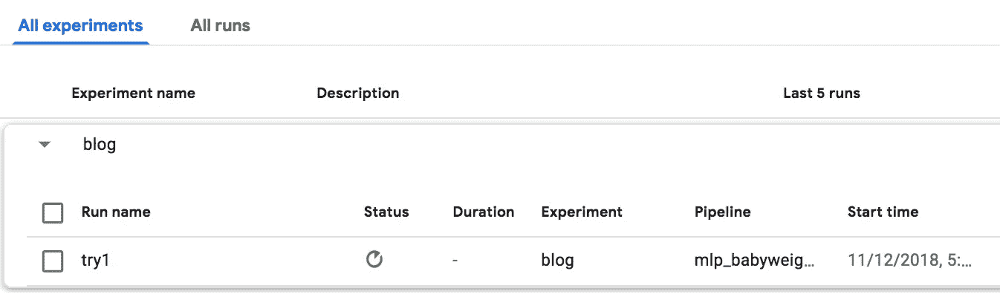
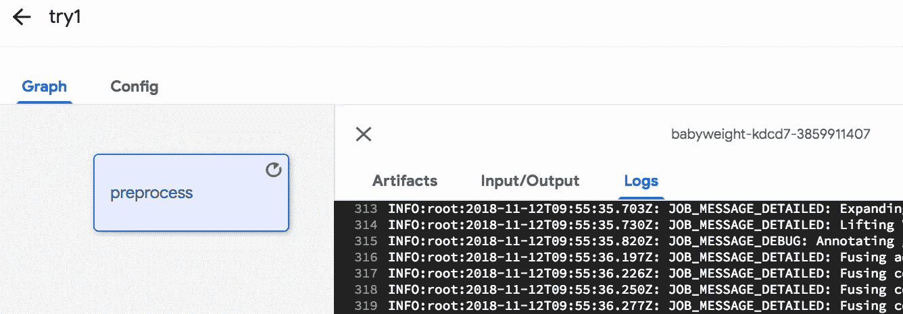
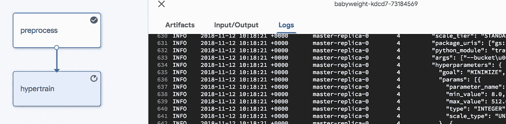
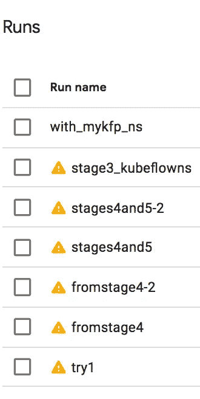

# 如何创建和部署 Kubeflow 机器学习管道(第 1 部分)

> 原文：<https://towardsdatascience.com/how-to-create-and-deploy-a-kubeflow-machine-learning-pipeline-part-1-efea7a4b650f?source=collection_archive---------3----------------------->

谷歌云最近宣布了一个开源项目，以简化机器学习管道的操作。在本文中，我将带您了解使用 [Kubeflow Pipelines](https://github.com/kubeflow/pipelines) (本文中的 KFP)获取现有真实世界 TensorFlow 模型并操作化该模型的培训、评估、部署和再培训的过程。

本文的[完整代码](https://github.com/GoogleCloudPlatform/training-data-analyst/tree/master/courses/machine_learning/deepdive/06_structured/pipelines)在 GitHub 上。

## 1.创建一个安装了管道的 Kubernetes 集群(一次)

***注*** *:我写这篇文章的时候，托管管道还没有出现。创建安装了管道的 Kubernetes 集群的一个更简单的方法是遵循这个* [*自述文件*](https://github.com/GoogleCloudPlatform/training-data-analyst/blob/master/courses/machine_learning/deepdive/06_structured/pipelines/README.md) *中的步骤。如果你这样做了，继续从第二步开始读。*

KFP 自然需要 Kubernetes 集群来运行。使用此命令启动一个 Google Kubernetes 引擎(GKE)集群，并允许 KFP 管理该集群(repo 中的 [create_cluster.sh](https://github.com/GoogleCloudPlatform/training-data-analyst/blob/master/courses/machine_learning/deepdive/06_structured/pipelines/1_create_cluster.sh) ):

```
#!/bin/bash

CLUSTERNAME=mykfp
ZONE=us-central1-bgcloud config set compute/zone $ZONE
gcloud beta container clusters create $CLUSTERNAME \
  --cluster-version 1.11.2-gke.18 --enable-autoupgrade \
  --zone $ZONE \
  --scopes cloud-platform \
  --enable-cloud-logging \
  --enable-cloud-monitoring \
  --machine-type n1-standard-2 \
  --num-nodes 4kubectl create clusterrolebinding ml-pipeline-admin-binding --clusterrole=cluster-admin --user=$(gcloud config get-value account)
```

创建一个 GKE 集群大约需要 3 分钟，因此导航到 GCP 控制台的 [GKE 部分，并确保集群已经启动并准备就绪。](https://console.cloud.google.com/kubernetes)

一旦集群启动，在 GKE 集群上安装 ML 管道(repo 中的[2 _ deploy _ kube flow _ pipelines . sh](https://github.com/GoogleCloudPlatform/training-data-analyst/blob/master/courses/machine_learning/deepdive/06_structured/pipelines/2_deploy_kubeflow_pipelines.sh)):

```
#!/bin/bash
PIPELINE_VERSION=0.1.3
kubectl create -f [https://storage.googleapis.com/ml-pipeline/release/$PIPELINE_VERSION/bootstrapper.yaml](https://storage.googleapis.com/ml-pipeline/release/$PIPELINE_VERSION/bootstrapper.yaml)
```

在发布页面将上述版本更改为[最新版本。部署此包将需要几分钟时间。您可以查看作业的状态，并等待成功运行的次数变为 1。或者，您可以告诉 kubectl 等待创建完成:](https://github.com/kubeflow/pipelines/releases)

```
#!/bin/bashjobname=$(kubectl get job | tail -1 | awk '{print $1}')
kubectl wait --for=condition=complete --timeout=5m $jobname
```

在等待软件安装完成时，您可以继续阅读！



Buzzwords all the way down!

## 2.管道的描述

有几种方法可以创建管道。“dev-ops”的方式是使用 Python3 和 Docker。一种对数据科学家更友好的方式是使用 Jupyter 笔记本。在后面的帖子中，我将向您展示 Jupyter notebook 方法，但在这篇帖子中，我将向您展示 Python3-Docker 机制。理解这一点是有帮助的，这样当你走 Jupyter 路线时，你就知道幕后发生了什么。

我将通过机器学习模型来预测婴儿的体重。该模型有以下步骤:(a)从 BigQuery 中提取数据，对其进行转换，并将转换后的数据写入云存储。(b)训练张量流估计器 API 模型，并对模型进行超参数调整(c)一旦获得最佳学习速率、批量大小等。确定后，使用这些参数对模型进行更长时间的训练，并对更多数据进行训练(d)将训练好的模型部署到云 ML 引擎。

下面是描述上述管道的 Python 代码(repo 中的 [mlp_babyweight.py](https://github.com/GoogleCloudPlatform/training-data-analyst/blob/master/courses/machine_learning/deepdive/06_structured/pipelines/mlp_babyweight.py) ):

```
preprocess = dsl.ContainerOp(
  name=**'preprocess'**,image=**'gcr.io/cloud-training-demos/babyweight-pipeline-bqtocsv:latest'**,
  arguments=[
    **'--project'**, project,
    **'--mode'**, **'cloud'**,
    **'--bucket'**, bucket
  ],
  file_outputs={**'bucket'**: **'/output.txt'**}
)hparam_train = dsl.ContainerOp(
  name=**'hypertrain'**,image=**'gcr.io/cloud-training-demos/babyweight-pipeline-hypertrain:latest'**,
  arguments=[
    preprocess.outputs[**'bucket'**]
  ],
  file_outputs={**'jobname'**: **'/output.txt'**}
)train_tuned = dsl.ContainerOp(
  name=**'traintuned'**,image=**'gcr.io/cloud-training-demos/babyweight-pipeline-traintuned-trainer:latest'**,arguments=[
    hparam_train.outputs[**'jobname'**],
    bucket
  ],
  file_outputs={**'train'**: **'/output.txt'**}
)
train_tuned.set_memory_request(**'2G'**)
train_tuned.set_cpu_request(**'1'**)deploy_cmle = dsl.ContainerOp(
  name=**'deploycmle'**,image=**'gcr.io/cloud-training-demos/babyweight-pipeline-deploycmle:latest'**,
  arguments=[
    train_tuned.outputs[**'train'**],  *# modeldir* **'babyweight'**,
    **'mlp'** ],
  file_outputs={
    **'model'**: **'/model.txt'**,
    **'version'**: **'/version.txt'** }
)
```

上面的每个步骤都是一个 Docker 容器。Docker 容器的输出是另一个后续步骤的输入——它是一个有向无环图，当加载到 pipelines UI 中时，将如下所示:



ML Pipeline

(完整的端到端应用程序还包括第五步，部署 web 应用程序，为模型提供用户界面。)

看一下预处理步骤:

```
preprocess = dsl.ContainerOp(
  name=**'preprocess'**,image=**'gcr.io/cloud-training-demos/babyweight-pipeline-bqtocsv:latest'**,
  arguments=[
    **'--project'**, project,
    **'--mode'**, **'cloud'**,
    **'--bucket'**, bucket
  ],
  file_outputs={**'bucket'**: **'/output.txt'**}
)
```

注意，它使用两个输入参数——项目和存储桶——并将其输出(包含预处理数据的存储桶)放在/output.txt 中。

因此，第二步使用 preprocess.outputs['bucket']获取该存储桶名称，并将其输出(性能最高的超参数调优试验的作业名称)作为 hparam _ train . outputs[' job name ']供管道的第三步使用。

相当简单！

当然，这回避了两个问题:第一步如何获得它需要的项目和桶？第二，各个步骤是如何实现的？

项目和桶是通过管道参数得到的:

```
def train_and_deploy(
    project='cloud-training-demos',
    bucket='cloud-training-demos-ml'
):
```

本质上，项目和存储桶将由最终用户在管道运行时提供。UI 将预先填充我在上面提供的默认值:



Pipeline parameters are provided by the end-user

本节的其余部分是关于如何实现各个步骤的。再次，正如我提到的，我将解释 Python3-Docker 的实现方式。在以后的文章中，我会解释 Jupyter 的方法。所以，如果你确信你永远不会走码头工人这条路，只需略读这一部分或者直接跳到第三部分。

## 2a。预处理

在每一步中，您都需要创建一个 Docker 容器。这本质上是一个独立的程序(bash、Python、C++，无论什么),它的所有依赖项都被很好地指定，这样它就可以在集群上由 KFP 运行。

在我的例子中，我的预处理代码是一个独立的 Python 程序，它使用 Apache Beam 并期望在云数据流上运行。所有代码都在一个名为 [transform.py](https://github.com/GoogleCloudPlatform/training-data-analyst/blob/master/courses/machine_learning/deepdive/06_structured/pipelines/containers/bqtocsv/transform.py) 的命令行程序中:



The preprocessing code is all in a single file called transform.py

我的 Dockerfile 文件必须指定所有的依赖项。幸运的是，KFP 有一堆样本容器，其中一个有我需要的所有依赖项。所以，我只是继承了它。因此，我的 [Dockerfile](https://github.com/GoogleCloudPlatform/training-data-analyst/blob/master/courses/machine_learning/deepdive/06_structured/pipelines/containers/bqtocsv/Dockerfile) 是全部 4 行:

```
FROM gcr.io/ml-pipeline/ml-pipeline-dataflow-tft:latest
RUN mkdir /babyweight
COPY transform.py /babyweight
ENTRYPOINT ["python", "/babyweight/transform.py"]
```

本质上，我将 transform.py 复制到 Docker 容器中，并说入口点是执行该文件。

然后，我可以构建我的 Docker 容器，并在我的项目中的 gcr.io 中将其发布在 [build.sh](https://github.com/GoogleCloudPlatform/training-data-analyst/blob/master/courses/machine_learning/deepdive/06_structured/pipelines/containers/bqtocsv/build.sh) 中:

```
CONTAINER_NAME=babyweight-pipeline-bqtocsvdocker build -t ${CONTAINER_NAME} .
docker tag ${CONTAINER_NAME} gcr.io/${PROJECT_ID}/${CONTAINER_NAME}:${TAG_NAME}
docker push gcr.io/${PROJECT_ID}/${CONTAINER_NAME}:${TAG_NAME}
```

当然，这是我为预处理步骤指定的 image_name。

## 2b。CMLE 上的训练和超参数调整

我将使用 [bash 在云 ML 引擎上进行训练和超参数调优，以使用 gcloud](https://github.com/GoogleCloudPlatform/training-data-analyst/blob/master/courses/machine_learning/deepdive/06_structured/pipelines/containers/hypertrain/train.sh) 提交作业:

```
gcloud ml-engine jobs submit training $JOBNAME \
  --region=$REGION \
  --module-name=trainer.task \
  --package-path=${CODEDIR}/babyweight/trainer \
  --job-dir=$OUTDIR \
  --staging-bucket=gs://$BUCKET \
  --scale-tier=STANDARD_1 \
  --config=hyperparam.yaml \
  --runtime-version=$TFVERSION \
 **--stream-logs** \
  -- \
  --bucket=${BUCKET} \
  --output_dir=${OUTDIR} \
  --eval_steps=10 \
  --train_examples=20000# write output file for next step in pipeline
echo $JOBNAME > /output.txt
```

请注意，我使用了 gcloud 命令等待完成的-stream-logs，并注意我写出了 jobname，它是管道代码中以下步骤的契约的一部分。

这一次，我将通过从一个已经安装了 gcloud 的容器继承来创建[我的 Dockerfile](https://github.com/GoogleCloudPlatform/training-data-analyst/blob/master/courses/machine_learning/deepdive/06_structured/pipelines/containers/hypertrain/Dockerfile) ，并且 git 克隆包含实际教练代码的存储库:

```
FROM google/cloud-sdk:latestRUN mkdir -p /babyweight/src && \
    cd /babyweight/src && \
    git clone [https://github.com/GoogleCloudPlatform/training-data-analyst](https://github.com/GoogleCloudPlatform/training-data-analyst)COPY train.sh hyperparam.yaml ./ENTRYPOINT ["bash", "./train.sh"]
```

## 2c。在 Kubernetes 上进行本地培训

上面的预处理和超参数调优步骤利用了托管服务。KFP 所做的只是提交作业，并允许托管服务完成它们的工作。在 KFP 运行的 Kubernetes 集群上做点什么怎么样？

为了稍微混淆一下，让我在 GKE 集群上本地执行下一步(培训)。为此，我可以简单地运行一个直接调用 python 的 Docker 容器:

```
NEMBEDS=$(gcloud ml-engine jobs describe $HYPERJOB --format 'value(trainingOutput.trials.hyperparameters.nembeds.slice(0))')
TRIALID=$(gcloud ml-engine jobs describe $HYPERJOB --format 'value(trainingOutput.trials.trialId.slice(0))')...OUTDIR=gs://${BUCKET}/babyweight/hyperparam/$TRIALID
python3 -m trainer.task \
  --job-dir=$OUTDIR \
  --bucket=${BUCKET} \
  --output_dir=${OUTDIR} \
  --eval_steps=10 \
  --nnsize=$NNSIZE \
  --batch_size=$BATCHSIZE \
  --nembeds=$NEMBEDS \
  --train_examples=200000
```

在集群本身上执行作业有一个问题。您如何知道集群没有在执行耗尽所有可用内存的任务呢？traintuned 容器操作“保留”了必要数量的内存和 CPU。只有当必要的资源可用时，kubeflow 才会安排作业:

```
train_tuned.set_memory_request('2G')
train_tuned.set_cpu_request('1')
```

## 2d。部署到云 ML 引擎

[部署到云 ML 引擎](https://github.com/GoogleCloudPlatform/training-data-analyst/tree/master/courses/machine_learning/deepdive/06_structured/pipelines/containers/deploycmle)也使用 gcloud，所以那个目录下的 deploy.sh 和 build.sh 应该看起来很熟悉:

```
gcloud ml-engine versions create ${MODEL_VERSION} \
       --model ${MODEL_NAME} --origin ${MODEL_LOCATION} \
       --runtime-version $TFVERSIONecho $MODEL_NAME > /model.txt
echo $MODEL_VERSION > /version.txt
```

和

```
FROM google/cloud-sdk:latestRUN mkdir -p /babyweight/src && \
    cd /babyweight/src && \
    git clone [https://github.com/GoogleCloudPlatform/training-data-analyst](https://github.com/GoogleCloudPlatform/training-data-analyst)COPY deploy.sh ./ENTRYPOINT ["bash", "./deploy.sh"]
```

正如我们在 Kubernetes 集群上培训一样，我们也可以在 Kubernetes 本身上部署(参见[这个组件中的一个例子](https://github.com/kubeflow/pipelines/tree/master/components/kubeflow))。

## 2e。编译 DSL

现在，所有步骤的 Docker 容器都已构建完毕，我们可以将管道提交给 KFP 了，只是……KFP 要求我们将管道 Python3 文件编译成特定于领域的语言。我们使用 Python3 SDK 附带的一个名为 dsl-compile 的工具来完成这项工作。所以，先安装那个 SDK ( [3_install_sdk.sh](https://github.com/GoogleCloudPlatform/training-data-analyst/blob/master/courses/machine_learning/deepdive/06_structured/pipelines/3_install_sdk.sh) ):

```
pip3 install python-dateutil [https://storage.googleapis.com/ml-pipeline/release/0.1.2/kfp.tar.gz](https://storage.googleapis.com/ml-pipeline/release/0.1.2/kfp.tar.gz) --upgrade
```

然后，使用以下代码编译 DSL:

```
python3 mlp_babyweight.py mlp_babyweight.tar.gz
```

或者，您可以通过以下方式将包含 dsl-compile 的目录添加到您的路径中

```
export PATH=”$PATH:`python -m site --user-base`/bin
```

然后调用编译器:

```
dsl-compile --py mlp_babyweight.py --output mlp_babyweight.tar.gz
```

在第 3 节中，您将把这个 tar 文件上传到 ML pipelines UI。

## 3.上传管道

用户界面服务器在端口 80 的 GKE 集群上运行。进行端口转发，以便您可以通过端口 8085 ( [4_start_ui.sh](https://github.com/GoogleCloudPlatform/training-data-analyst/blob/master/courses/machine_learning/deepdive/06_structured/pipelines/4_start_ui.sh) )从笔记本电脑访问它:

```
export NAMESPACE=kubeflow
kubectl port-forward -n ${NAMESPACE} $(kubectl get pods -n ${NAMESPACE} --selector=service=ambassador -o jsonpath='{.items[0].metadata.name}') 8085:80
```

现在，打开浏览器到[http://localhost:8085/pipeline](http://localhost:8085/pipeline.)，切换到 Pipelines 选项卡。然后，上传在 2e 小节中创建的 tar.gz 文件作为管道。

这只是使图表可用。您可能会使用各种设置组合来运行它。所以，开始一个实验来保持所有这些运行。我将我的实验命名为“博客”，然后创建了一个 run。我将该运行命名为“try1 ”,并使用刚刚上传的管道进行设置:



管道现在开始运行。我可以看到正在执行的每个步骤以及每个步骤的日志:



## 4.实验、开发、再培训、评估…

完整的源代码包括一些我忽略的东西。显然，完整的代码看起来并不完整，而且第一次也没有成功。我没有每次都从头开始管道，而是设置了管道，这样我就可以从任何一步开始(我正在处理的那一步)。

但是，每一步都依赖于前一步的输出。如何做到这一点？这是我的解决方案:

```
 **if start_step <= 2:**
    hparam_train = dsl.ContainerOp(
      name='hypertrain',
      # image needs to be a compile-time string
      image='gcr.io/cloud-training-demos/babyweight-pipeline-hypertrain:latest',
      arguments=[
        preprocess.outputs['bucket']
      ],
      file_outputs={'jobname': '/output.txt'}
    )
  **else:
    hparam_train = ObjectDict({
      'outputs': {
        'jobname': 'babyweight_181008_210829'
      }
    })**
```

本质上，如果 start_step ≤ 2，就会创建容器 op。否则，我只需用上一步的“已知”输出创建一个字典。这样，我可以简单地将 start_step 设置为 4，跳过前面的步骤，从第 4 步开始。然而，后面的步骤将具有它们期望的来自任何先前步骤的输入。

我的实验包括几次运行:



比如 try1 成功运行 3 步后失败，我可以从第 4 步开始。我需要两次尝试才能完成第四步。然后，我添加了步骤 5(部署一个 AppEngine 应用程序到 web 服务的前端)。然后，我回去尝试了阶段 3 的不同变化。

## 4b。再训练

当然，你不会训练一个模型一次就让它永远消失(是吗？).一旦有了更多的数据，您将需要重新训练模型。在我们的婴儿体重模型中，一旦我们有了一年的数据，我们可以想象重新训练模型。我在管道中处理这种情况的方法是请求一个 startYear 作为输入参数:

```
def train_and_deploy(
    project=dsl.PipelineParam(name='project', value='cloud-training-demos'),
    bucket=dsl.PipelineParam(name='bucket', value='cloud-training-demos-ml'),
    startYear=dsl.PipelineParam(name='startYear', value='2000')
):
```

bqtocsv 步骤中的预处理代码仅提取起始年份或之后的行:

```
WHERE year >= start_year
```

并命名输出文件，这样它们就不会破坏前面的输出:

```
os.path.join(OUTPUT_DIR, 'train_{}.csv', start_year)
```

训练现在在更大的数据集上进行，因为模式匹配是针对 train*。就是这样！

当然，还有其他方法来处理再培训。我们可以采用以前的模型，只根据更新的数据进行训练。像这样的语义并不难合并——使用命名约定来帮助管道做正确的事情。

## 4c。评价？笔记本？

当然，通常情况下，您不会立即将一个经过训练的模型推向生产。相反，在转换所有流量之前，您将进行一些评估，也许是 A/B 测试。

此外，您倾向于不在 Docker 容器中开发。我在这里很幸运，因为我的 babyweight 模型几乎是一个 Python 包，并且非常方便归档。如果您在 Jupyter 笔记本上完成所有的模型开发，会怎么样？

如何进行评估，以及如何将笔记本转换为管道是另一篇博文的主题。注意这个空间。

## 5.动手吧！

本文的[完整代码](https://github.com/GoogleCloudPlatform/training-data-analyst/tree/master/courses/machine_learning/deepdive/06_structured/pipelines)在 GitHub 上。克隆 repo 并按照自述文件中的步骤操作。

另外，请阅读 [Amy Unruh 关于 Kubeflow 管道入门的博文](https://cloud.google.com/blog/products/ai-machine-learning/getting-started-kubeflow-pipelines)。