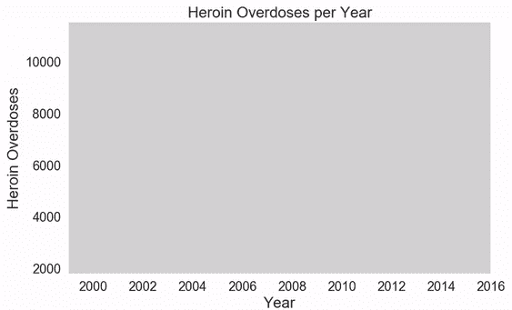
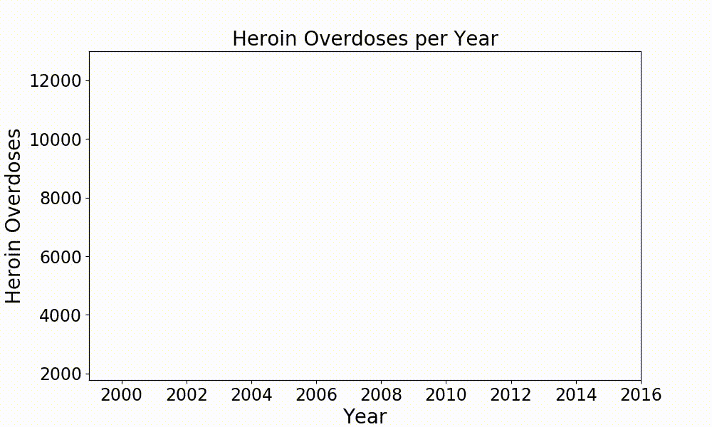
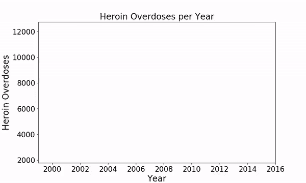

# 如何用 Python 创建动画图形

> 原文：<https://towardsdatascience.com/how-to-create-animated-graphs-in-python-bb619cc2dec1?source=collection_archive---------1----------------------->



Animation of Heroin Deaths in the USA. Created in Python using Seaborn.

Matplotlib 和 Seaborn 是 Python 中一些很好的库，可以创建很棒的图形。但是这些图都是静态的，很难用一种动态的、令人愉悦的方式来描绘数据值的变化。如果在你的下一个演示文稿、视频或社交媒体帖子中，你可以使用一个简短的视频剪辑来展示数据中的发展，那该有多好？更好的是，你仍然可以继续使用 Matplotlib、Seaborn 或任何其他你喜欢用于绘图的库！

我最近为一部关于美国阿片类药物危机的短纪录片制作了几个动态图，所以我将在这篇文章中使用其中的数据。这些数据由美国国家药物滥用研究所和疾病预防控制中心公开提供，可以在这里下载:[https://www . Drug Abuse . gov/sites/default/files/dodoff _ data _ 1999-2015 . xls](https://www.drugabuse.gov/sites/default/files/overdose_data_1999-2015.xls)。

在这篇文章中，我将使用 Matplotlib 和 Seaborn 一起绘图，使用 Numpy 和 Pandas 一起处理数据。对于动画，matplotlib 提供了一些我们可以使用的函数。因此，让我们继续导入所有依赖项。

```
import numpy as np
import pandas as pd
import seaborn as sns
import matplotlib
import matplotlib.pyplot as plt
import matplotlib.animation as animation
```

现在，为了准备动画数据，我们只需要加载它，并把它放入一个熊猫数据帧。当绘制关于不同阿片类药物过量的几个图时，还可以方便地编写一个函数，用于从您感兴趣的行加载数据。

```
overdoses = pd.read_excel('overdose_data_1999-2015.xls',sheetname='Online',skiprows =6)def get_data(table,rownum,title):
    data = pd.DataFrame(table.loc[rownum][2:]).astype(float)
    data.columns = {title}
    return data
```

现在让我们开始制作动画吧！

首先，如果你像我一样使用 jupyter 笔记本，最好用一个`%matplotlib notebook`开始这个单元，这样你就可以立即在你的笔记本上看到动画，而不只是在它被保存之后。

在我的例子中，我现在使用`get_data`函数从表中检索海洛因过量的数字，并将其打包到一个有两列的 Pandas 数据帧中。一个用于年份，另一个用于过量用药的计数。

```
%matplotlib notebook
title = 'Heroin Overdoses'
d = get_data(overdoses,18,title)
x = np.array(d.index)
y = np.array(d['Heroin Overdoses'])
overdose = pd.DataFrame(y,x)
#XN,YN = augment(x,y,10)
#augmented = pd.DataFrame(YN,XN)
overdose.columns = {title}
```

接下来，我们初始化一个 writer，它使用 ffmpeg 并以 20 fps 的比特率 1800 进行记录。你当然可以自己挑选这些值。

```
Writer = animation.writers['ffmpeg']
writer = Writer(fps=20, metadata=dict(artist='Me'), bitrate=1800)
```

现在让我们用一些标签创建一个图形。确保设置 x 轴和 y 轴的限制，以便动画不会在当前显示的数据范围内跳跃。

```
fig = plt.figure(figsize=(10,6))
plt.xlim(1999, 2016)
plt.ylim(np.min(overdose)[0], np.max(overdose)[0])
plt.xlabel('Year',fontsize=20)
plt.ylabel(title,fontsize=20)
plt.title('Heroin Overdoses per Year',fontsize=20)
```

动画的核心部分是动画函数，在该函数中，您可以定义视频的每一帧中发生的事情。这里的`i`代表动画中帧的索引。使用该索引，您可以选择在该框架中应该可见的数据范围。之后，我使用 seaborn lineplot 来绘制数据选择。最后两行只是为了让剧情看起来更赏心悦目一点。

```
def animate(i):
    data = overdose.iloc[:int(i+1)] #select data range
    p = sns.lineplot(x=data.index, y=data[title], data=data, color="r")
    p.tick_params(labelsize=17)
    plt.setp(p.lines,linewidth=7)
```

使用`matplotlib.animation.FuncAnimation`启动动画，其中链接动画功能并定义动画应包含多少帧。因此，`frames`定义了`animate(i)`被调用的频率。

```
ani = matplotlib.animation.FuncAnimation(fig, animate, frames=17, repeat=True)
```

要将这个动画保存为 mp4，你可以简单地调用`ani.save()`。如果你只是想在保存之前看一眼，那就打电话给`plt.show()`吧。

```
ani.save('HeroinOverdosesJumpy.mp4', writer=writer)
```

所以现在动画看起来是这样的:



Heroin Overdose Animation — Jumpy

它有点工作，但仍然很跳动。为了避免跳跃，我们需要更多的数据点在我们已经有的数据点之间。为此我们可以使用另一个函数，我在这里称之为`augment`。

```
def augment(xold,yold,numsteps):
    xnew = []
    ynew = []
    for i in range(len(xold)-1):
        difX = xold[i+1]-xold[i]
        stepsX = difX/numsteps
        difY = yold[i+1]-yold[i]
        stepsY = difY/numsteps
        for s in range(numsteps):
            xnew = np.append(xnew,xold[i]+s*stepsX)
            ynew = np.append(ynew,yold[i]+s*stepsY)
    return xnew,ynew
```

现在我们只需要将这个函数应用于我们的数据，并在`matplotlib.animation.FuncAnimation`函数中增加帧数。这里我用`numsteps=10`调用 augment，这意味着我将我的训练数据增加到 160 个数据点，并且必须设置`frames=160`。结果看起来更加平滑，但是在数据值改变的地方仍然有一些尖锐的边缘。



Heroin Overdose Animation — Sharp Edges

为了消除这些问题，我们可以实现一个平滑函数，如下所述:[https://www . SW harden . com/WP/2008-11-17-linear-data-smoothing-in-python/](https://www.swharden.com/wp/2008-11-17-linear-data-smoothing-in-python/)

```
def smoothListGaussian(listin,strippedXs=False,degree=5):  
    window=degree*2-1  
    weight=np.array([1.0]*window)  
    weightGauss=[]  
    for i in range(window):  
        i=i-degree+1  
        frac=i/float(window)  
        gauss=1/(np.exp((4*(frac))**2))  
        weightGauss.append(gauss)
    weight=np.array(weightGauss)*weight  
    smoothed=[0.0]*(len(listin)-window)  
    for i in range(len(smoothed)):        smoothed[i]=sum(np.array(listin[i:i+window])*weight)/sum(weight)  
    return smoothed
```

此外，我们可以添加一些颜色和风格参数，使情节看起来更有个性。

```
sns.set(rc={'axes.facecolor':'lightgrey', 'figure.facecolor':'lightgrey','figure.edgecolor':'black','axes.grid':False})
```

这就是我们如何获得上面显示的最终结果。

这篇文章仅仅展示了 matplotlib 动画函数的一个例子。当然，你可以用它来制作任何你想制作动画的情节。简单调整`animate()`函数中的参数和绘图类型，可能性是无限的。

我希望你会喜欢 matplotlib 的这个好功能，并能把它用在更好的地方！如果你想看看我为这部纪录片制作的所有图片并从中获得灵感，你可以在这里找到:[https://youtu.be/7xrvuSDLHiY](https://youtu.be/7xrvuSDLHiY)