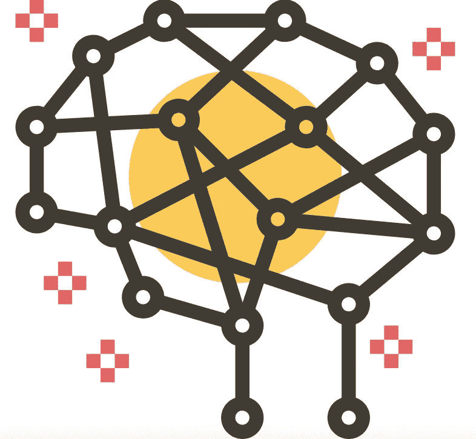
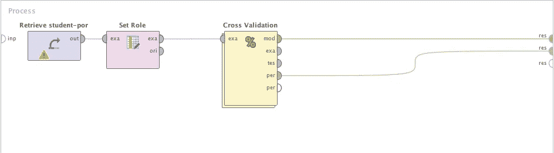
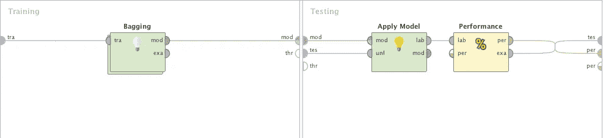
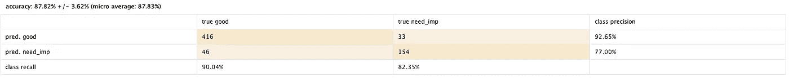
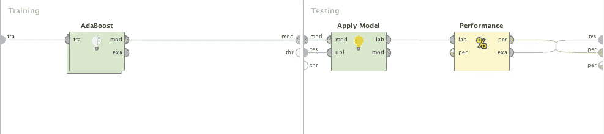
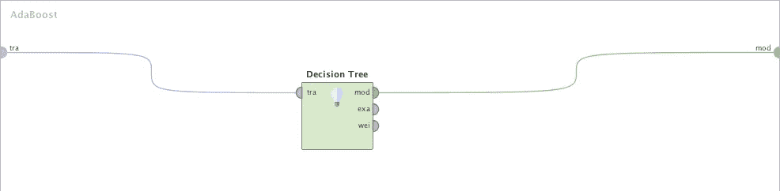
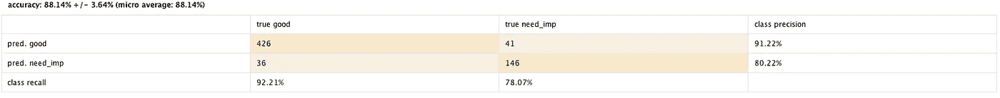
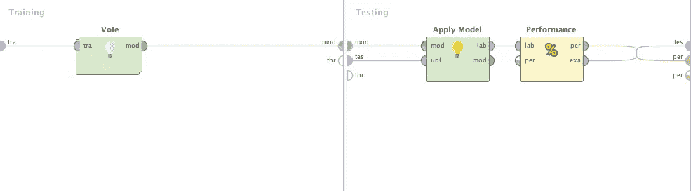
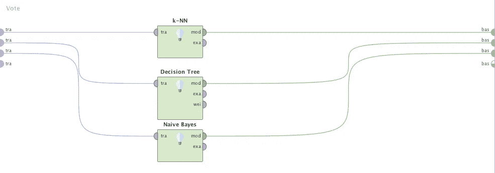
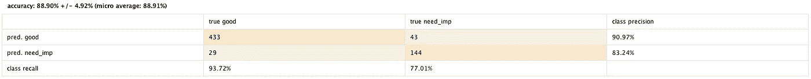

# 如何使用 rapid miner 创建集合模型

> 原文：<https://towardsdatascience.com/how-to-create-ensemble-models-using-rapid-miner-72a12160fa51?source=collection_archive---------6----------------------->

**什么是合奏模型？**

在训练阶段，我们可以使用特定的算法，从手头的数据中得到一个模型。但是，对于特定的数据集来说，这不会是最佳的模型，因为这只是一种算法，而且这种算法是一种弱算法。然后，您可能需要尝试不同的算法来获得优化的模型。相反，你可以尝试将几个可能的弱算法结合在一起，或者将同一算法的几个模型用于不同的数据集，并创建一个[集成](https://en.wikipedia.org/wiki/Ensemble_learning)模型。Bagging 和 boosting 使用一种算法，并使用同一数据集的不同样本创建几个模型，而 Voting 对同一数据集使用几个弱算法来创建集成模型。

**什么是 RapidMiner？**

[RapidMiner](https://rapidminer.com/data-mining-tools-try-rapidminer/) 是一款数据挖掘工具，可用于数据准备、建模、评估&部署。它提供了用它的操作符创建集合模型的灵活性。RapidMiner 使用 bagging，boosting &投票来创建集合模型。

**如何使用 bagging 创建集合模型？**

[Bagging](https://en.wikipedia.org/wiki/Bootstrap_aggregating) 是一个集成元算法，从一个算法创建 n 个学习器。数据集被随机采样并替换，以给定的比率创建 n 个数据集，并馈入 n 个分类器。由于完成了替换，相同数据元素可用于其他一些数据集中。一个数据元素出现在不同数据集中的概率对于所有元素都是相同的。对于分类，考虑来自 n 个分类器的多数投票的预测，对于回归，考虑 n 个分类器的预测的平均值。装袋基本上减少了方差和过度拟合。相关的 RapidMiner 流程如下所示。

The Bagging process

在“交叉验证”操作符中，我们在训练阶段使用“装袋”操作符，如下所示。

Inside Cross Validation sub process

在“装袋”中,“决策树”操作员用于培训，如下所示。您可以使用您想要的任何其他分类器。

Inside Bagging sub process

Confusion Matrix of Bagging algorithm

**如何使用 boosting 创建集合模型？**

[Boosting](https://en.wikipedia.org/wiki/Boosting_(machine_learning)) 是一种集成元算法，它从一个算法中依次创建 n 个学习器。数据集被随机抽样替换，并以给定的比例创建 n 个数据集。可能存在被给定学习者错误分类的数据点。所以这是错误的。当训练下一个学习者时，考虑前一个分类器的错误，并且对错误分类的数据元素给予新的权重，使得该数据元素更频繁地出现在新的数据集中。升压用于降低偏置。相关的 RapidMiner 流程被创建为装袋流程。

在“交叉验证”操作符中，我们在训练阶段使用“AdaBoost”操作符，如下所示。还有一些其他的提升算法，比如 RapidMiner 中的贝叶斯提升，你可以试试。

Inside Cross Validation sub process

在“装袋”中,“决策树”操作员用于培训，如下所示。您可以使用我前面提到的任何其他分类器。

Inside AdaBoost sub process

Confusion Matrix of Boosting algorithm

**我如何通过投票创建集合模型？**

不像在投票中的装袋和助推，几种算法可以结合在一起创建集成模型，正如我在本文开始时提到的。对于分类，所有分类器的多数投票作为预测给出，对于回归，所有分类器的平均值作为预测给出，如在 bagging 算法中。RapidMiner 流程与装袋流程相同。

在“交叉验证”操作符中，我们在训练阶段使用“投票”操作符，如下所示。

The Cross Validation sub process

在“投票”节点中，我使用了 K-NN、决策树和朴素贝叶斯分类器。

Inside Vote operator

Confusion Matrix of Voting process

除了使用一种弱算法，你还可以尝试一种集成算法，它可以做更精确的预测。集成算法的快乐模型训练。

**延伸阅读**

[1][https://quant dare . com/bagging-and-boosting 之间的区别是什么/](https://quantdare.com/what-is-the-difference-between-bagging-and-boosting/)

[2][https://www . quora . com/What-is-bias-in-machine-learning-algorithms](https://www.quora.com/What-is-bias-in-machine-learning-algorithms)