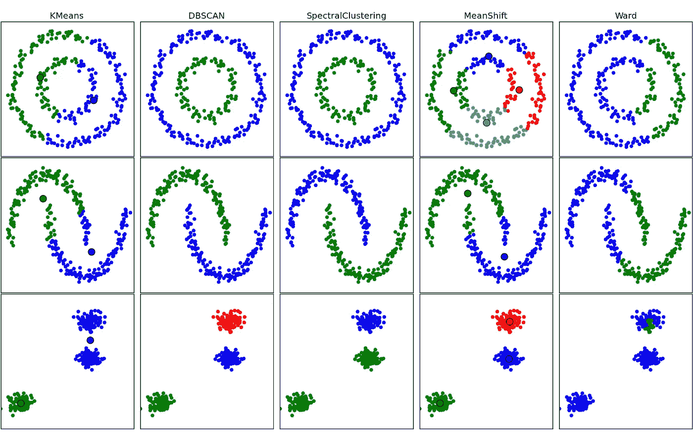
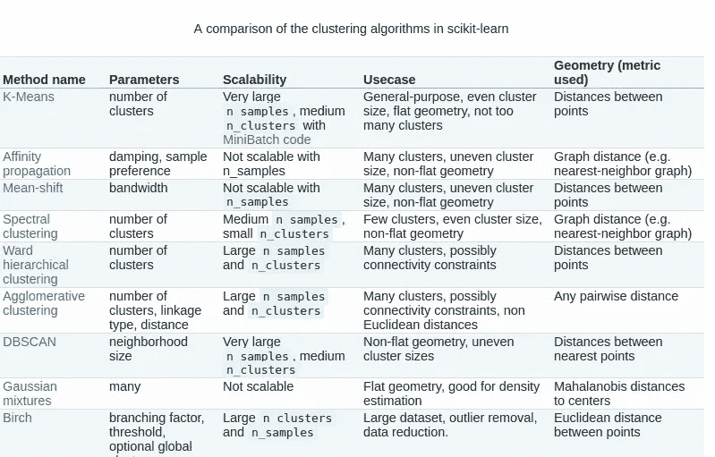
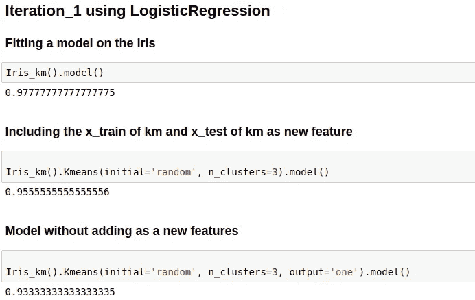
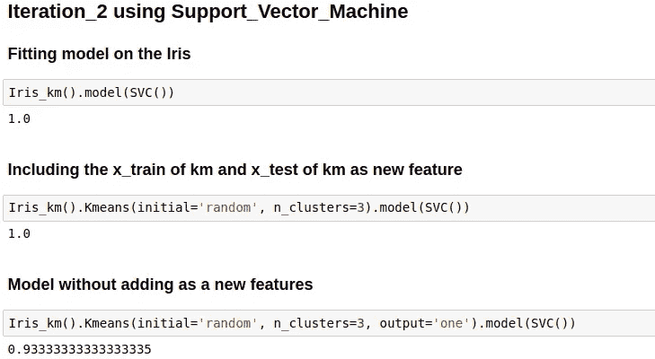

# 如何使用聚类创建新功能！！

> 原文：<https://towardsdatascience.com/how-to-create-new-features-using-clustering-4ae772387290?source=collection_archive---------1----------------------->

## 介绍

特征是一条可能对预测有用的信息。创造新特征的过程属于**特征工程。**特征工程**..**

聚类是一组定位或发生在一起的相似事物，聚类分析本身并不是一种特定的算法。一些例子是:

Formation of clusters by different algorithms

这可以通过各种算法来实现，这些算法在什么构成一个聚类以及如何有效地找到它们的概念上有很大不同。适当的聚类算法和参数设置取决于单个数据集和结果的预期用途。

现在让我们看看我如何在鸢尾数据集中使用 [**KMeans** 聚类](http://scikit-learn.org/stable/modules/clustering.html#k-means)来为那些不了解鸢尾数据集的人创建新的功能，这是关于鸢尾花及其物种的数据。

简而言之，数据集由 3 种不同类型的鸢尾(Setosa、Versicolour 和 Virginica)花瓣和萼片长度组成，行是样本，列是:萼片长度、萼片宽度、花瓣长度和花瓣宽度。有关 iris 的更多信息，请使用 [**Iris_Link1**](https://en.wikipedia.org/wiki/Iris_flower_data_set) 、[**Iris _ link 2**](http://scikit-learn.org/stable/auto_examples/datasets/plot_iris_dataset.html)**。**

有许多聚类模型和双聚类模型，KMeans 是一种聚类模型，它遵循一种简单而容易的方法将数据集分类为聚类。主要思想是定义 k 个质心，每个聚类一个，并迭代直到找到实际质心。

1.  *将 K 个点放入被聚类的对象所代表的空间中。这些点代表初始组质心。*
2.  *将每个对象分配到具有最近质心的组。*
3.  *当所有对象都被指定后，重新计算 K 个质心的位置。*
4.  *重复步骤 2 和 3，直到质心固定在最终中心。*

## **型号**

这里定义了一个类，通过使用 KMeans 聚类生成新的要素，并将其添加到数据集中以计算数据的性能。

## 结果

我们创建了实例来检查使用和不使用新的集群特性时的变化。

在这次迭代中，我们使用了 LogisticRegression，我们可以清楚地看到步骤 1 的性能比步骤 2 好，在步骤 2 中添加集群的新功能并没有起到什么作用。

步骤 3:如果我们只为我们的训练数据选择标签，这将进一步降低我们的模型性能。

在我们的第二次迭代中，我们使用支持向量机

*   在这里，考虑到 Kmeans 特性，模型在原始数据集上的表现与我们的 Support_Vector_machine 相同。
*   即使在这种情况下，如果我们尝试为我们的训练数据使用标签，也会进一步降低我们的模型性能。

## 结论

当标签用于训练时，它不会给我们的模型增加价值，相反，将它们作为一个特征添加可以在模型的性能方面帮助我们一点。

一定要尝试这种聚类技术，将新特性添加到您的模型中，看看它的表现如何。