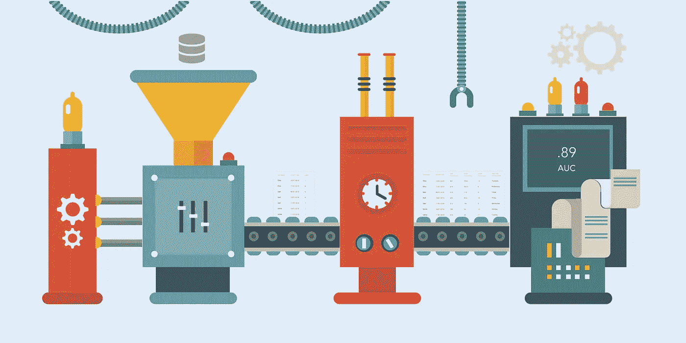
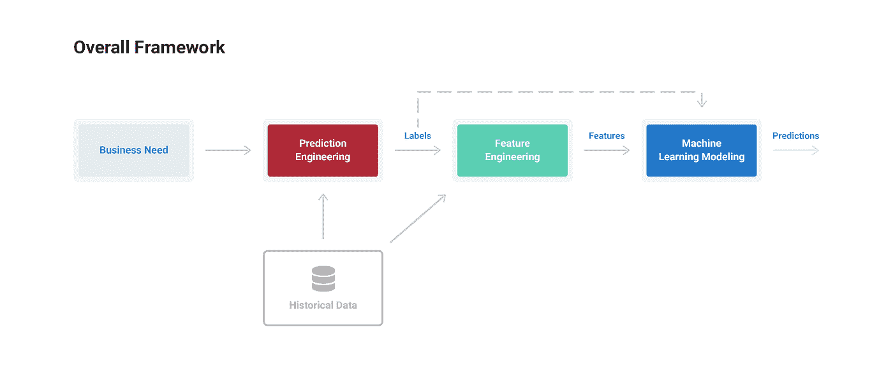
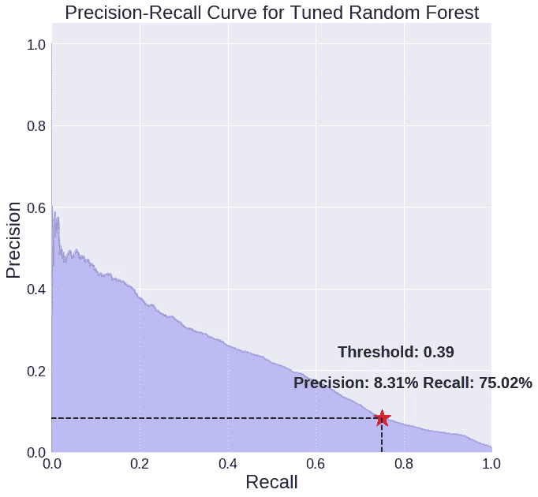

# 如何用机器学习创造价值

> 原文：<https://towardsdatascience.com/how-to-create-value-with-machine-learning-eb09585b332e?source=collection_archive---------7----------------------->

## 用 3 个步骤定义和解决有意义问题的通用框架

想象以下场景:你的老板要求你建立一个机器学习模型，以预测每个月你的订阅服务的哪些客户将在该月流失，流失定义为超过 31 天没有活跃会员。你通过寻找客户流失的历史例子来煞费苦心地制作标签，通过头脑风暴和手工设计特征，然后训练和手动调整机器学习模型来进行预测。

对抵制测试集的指标感到满意，你带着结果去见你的老板，却被告知现在你必须开发一个*不同的*解决方案:每两周进行一次预测，流失率定义为 14 天不活动。沮丧的是，你意识到你以前的工作都不能被重用，因为它是为一个单一的预测问题设计的。

您为客户流失的狭义定义编写了一个标签函数，并且管道中的下游步骤(特征工程和建模)也依赖于初始参数，因此必须重做。由于硬编码一组特定的值，你将不得不建立一个完全*的新管道*来解决问题定义中仅有的一个小的*变化。*

## 构建机器学习过程

这种情况表明了目前解决机器学习问题的方法。该过程是*特定的*，即使使用相同的数据，也需要针对每个参数设置的*定制解决方案*。结果是公司错过了机器学习的全部好处，因为它们局限于用时间密集型方法解决少量问题。

> 缺乏 ***标准化方法*** 意味着没有可以快速调整和部署为问题变化参数的解决机器学习问题的脚手架。

我们如何改进这一过程？让机器学习变得更容易实现需要一个通用的框架来设置和解决问题。这个框架应该*适应现有的工具*，快速*适应变化的参数*，*适用于不同的行业*，并提供*足够的结构*给数据科学家一条清晰的道路，以规划和解决机器学习的有意义的问题。

在[功能实验室](https://www.featurelabs.com)，我们对这个问题进行了大量思考，并开发了我们认为解决机器学习有用问题的更好方法。在本系列的接下来三个部分中，我将展示我们如何围绕*预测工程*、*特征工程*和*建模*的步骤，以结构化、可重复的方式构建机器学习解决方案。

我们将把该方法完整地应用于一个用例——预测客户流失——并看看如果问题的参数发生变化，我们如何调整解决方案。此外，我们将能够利用现有的工具——[Pandas](http://pandas.pydata.org/)、 [Scikit-Learn](http://scikit-learn.org/) 、[feature tools](https://www.featuretools.com/)——通常用于机器学习。

通用机器学习框架概述如下:

1.  **预测工程:**陈述业务需求，转化为机器学习问题，并从数据集生成带标签的示例
2.  **特征工程:**从每个标签的原始数据中提取预测变量——特征
3.  **建模:**在特性上训练机器学习模型，针对业务需求进行调整，并在部署到新数据之前验证预测

*A general-purpose framework for defining and solving meaningful problems with machine learning*

我们将介绍每个步骤的基础知识，以及如何用代码实现它们。完整的项目可以在 GitHub 的 [Jupyter 笔记本上获得。(完全披露:我在 Feature Labs 工作，这是一家开发工具的初创公司，包括](https://github.com/Featuretools/predicting-customer-churn) [Featuretools](https://github.com/Featuretools/featuretools) ，用于解决机器学习的问题。这里记录的所有工作都是用开源工具和数据完成的。)

整套文章是:

1.  概述:通用机器学习框架(本文)
2.  [预测工程:如何设置你的机器学习问题](/prediction-engineering-how-to-set-up-your-machine-learning-problem-b3b8f622683b)
3.  [特征工程:机器学习的动力是什么](https://medium.com/@williamkoehrsen/feature-engineering-what-powers-machine-learning-93ab191bcc2d)
4.  [建模:教授算法进行预测](https://medium.com/@williamkoehrsen/modeling-teaching-a-machine-learning-algorithm-to-deliver-business-value-ad0205ca4c86)

虽然这个项目只讨论了一个应用，但同样的过程可以应用于各个行业，以构建有用的机器学习解决方案。最终的交付成果是一个框架，你可以用它来解决任何领域的机器学习问题，以及一个可以直接应用于你自己的客户流失数据集的特定解决方案。

# 商业动机:确保你解决了正确的问题

最复杂的机器学习管道不会有任何影响，除非它为公司创造价值。因此，构建机器学习任务的第一步是理解业务需求，以便您可以确定要解决的正确问题。在整个系列中，我们将解决解决*客户流失*的常见问题。

对于基于订阅的商业模式来说，预测哪些客户会流失——在一段特定的时间内停止支付服务费用——是至关重要的。准确预测客户是否会流失以及何时会流失，有助于企业与那些面临退订风险的客户进行接触，或者向他们提供优惠费率，以激励他们继续订购。一个有效的客户流失预测模型可以让一家公司*主动*发展客户群。

对于客户流失问题，业务需求是:

> 通过降低客户流失率来增加付费用户的数量。

减少客户流失的传统方法需要使用[生存分析技术](/survival-analysis-in-python-a-model-for-customer-churn-e737c5242822)预测哪些客户会流失，但是，考虑到丰富的历史客户行为数据，这提供了[监督机器学习的理想应用](https://www.sciencedirect.com/science/article/pii/S1569190X15000386)。

> 我们可以通过建立一个监督算法来解决机器学习的业务问题，该算法从过去的数据中学习，以预测客户流失。

陈述业务目标，并用机器学习可解决的任务来表达它，是管道中关键的第一步。一旦我们知道我们希望模型预测什么，我们就可以继续使用可用的数据来开发和解决有监督的机器学习问题。

# 后续步骤

在接下来的三篇文章中，我们将应用预测工程、特征工程和建模框架来解决来自亚洲最大的订阅音乐流媒体服务 [KKBOX](https://www.kkbox.com/intl/index.php?area=intl) 的[数据集](https://www.kaggle.com/c/kkbox-churn-prediction-challenge/data)上的客户流失问题。

寻找以下帖子(或查看 [GitHub 库](https://github.com/Featuretools/predicting-customer-churn)):

1.  [预测工程:如何设置你的机器学习问题](https://medium.com/@williamkoehrsen/prediction-engineering-how-to-set-up-your-machine-learning-problem-b3b8f622683b)
2.  [特征工程:机器学习的动力](https://medium.com/@williamkoehrsen/feature-engineering-what-powers-machine-learning-93ab191bcc2d)
3.  建模:训练算法进行预测(即将推出)

我们将看到如何用现有的数据科学工具填充细节，以及如何在不重写完整管道的情况下改变预测问题。最终，我们将拥有一个预测客户流失的有效模型，该模型经过调整可以满足业务需求。

Precision-recall curve for model tuned to business need.

通过这些文章，我们将看到一种机器学习的方法，这种方法让我们能够快速构建多种预测问题的解决方案。下一次你的老板改变问题参数时，你只需修改几行代码就能有一个新的解决方案。

如果构建有意义的高性能预测模型是您关心的事情，那么请联系我们的[功能实验室](https://www.featurelabs.com/contact/)。虽然这个项目是用[开源特性工具](https://github.com/Featuretools)完成的，但是[商业产品](https://www.featurelabs.com/product)为创建机器学习解决方案提供了额外的工具和支持。