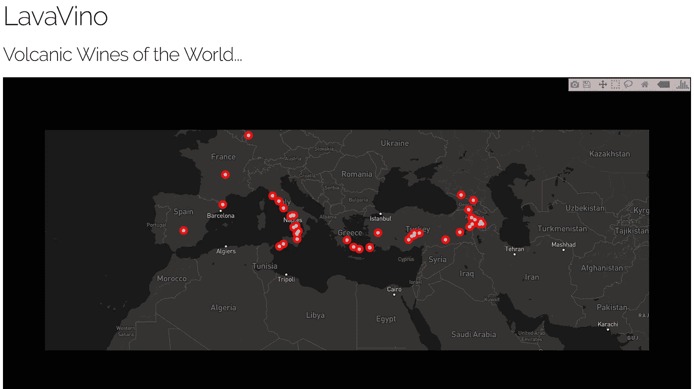
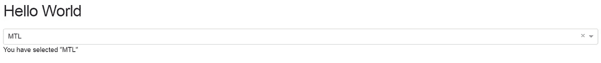
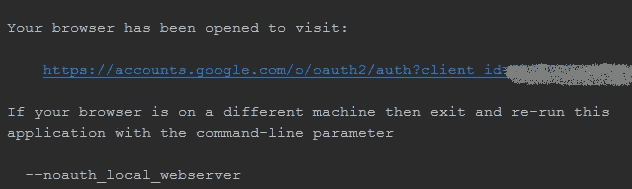
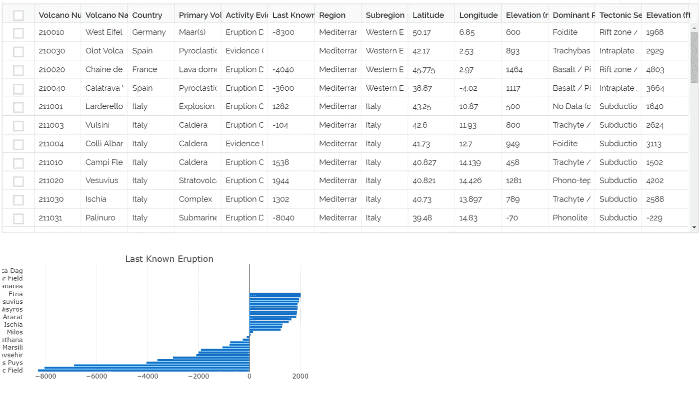

# 如何使用 Python、Plotly Dash 和 Google Sheets API 创建您的第一个 web 应用程序

> 原文：<https://towardsdatascience.com/how-to-create-your-first-web-app-using-python-plotly-dash-and-google-sheets-api-7a2fe3f5d256?source=collection_archive---------2----------------------->



The final product from this step-by-step guide to developing web dashboards using Plotly Dash, Python and Google Sheets API

**更新 09/21/2018:** 下面教程第一部分创建的 app 现在[在这个 Github 仓库](https://github.com/dcbark01/DashAppTemplate)中可用。虽然在功能方面进行了简化，但是将那里的代码与这里的教程结合起来，应该可以让您立即开始使用 Dash。
— — — — — — — —

我最近写了几个简短的教程，讲述如何使用 Plotly 的人提供的令人敬畏的“Dash”Python 库来创建 web 应用程序。该库对于数据科学项目(或任何项目)的快速原型开发的力量是不可低估的。

然而，默认情况下，Dash 应用程序只能在本地机器上运行。显然，任何 web 应用程序的主要好处是能够与受众分享。幸运的是，Dash 库是建立在非常流行的“Flask”库之上的，Dash 应用程序可以部署为以同样的方式提供内容。我们将利用通过使用 [Heroku](http://www.heroku.com) 获得的简单部署过程，而不是从头开始配置服务器。一旦我们有了一些在 Heroku 上运行的示例代码，我们将更新应用程序，通过 Python API 从 Google Docs 电子表格中访问数据。

**步骤 1:创建和设置虚拟环境**

使用您最喜欢的虚拟环境，创建一个新的环境来存放应用程序。使用 Anaconda，我们只需输入:

```
$ conda create --name <your env name> python=3.6
```

创建环境后，在命令提示符下激活它(根据您的操作系统，您可能不需要在前面加上“source”)，然后创建一个文件夹，我们将在后续步骤中使用它来存放所有各种应用程序文件。

```
$ source activate <your env name>
$ mkdir venv
$ cd venv
```

现在，安装应用程序所需的依赖项。

```
$ pip install dash
$ pip install dash-renderer
$ pip install dash-core-components
$ pip install dash-html-components
$ pip install plotly
$ pip install dash-table-experiments 
$ pip install numpy
$ pip install pandas
$ pip install gunicorn
$ pip install --upgrade google-api-python-client$ pip install numpy
$ pip install pandas
$ pip install gunicorn
```

验证您是否在先前为项目创建的“venv”目录中。在此初始化一个空的 git 存储库。

```
$ git init
```

**步骤 2:创建文件结构和初始 app 文件**

与简单地在本地机器上运行相比，在 Heroku 上部署一个网站需要一些额外的文件和文件夹。为了确保事情顺利进行，我们需要根据以下结构创建几个文件:

```
venv/
   app.py
   .gitignore
   .Procfile
   .requirements.txt
   credentials/
      __init__.py
      Credentials.py
```

在之前创建的“venv”文件夹中，创建一个名为“app.py”的新文件。我们可以使用这里的代码([链接到原始源代码](https://dash.plot.ly/deployment))进行初始测试。

现在，创建一个“credentials”文件夹，并在该文件夹中创建两个文件，“__init__”。py”和“Credentials.py”。__init__ 文件只是让 Python 知道我们希望这个文件夹是一个可导入的模块——我们可以将文件本身留空。第二个文件是我们用来存储访问 Google 工作表数据的 Google API 键的地方，但是我们稍后会更新这些键。

***重要提示:**在将代码上传到任何公共 Git 存储库之前，请确保更新 gitignore 文件以排除 credentials 文件夹！

在“venv”文件夹中，创建。gitignore 文件(我喜欢用 [gitignore.io](https://www.gitignore.io/) 作为启动模板)。

```
# At a minimum, make sure .gitignore file contains these items
*.pyc
.DS_Store
.env
```

接下来，同样在“venv”文件夹中，创建一个名为“Procfile”的文件，其内容如下:

```
web: gunicorn app:server
```

最后，我们需要在“requirements.txt”文件中创建一个项目依赖关系列表。只需在提示符下键入以下命令，即可轻松生成该列表:

```
$ pip freeze > requirements.txt
```

**第三步:将测试应用部署到 Heroku**

对于这一步，您需要在您的机器上安装一个 Heroku 帐户和命令行提示符([参见 Heroku 帐户设置的链接](https://devcenter.heroku.com/articles/heroku-cli))。

```
$ heroku create lava-vino # replace "lava-vino" with your-app-name
$ git add . 
$ git commit -m "Initial commit"
$ git push heroku master 
$ heroku ps:scale web=1
```

验证该应用程序在[https://lava-vino.herokuapp.com/](https://lava-vino.herokuapp.com/)(或您的应用程序的等效名称)上可见。



The test app shows up in the browser — Success!

**第五步:更新应用程序，从 Google API 中提取数据，并将数据可视化**

[在之前的教程](https://medium.com/@daniel_c_barker/how-to-access-google-sheet-data-using-the-python-api-and-convert-to-pandas-dataframe-5ec020564f0e)中，我解释了如何使用 Google 的 Python API 访问 Google 工作表数据。为了可视化该教程中提到的火山葡萄酒数据集，我们需要更新我们的应用程序，并提供适当的 Google API 凭证。稍微修改一下该教程中描述的步骤，将“client_secret.json”文件复制到我们在上一步中创建的“credentials”文件夹中。此外，您需要用您的地图框 ID 令牌更新“Credentials.py”文件。

**重要提示:**在将代码上传到任何公共 Git 存储库之前，一定要更新 gitignore 文件，以排除 credentials 文件夹！

接下来，用下面的代码更新‘app . py’文件(确保包含您自己的 Mapbox ID 标记，和/或更新 Google 工作表名称、ID 和数据解析方法以适应您自己的数据集)。

我们几乎准备好将更新的应用程序部署到 Heroku，但是首先，我们需要在本地机器上运行应用程序，以便生成 Google API 凭证文件。继续在本地计算机上运行“app.py”文件；您应该会收到一条警告，提示您访问一个链接，以使用您的 Google 帐户验证您的应用程序。单击链接进行身份验证—如果成功，您现在应该在 credentials 文件夹中有一个新的“credentials.json”文件。



After running the app on your local machine, click the link to authenticate access request for the Google API

生成凭证文件后，您就可以使用以下命令将更新后的应用程序部署到 Heroku 了:

```
$ git status # view the changes
$ git add .  # add all the changes
$ git commit -m "Updated app"
$ git push heroku master
```

关键时刻……导航到[https://lava-vino.herokuapp.com/](https://lava-vino.herokuapp.com/)(或者你的应用程序名称的网址，祈祷成功吧！我们的 web 应用程序已成功部署到世界各地！



如您所见，创建 Dash 应用程序并通过 Heroku 进行部署相对简单，而且所有这些都无需编写任何 HTML、Javascript 或 CSS 代码。显然，这个应用程序还有很多工作要做——交叉引用葡萄酒名称数据、可视化数据、创建友好的用户界面等。我们将在以后的教程中讨论这些内容。我还将尝试上传一个项目的精简版本到它自己的 Git 存储库中，这样它就可以很容易地被克隆为一个模板。与此同时，希望这能让你开始运行自己的 Dash 应用程序！