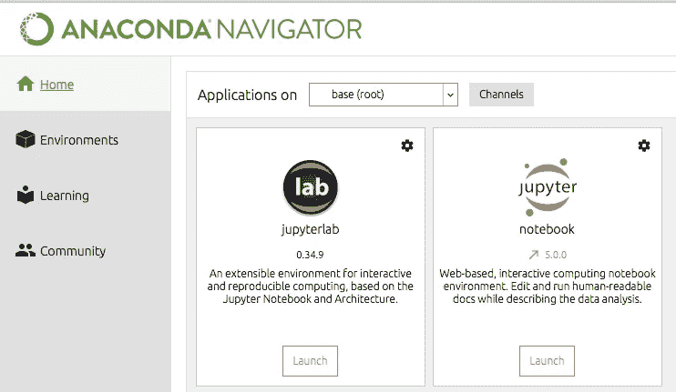
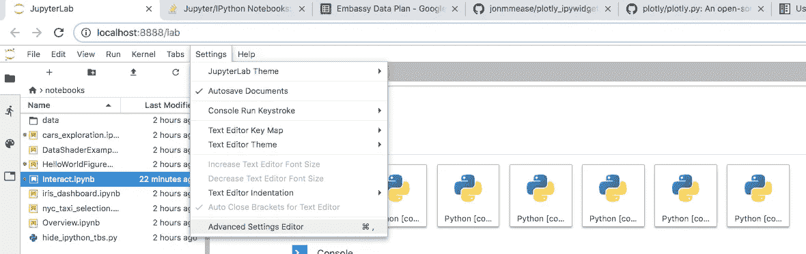
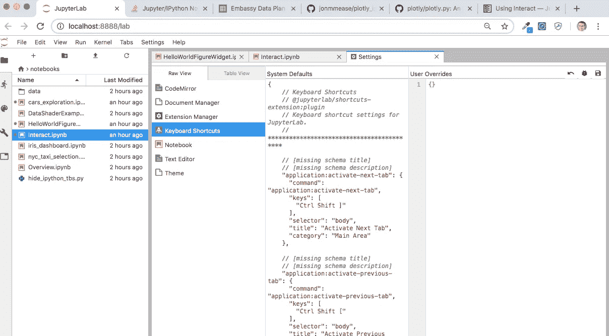
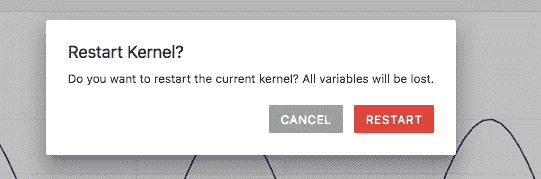

# 如何自定义 JupyterLab 键盘快捷键

> 原文：<https://towardsdatascience.com/how-to-customize-jupyterlab-keyboard-shortcuts-72321f73753d?source=collection_archive---------5----------------------->


我经常发现自己想要重新启动并运行所有单元格，所以我想制作一个键盘快捷键。我制作这个教程是为了帮助其他人，因为它不是一个点击选择的东西

JupyterLab 就像合成代谢类固醇的 Jupyter notebook 没有增加的癌症风险和其他负面副作用。JupyterLab 被宣传为 Jupyter 项目的下一代 UI。2018 年初 [beta](https://blog.jupyter.org/jupyterlab-is-ready-for-users-5a6f039b8906) 发布。

有趣的事实是，Jupyter 人把 JupyterLab 写成一个单词，而 Jupyter notebook 写成两个单词😃。

这感觉就像使用您熟悉的 Jupyter 笔记本电脑，并增加了导航标签等功能。这是未来——它就在眼前。

如果你和我一样，你可能看过巨蟒之灾中的 JupyterLab，但却一直保存着你的 Jupyter 笔记本。试试看。它可以帮助你提高工作效率。说到生产力，我们来做一个键盘快捷键。🚀

# 正在做

用`conda install -c conda-forge jupyterlab`或`pip install jupyterlab`安装。然后在终端中用`jupyterlab` 运行 JupyterLab，或者在 Anaconda Navigator 中选择应用程序图标。



JupterLab 打开后，点击*设置*下拉菜单。选择*高级设置编辑器*。



选择*键盘快捷键*。



您将在*系统默认设置*面板中看到每个选项的字典。有一大堆选项，所以你可能想用*Command+F(Windows 上的 Ctrl + F* 来找到你想要的那个。复制您想要覆盖的代码。

这里是*重启并运行全部*的部分。

```
{
  "command": "runmenu:restart-and-run-all",
  "keys": [
        ""
   ],
   "selector": "[data-jp-code-runner]"
},
```

将此代码粘贴到*用户首选项*面板中。在*键*列表中，输入您想要成为快捷键的键的名称。我在下面加了 *Ctrl* 和 *Shift* 和 *R* 。

***更新 2020 年 6 月 24 日，沙希达在评论中指出，JupyterLab 更改了用于更改键盘快捷键的 API。下面的代码已更新。谢谢沙希达！***

```
{"shortcuts": 
    [
        {
            "command": "runmenu:restart-and-run-all",
            "keys": [
                "Ctrl Shift R"
            ],
            "selector": "[data-jp-code-runner]"
        }
    ]
}
```

我建议通过在*系统默认面板*中搜索您的新组合键来确保您没有覆盖另一个 JupyterLab 键盘快捷键。

现在你知道了。按下*Command+S*(Windows 上为 *Ctrl* + *S* )保存，打开笔记本文件，试用你的新键盘快捷键！

# 全部运行！



真见鬼。

您刚刚学习了如何通过在 JupyterLab 中制作键盘快捷键来节省时间。请注意，这将在 Jupyter 实验室的编辑模式或命令模式下运行。

有些命令不会出现在*系统默认设置*面板中。这里列出了可以绑定的[命令](https://github.com/jupyterlab/jupyterlab/issues/5371)。

尝试和享受！

# 包装

我希望这篇自定义 JupyterLab 快捷方式的指南对你有所帮助。如果你有，请在你最喜欢的社交媒体上分享，这样其他人也可以找到它。😀

我写关于 [Python](https://memorablepython.com) 、 [SQL](https://memorablesql.com) 和其他技术主题的文章。如果你对这些感兴趣，请注册我的[邮件列表，那里有很棒的数据科学资源](https://dataawesome.com)，点击这里阅读更多帮助你提高技能的内容。👍

[](https://dataawesome.com)