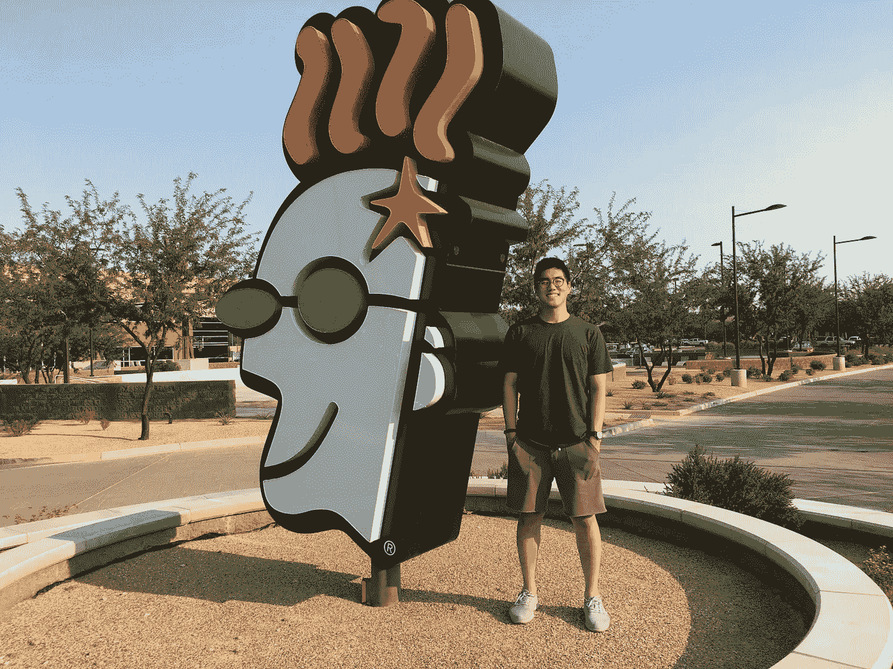
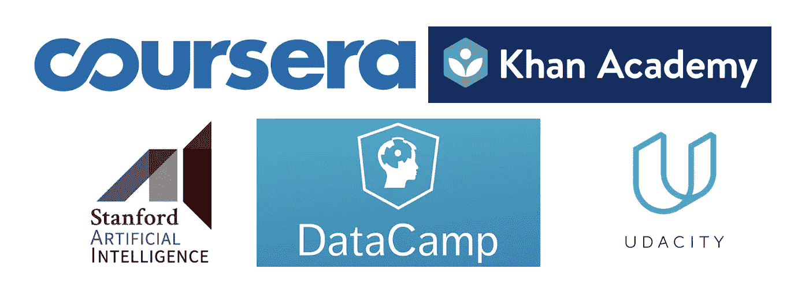

# 没有学位如何学习数据科学

> 原文：<https://towardsdatascience.com/how-to-data-science-without-a-degree-79d8388a49ba?source=collection_archive---------5----------------------->

## 一位数据科学家的想法和建议

Me at GoDaddy office

# **简介**

你好。

我想向你展示如何成为一名没有学位(或免费)的数据科学家。具有讽刺意味的是，我有一个学位——甚至是为数据科学而设的学位([西北大学](https://www.mccormick.northwestern.edu/analytics/)的分析学硕士)。但是给你一点背景，我以前是德勤的会计。这不是很疯狂吗？我远离数据科学或任何技术。由于我来自一个非技术背景的家庭，我不得不在工作之余，甚至在我的硕士课程期间，自己在网上学习很多东西，以赶上我的同龄人的水平。亲身经历过，我可以告诉你，学历很有帮助，但不是必须的。因为我一直站在获得学位和在线学习的两边，我想我可以给你一个独特的视角。获得数据科学硕士学位是进入该领域的一种可靠而快速的方式，但幸运的是，如果你不想花 6-9 万美元的学费，你不必这样做。不过，这需要你高度的自律。

如果有朋友问我如何进入数据科学领域，这篇文章就是为他们准备的。我希望你能发现我的建议是有价值的和相关的，因为我自己也经历过这个过程，并且发现这些资源是有用的。在我们进入细节之前，让我们先了解一下数据科学是什么。

# **作为一名数据科学家，您从事什么工作？**

如果你已经知道这一点，请跳过这一部分。

嗯，根据我在 GoDaddy，HERE 和 GoGo 等几家公司担任数据科学家的经验，数据科学家通过对大数据应用机器学习来解决问题。一些例子是:预测客户取消订阅的概率，识别数据异常，计算千兆字节或兆兆字节数据的即席分析，将客户分组为有意义的组，文本分析以在客户聊天记录中找到主题，计算收入预测，并且列表不会结束。

作为一名数据科学家，你会遇到许多不同类型的问题。要想胜任，你需要有扎实的数学、统计和编程基础。您需要知道何时根据问题和数据使用特定的技术和算法。最后，您通常需要将结果和技术展示给高管和不太懂技术的观众。

此外，作为一名数据科学家，你需要继续学习和适应。因为这个领域变化很快，所以跟上时代和学习新技术很重要。即使是今天，我也花很多时间学习。

# 成为数据科学家需要什么(免费)

Free online resources

数据科学家的工作听起来让你兴奋吗？太好了。这是一个活着免费学习的好时机。我试图专注于免费或便宜的选择，因为谁不喜欢免费的东西？它只需要你的承诺和毅力。我将分三个阶段描述这个过程。

请记住，除了下面提到的，还有其他很好的资源。但这些恰好是我拍的，觉得有用。

# 第一阶段:婴儿期

为了擅长数据科学，你需要有良好的编程、统计和数学基础。至少，我建议您学习以下内容:

*   大学水平的介绍**计算机科学**课程(对我来说是 C++)。
*   大学级别的低年级数学课程，如**多变量微积分、微分方程、线性代数**。这将直接影响你对深度学习底层数学的理解，比如反向传播和矩阵运算。
*   大学水平的统计**介绍**和**概率**教你 r

好消息是他们不必在大学里参加。要在线学习我上面提到的技能，我推荐这些:

*   数学:**多变量微积分、微分方程、** [**线性代数**](https://www.khanacademy.org/math/linear-algebra) **出自** [**可汗学院**](https://www.khanacademy.org) **。**
*   统计学:**R 中的统计学与数据科学导论:** [**约翰霍普金斯大学 Coursera 上的数据科学专业**](https://www.coursera.org/specializations/jhu-data-science) **。**
*   Python:**[**CodeAcademy.com**](http://CodeAcademy.com)**为 Python 中的一般编程。****

**要查看数据科学可以做什么的示例，请查看 Kaggle.com 的**，在那里人们学习和竞争数据科学项目。另外，看看 DataCamp.com 的**，它提供了用 R 和 Python 编写的各种数据科学主题的实践教程。******

******到第 1 阶段结束时，您应该能够熟练地在 R 或 Python 上执行简单的机器学习技术，如逻辑/线性回归和决策树。另外，我建议同时学习 R 和 Python。尽管我最近主要使用 Python，但根据您试图解决的问题，了解这两者是很有用的。******

# ******第二阶段:青春期******

******现在，您应该对数据科学和统计方法有了更好的了解。在第二阶段，你想更深入，专注于机器学习。我发现像 [**Coursera**](http://Coursera.com) 这样的在线资源通常不会涵盖大学水平的课程。谢天谢地， [**斯坦福的人工智能实验室**](http://ai.stanford.edu/courses/) 免费在线提供令人惊叹的课程。所以你可以免费观看世界一流的讲座、课堂笔记和许多其他课程材料。所以如果可以的话，我建议你参加 Coursera 课程，同时观看斯坦福大学的讲座。例如，Coursera 上的[**deep learning . ai**](https://www.deeplearning.ai)向你展示了深度学习非常好和实用的一面，而斯坦福的**cs 231n 计算机视觉**课程要深入得多。******

****在此阶段，采取以下措施:****

*   ****机器学习:[**吴恩达在 Coursera 上的机器学习课程**](https://www.coursera.org/learn/machine-learning) 。我参加了这次考试，但没有支付认证费用，因为我的作业没有使用 python 或 r。但这对理解机器学习的基础仍然非常有用。****
*   ****机器学习: [**斯坦福 CS229 机器学习课程**](https://www.youtube.com/view_play_list?p=A89DCFA6ADACE599) **。这些是吴恩达的旧演讲视频，但仍然很好。******
*   ****文本分析: [**在 Coursera**](https://www.coursera.org/learn/python-text-mining) 上应用 Python 中的文本挖掘。我没有上过这个课程，但是文本分析和自然语言处理(NLP)是一个数据科学家非常普遍和需要的技能。****
*   ****PySpark: [**DataCamp 的 PySpark 课程简介**](https://www.datacamp.com/courses/introduction-to-pyspark) 。Pyspark 是 spark 分布式计算框架的 python 版本。简单地说，它允许你在非常大的数据上使用 python。我每周都用它。****
*   ****深度学习:[**吴恩达 Coursera 上的 deep Learning . ai**](https://www.deeplearning.ai)**。**我付费认证是因为这门课的作业很好。因为它很实惠，所以我建议你付钱。****
*   ****计算机视觉: [**斯坦福 CS231n 卷积神经网络视觉识别教程**](http://vision.stanford.edu/teaching/cs231n/) **。******
*   ****自然语言处理:[**斯坦福 CS224n 自然语言处理与深度学习课程**](https://web.stanford.edu/class/cs224n/) **。******
*   *****(2019–10–01 更新)* PyTorch 与实用深度学习:**[**fast . ai**](https://fast.ai)。我听说了很多关于这个免费课程的好消息，PyTorch 也越来越受欢迎。我打算亲自去看看这门课。******

****同样，还有其他资源，如 DataCamp、Udacity、edX 和 fast.ai，您可以查看以了解各种主题。****

# ****第三阶段:独立****

****在这个阶段，你应该为面试做准备，并继续学习新的和更深入的话题。如果你已经掌握了材料，直到第二阶段，我认为你应该有足够的知识来申请一份入门级的工作。然而，还有几件事对你通过面试很关键。****

****第一，个人项目。如果你在一个数据科学项目中，大多数课程都会让你完成机器学习项目，这对练习你的技能和向雇主展示你所做的事情非常好。所以我真的建议你尝试一些个人项目，最简单的就是 Kaggle。另外，尽管没有必要，我还是建议你在 Github 上放一些你已经完成的示例代码和项目，给未来的雇主看看。****

****第二，你很可能会被面试 SQL。当我开始在 GoDaddy 工作时，我并不太了解 SQL。当我在面试的时候，我只是通过谷歌 SQL 面试问题了解了一点关于 W3Schools.com 的知识。即使要看公司，SQL 也没有你的机器学习和编程技能重要。在工作中学习相对容易。去 Leetcode.com[看看，练习你的 SQL 和编程技能。](http://Leetcode.com)****

****最后，到这个阶段，你应该有足够的知识来探索不同的机器学习主题，并进行更深入的学习。你可以关注任何你感兴趣的话题，无论是 RNN、CNN、NLP 还是其他。我呢，这几天在努力学习强化学习。****

# ****结论****

****这是我的第一篇文章，我真的希望你会觉得有用。我试图把重点放在你应该学习的特定课程上，而不是你需要学习的特定工具或 Python/R 包，因为这些课程会教你这些东西。****

****如果你想看机器学习的示例代码，请查看我的 [Github 知识库](https://github.com/jasjung/Machine_Learning)，我会不断更新我学到的新东西。我计划分享更多我正在做的不同项目或任何其他关于媒体的想法！如果你有任何问题，或者希望我在未来报道任何具体的事情，请在下面的评论中提问。****

****感谢您的阅读！****

*****(* [*)领英*](https://www.linkedin.com/in/jasjung/) *，* [*推特*](https://twitter.com/jasjung_) *)*****

****你可以看看我的其他文章和项目！****

*   ****和我聊天:[https://calendly.com/jasjung/30min](https://calendly.com/jasjung/30min)****
*   ****中型:为什么有这么多不同类型的数据科学家？ [**机器学习工程师 vs 数据科学家(数据科学结束了吗？**)](/mlevsds-3c89425baabb)****
*   ****中:好奇成为数据科学家后会发生什么？查看我的新文章， [**如何作为一名数据/研究科学家保持最新状态**](/how-to-stay-up-to-date-as-a-data-research-scientist-3846ef6b1739) 。****
*   ****项目:我最新的项目 [**www。薪.忍者**](https://salary.ninja) 及对应文章 [**欢迎来到薪忍者**](https://medium.com/salary-ninja/welcome-to-salary-ninja-e87f275863d6) 。****
*   ****Youtube:我的程序( **AlphaBlitz** )使用深度学习击败了脸书的文字游戏。喜欢并订阅！:)****
*   ****Medium **:** [**我如何在 5 周内用 Django 构建并部署我的第一个 Web 应用**](https://medium.com/better-programming/how-i-built-and-deployed-my-first-web-application-with-django-in-5-weeks-e9728480a8dd) 。****
*   ****中型: [**我如何用我的前四篇中型文章**](https://medium.com/@jasjung/how-i-made-over-2000-with-my-first-four-medium-articles-193b2ba184c3?source=user_profile---------0-------------------------------) 赚了 2000 多美元。****
*   ****中等: [**四年内做过软件工程师、机器学习工程师、数据科学家。这些是我的主要收获。**](/i-worked-as-a-software-engineer-machine-learning-engineer-and-data-scientist-within-four-years-a4afa19545ca?source=user_profile---------0-------------------------------)****