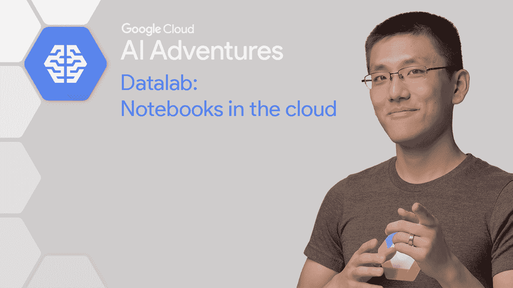
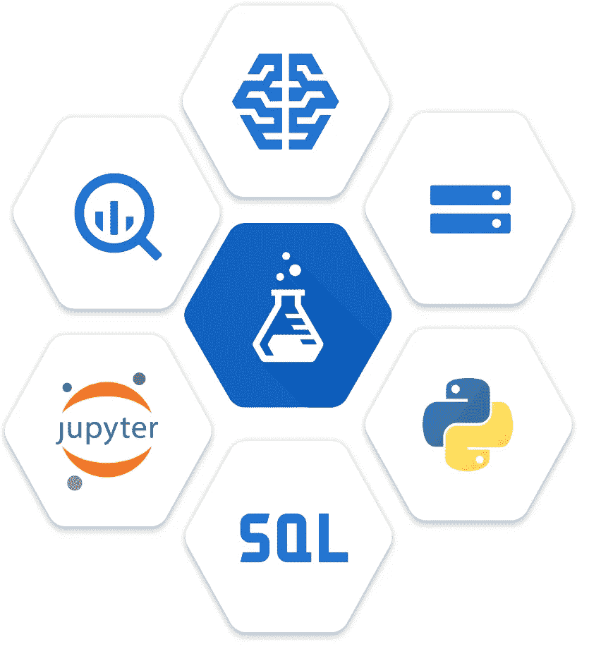
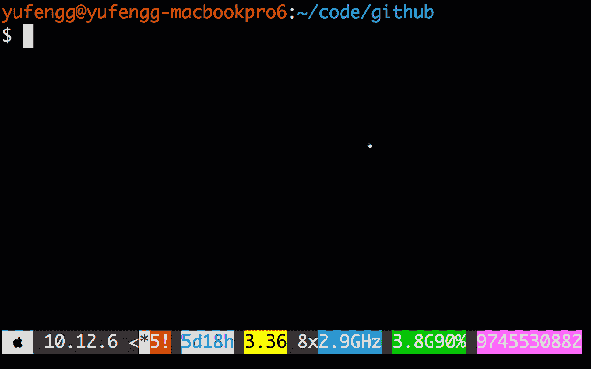
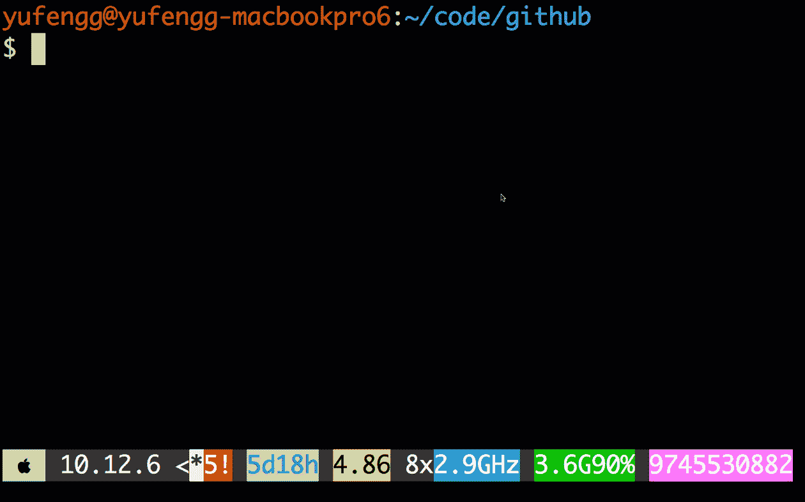
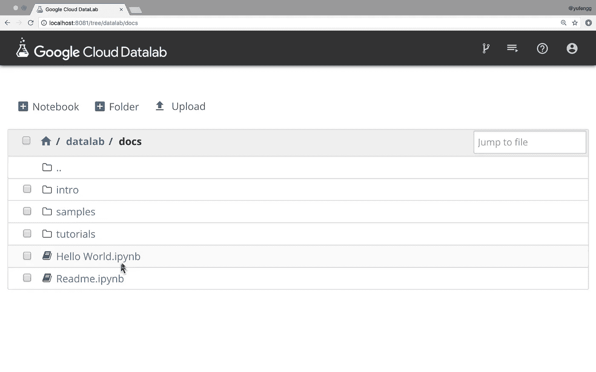
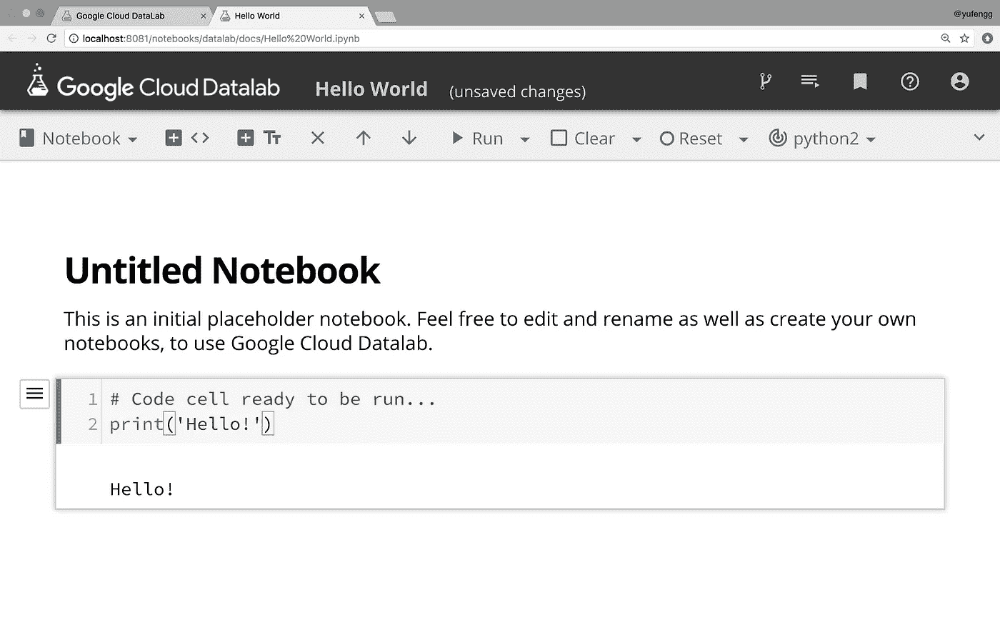
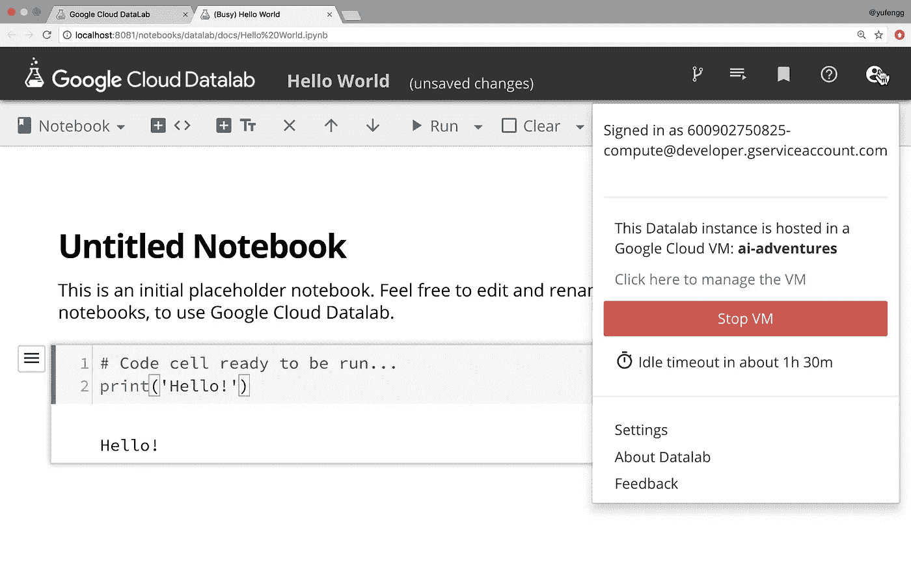
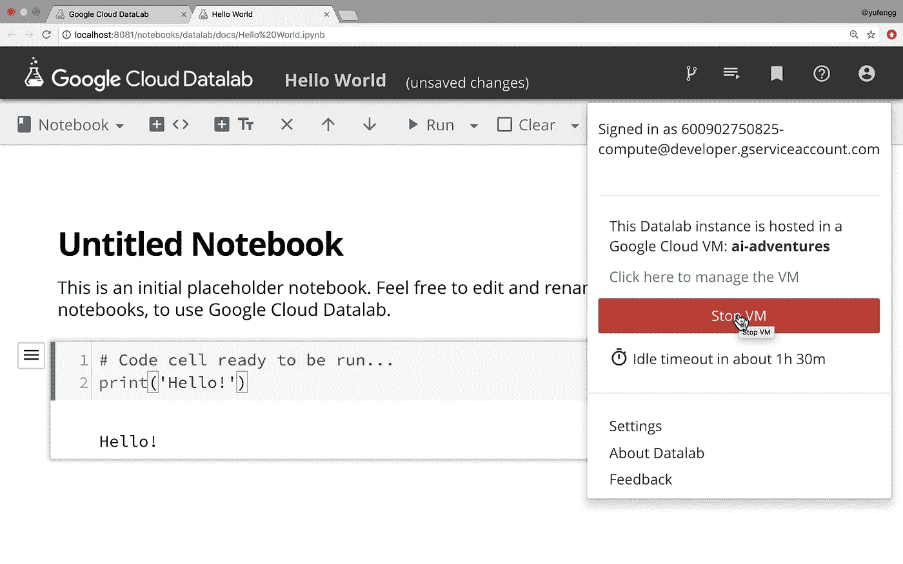
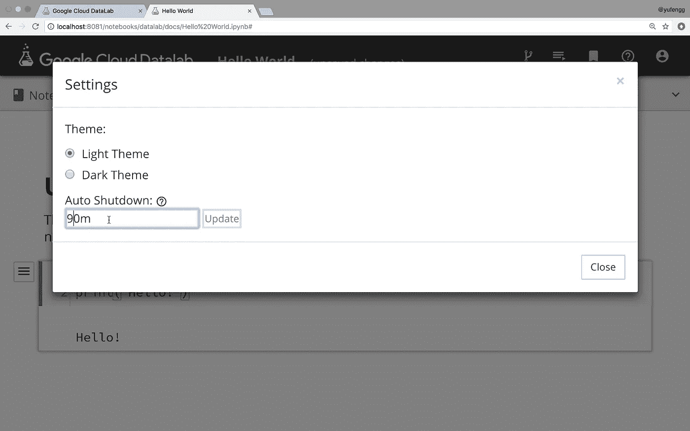

# 如何进行数据实验:针对大型数据集运行笔记本电脑

> 原文：<https://towardsdatascience.com/how-to-datalab-running-notebooks-against-large-datasets-2c4f932729f6?source=collection_archive---------2----------------------->

将大数据传输到本地计算环境既缓慢又昂贵。在这一集的人工智能冒险中，我们将看到如何将您的笔记本环境应用到您的数据中！

唯一比交互式 Python 笔记本更好的是什么？当然，这是一个具有快速简单的数据连接的交互式 Python 笔记本！

[上一集](/interactive-data-science-with-jupyter-notebooks-457ab4928b08)我们看了 Jupyter 笔记本有多有用。这一次，我们将看到如何通过在云中运行它来实现更多的额外好处！

# 数据，但更大

随着您在云中处理越来越大的数据集，使用您的本地机器与它进行交互变得越来越困难。下载具有统计代表性的数据样本来测试你的代码会变得很困难，而在本地传输数据进行训练依赖于稳定的连接。那么，数据科学家应该做些什么呢？

**如果您无法将数据带到您的电脑上，请将您的电脑带到您的数据上**！让我们看看如何在云中运行笔记本环境，靠近您的数据集！

[Google Cloud Datalab](https://cloud.google.com/datalab/) 建立在我们熟悉的 Jupyter 笔记本之上，增加了一些功能，包括轻松验证 BigQuery 数据集、快速操作 Google 云存储以及 SQL-query 支持！这个工具包在 GitHub 上也是开源的，所以你可以在你自己的环境中运行它。

让我们创建一个数据实验室环境，并为在云中运行我们的笔记本电脑做好准备。

使用`gcloud components install datalab`安装 datalab 组件。然后您将拥有一个名为`datalab`的新命令行工具。

Installing Datalab is a one-command operation

启动 Datalab 是一行命令:`datalab create`

Datalab still connects to localhost!

该命令启动您将用于分析的虚拟机，配置网络，并安装我们将使用的必要库，包括 TensorFlow、pandas、numpy 等等。

一旦 Datalab 启动，它将打开一个笔记本环境，看起来与我们在 Jupyter 笔记本中看到的非常相似。然而，这不是在本地运行，而是在云中的虚拟机上运行。Datalab 默认安装了一些示例，这是一个开始探索的好地方。让我们看看“你好，世界”笔记本，在“文档”文件夹中。

在这里，我们可以立即开始使用笔记本，运行细胞并进行实验。这非常方便，因为不需要管理和配置不同的 python 库。

让我们来看看几个内置的附加工具。在右上角的帐户图标上，有一些需要注意的数字设置和有用信息。

首先，请注意笔记本是作为服务帐户运行的。服务帐户已经使用我们所在项目的资产进行了身份验证，但是如果我们想要从另一个项目访问资源，我们需要授予服务帐户访问权限，而不是用户帐户。

由于运行笔记本的虚拟机对于能够访问项目的任何人都是可访问的，所以我们不想在 datalab 笔记本中暴露我们自己的帐户凭证。

继续向下，我们看到我们正在从一个名为 **ai-adventures** 的 Google Compute Engine 虚拟机运行笔记本，我们可以随时通过单击该按钮关闭虚拟机。

默认情况下，一旦虚拟机空闲 90 分钟，Datalab 就会关闭它。您可以通过单击消息来切换此功能。

超时也可以设置为自定义值。让我们去设置看看如何做到这一点。我们在此设置的值将在虚拟机重新启动后保持不变，如果设置为零，将不会发生自动关闭。

这也是我们可以选择亮或暗的主题的地方。

现在，我们已经设置好了 datalab 笔记本电脑，并熟悉了我们的环境，让我们看看可以用 datalab 做些什么吧！

# Datalab 运行中的一个示例

今天我将通过一个例子来描述 Github 上使用的编程语言之间的相关性。也就是，“如果你用语言 A 编程，你有多大可能*也用语言 B 编程？”笔记本在 docs 下的 samples 目录中。你也可以[在 GitHub](https://github.com/googledatalab/notebooks/blob/master/samples/Programming%20Language%20Correlation.ipynb) 上查看一下。*

该分析仅使用了更大的 GitHub 公共数据集的一小部分样本。如果你想使用完整的 Github 提交历史，你可以点击查看[数据集，点击](https://bigquery.cloud.google.com/dataset/bigquery-public-data:github_repos)查看[随附指南。](https://cloud.google.com/bigquery/public-data/github)

# 结论和后续步骤

[Datalab](https://cloud.google.com/datalab/docs/) 是一种在靠近数据的地方运行云连接笔记本的好方法，它可以方便地连接到 BigQuery 等工具，并且可以轻松地在云中验证数据集。

去试试 Datalab，看看它是不是适合你的选择！

感谢阅读本集[云 AI 冒险](https://goo.gl/UC5usG)。如果你喜欢这个系列，请为这篇文章鼓掌让我知道。如果你想要更多的机器学习动作，一定要关注媒体上的[me](https://medium.com/@yufengg)或订阅 YouTube 频道的[来观看未来的剧集。更多剧集即将推出！](https://goo.gl/S0AS51)