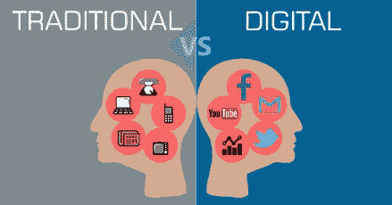
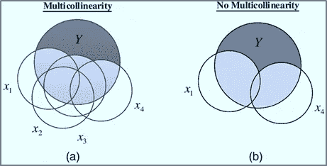

# 营销组合建模中的数字变量(MMM)

> 原文：<https://towardsdatascience.com/how-to-deal-with-digital-variables-in-marketing-mix-modeling-mmm-9ceb36ba563f?source=collection_archive---------14----------------------->

Source: [Pixabay](https://pixabay.com/en/social-social-media-communication-3064515/)

传统的 MMM 有助于理解电视、户外、印刷广告、店内促销和折扣等营销投入的影响。

随着数字技术的破坏，营销人员现在正在寻找一套新的营销投入，以了解他们的营销组合。MMM 中使用的一些数字变量是:脸书花费和印象、Instagram 花费和印象、有机会话、网站访问/流量、横幅花费、付费搜索花费和在线视频/内容花费。

那么，问题是如何处理 MMM 中的数字变量呢？

1.  **线性与非线性影响:**

Source: https://www.bearfoxmarketing.com/marketing/difference-traditional-marketing-vs-digital-marketing/

在 MMM 中，TV 被视为非线性变量。非线性意味着电视支出/GRP 的每一个单位增长都不会产生单位销售回报。电视广告的效果开始随着时间而衰减。(详情请参考我在 MMM 上的第一篇文章:[https://towardsdatascience . com/market-mix-modeling-MMM-101-3d 094 df 976 f 9](/market-mix-modeling-mmm-101-3d094df976f9))

另一方面，对许多品牌来说，数字媒体是一种相当新的投资媒介。因此，许多企业将数字视为线性变量。换句话说，随着数字支出/印象的增加，销售额也会增加。将数字花费/印象视为线性的另一个原因是，与传统的广告媒体(如电视、印刷和网络)相比，数字是相对便宜的媒体。因此，营销人员有足够的钱来增加对数字空间的投资，以获得更好的投资回报。

然而，并非所有品牌都是如此。例外情况可能包括那些可能没有开展有效的数字活动或在数字媒体上投资很少的品牌。随着时间的推移，脸书或 Youtube 广告的效果会减弱，从而使曲线变得非线性。

**2。印象与花费(哪个更相关):**

Source: [Pixabay](https://pixabay.com/en/facebook-mouse-cursor-mouse-pointer-76536/)

通常，相同营销投入的印象和花费可能彼此具有非常高的相关性。因此，将模型中的两个变量放在一起考虑是不准确的。选择其中任何一个时，应考虑以下事项:

一、做 MMM 的目的是什么？目标是了解每项投入的投资回报率和资金投向，还是仅仅了解推动销售的因素？在前者的情况下，支出应被明确视为投入。

二。在后一种情况下，应检查整体模型统计和稳健性，并选择两个变量中的任何一个。

**3。变量间多重共线性高:**

Source: [Asce Library](https://ascelibrary.org/doi/10.1061/%28ASCE%29CP.1943-5487.0000636)

通常，数字变量以它们之间非常高多重共线性为特征。在构建模型时，最好进行几次迭代，并在模型中使用这些数字变量的不同组合。这应该由领域知识和模型的统计意义来支持。

**4。投资回报影响:**

Source: [http://stephenlnelson.com/articles/quicken-annual-return/](http://stephenlnelson.com/articles/quicken-annual-return/)

如果在数字媒体上花费了大量资金，数字投资回报率通常会高于电视投资回报率。然而，如果在电视上投入大量资金，电视投资回报率将超过数字投资回报率。这不应该被认为是一个需要担心的问题，因为通常如果数字媒体的花费少了，就有机会在数字媒体上投入更多的钱(由于它的线性性质)

这是一个关于如何处理 MMM 中的数字变量的简介。

敬请关注更多文章！！

你也可以看我在 MMM 上的其他文章- [这里](/market-mix-modeling-mmm-101-3d094df976f9)、[这里](/market-mix-modeling-101-part-2-95c5e147c8a3)、[这里](https://medium.com/@ridhima.kumar0203/market-mix-modeling-101-elasticity-e881f1df5c8b)和[这里。](/types-of-interaction-effects-in-market-mix-modeling-mmm-95247f3de36e)

更多详情，请联系:

网址:[https://www.arymalabs.com/](https://www.arymalabs.com/)

[领英](https://www.linkedin.com/in/ridhima-kumar7/)

[推特](https://twitter.com/kumar_ridhima)

**版权所有 2018**[**www.ridhimakumar.com**](http://www.ridhimakumar.com)版权所有。