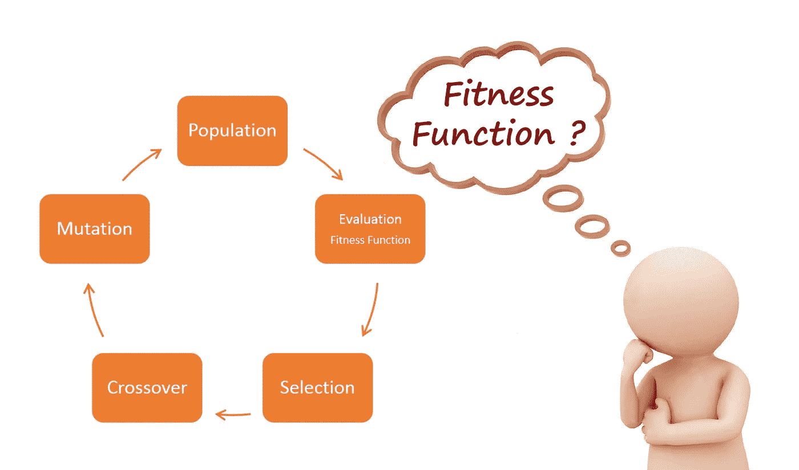

# 如何在遗传算法中定义一个适应度函数？

> 原文：<https://towardsdatascience.com/how-to-define-a-fitness-function-in-a-genetic-algorithm-be572b9ea3b4?source=collection_archive---------0----------------------->

在我的[上一篇文章](https://medium.com/towards-data-science/introduction-to-genetic-algorithms-including-example-code-e396e98d8bf3)中，我已经解释了关于遗传算法的基础知识。这篇文章发表后，我收到了许多关于**适应度函数**和**评估策略**的讨论请求。在本文中，我们将讨论适应度函数，以及如何针对给定的问题提出适应度函数。



# 什么是健身功能？

**适应度函数**(也称为**评估函数**)评估给定解决方案与期望问题的最优解决方案的接近程度。它决定了解决方案的适合程度。

# 我们为什么使用健身功能？

在遗传算法中，每个解一般被表示为一串二进制数，称为一个**染色体**。我们必须测试这些解决方案，并拿出最佳的解决方案来解决给定的问题。因此，需要给每个解决方案打分，以表明它与期望的解决方案的总体规格有多接近。该分数通过将**适应度函数**应用于测试或从测试解决方案获得的结果而生成。

# 适应度函数的一般要求

任何适应度函数都应满足以下要求。

1.  应该清楚地定义适应度函数。读者应该能够清楚地理解健身分数是如何计算的。
2.  应该有效地实现适应度函数。如果适应度函数成为算法的瓶颈，那么遗传算法的整体效率就会降低。
3.  适应度函数应该定量地衡量给定的解决方案在解决问题时的适合程度。
4.  适应度函数应该产生直观的结果。最佳/最差候选人应具有最佳/最差分值。

# **如何针对给定的问题想出一个适应度函数？**

每个问题都有自己的适应度函数。应该使用的适应度函数取决于给定的问题。当使用遗传算法来公式化一个问题时，为给定的问题提出一个适应度函数是最难的部分。

没有硬性规定，特定的函数应该用于特定的问题。然而，对于某些类型的问题，数据科学家已经采用了某些函数。

通常，对于使用监督学习的分类任务，诸如*欧几里德距离* e 和*曼哈顿距离*之类的误差度量已经被广泛用作适应度函数。

对于优化问题，诸如与问题域相关的一组计算参数之和的基本函数可以用作适应度函数。

我们来看几个例题和它们相关的适应度函数。

## 示例 1—生成序列

考虑下面给出的例子。我使用这个简单的例子主要是为了便于理解。

给定一组 5 个基因，它们可以保存二进制值 0 和 1 中的一个，我们必须得到全为 1 的序列。所以我们必须尽可能地增加 1 的数量。这可以认为是一个优化问题。因此，**适应度函数**被认为是基因组 中存在的 ***个 1。如果有五个 1，那么它有最大的适应性，解决了我们的问题。如果没有 1，那么 If 具有最小适应度。***

下面给出的代码显示了如何实现适应度函数来计算适应度分数。

## 示例 2—时间表安排


Timetable for a week

可以使用遗传算法的一个非常著名的场景是制作时间表或时间表安排的过程。

假设您正试图为某一特定批次的大学课程制定一份每周时间表。我们必须安排课程，制定时间表，这样课程之间就不会有冲突。在这里，我们的任务是寻找最佳的时间表安排。

既然班级之间不应该有冲突，我们应该尽量减少有班级冲突的学生人数。你可以把**适应度函数**公式化为 ***有班级冲突的学生人数*** 的倒数。有班级冲突的学生人数越少，班级越适合。

## 示例 3-寻找满足给定约束的一组变量的值

考虑三个变量 x，y 和 z。问题是找到 x，y 和 z 的最佳值集合，使得它们的总值等于值 t。

```
x + y + z = t
```

我们必须减少 x+y+z 之和偏离 t，即|x + y + z — t|应该为零。因此，适应度函数可以被认为是|x + y + z - t| 的 ***逆。***

```
Fitness function = 1/|x + y + z - t|
```

这些是应用遗传算法的几个例子，以及如何得出它们的适应度函数。为了便于理解，我使用了这些简单的例子。在对复杂的现实世界问题建模时，我们可能得不到如此简单的适应度函数。

# **最终注释**

适应度函数必须能够衡量你的解决方案有多好。特别是，它应该能够处理生成的任何可用的解决方案，并且必须显示出改进它们的正确方法。

例如，除非答案是正确的，否则为零的适应度函数是不好的，因为它不能帮助您了解解决方案与正确答案有多接近。此外，随着解决方案变得更好而增加，但不识别最佳解决方案的适应度函数也不是那么好，因为您的群体将提高到某个点，然后停滞不前。

你必须处理这个问题，从不同的角度考虑，并考虑可以用什么样的函数来检验你的解决方案有多好。你想要一个函数，它对坏解给出低值，对好解给出高值。通过练习，你最终会更好地为给定的问题定义一个适应度函数。

希望你对如何为一个给定的使用遗传算法解决的问题定义一个适应度函数有了一个基本的概念。

感谢阅读…