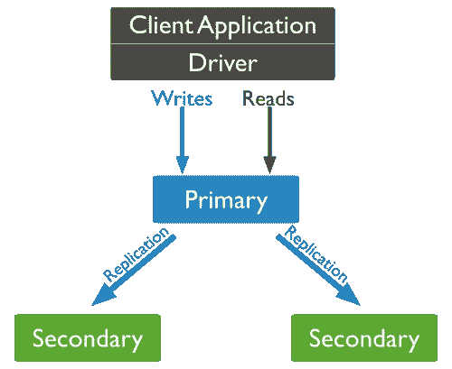
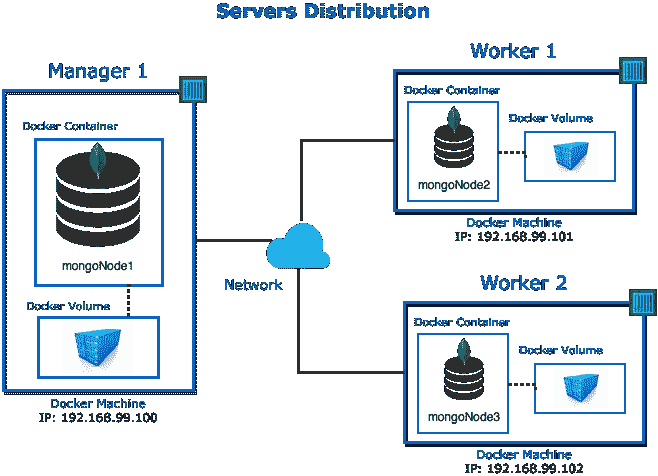
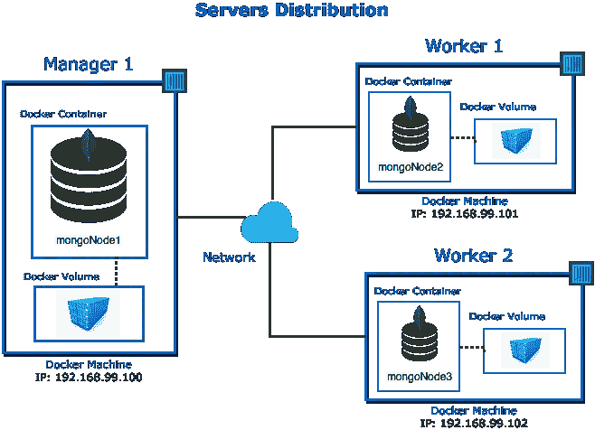

# 如何使用 Docker 部署 MongoDB 副本集

> 原文：<https://towardsdatascience.com/how-to-deploy-a-mongodb-replica-set-using-docker-6d0b9ac00e49?source=collection_archive---------0----------------------->


# 文章已更新

我写了一篇关于如何使用 DevOps 时尚风格部署 mongodb 集群的新文章，在这篇文章中，我使用了 Terraform、Ansible、Packer 和更多很酷的技术，我强烈建议您阅读它。

[](https://medium.com/@cramirez92/deploy-a-mongodb-replica-set-in-a-devops-fashion-style-infrastructre-as-code-f631d7a0ad80) [## 以 DevOps 方式部署 MongoDB 副本集(作为代码的基础架构)

### 介绍

medium.com](https://medium.com/@cramirez92/deploy-a-mongodb-replica-set-in-a-devops-fashion-style-infrastructre-as-code-f631d7a0ad80) 

本文将介绍如何使用 docker 设置带身份验证的 MongoDB 副本集。

本文中我们将使用的是:

*   MongoDB 3.4.1
*   Mac docker 1 . 12 . 6

# 副本集的体系结构



MongoDB Replica Set

# 用 docker 构建我们的副本集



Servers Distribution using Docker

在上图中，我们看到了用 docker 设置的复制结果。

## #先决条件

*   **码头工人**的基础知识
*   **对接机**和**对接机**安装完毕
*   **mongoDB** 中的基础知识
*   **bash 脚本的基础知识**

如果你在 Mac 或 Windows 上，考虑使用虚拟机。我将在 MacOS Sierra 上使用 VirtualBox 来运行我们的 mongoDB 实例。

# #步骤 1 —创建我们的 3 台对接机

要创建 docker 机器，我们需要在终端中发出下一条命令:

```
$ docker-machine create -d virtualbox manager1
```

这个命令将创建一个名为 **manager1** 的机器，使用 **virtualbox** 作为我们的虚拟化提供者。

现在让我们创建两个左`docker-machine`

```
$ docker-machine create -d virtualbox worker1$ docker-machine create -d virtualbox worker2
```

要验证我们的机器是否已创建，让我们运行以下命令:

```
$ docker-machine ls// the result will be
NAME    ACTIVE   DRIVER     STATE     URL    
manager1   -   virtualbox   Running  tcp://192.168.99.100:2376           
worker1    -   virtualbox   Running  tcp://192.168.99.101:2376
worker2    -   virtualbox   Running  tcp://192.168.99.102:2376
```

# #步骤 MongoDB 主节点的配置

现在我们有了三台机器，让我们将它放在第一台机器**上，开始 mongodb 配置，让我们运行下一个命令:**

```
$ eval `docker-machine env manager1`
```

在创建我们的 mongoDB 容器之前，有一个非常重要的主题已经在 **docker 容器**中围绕**数据库持久性**讨论了很久，为了实现这个挑战，我们将要做的是创建一个 **docker 卷**。

```
$ docker volume create --name mongo_storage
```

现在让我们附加我们创建的卷来启动我们的第一个 mongo 容器并设置配置。

```
$ docker run --name mongoNode1 \
-v mongo_storage:/data \
-d mongo \
--smallfiles
```

接下来我们需要创建**密钥文件。**

> 密钥文件的内容作为副本集成员的共享密码。对于副本集的所有成员，密钥文件的内容必须相同。

```
$ openssl rand -base64 741 > mongo-keyfile
$ chmod 600 mongo-keyfile
```

接下来，让我们创建文件夹，用于保存 **mongo_storage** 卷中的数据、密钥文件和配置:

```
$ docker exec mongoNode1 bash -c 'mkdir /data/keyfile /data/admin'
```

下一步是创建一些管理员用户，让我们创建一个 **admin.js** 和一个 **replica.js** 文件，如下所示:

```
// admin.jsadmin = db.getSiblingDB("admin")// creation of the admin user
admin.createUser(
  {
    user: "cristian",
    pwd: "cristianPassword2017",
    roles: [ { role: "userAdminAnyDatabase", db: "admin" } ]
  }
)// let's authenticate to create the other user
db.getSiblingDB("admin").auth("cristian", "cristianPassword2017" )// creation of the replica set admin user
db.getSiblingDB("admin").createUser(
  {
    "user" : "replicaAdmin",
    "pwd" : "replicaAdminPassword2017",
    roles: [ { "role" : "clusterAdmin", "db" : "admin" } ]
  }
)
```

```
//replica.jsrs.initiate({
 _id: 'rs1',
 members: [{
  _id: 0, host: 'manager1:27017'
 }]
})
```

## **重要**

> 密码应该是随机的、长的和复杂的，以确保系统安全并防止或延迟恶意访问。参见[数据库用户角色](https://docs.mongodb.com/manual/reference/built-in-roles/#database-user-roles)了解内置角色以及与数据库管理操作相关的完整列表。

我们所做的直到知道:

*   创建了 **mongo_storage** ，docker 卷。
*   创建了 **mongo-keyfile** ，openssl 密钥生成。
*   创建了 **admin.js 文件**，管理 mongoDB 的用户。
*   创建了 **replica.js 文件**，以初始化副本集。

好了，让我们继续将文件传递到容器中。

```
$ docker cp admin.js mongoNode1:/data/admin/$ docker cp replica.js mongoNode1:/data/admin/$ docker cp mongo-keyfile mongoNode1:/data/keyfile/
```

```
// change folder owner to the user container$ docker exec mongoNode1 bash -c 'chown -R mongodb:mongodb /data'
```

我们所做的是将需要的文件传递给容器，然后**将******/数据文件夹所有者** **更改为容器用户**，因为容器用户是需要访问该文件夹和文件的用户。**

**现在一切都已经设置好了，我们准备用副本集配置重新启动 mongod 实例。**

**在我们开始验证 mongo 容器之前，让我们创建一个`env`文件来设置我们的用户和密码。**

```
MONGO_USER_ADMIN=cristian
MONGO_PASS_ADMIN=cristianPassword2017MONGO_REPLICA_ADMIN=replicaAdmin
MONGO_PASS_REPLICA=replicaAdminPassword2017
```

**现在我们需要移除容器并开始一个新的。为什么？，因为我们需要提供副本集和身份验证参数，为此我们需要运行以下命令:**

```
// first let's remove our container$ docker rm -f mongoNode1// now lets start our container with authentication $ docker run --name mongoNode1 --hostname mongoNode1 \
-v mongo_storage:/data \
--env-file env \
--add-host manager1:192.168.99.100 \
--add-host worker1:192.168.99.101 \
--add-host worker2:192.168.99.102 \
-p 27017:27017 \
-d mongo --smallfiles \
--keyFile /data/keyfile/mongo-keyfile \
--replSet 'rs1' \
--storageEngine wiredTiger \
--port 27017
```

**这是怎么回事…🤔这似乎是对旗帜的滥用。**

**让我分两部分向你解释:**

****码头标志:****

1.  **`--env-file`读取一个 env 文件并在容器中设置`environment`变量。**
2.  **`--add-host`标志将条目添加到 docker 容器的`/etc/hosts`文件中，这样我们就可以使用主机名而不是 IP 地址。这里，我们正在映射我们之前创建的 3 台 docker-machine。**

**要更深入地理解 *docker 运行命令*、[请阅读 docker 的文档](https://docs.docker.com/engine/reference/run/)。**

****蒙哥旗帜:****

**为了设置 mongo 副本集，我们需要各种 mongo 标志**

1.  **`--keyFile`这个标志是用来告诉 mongo】在哪里**
2.  **`--replSet`该标志用于设置副本集的名称。**
3.  **`--storageEngine`该标志用于设置 mongoDB 的引擎，不是必需的，因为 **mongoDB 3.4.1** 的默认引擎是 **wiredTiger。****

**为了更深入地了解 mongo 副本集，[阅读 MongoDB 文档](https://docs.mongodb.com/manual/tutorial/deploy-replica-set/)，我也推荐[mongou 大学的课程](https://university.mongodb.com/?next=/courses/MongoDB/M101JS/2016_March/courseware/Week_2_CRUD/5695578bd8ca393adc3abe54)来学习关于这个主题的更多内容。**

**mongoNode1 容器的最后一步是启动副本集，我们将通过运行以下命令来完成这一步:**

```
$ docker exec mongoNode1 bash -c 'mongo < /data/admin/replica.js'
```

**您应该会看到类似这样的内容:**

```
MongoDB shell version v3.4.1
connecting to: mongodb://127.0.0.1:27017
MongoDB server version: 3.4.1
{ "ok" : 1 }
bye
```

**现在，让我们使用以下命令创建管理员用户:**

```
$ docker exec mongoNode1 bash -c 'mongo < /data/admin/admin.js'
```

**您应该会看到类似这样的内容:**

```
MongoDB shell version v3.4.1
connecting to: mongodb://127.0.0.1:27017
MongoDB server version: 3.4.1
admin
Successfully added user: {
 "user" : "cristian",
 ...
Successfully added user: {
 "user" : "replicaAdmin",
...
bye
```

**现在，要进入复制副本，请运行以下命令:**

```
$ docker exec -it mongoNode1 bash -c 'mongo -u $MONGO_REPLICA_ADMIN -p $MONGO_PASS_REPLICA --eval "rs.status()" --authenticationDatabase "admin"'
```

**你应该准备好看到这样的东西:**

```
MongoDB shell version v3.4.1
connecting to: mongodb://127.0.0.1:27017
MongoDB server version: 3.4.1
{
 "set" : "rs1",
 ...
 "members" : [
  {
   "_id" : 0,
   "name" : "manager1:27017",
   ...
 "ok" : 1
}
```

# **#步骤 3——再添加 2 个 mongo 节点容器**

**现在一切都准备好了，让我们再启动两个节点，并将它们加入副本集。**

**要添加第一个节点，让我们切换到 **worker1** docker 机器，如果您使用的是本地计算机，请运行以下命令:**

```
eval `docker-machine env worker1`
```

**如果你没有在本地运行，只要把你的终端指向下一个服务器。**

**现在，因为我们要重复我们为 **mongoNode1** 所做的几乎所有步骤，所以让我们编写一个脚本来运行我们所有的命令。**

**让我们创建一个名为 **create-replica-set.sh** 的文件，看看如何组成 **main** 函数:**

```
function main {
  init_mongo_primary
  init_mongo_secondaries
  add_replicas manager1 mongoNode1
  check_status manager1 mongoNode1
}main
```

**现在让我向您展示这个函数是如何组成:**

****初始化 MONGO 主函数****

```
function init_mongo_primary {
  # [@params](http://twitter.com/params) name-of-keyfile
  createKeyFile mongo-keyfile

  # [@params](http://twitter.com/params) server container volume
  createMongoDBNode manager1 mongoNode1 mongo_storage

  # [@params](http://twitter.com/params) container
  init_replica_set mongoNode1
}
```

**这个函数内部也有函数调用，没有新的功能，我们之前已经看到了所有的功能，让我来描述一下它的功能:**

1.  **为**副本集验证创建**密钥文件**。****
2.  **创建一个 mongodb 容器，并接收 2 个参数:a)将要定位的服务器，b)容器的名称，docker 卷的名称，所有这些功能我们以前都见过。**
3.  **最后，它将以与我们之前完全相同的步骤启动复制副本。**

****初始化 MONGO 辅助功能****

```
function init_mongo_secondaries {
  # [@Params](http://twitter.com/Params) server container volume
  createMongoDBNode worker1 mongoNode1 mongo_storage
  createMongoDBNode worker2 mongoNode2 mongo_storage
}
```

**这个函数的作用是**为副本集**创建另外两个 mongo 容器，并执行与 mongoNode1 相同的步骤，但这里我们不包括副本集实例化和管理员用户创建，因为这些都不是必需的，因为副本集将与副本集的所有节点共享数据库配置，稍后它们将被添加到主数据库。**

## ****添加副本功能****

```
# [@params](http://twitter.com/params) server container
function add_replicas {
  echo '·· adding replicas >>>> '$1' ··' switchToServer $1

  for server in worker1 worker2
   do
    rs="rs.add('$server:27017')"
    add='mongo --eval "'$rs'" -u $MONGO_REPLICA_ADMIN 
         -p $MONGO_PASS_REPLICA --authenticationDatabase="admin"'
    sleep 2
    wait_for_databases $server
    docker exec -i $2 bash -c "$add"
  done
}
```

**在这里，我们正在做的是，最后将另外 2 个 mongo 容器添加到**副本集配置上的**主数据库**中，**首先，我们循环通过剩余的机器来添加容器，在循环中，我们准备配置，然后我们检查容器是否准备好，我们通过调用函数`wait_for_databases`来完成，我们将机器作为参数传递给 check，然后我们在主数据库中执行配置，我们应该看到这样的消息:**

```
MongoDB shell version v3.4.1
connecting to: mongodb://127.0.0.1:27017
MongoDB server version: 3.4.1
{ "ok" : 1 }
```

**这意味着 mongo 容器被成功地添加到了副本中。**

**最后，我们用 main 中的最后一个函数检查副本集的状态:**

```
# [@params](http://twitter.com/params) server container
function check_status {
  switchToServer $1
  cmd='mongo -u $MONGO_REPLICA_ADMIN -p $MONGO_PASS_REPLICA 
        --eval "rs.status()" --authenticationDatabase "admin"'
  docker exec -i $2 bash -c "$cmd"
}
```

**既然我们已经看到了我们的自动化脚本的功能，并且我们知道将要这样做，那么是时候执行自动化 bash 脚本了，如下所示:**

> **注意如果你已经完成了上面的所有步骤，你需要重置我们已经实现的所有东西，以避免任何冲突名称问题，重置配置在 github 存储库中有一个 reset.sh 文件**

```
# and this how we can execute the script that will configure 
# everything for us.**$ bash < create-replica-set.sh**
```

**如果一切设置正确，我们应该会看到来自 mongodb 的如下消息:**

```
MongoDB shell version v3.4.1
connecting to: mongodb://127.0.0.1:27017
MongoDB server version: 3.4.1
{
 "set" : "rs1",
 ...
 },
 "members" : [
  {
   "_id" : 0,
   "name" : "manager1:27017",
   "health" : 1,
   "state" : 1,
   "stateStr" : "PRIMARY",
   ...
  },
  {
   "_id" : 1,
   "name" : "worker1:27017",
   "health" : 1,
   "state" : 2,
   "stateStr" : "SECONDARY",
   ...
  },
  {
   "_id" : 2,
   "name" : "worker2:27017",
   "health" : 1,
   "state" : 0,
   "stateStr" : "STARTUP",
   ...
  }
 ],
 "ok" : 1
}
```

**正如您所看到的，每个容器现在都配置良好，需要注意的是，我们像以前一样使用 docker 中的`--add-host`标志，这将这些条目添加到 Docker 容器的/etc/hosts 文件中，因此我们可以使用主机名而不是 IP 地址。**

**两个节点从 mongoNode1 完成同步可能需要一分钟时间。**

**您可以通过查看日志来查看每个 mongo Docker 容器中发生了什么。您可以通过在任何 docker-machine 服务器上运行该命令来实现这一点。**

```
$ docker logs -ft mongoContainerName
```

**现在我们已经有了一个 **MongoDB 副本集**服务，让我们修改我们的用户，或者您可以创建另一个用户，并授予一些权限来对数据库进行 crud 操作，因此，仅出于说明的目的，这是一个不好的做法，让我为我们的 admin 用户添加一个超级角色。**

```
# we are going to assign the root role to our admin user**# we enter to the container**
$ docker exec -it mongoNode1 bash -c 'mongo -u $MONGO_USER_ADMIN -p $MONGO_PASS_ADMIN --authenticationDatabase "admin"'**# Then we execute the following in the mongo shell**
# Mongo 3.4.1 shell
> use admin
> db.grantRolesToUser( "cristian", [ "root" , { role: "root", db: "admin" } ] )
>
```

**现在他有了一个可以做任何东西的超级用户，所以让我们创建一个数据库并插入一些数据。**

```
$ docker exec -it mongoNode1 bash -c 'mongo -u $MONGO_USER_ADMIN -p $MONGO_PASS_ADMIN --authenticationDatabase "admin"'# Mongo 3.4.1 shell
> use movies
> db.movies.insertMany([{
  id: '1',
  title: 'Assasins Creed',
  runtime: 115,
  format: 'IMAX',
  plot: 'Lorem ipsum dolor sit amet',
  releaseYear: 2017,
  releaseMonth: 1,
  releaseDay: 6
}, {
  id: '2',
  title: 'Aliados',
  runtime: 124,
  format: 'IMAX',
  plot: 'Lorem ipsum dolor sit amet',
  releaseYear: 2017,
  releaseMonth: 1,
  releaseDay: 13
}, {
  id: '3',
  title: 'xXx: Reactivado',
  runtime: 107,
  format: 'IMAX',
  plot: 'Lorem ipsum dolor sit amet',
  releaseYear: 2017,
  releaseMonth: 1,
  releaseDay: 20
}, {
  id: '4',
  title: 'Resident Evil: Capitulo Final',
  runtime: 107,
  format: 'IMAX',
  plot: 'Lorem ipsum dolor sit amet',
  releaseYear: 2017,
  releaseMonth: 1,
  releaseDay: 27
}, {
  id: '5',
  title: 'Moana: Un Mar de Aventuras',
  runtime: 114,
  format: 'IMAX',
  plot: 'Lorem ipsum dolor sit amet',
  releaseYear: 2016,
  releaseMonth: 12,
  releaseDay: 2
}])# inserted 5 documents
> 
```

**现在我们有了一个电影数据库，其中的电影集合包含 5 部电影:d。**

# **#是时候回顾一下了**

**我们所做的…**

****

**我们使用带有自动化脚本的 **Docker、**配置并启动带有**认证的 **MongoDB 副本集**。****

**在安全性方面，我们创建了:**

*   **2 类用户，即**管理数据库**和**集群管理数据库。****
*   **我们创建一个**密钥文件**，并在启用**身份验证的情况下启动副本。****

> **如果为数据库正确配置了访问控制，攻击者应该无法访问您的数据。查看我们的[安全清单](https://docs.mongodb.com/manual/administration/security-checklist/)以帮助发现潜在的弱点。— [@MongoDB Docs](https://www.mongodb.com/blog/post/how-to-avoid-a-malicious-attack-that-ransoms-your-data?utm_source=dbweekly&utm_medium=email)**

**如果我们想给我们的架构增加更多的安全性，我们可以用我们的 docker-machines 创建一个 **Swarm 集群、**，docker swarm 可以很好地处理网络通信，我们还可以在我们的容器中创建非根用户，我们可以在 mongoDB 中启用加密数据，但是这个主题不在本文的讨论范围之内。**

# **#结论**

**现在我们有了一个工作的 **MongoDB 副本集**。您可以随时向该副本集添加节点。您甚至可以停止一个 mongo 容器或主 mongoNode1，并观察另一个 mongoNode 作为新的主 mongoNode。由于**数据写入 docker 卷**中，重启这些节点不成问题。**数据将继续存在**并完好无损地重新加入副本集。**

**对我们来说，一个好处是我们看到了如何用 bash 文件来自动化整个过程。**

**您面临的一个挑战是修改 **bash 脚本**并使其更加动态**，因为该脚本非常依赖于本文规范，另一个挑战是向架构添加一个任意的 Mongo 节点。****

# ****Github 知识库****

****要获得文章的完整脚本文件，您可以在下面的 repo 中查看。****

****[](https://github.com/Crizstian/mongo-replica-with-docker) [## GitHub-Crizstian/mongo-Replica-with-docker:如何使用 Docker 部署 MongoDB 副本集

### 如何使用 docker 部署一个 MongoDB 副本集

github.com](https://github.com/Crizstian/mongo-replica-with-docker) 

# 进一步阅读

*   [部署带有密钥文件访问控制的副本集](https://docs.mongodb.com/manual/tutorial/deploy-replica-set-with-keyfile-access-control/#deploy-repl-set-with-auth) — MongoDB Docs。
*   向副本集添加成员 — MongoDB Docs。
*   [MongoDB Docker Hub](https://hub.docker.com/_/mongo/)—Docker Docs。
*   [如何避免勒索您数据的恶意攻击](https://www.mongodb.com/blog/post/how-to-avoid-a-malicious-attack-that-ransoms-your-data?utm_source=dbweekly&utm_medium=email)
*   [如何在 ubuntu 16.04 上设置安全的 mongoDB 3.4 服务器](https://www.opsdash.com/blog/howto-setup-mongodb-secure.html?utm_source=dbweekly&utm_medium=email)**** 

****我希望你喜欢这篇文章，我目前仍在探索 MongoDB 世界，所以我愿意接受反馈或贡献，如果你喜欢它，推荐给朋友，分享或再次阅读。****

****你可以在推特@ crami rez _ 92【https://twitter.com/cramirez_92】T3
关注我****

****直到下次😁👨🏼‍🎨👨🏻‍💻****