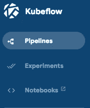
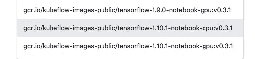
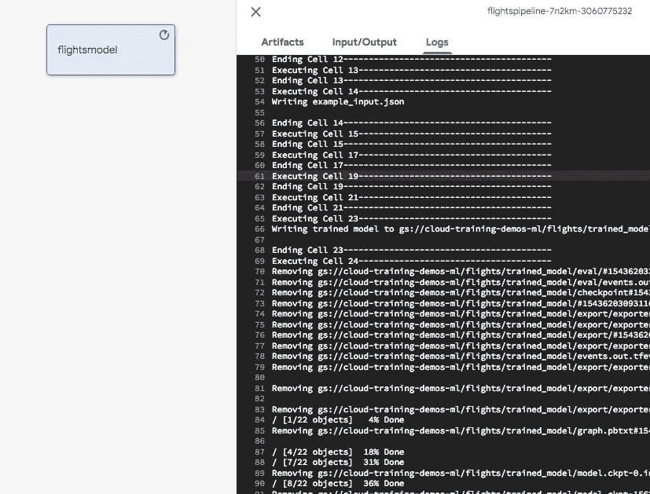

# 如何将 Jupyter 笔记本部署为 Kubeflow ML 管道的组件(第 2 部分)

> 原文：<https://towardsdatascience.com/how-to-deploy-jupyter-notebooks-as-components-of-a-kubeflow-ml-pipeline-part-2-b1df77f4e5b3?source=collection_archive---------10----------------------->

## 在 Kubernetes 集群上运行 Jupyter 笔记本的简单方法

在第 1 部分中，我向您展示了如何使用 Docker 组件创建和部署 Kubeflow ML 管道。在第 2 部分中，我将向您展示如何让 Jupyter 笔记本成为 Kubeflow ML 管道的一个组件。Docker 组件是为操作机器学习模型的人准备的，能够在任意硬件上运行 Jupyter 笔记本更适合数据科学家。


In this article, I show you an easy way to run your Jupyter notebook as a container in Kubernetes. (Photo by [Cameron Venti](https://unsplash.com/photos/QtETdXXR7gs?utm_source=unsplash&utm_medium=referral&utm_content=creditCopyText) on [Unsplash](https://unsplash.com/search/photos/container?utm_source=unsplash&utm_medium=referral&utm_content=creditCopyText))

我将假设您已经有了一个 Kubeflow 管道集群，并按照上一篇文章中的解释运行。通常，“ML 平台团队”(IT 部门的一部分)将管理供数据科学家团队使用的集群。

## 第一步。启动 JupyterHub

*注意:当我写这篇文章时，您必须在集群本身上运行笔记本。不过，现在更好的方法是使用人工智能平台笔记本，并远程向集群提交代码。遵循本自述文件中的说明，确保启动 TensorFlow 1.10 笔记本电脑虚拟机。跳过这一步，从第 2 步开始。*

从 Kubeflow pipelines 用户界面(http://localhost:8085/pipeline，如果您遵循了上一篇文章中的说明)，单击笔记本的链接:



Click on the notebooks link from Kubeflow pipelines to start JupyterHub on the cluster and start working with notebooks

如果这是第一次，这将提示您启动 JupyterHub。使用您的 GCP 用户名/密码登录。然后，选择所需的 Tensorflow 版本:



Choose the version of TensorFlow

我在一个 cpu 上选择了 TensorFlow v1.10。

## 第二步。克隆 git repo

然后，打开一个终端窗口，git 克隆我的 repo:

```
git clone https://github.com/GoogleCloudPlatform/data-science-on-gcp
```

切换回 Jupyter 笔记本列表，导航到 data-science-on-GCP/updates/cloud ml，打开 [flights_model.ipynb](https://github.com/GoogleCloudPlatform/data-science-on-gcp/blob/master/updates/cloudml/flights_model.ipynb) 。

## 第三步。用张量流预测航班延误

实际的 TensorFlow 代码(参见这里的完整笔记本: [flights_model.ipynb](https://github.com/GoogleCloudPlatform/data-science-on-gcp/blob/master/updates/cloudml/flights_model.ipynb) )并不重要，但是我希望您注意一些事情。一个是，我开发这款笔记本电脑时，大部分时间都是在急切模式下进行的，以便于调试:

```
if EAGER_MODE:
    dataset = load_dataset(TRAIN_DATA_PATTERN)
    for n, data in enumerate(dataset):
      numpy_data = {k: v.numpy() for k, v in data.items()} # .numpy() works only in eager mode
      print(numpy_data)
      if n>3: break
```

然后，我对模型进行了几个步骤的训练，并指定了更多的步骤(如果“不在开发模式中”:

```
num_steps = 10 if DEVELOP_MODE else (1000000 // train_batch_size)
```

最后，我将其作为 web 服务部署到 Cloud ML Engine:

```
gcloud ml-engine versions create ${MODEL_VERSION} --model ${MODEL_NAME} --origin ${MODEL_LOCATION} --runtime-version 1.10
```

并确保我可以将 JSON 发送到已部署的模型:

```
{"dep_delay": 14.0, "taxiout": 13.0, "distance": 319.0, "avg_dep_delay": 25.863039, "avg_arr_delay": 27.0, "carrier": "WN", "dep_lat": 32.84722, "dep_lon": -96.85167, "arr_lat": 31.9425, "arr_lon": -102.20194, "origin": "DAL", "dest": "MAF"}
{"dep_delay": -9.0, "taxiout": 21.0, "distance": 301.0, "avg_dep_delay": 41.050808, "avg_arr_delay": -7.0, "carrier": "EV", "dep_lat": 29.984444, "dep_lon": -95.34139, "arr_lat": 27.544167, "arr_lon": -99.46167, "origin": "IAH", "dest": "LRD"}
```

为了返回，对于每个实例，航班将晚点的概率。

## 第四步。将笔记本电脑部署为组件

所以，我有一个完全成熟的笔记本电脑，可以完成一些 ML 工作流程。我能把它作为 Kubeflow 管道的一部分来执行吗？回想一下 [*第 1 部分*](/how-to-create-and-deploy-a-kubeflow-machine-learning-pipeline-part-1-efea7a4b650f) 中的内容，一个组件所需要的只是一个自包含的容器，它接受几个参数并将输出写到文件中，或者在 Kubeflow 集群上，或者在云存储上。

为了将 flights_model 笔记本部署为一个组件:

*   我的笔记本顶部有一个单元格，它的标签是“参数”。在这个单元格中，我定义了我想要用来重新执行笔记本的任何变量。特别是，我设置了一个名为 DEVELOP_MODE 的变量。在开发模式下，我将读取小数据集；在非开发模式下，我将在完整数据集上进行训练。因为我希望您能够轻松地更改它们，所以我还将 PROJECT(要计费)和 BUCKET(要存储输出)作为参数。
*   然后，我构建一个能够执行我的笔记本的 Docker 映像。为了执行一个笔记本，我将使用 Python 包 papermill。我的笔记本用的是 Python3，gcloud，tensorflow。所以我的 docker 文件捕获了[docker 文件](https://github.com/GoogleCloudPlatform/data-science-on-gcp/blob/master/updates/cloudml/submitnotebook/Dockerfile)中的所有依赖项

```
FROM **google/cloud**-sdk:latestRUN apt-get update -y && apt-get install --no-install-recommends -y -q ca-certificates **python3-dev** python3-setuptools python3-pipRUN python3 -m pip install **tensorflow==1.10 jupyter papermill**COPY run_notebook.sh ./ENTRYPOINT ["bash", "./run_notebook.sh"]
```

*   Docker 映像的入口点是 [run_notebook.sh](https://github.com/GoogleCloudPlatform/data-science-on-gcp/blob/master/updates/cloudml/submitnotebook/run_notebook.sh) ，它使用 papermill 来执行笔记本:

```
gsutil cp $IN_NB_GCS  input.ipynb
gsutil cp $PARAMS_GCS params.yaml
**papermill input.ipynb output.ipynb -f params.yaml --log-output**
gsutil cp output.ipynb $OUT_NB_GCS
```

*   实际上，该脚本将要运行的笔记本从 Google 云存储复制到 Kubeflow pod，用 papermill 运行笔记本，并将结果输出复制回 Google 云存储。
*   但是 params.yaml？params.yaml 是什么？这些是笔记本电脑的可配置参数。例如，它可以是:

```
---
BUCKET: cloud-training-demos-ml
PROJECT: cloud-training-demos
DEVELOP_MODE: False
```

*   就是这样！当这个 Docker 映像运行时，它将执行提供的笔记本并复制输出笔记本(标绘了图形，训练了模型等)。)到 GCS。

## 第五步。作为管道的一部分启动笔记本组件

将笔记本作为管道中的一个步骤来运行的意义在于，它可以在其他管道中进行编排和重用。但是，为了向您展示如何做到这一点，您应该这样创建一个仅执行该笔记本的管道:

```
import kfp.components as comp
import kfp.dsl as dsl# a single-op pipeline that runs the flights pipeline on the pod
[@dsl](http://twitter.com/dsl).pipeline(
   name='FlightsPipeline',
   description='Trains, deploys flights model'
)
def flights_pipeline(
   inputnb=dsl.PipelineParam('inputnb'),
   outputnb=dsl.PipelineParam('outputnb'),
   params=dsl.PipelineParam('params')
):
    notebookop = dsl.ContainerOp(
      name='flightsmodel',
      image='gcr.io/cloud-training-demos/**submitnotebook**:latest',
      arguments=[
        **inputnb,
        outputnb,
        params**
      ]
    )
```

没什么特别的——我正在创建一个容器，告诉它使用我的图像，它有 TensorFlow、papermill 等。并给它输入和输出笔记本和参数。随着管道的运行，日志流传输到管道日志，并将显示在 Stackdriver 中:



As the pipeline executes, the notebook cells’ outputs get streamed to Stackdriver

在我的 GitHub repo 中，创建和部署管道显示在 [launcher.ipynb](https://github.com/GoogleCloudPlatform/data-science-on-gcp/blob/master/updates/cloudml/launcher.ipynb) 中。

## 尝试一下

*如果您还没有这样做，请阅读并浏览如何使用 Docker 映像* *创建和部署 Kubeflow ML 管道的第 1 部分* [*。*](/how-to-create-and-deploy-a-kubeflow-machine-learning-pipeline-part-1-efea7a4b650f)

尝试这篇关于如何在 Kubeflow 管道中部署 Jupyter 笔记本作为组件的文章:

1.  按照第 1 部分中的说明启动一个集群
2.  在集群上，打开 [flights_model.ipynb](https://github.com/GoogleCloudPlatform/data-science-on-gcp/blob/master/updates/cloudml/flights_model.ipynb) ，将项目和 BUCKET 更改为您自己的东西，并运行笔记本，确保它可以工作。
3.  打开 [launcher.ipynb](https://github.com/GoogleCloudPlatform/data-science-on-gcp/blob/master/updates/cloudml/launcher.ipynb) 并完成运行 flights_model.ipynb 和作为 Kubeflow 管道组件的步骤。

启动器笔记本还包括在深度学习虚拟机上启动 flights_model 笔记本的能力，但现在忽略它——我将在本系列的第 3 部分中介绍它。

笔记本可以是可组合性和可重用性的一个单元——但是为了实现这一点，你必须小心编写小的、单一用途的笔记本。我在这篇文章中所做的——一个巨大的单片笔记本——并不是一个好主意。权衡的结果是，如果您使用较小的笔记本，依赖性跟踪会变得困难。

## 什么时候用什么

*   如果你是一个小团队，并且没有人为你维护像 Kubeflow clusters 这样的 ML 基础设施，那么使用[深度学习 VM](https://cloud.google.com/deep-learning-vm/) 进行开发和自动化。我将在本系列的第 3 部分中讨论这个问题。
*   如果您在一个大型组织中工作，其中有一个独立的 ML 平台团队管理您的 ML 基础设施(即 Kubeflow 集群)，本文(第 2 部分)将向您展示如何在 Jupyter 笔记本中开发并部署到 Kubeflow 管道。(如果您向 IT 团队展示这篇文章，他们可能会帮助您完成 Docker 部分)。
*   虽然笔记本会帮助你变得敏捷，但是你也会积累大量的技术债务。单体笔记本很难重用，单一用途的笔记本很难跟踪依赖性。第二，即使你的日志会转到 GCP 的日志平台(Stackdriver)，它们也可能是非结构化的单元输出。这使得很难监控管道和对故障做出反应。因此，计划将成熟的代码和模型从笔记本转移到单独的管道组件中，每个组件都是一个容器。这是我在 [*第一部*](/how-to-create-and-deploy-a-kubeflow-machine-learning-pipeline-part-1-efea7a4b650f) 里给你看的。

换句话说，对小团队使用深度学习 VM，对实验工作使用 Jupyter 组件，对成熟模型使用容器操作