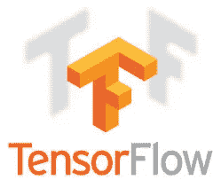

# 如何用 TensorFlow 部署机器学习模型？第 1 部分—准备好您的模型以供使用。

> 原文：<https://towardsdatascience.com/how-to-deploy-machine-learning-models-with-tensorflow-part-1-make-your-model-ready-for-serving-776a14ec3198?source=collection_archive---------0----------------------->



在完成 Udacity 的深度学习基础课程后，我有一个大问题——我如何部署训练好的模型并对新的数据样本进行预测？幸运的是，TensorFlow 是为生产开发的，它为模型部署提供了解决方案— [TensorFlow 服务](https://tensorflow.github.io/serving/)。基本上，有三个步骤——导出你的服务模型，用你的模型创建一个 [Docker](https://www.docker.com/) 容器，并用 [Kubernetes](https://kubernetes.io/) 将其部署到云平台，即谷歌云或亚马逊 AWS。在本文中，我主要关注第一部分——导出服务模型。

# 动机和工具

在 Udacity 的课程中，我总是问自己——我有我的模型，我可以在 Jupyter 笔记本上运行它并看到结果，但我能用它做什么呢？其他人如何使用它？

作为一名软件工程师，我对管道感兴趣:创建模型->在本地测试它->创建 web 服务来服务客户端请求->创建包含我的 web 服务的部署容器->测试容器->将其投入生产。我的问题的答案是:

*   用于模型创建的 TensorFlow
*   集装箱码头工人
*   为模型托管服务的 TensorFlow
*   用于生产部署的 Kubernetes

## 张量流

[TensorFlow](https://www.tensorflow.org/) 是一个开源库，用于开发机器学习，尤其是深度学习模型。它是由 Google 创建和支持的，不仅面向学术界，也面向产品开发。

## 码头工人

Docker 是一个非常流行的容器化引擎，它提供了一种便捷的方式来将所有依赖项打包在一起，以便部署在本地或云中。[文档](https://docs.docker.com/)非常全面，我鼓励你查看它的细节。

## 张量流服务

TensorFlow Serving，顾名思义，托管模型并提供对它的远程访问。TensorFlow Serving 有关于其[架构](https://tensorflow.github.io/serving/architecture_overview)的良好文档和有用的教程。不幸的是，他们使用准备好的例子，并得到一点解释，你需要做什么来为你自己的模型服务。

## 库伯内特斯

Kubernetes 是一个开源软件，也是由谷歌开发的，它提供容器编排，允许你自动水平扩展、服务发现、负载平衡等等。简而言之，它自动化了云中 web 服务的管理。

# 目的

作为一个例子，我采用了一个用于半监督学习的 [GAN 模型](https://github.com/udacity/deep-learning/tree/master/semi-supervised)，它在 Udacity 深度学习基础课程中讲授。我的意图是:

*   在[街景门牌号](http://ufldl.stanford.edu/housenumbers/)数据集上训练 GAN 模型进行半监督学习
*   使用 GAN 鉴别器进行门牌号预测。作为输出，我希望有 10 个分数，对应于从 0 到 9 的数字。
*   让 TensorFlow 在 Docker 容器中为我的模型提供服务
*   创建一个客户端来请求数字图像的分数
*   将模型部署到云中

# 模型准备

基于 [Jupyter 笔记本](https://github.com/udacity/deep-learning/blob/master/semi-supervised/semi-supervised_learning_2_solution.ipynb)，我将功能放入独立的 Python 文件中，测试保存的模型，实现模型导出和服务请求的客户端。一般来说，基本代码保持不变。你可以在我的 [GitHub 库](https://github.com/Vetal1977/tf_serving_example)中找到实现细节。

主要步骤是:

*   [训练模型](https://github.com/Vetal1977/tf_serving_example/blob/master/svnh_semi_supervised_model_train.py)保存磁盘上的检查点
*   [加载保存的模型](https://github.com/Vetal1977/tf_serving_example/blob/master/svnh_semi_supervised_model_loaded_test.py)并测试其工作是否正常
*   [将模型](https://github.com/Vetal1977/tf_serving_example/blob/master/svnh_semi_supervised_model_saved.py)导出为 Protobuf 格式(详情如下)
*   [创建客户端](https://github.com/Vetal1977/tf_serving_example/blob/master/svnh_semi_supervised_client.py)来发布请求(细节在下一部分)

对于使用 TensorFlow 创建深度学习模型的任何人来说，前两步都非常容易，我不想在这里详细介绍。但是最后两步对我来说很新，我花了一些时间来理解它是如何工作的以及需要什么。

# TensorFlow 服务。这是什么？

TensorFlow Serving 实现了一个运行机器学习模型的服务器，并提供对它们的远程访问。常见的任务是对提供的数据(例如图像)进行预测和分类。

几个技术亮点:

*   服务器实现了一个 [gRPC](http://www.grpc.io/) 接口，所以您不能从浏览器发出请求。相反，我们需要创建一个客户机，它可以通过 gRPC 进行通信
*   TensorFlow Serving 已经提供了对存储为 [Protobuf](https://github.com/google/protobuf) 的模型的操作
*   您可以创建自己的实现来处理以其他格式存储的模型

我没有创建自己的实现，所以我需要将我的模型导出到 Protobuf 中。

## 原蟾蜍

协议缓冲区(或 Protobuf)允许高效的数据序列化。它是一个开源软件，是由谷歌开发的

# 将模型导出到 Protobuf 中

TensorFlow Serving 提供了 [SavedModelBuild](https://www.tensorflow.org/api_docs/python/tf/saved_model/builder/SavedModelBuilder) 类将模型保存为 Protobuf。这里描述的[还不错](https://tensorflow.github.io/serving/serving_basic.html)。

我的 GAN 模型接受形状为*【batch _ num，width，height，channels】*的图像张量，其中批次数量为 1(您一次只能预测一个图像)，宽度和高度为 32 像素，图像通道数量为 3。输入图像必须缩放，以使每个像素在[-1，1]的范围内，而不是在[0，255]的范围内。

另一方面，被服务的模型必须接受 JPEG 图像作为输入，因此为了服务，我需要注入层来将 JPEG 转换成所需的图像张量。

首先，我实现了图像转换。对我来说有点棘手。

```
serialized_tf_example = tf.placeholder(
                            tf.string, name=’input_image’) feature_configs = { ‘image/encoded’: tf.FixedLenFeature(
                                         shape=[], 
                                         dtype=tf.string), } tf_example = tf.parse_example(serialized_tf_example, feature_configs) jpegs = tf_example[‘image/encoded’] images = tf.map_fn(preprocess_image, jpegs, dtype=tf.float32) images = tf.squeeze(images, [0])
# now the image shape is (1, ?, ?, 3)
```

基本上，您需要一个序列化传入图像的占位符、一个特性配置(字典名称到特性)和特性类型，其中您列出了预期的输入(在我的例子中是 JPEG 的*图像/编码的*)。然后解析序列化的示例并从中提取 JPEG。最后一步是将 JPEG 转换成所需的图像张量。实现细节见 my[GitHub](https://github.com/Vetal1977/tf_serving_example/blob/master/svnh_semi_supervised_model_saved.py)(*预处理 _ 图像*方法)。

然后，我可以使用该图像张量作为我的 GAN 模型的输入，创建一个会话对象并加载保存的检查点。

```
......
net = GAN(images, z_size, learning_rate, drop_rate=0.)
......saver = tf.train.Saver() with tf.Session() as sess: 
    # Restore the model from last checkpoints 
    ckpt = tf.train.get_checkpoint_state(FLAGS.checkpoint_dir)    
    saver.restore(sess, ckpt.model_checkpoint_path)
......
```

对我来说，下一个挑战是理解如何用提供的 SavedModelBuilder 将恢复的模型转换成 Protobuf。

```
builder = tf.saved_model.builder.SavedModelBuilder(export_path)
```

你必须创建一个所谓的带有输入、输出和方法名的签名(例如分类或预测)。TensorFlow 提供了一个方法*TF . saved _ model . utils . build _ tensor _ info*来创建张量信息。我用它来定义输入和输出(在我的例子中是分数)。

```
predict_tensor_inputs_info = \
    tf.saved_model.utils.build_tensor_info(jpegs) predict_tensor_scores_info = \
    tf.saved_model.utils.build_tensor_info(net.discriminator_out)
```

现在我准备好创建签名了。

```
prediction_signature = (
    tf.saved_model.signature_def_utils.build_signature_def( 
        inputs={‘images’: predict_tensor_inputs_info}, 
        outputs={‘scores’: predict_tensor_scores_info},
        method_name=\
            tf.saved_model.signature_constants.PREDICT_METHOD_NAME)
```

*【图像】*和*【分数】*是预定义的名称，您必须在输入和输出词典中使用它们。

在[教程](https://tensorflow.github.io/serving/serving_inception)中，TensorFlow 团队创建了两个签名——一个用于分类，一个用于预测。我不想要任何分类结果，所以预测签名对我来说就足够了。

最后一步—保存模型。

```
legacy_init_op = tf.group(tf.tables_initializer(), 
                          name=’legacy_init_op’) builder.add_meta_graph_and_variables(
    sess, 
    [tf.saved_model.tag_constants.SERVING], 
    signature_def_map={ ‘predict_images’: prediction_signature }, 
    legacy_init_op=legacy_init_op) builder.save()
```

这非常简单，现在您已经将模型存储为 Protobuf。导出文件夹的结构应该类似于:

*   *variables* 文件夹，带有*variables . data-XXX-of-yyy*和 *variables.index*
*   *saved_model.pb* 文件

第一部分工作已经完成——模型被成功导出为 Protobuf。

# 把它们放在一起

## 环境

我在以下环境中进行了开发和测试:

*   基于 GPU 的电脑(英伟达 GeForce GTX 1060 6 GB)
*   Ubuntu 16.04
*   蟒蛇
*   Python 3.5
*   张量流 1.8

## 你自己试试

下面是您自己尝试时需要执行的步骤。

*   克隆源

```
cd ~git clone [https://github.com/Vetal1977/tf_serving_example.git](https://github.com/Vetal1977/tf_serving_example.git)cd tf_serving_example
```

*   训练模型

```
python svnh_semi_supervised_model_train.py
```

下载列车和测试街景门牌号码数据集和另一个 ca 大约需要 5-10 分钟。20 分钟训练模型(在我的环境下)。

*   检查您是否保存了模型

```
ls ./checkpoints
```

您应该会看到数据、索引和元数据文件。

*   将模型导出到 Protobuf，由 TensorFlow 提供服务

```
python svnh_semi_supervised_model_saved.py --checkpoint-dir=./checkpoints --output_dir=./gan-export --model-version=1
```

应该打印出以下内容

```
Successfully exported GAN model version '1' into './gan-export'
```

如果你打字

```
ls ./gan-export/1
```

你应该得到*变量*文件夹和 *saved_model.pb* 文件。

# 而不是结论

可能这听起来很简单，但我需要几个小时来理解 TensorFlow 如何为模型服务。我有什么输入和输出。我如何注册他们让 TensorFlow 知道，什么和如何服务。

在下一部分中，我将创建一个 Docker 容器，将我的模型放入其中，并创建一个客户端来发出请求。