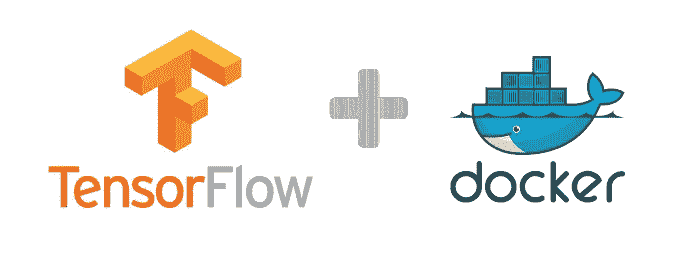

# 如何用 TensorFlow 部署机器学习模型？第 2 部分—容器化！

> 原文：<https://towardsdatascience.com/how-to-deploy-machine-learning-models-with-tensorflow-part-2-containerize-it-db0ad7ca35a7?source=collection_archive---------0----------------------->



如[第 1 部分](https://medium.com/@vitaly.bezgachev/how-to-deploy-machine-learning-models-with-tensorflow-part-1-make-your-model-ready-for-serving-776a14ec3198)所述，我想将我的深度学习模型部署到生产中。我已经展示了如何为 [TensorFlow 服务](https://tensorflow.github.io/serving/)准备模型。我们将 GAN 模型作为 [Protobuf](https://github.com/google/protobuf) 导出，现在它已经可以托管了。

# 可部署人工制品的步骤

TensorFlow 服务实现了一个处理传入请求并将其转发给模型的服务器。这个服务器可能运行在某个地方，很可能是在你的云提供商(比如 Amazon AWS，Google Cloud Platform，Microsoft Azure)那里，对全世界开放。

如今，将这样的服务器及其所有依赖项打包到一个包中，并作为一个整体进行配置和部署是很常见的。

为此，您可以创建一个虚拟机映像，但是它非常笨重，我不建议将其用于服务部署。(尽管预配置的虚拟机对于为开发人员提供工作环境非常有用)。

通常我们使用容器来创建可部署的工件。然后我们可以在任何地方部署它们——本地、内部网、云中。这样的容器将包括您的服务及其所有依赖项。你只需要在操作系统上安装一个运行你的容器的薄层。

最流行的容器平台是 [Docker](https://www.docker.com/) 。我们需要创建一个 Docker 映像，在该映像上创建一个容器并运行它。首先—在我们的本地操作系统中。

与我们的情况相对应——我们应该测试容器是否运行，TensorFlow 提供的服务器是否成功启动，接受对我们模型的请求并对它们做出响应。

# 在本地获取码头工人

在本地，我们应该安装 Docker 来运行我们的容器。我参考官方[文档](https://docs.docker.com/engine/installation/)，因为我无法更好地描述安装程序。

**提示**:如果你在 Ubuntu 下，很可能你必须对每个 Docker 命令使用 *sudo* 。我强烈建议采取以下措施来避免这种情况:

*   如果 **docker** 组不存在，添加该组
*   将连接的用户 *$USER* 添加到 *docker* 组

```
sudo groupadd docker
sudo usermod -aG docker $USER
```

*   重启你的电脑

现在你应该可以不用 T21 就能执行 Docker 命令了。例如

```
docker version
```

应该显示系统和版本信息，而没有任何关于缺少权限的错误。

# 为 TensorFlow 服务创建 Docker 映像并运行容器

TensorFlow 服务提供 Docker 映像，因此我们可以克隆存储库并使用它们。

## 获取 TensorFlow 服务

这非常简单——只需克隆存储库:

```
cd ~git clone https://github.com/tensorflow/serving.git
```

## 构建 Docker 映像并运行容器

Docker 映像的配置是通过 Docker 文件定义的。TensorFlow 服务提供了其中的两种—一种用于 CPU 构建，一种用于 GPU 构建。两者都可以在*serving/tensor flow _ serving/tools/docker*下找到:

*   用于 CPU 构建的 *Dockerfile.devel*
*   *用于 gpu 构建的 Dockerfile.devel-gpu*

**英伟达 Docker**

如果你的机器上有 NVidia GPU 并安装了 CUDA 和 cuDNN 库，我强烈建议创建一个支持 GPU 的 Docker 容器。之前要安装 [*nvidia-docker*](https://github.com/NVIDIA/nvidia-docker) 才能正常工作。这里的[简单明了，描述得很好](https://github.com/nvidia/nvidia-docker/wiki/Installation-(version-2.0))。在我的例子中，我使用了以下命令序列:

```
curl -s -L https://nvidia.github.io/nvidia-docker/gpgkey | \
  sudo apt-key add -distribution=$(. /etc/os-release;echo $ID$VERSION_ID)curl -s -L https://nvidia.github.io/nvidia-docker/$distribution/nvidia-docker.list | \
  sudo tee /etc/apt/sources.list.d/nvidia-docker.listsudo apt-get update
sudo apt-get install nvidia-docker2
sudo pkill -SIGHUP dockerd
```

**提示**:由于我使用了 GPU Dockerfile，所以在接下来的步骤中我会参考它。使用 CPU Dockerfile，您可以以同样的方式工作。唯一的区别是，你不需要通过运行容器 *nvidia-docker* 和 *runtime=nvidia* 标志。

让我们创建我们的 Docker 图像:

```
cd serving
docker build --pull -t $USER/tensorflow-serving-devel-gpu -f tensorflow_serving/tools/docker/Dockerfile.devel-gpu .
```

下载依赖项和构建映像大约需要一个小时或更长时间…现在我们可以运行 Docker 容器:

```
docker run --runtime=nvidia --name=tf_container_gpu -it $USER/tensorflow-serving-devel-gpu
```

如果一切正常，恭喜你！您现在位于 TensorFlow 服务 Docker 容器的外壳中。

**提示**:当您用*退出*命令离开集装箱外壳时，集装箱停止。要再次启动它，请执行:

```
docker start -i tf_container_gpu
```

不要移除容器！否则，您所做的更改将会消失。另外，请注意，我们在这里不需要 *runtime=nvidia* 参数。

Docker 容器中包含所有必要的组件，如 Python、Bazel 等。已安装，TensorFlow 服务器已准备就绪。如果我们执行

```
tensorflow_model_server
```

在 Shell 内部运行 Docker 容器，我们应该看到使用信息。

## 部署模型

首先，让我们创建一个工作目录。在运行容器的外壳中执行:

```
mkdir serving
```

接下来，我们将导出的模型(参见[第 1 部分](https://medium.com/towards-data-science/how-to-deploy-machine-learning-models-with-tensorflow-part-1-make-your-model-ready-for-serving-776a14ec3198))复制到 TensorFlow 容器中。从您的 **PC** 上的 Shell:

```
cd <path to GAN project>
docker cp ./gan-export tf_container_gpu:/serving
```

您应该将导出的模型文件夹放在**容器**中。从它的外壳来看:

```
cd /serving
ls ./gan-export/1
```

你应该看到*变量*文件夹和 *saved_model.pb* 文件。

## 开始上菜

万岁！我们已经准备好通过 TensorFlow 托管我们的模型:-)

```
tensorflow_model_server --port=9000 --model_name=gan --model_base_path=/serving/gan-export &> gan_log &
```

如果你检查日志…

```
cat gan_log
```

…您应该在最后一个字符串中看到类似这样的内容:

```
I tensorflow_serving/model_servers/main.cc:298] Running ModelServer at 0.0.0.0:9000 …
```

# 断点

我们走了很多步，但都很简单明了。他们需要大量的时间，因为要从源代码下载和构建。

所以我们在 Docker 容器中开始我们的模型，它在本地运行。但是我们可以保存容器和我们的更改，并在以后部署它，例如，部署到云中。在此之前，我们希望确保我们的模型接受请求和对请求的响应。我们的模型需要一个客户！

# 创建客户端

TensorFlow 服务基于 [gRPC](http://www.grpc.io/) 协议，因此您确实需要创建一个能够通过它进行“对话”的客户端。在[教程](https://tensorflow.github.io/serving/serving_advanced)中，他们使用了一个构建在 Docker 容器中的示例客户端。但是我想要一个在我的 PC 上运行的客户端，它可以向 TensorFlow 容器中托管的模型发出请求。

**提示:**我们在 **PC** 上执行的所有后续步骤(不在 Docker 容器中！).请记住，我们已经克隆了 TensorFlow 服务存储库。

## 其他 Python 库

首先，我们需要 Python 环境中的 gRPC 库。我从 PyPI 安装了它们:

```
pip install grpcio grpcio-tools
```

## 张量流预测服务

对于我们的客户，我们需要 TensorFlow 服务 API。问题— API 是以 Protobuf 的形式提供的(可以在*serving/tensor flow _ serving/APIs)*下找到)。如果我们想在客户机中使用它们，我们需要从这些 Protobuf 中生成 Python 文件。我这样做了，并将生成的文件放入我的[存储库](https://github.com/Vetal1977/tf_serving_example/tree/master/tensorflow_serving/apis)。如果你愿意，你可以自己做(虽然有点棘手):

```
# 1
cd <tensorflow serving source folder># 2
git clone [https://github.com/tensorflow/tensorflow.git](https://github.com/tensorflow/tensorflow.git)# 3
python -m grpc.tools.protoc ./tensorflow_serving/apis/*.proto --python_out=<path to GAN project> --grpc_python_out=<path to GAN project> --proto_path=.
```

步骤的简短说明:

1.  更改到包含 TensorFlow 服务源的文件夹
2.  TensorFlow Serving 使用核心框架 Protobuf 的(*Serving/tensor flow/tensor flow/core/framework*)。获得它们最简单的方法是从 Git 存储库中克隆 TensorFlow 框架
3.  这里我们从 Protobuf 为我们的客户生成 Python 文件

## 客户

我已经[实现了](https://github.com/Vetal1977/tf_serving_example/blob/master/svnh_semi_supervised_client.py)客户端，这比上面所有准备工作都要简单:-)这里您只需使用 gRPC 和 TensorFlow 服务 API 来发出请求。最有趣的部分是:

```
# Send request 
with open(FLAGS.image, ‘rb’) as f: 
    # 1
    data = f.read() # 2
    request = predict_pb2.PredictRequest()    # 3    
    request.model_spec.name = 'gan' 
    request.model_spec.signature_name = 'predict_images' 
    request.inputs['images'].CopyFrom( 
        tf.contrib.util.make_tensor_proto(
            data, shape=[1])) # 4
    result = stub.Predict(request, 60.0)
```

1.  打开(JPEG)文件
2.  创建预测请求对象
3.  初始化对我们的 GAN 模型的预测请求。在这里，我们指定:模型的名称(它必须与我们启动 *tensorflow_model_server* 时的 *model_name* 参数相匹配)、签名名称(我们只有 *predict_images* 和数据(在我们的例子中是 JPEG 图像)
4.  服务器上的呼叫预测。

# 呼叫预测

现在我们可以调用运行在 Docker 容器中的模型。获取容器 IP 地址:

```
docker network inspect bridge | grep IPv4Address
```

我的情况是 172.17.0.2。

接下来，我们需要测试图像——我从街景门牌号码测试集中提取了几张图像(以 MATLAB 格式提供),并将它们放在这里[处](https://github.com/Vetal1977/tf_serving_example/tree/master/svnh_test_images)。现在—发出客户端请求:

```
cd <path to GAN project>
python svnh_semi_supervised_client.py --server=172.17.0.2:9000 --image=./svnh_test_images/image_3.jpg
```

**提示**:有时候，Docker 容器的 IP 地址不起作用。在这种情况下，我们可以使用*0 . 0 . 0*或 *localhost* 。如果你有问题，试试这些。例如:

```
python svnh_semi_supervised_client.py --server=localhost:9000 ...
```

您应该会看到类似这样的内容:

```
outputs {
  key: “scores”
  value {
    dtype: DT_FLOAT
    tensor_shape {
      dim {
        size: 1
      }
      dim {
        size: 10
      }
    }
    float_val: 8.630897802584857e-17
    float_val: 1.219293777054986e-09
    float_val: 6.613714575998131e-10
    float_val: 1.5203355241411032e-09
    **float_val: 0.9999998807907104**
    float_val: 9.070973139291283e-12
    float_val: 1.5690838628401593e-09
    float_val: 9.12262028080068e-17
    float_val: 1.0587883991775016e-07
    float_val: 1.0302327879685436e-08
  }
}
```

我用**粗体**标记了最高分，它实际上对应于样本图像中的“4”(数字从 0 到 9) :-)我的 GAN 模型相对简单，精确度约为 68%。

# 而不是结论

在第二部分中，我们创建了 TensorFlow 服务容器，将 GAN 模型复制到其中，并启动公开我们模型的服务器。为了进行测试，我们创建了 gRPC 客户端，可以在 PC 上本地运行，并向我们的模型发出请求。

在[下一部](https://medium.com/@vitaly.bezgachev/how-to-deploy-machine-learning-models-with-tensorflow-part-3-into-the-cloud-7115ff774bb6)中，我们将把我们的模型公之于众！