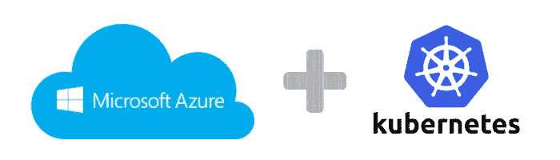

# 如何用 TensorFlow 部署机器学习模型？第 3 部分—进入云！

> 原文：<https://towardsdatascience.com/how-to-deploy-machine-learning-models-with-tensorflow-part-3-into-the-cloud-7115ff774bb6?source=collection_archive---------1----------------------->



在[第 1 部分](https://medium.com/towards-data-science/how-to-deploy-machine-learning-models-with-tensorflow-part-1-make-your-model-ready-for-serving-776a14ec3198)和[第 2 部分](https://medium.com/towards-data-science/how-to-deploy-machine-learning-models-with-tensorflow-part-2-containerize-it-db0ad7ca35a7)中，我们创建了一个 GAN 模型来预测[街景门牌号码](http://ufldl.stanford.edu/housenumbers/)，并在 [Docker](https://www.docker.com/) 容器中使用 [TensorFlow 本地服务](https://tensorflow.github.io/serving/)来托管它。现在是将它引入云的时候了！

# 动机

当您实现一个 web 服务(比如预测服务)并希望其他人使用它时，您可以在云托管提供商处发布它。通常，您不想关心诸如服务的可用性、可伸缩性之类的事情；你想专注于开发你的模型和算法。

如今，你有大量的云平台提供商可供选择。最突出的是亚马逊 AWS、微软 Azure、谷歌云平台、IBM Bluemix。一旦服务被部署到他们的服务器上，他们就提供资源并负责服务的可用性。

第二个重要任务是自动化。您希望自动部署、扩展和管理您的服务。就我个人而言，我希望每次单击鼠标或运行一个简单的脚本就能部署，我希望我的服务在收到更多请求时能自动扩展，我希望在崩溃时无需手动干预就能恢复，等等。这里一个工具 [Kubernetes](https://kubernetes.io/) 开始发挥作用。

> Kubernetes 是一个开源系统，用于自动化部署、扩展和管理容器化的应用程序。

Kubernetes 是由 Google 开发和支持的。所以你绝对可以依赖它。上面列出的云提供商有内置的 it 支持。因此，我们可以相对容易地将部署设置到云中。

# 云提供商选择

对于这篇文章，我使用微软 Azure。主要是因为一个原因——他们提供 30 天的试用期和 200 美元的信用额度。

我也看了其他供应商。在 AWS，我没有找到免费获得小型 Kubernetes 集群的可能性。在谷歌你可以免费测试他们的云平台，但是他们用“账户类型=业务”吓到我了(我只是想给自己一个小的测试环境)。IBM Bluemix 不是很直观。

所以我选择了微软 Azure，他们也有很好的用户界面:-)

# 准备 Docker 图像

在我们进入 Kubernetes 之前，我们需要保存 Docker 容器以及我们所做的所有更改，作为一个图像。首先，我们需要容器 ID:

```
docker ps --all
```

您将获得所有 Docker 容器的列表——选择您已经创建的容器。例如:

```
CONTAINER ID IMAGE COMMAND CREATED STATUS PORTS NAMES
**35027f92f2f8** <your user name>/tensorflow-serving-devel "/bin/bash" 4 days ago Exited (0) 4 days ago tf_container_cpu
```

我用粗体字标出了我们需要的 ID。

**提示**:由于我不想在云中使用昂贵的 GPU 驱动的虚拟机，我选择了 TensorFlow 服务 CPU Docker 容器。

现在我们可以从容器中创建 Docker 图像:

```
docker commit **35027f92f2f8** $USER/tensorflow-serving-gan:v1.0
```

如果你查看图片列表( *docker images* 命令)，你应该会发现一个新创建的图片 *<你的用户名> /tensorflow-serving-gan* 标签为 *v1.0* 。图像是近似的。比原来的大 5 倍，因为我们下载并制作了很多新东西。

# 库伯内特。重要概念简介

我鼓励你查看 Kubernetes 的文档,了解它的功能、概念和教程。在这里，我只是给了一个非常粗略的想法，如何与它合作。

我们将 Docker 映像部署到 Kubernetes 集群中。Kubernetes 集群至少由一个主节点和一个或多个工作节点组成。

## 结节

节点是 Kubernetes 集群中的一个工作机(虚拟机或裸机)。它由主组件管理，拥有运行 **Pods** 的所有服务。这些服务包括，例如，Docker，这对我们很重要。

我们将创建一个主节点和一个工作节点。主节点不运行任何 Pod，它的职责是集群管理。

## **Pod**

Pod 是由一个或多个容器、这些容器的共享存储以及关于如何运行容器的选项组成的组。所以 Pod 是逻辑相关容器的逻辑主机。

在我们的 Pod 中，我们只有一个 Docker 容器，即我们的 TensorFlow GAN 服务。我们将创建两个 pod，尽管它们将在同一个节点上运行。

## 服务

豆荚是会死的。他们出生和死亡。特别是复制控制器动态地创建和销毁 pod。虽然每个 Pod 都有自己的 IP 地址，但是这些 IP 地址并不可靠。因此，如果我们有需要相互通信的 pod(例如前端到后端)，或者我们想要从外部访问一些 pod(在我们的例子中)，那么我们就有问题了。

Kubernetes **服务**解决。这是一个抽象概念，它定义了一组逻辑单元和访问它们的策略。在我们的例子中，我们将创建一个抽象两个 pod 的服务。

# 在 Microsoft Azure 上设置 Kubernetes 群集

Microsoft Azure 提供了一种设置和操作 Kubernetes 集群的便捷方式。首先你需要 Azure 账号。

## 进入 Microsoft Azure

*   在[https://azure.microsoft.com/free/](https://azure.microsoft.com/free/)获得 Azure 免费试用账户。如果你已经有微软帐号，你可以使用它。
*   微软提供 200 美元的信用额度来启动 Azure。这对我们的目的来说已经足够了。
*   去 [Azure 门户](https://portal.azure.com/)，检查你是否有完全访问权限。
*   在你的电脑上本地安装 [Azure 命令行界面](https://docs.microsoft.com/en-us/cli/azure/install-azure-cli)。在 64 位 Ubuntu 中，您可以从终端完成:

```
echo "deb [arch=amd64] [https://packages.microsoft.com/repos/azure-cli/](https://packages.microsoft.com/repos/azure-cli/) wheezy main" | \
sudo tee /etc/apt/sources.list.d/azure-cli.listsudo apt-key adv --keyserver packages.microsoft.com --recv-keys 417A0893sudo apt-get install apt-transport-httpssudo apt-get update && sudo apt-get install azure-cli
```

然后使用以下命令检查安装的版本:

```
az --version
```

它应该等于或大于 2.0.x。

## 创建 Kubernetes 集群

您需要通过简单的步骤来创建一个 Kubernetes 集群。

**登录 Azure**

```
az login
```

并遵循终端和浏览器中的指示。最后，您应该会看到一个带有云信息的 [JSON](http://www.json.org/) 文档。

**创建资源组**

资源组是一个逻辑组，您可以在其中部署资源(例如虚拟机)并管理它们。

```
az group create --name ganRG --location eastus
```

您应该会看到一个包含资源组信息的 JSON 文档。

**创建集群**

现在是时候创建 Kubernetes 集群了。在 Azure 免费试用版中，我们最多可以使用 4 个内核，因此我们只能创建一个主内核和一个工作内核；它们每个都有两个内核。主节点是自动创建的， *agent-count* 指定工作(或代理)节点的数量。

```
az acs create --orchestrator-type=kubernetes \
--resource-group ganRG \
--name=ganK8sCluster \
--agent-count=1 \
--generate-ssh-keys
```

**提示**:不要使用很长的名称，我在创建 Kubernetes 服务时遇到了一个错误，它抱怨名称太长(Azure 给集群名称添加了相当长的后缀)。

如果 SSH 密钥不存在，您还会在默认位置收到生成的 SSH 密钥。稍等几分钟…如果一切正常，那么您应该会看到包含集群信息的相当长且详细的 JSON 文档。确信您的资源组中已经创建了一个集群

```
{
.........
  "resourceGroup": "ganRG"
}
```

您还可以在 Azure Portal 中检查我们在资源组 *ganRG* 中有两个虚拟机—*k8s-master—…*和*k8s-agent—…*。

**注意事项**

如果您不使用虚拟机，请注意停止或取消分配虚拟机，以避免额外成本:

```
az vm [stop|deallocate] — resource-group=ganRG — name=k8s-agent-…
az vm [stop|deallocate] — resource-group=ganRG — name=k8s-master-…
```

您可以使用以下命令重新启动它们:

```
az vm start — resource-group=ganRG — name=k8s-agent-…
az vm start — resource-group=ganRG — name=k8s-master-…
```

# 将 Docker 图像上传到 Azure

现在我和 Kubernetes 做一个短暂的休息，把我们的 Docker 图片上传到 Azure 容器注册中心。它是我们在云中的 Docker 私有注册表。我们需要这个注册中心将 Docker 映像放入我们的 Kubernetes 集群。

## 创建容器注册表

```
az acr create --name=ganEcr --resource-group=ganRG --sku=Basic
```

创建一个私有注册表 *ganEcr* 。作为响应，您应该得到一个包含注册表信息的 JSON 文档。有趣的领域有:

```
{
  "adminUserEnabled": false,
  .........
  "loginServer": "ganecr.azurecr.io",
  .........
}
```

第一个告诉您，注册表没有管理员，第二个告诉您资源组中服务器的名称。为了上传 Docker 图像，我们需要一名管理员，我们必须让他:

```
az acr update -n ganEcr --admin-enabled true
```

## 上传 Docker 图像

首先，我们必须提供上传凭证:

```
az acr credential show --name=ganEcr
```

您应该会收到类似以下内容的响应:

```
{
  "passwords": [
    {
      "name": "password",
      "value": "=bh5wXWOUSrJtKPHReTAgi/bijQCkjsq"
    },
    {
      "name": "password2",
      "value": "OV0Va1QXv=GPL+sGm9ZossmvgIoYBdif"
    }
  ],
  "username": "ganEcr"
}
```

您使用一个*用户名*和一个密码从 Docker:

```
docker login ganecr.azurecr.io -u=ganEcr -p=<password value from credentials>
```

然后以这种方式标记 GAN Docker 图像:

```
docker tag $USER/tensorflow-serving-gan:v1.0 ganecr.azurecr.io/tensorflow-serving-gan
```

现在你可以把它推到 Azure 容器注册！

```
docker push ganecr.azurecr.io/tensorflow-serving-gan
```

耐心点，这需要一段时间:-)记住，这个操作将 Docker 镜像从你的 PC 上传到微软服务器。

# 在 Kubernetes 集群上运行

回到库伯内特。对于集群上的操作，我们需要一个名为 *kubectl* 的工具。它是一个命令行界面，用于对 Kubernetes 集群运行命令。

我建议您查看 kubectl 文档中的可用命令列表。我在这里使用:

```
kubectl get [nodes|pods|services] 
```

分别获取关于 Kubernetes 节点、pod 和服务的信息

```
kubectl create ...
```

用于从配置文件创建 pod 和服务。

## 用 kubectl 连接到 Azure

首先从 Azure 获取凭据:

```
az acs kubernetes get-credentials --resource-group=ganRG --name=ganK8sCluster
```

这个命令从 Azure 获取凭证并将它们本地保存到 *~/。kube/config* 。所以你不需要以后再问他们。

现在，使用 *kubectl* 验证到集群的连接:

```
kubectl get nodes
```

您应该会看到主节点和工作节点:

```
NAME                    STATUS                     AGE       VERSION
k8s-agent-bb8987c3-0    Ready                      7m        v1.6.6
k8s-master-bb8987c3-0   Ready,SchedulingDisabled   7m        v1.6.6
```

## 部署配置

我已经为部署到 Kubernetes 集群创建了一个[配置文件](https://github.com/Vetal1977/tf_serving_example/blob/master/gan_k8s.yaml) (YAML 格式)。在那里，我定义了一个[部署控制器](https://kubernetes.io/docs/concepts/workloads/controllers/deployment/)和一个[服务](https://kubernetes.io/docs/concepts/services-networking/service/)。我鼓励您阅读 Kubernetes 文档以获取详细信息。

这里只是一个解释，我所做的。实际上，您可以使用 *kubectl* 命令来部署 pod 和服务，但是将所需的部署配置一次性写入这样的 YAML 文件并在以后使用它要方便得多。

在我们的例子中，它定义了一个部署和一个服务:

```
......
kind: Deployment
metadata:
  name: gan-deployment
......
---
kind: Service
metadata:
  labels:
    run: gan-service
  name: gan-service
```

**部署**

我想将我的 Docker 映像部署到两个单元中:

```
spec:
replicas: 2
```

并从我的 Azure 容器注册表中提取它:

```
spec:
  containers:
  - name: gan-container
    image: ganecr.azurecr.io/tensorflow-serving-gan
```

部署后，Pod 应该启动 Shell 并启动 TensorFlow，在 Docker 容器中为 GAN 模型提供服务:

```
command:
- /bin/sh
- -c
args:
- /serving/bazel-bin/tensorflow_serving/model_servers/tensorflow_model_server          --port=9000 --model_name=gan --model_base_path=/serving/gan-export
```

在端口 9000 上:

```
ports:
- containerPort: 9000
```

**服务**

服务必须在端口 9000 上接受外部请求，并将它们转发到 Pod 中的容器端口 9000:

```
ports:
- port: 9000
  targetPort: 9000
```

并在两个底层 pod 之间提供负载平衡:

```
type: LoadBalancer
```

## 部署到 Kubernetes 集群中

现在部署 Docker 映像，让 Kubernetes 来管理它！

```
cd <path to GAN project>
kubectl create -f gan_k8s.yaml
```

您应该看到:

```
deployment "gan-deployment" created
service "gan-service" created
```

现在检查 pod 是否正在运行:

```
kubectl get podsNAME                              READY     STATUS    RESTARTS   AGE
gan-deployment-3500298660-3gmkj   1/1       Running   0          24m
gan-deployment-3500298660-h9g3q   1/1       Running   0          24m
```

**提示**:状态变为*运行*需要一段时间。只有这样你才能确定豆荚已经准备好了。

服务准备就绪:

```
kubectl get servicesNAME          CLUSTER-IP     EXTERNAL-IP    PORT(S)          AGE
gan-service   10.0.134.234   40.87.62.198   9000:30694/TCP   24m
kubernetes    10.0.0.1       <none>         443/TCP          7h
```

**提示**:gan 服务的外部 IP 必须是有效的 IP(不是*<>*或 *<节点>* )。否则，该服务不可操作。

# 检查它是否工作

所以现在我们可以检查我们的努力是值得的！

```
cd <path to GAN project>
python svnh_semi_supervised_client.py --server=40.87.62.198:9000 --image=./svnh_test_images/image_3.jpg
```

您应该看到:

```
outputs {
  key: "scores"
  value {
    dtype: DT_FLOAT
    tensor_shape {
      dim {
        size: 1
      }
      dim {
        size: 10
      }
    }
    float_val: 8.630897802584857e-17
    float_val: 1.219293777054986e-09
    float_val: 6.613714575998131e-10
    float_val: 1.5203355241411032e-09
    **float_val: 0.9999998807907104** float_val: 9.070973139291283e-12
    float_val: 1.5690838628401593e-09
    float_val: 9.12262028080068e-17
    float_val: 1.0587883991775016e-07
    float_val: 1.0302327879685436e-08
  }
}
```

如果你得到这个结果，恭喜你！您在 Kubernetes 集群的云中部署了 GAN 模型。Kubernetes 以可靠的方式扩展、负载平衡和管理 GAN 模型。

# 结论

在[第 1 部分](https://medium.com/towards-data-science/how-to-deploy-machine-learning-models-with-tensorflow-part-1-make-your-model-ready-for-serving-776a14ec3198)和[第 2 部分](https://medium.com/towards-data-science/how-to-deploy-machine-learning-models-with-tensorflow-part-2-containerize-it-db0ad7ca35a7)中，我们创建了一个 GAN 模型，准备好供 TensorFlow 使用，并将其放入 Docker 容器中。工作量很大，但我们都是在当地生产的。

现在我们把它公之于众，并使用最先进的技术，以可靠和可扩展的方式做到了这一点。

当然，这个模型非常简单，并且以用户不友好的形式给出结果。自动化潜力很大，我做了很多手动步骤来解释其中的机制。所有步骤都可以打包到脚本中进行“一键式”部署，或者成为持续集成/持续部署管道的一部分。

我希望你喜欢这个教程，并发现它很有用。如有任何疑问或问题，请随时与我联系。

# 更新 12。2017 年 11 月

我用[指令](https://medium.com/@vitaly.bezgachev/creating-restful-api-to-tensorflow-models-c5c57b692c10)扩展了一个教程，如何为模型创建 REST API，由 TensorFlow Serving 托管。