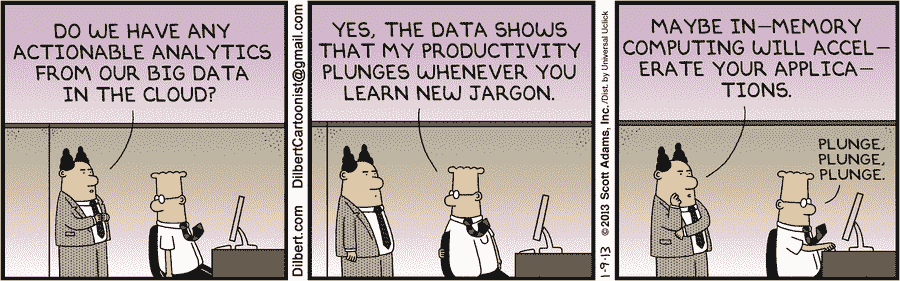
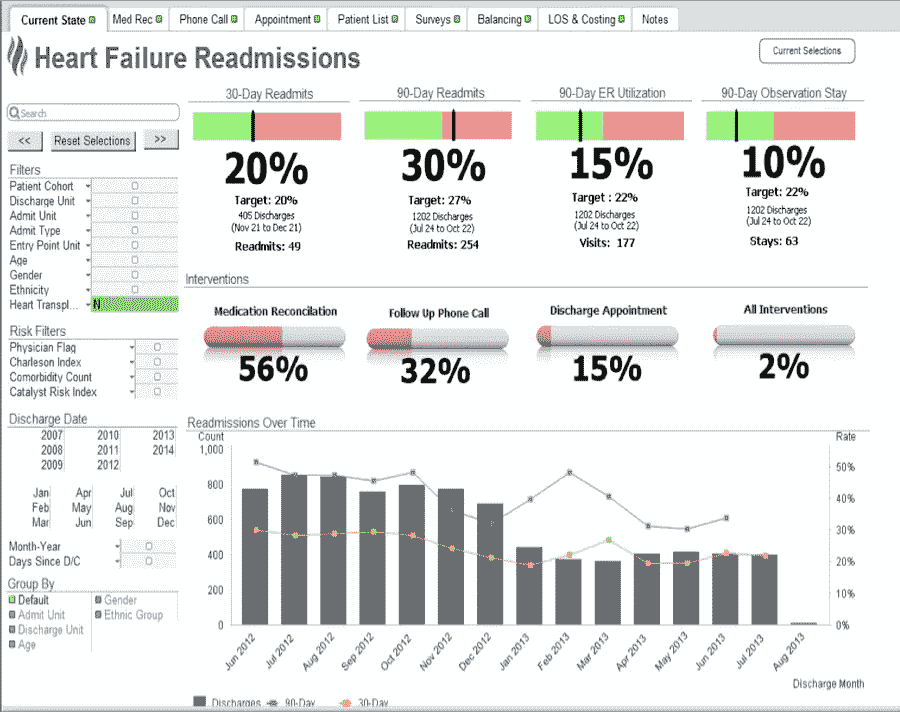

# 如何开发成功的医疗保健分析产品

> 原文：<https://towardsdatascience.com/how-to-develop-a-successful-healthcare-analytics-product-e36e0d4cb141?source=collection_archive---------6----------------------->

分析和数据科学是医疗保健的重要工具。不仅仅是因为他们能够预测某人何时会心脏病发作。良好的数据科学和分析是重要的工具，因为它们有助于在医疗保健支出和减少低效方面做出更好的决策。能够降低医疗服务提供者的医疗保健成本将反过来允许他们允许更多的人获得医疗保健。

当看着所有其他长期使用分析和算法的行业(如金融/银行和电子商务)时，医疗保健的诱惑是试图全面解决医疗保健中的所有数据问题。这反过来导致对数据团队、数据湖和其他以数据为中心的计划的大量投资[，这些投资并不总是成功的](http://www.acheronanalytics.com/acheron-blog/top-32-reasons-data-science-projects-fail)。[类似于 DC 电影未能像马福](https://www.cnet.com/special-reports/marvel-cinematic-universe-dc-extended-universe-showdown/) l 一样吸引观众注意力的原因之一。他们匆忙尝试创造类似于漫威用三分之一的时间用十年创造的东西。同样，许多医疗保健公司试图建立数据科学商店，并试图在几年内复制谷歌、亚马逊和其他一些大型科技公司已经做了十多年的事情。

在这种熟练水平上建立分析团队和数据系统需要时间(让我们甚至不要开始数据标记)。而不是试图在一年内创建一个完整的数据分析和算法世界。我们已经取得了成功，从一两个问题开始([像在网上卖书，但在医疗保健行业](http://www.latimes.com/business/la-fi-amazon-history-20170618-htmlstory.html))，选择一个观点来解决问题，然后讲一个简单的故事。如果你的数据团队能够做到这一点并取得成功，那么你就离成功更近了，并且已经开始获得支持者和经理的支持。医疗保健是复杂的，所以在向一个大团队投资数百万美元之前，先从关注几个问题和有限的视角开始。

​

# **挑一个问题拿一个**

当谈到医疗保健分析(或任何分析)时，重要的是选择一个特定的问题，然后将该问题分成更小的部分。例如，如果你试图开发一个检测欺诈的算法。设计一个模型、算法或系统来将欺诈的概念作为一个整体抽象成一个单一的数学表达式可能非常困难。尤其是当医疗保健互动很少被归类为欺诈或非欺诈时。

这并不妨碍你进行分析或预测建模。它只是改变了你的方法。与其开发复杂的数据科学模型，不如先关注那些有良好投资回报的东西。一个基本系统可以帮助首先减少分析师不得不为欺诈而费力处理的索赔数量，或者在更高的级别指出更大的系统性问题，可以帮助知道首先将精力集中在哪里。此外，他们可以通过互动来标记和记录模式。

在花一些时间查看这些案例后，您的分析团队将会对问题有进一步的了解，并会有许多优秀的最佳实践和标签数据。最后，这可能看起来很慢，但慢总比失败好。

# **专注于一个角度**

当开发任何类型的分析时，你可以采取许多不同的角度和观点。例如，在医疗保健领域，您可以关注医疗保健提供商(医院、急诊室等)、患者或手术类型。你的团队可能没有足够的资源来开发一个工具、仪表盘或算法来立刻处理所有这些不同的角度。因此，当承担一个像“预测病人再入院”这样的新项目时，选择一个对你的团队最有益的类别。通常，首先关注提供商是更好的选择之一。这是因为与患者行为相比，改变提供者行为要容易得多。当你改变一个提供者的行为时，其影响比改变一个病人的行为要大得多。这也是为什么首先关注提供商层面的分析会有所帮助的两个原因。此外，就像上面讨论的那样，它可以帮助关注和查明患者层面的一些更具体的问题。

# **你的最终作品应该有一个清晰的故事**

一旦你开发出了产品的最终数据点，这个产品就需要能够讲述一个故事。老实说，这对我来说仍然是一个困难的部分。然而，这是一个非常重要的概念。即使你是一个了不起的程序员、数据工程师或算法开发人员，如果你的产品没有向你的最终用户描绘一个清晰的故事，那么它可能会被忽略或误解。通常，我所看到的成功的报告流程是对问题有一个高层次的了解，如果适用的话，可能包括问题的成本。这让每个人都在同一页面上，也吸引了他们的注意力。如果你能说明问题有多大，花费了他们多少钱，最终用户就会被吸引过来。

然后你可以进一步深入问题，把它分解成子集，然后进入下一步。

接下来的步骤不一定是直接的解决方案。这可能是一个有问题的程序列表，导致大量的再入院或欺诈。这导致了下一个可能的项目是分析为什么。一旦你找到了可能的原因和解决方案，你就可以回头看看报告，看看事情是否有所改变。

*Caption: Taking a quick detour, lets look at a few dashboards from actual companies. The dashboard above is from Health Catalyst. The top portion is attempting to state whether or not the cohort is currently meeting the target for various readmissions. This kind of states if there is a problem or not. It is pretty typical for medical analytics to do a comparison approach. The middle section is a little bit of a disconnect for me. It doesn’t really flow with the story they are trying to tell. It talks about interventions, but this doesn’t really connect with the first set of graphs. However, the last section that is a bar graph melded with a line chart makes sense because it tells you the history. So maybe you’re not hitting your target readmission numbers, but you are improving*

总的来说，你处理医疗保健分析或开发算法来预测患者再入院等事件的方式与任何其他行业没有什么不同。试图解决整个问题，比如欺诈，或者将病人重新入院作为一个整体，这是很有诱惑力的。医疗保健行业的海量数据和复杂的交易并不容易。为了管理这种复杂性，分解问题并决定你计划采取的观点将有助于增加你的成功和结果率。

您的团队在开发医疗保健分析方面需要帮助吗？也许你正在寻找衡量供应商质量或分析患者模式。如果是这样，那么[今天就联系我们的团队](http://www.acheronanalytics.com/contact.html) y！我们有一个医疗保健分析专家团队，可以帮助您创建所需的工具。

我们已经致力于开发产品来帮助管理患者再入院、资源滥用、检测不必要的程序、慢性病预防和欺诈检测。

如果您想了解更多关于数据科学或分析的信息，请查看以下文章:

[Men ' s wear house 如何使用数据科学](https://www.theseattledataguy.com/how-mens-wearhouse-could-use-data-science-cont/)
[如何使用 R 开发预测模型](https://www.youtube.com/watch?v=8cKeAH2aGVI&t=6s)
[使用 Google Sheets 进行网页抓取](https://hackernoon.com/web-scraping-with-google-sheets-20d0dce323cc?source=activity---post_recommended_rollup)
[什么是决策树](http://www.acheronanalytics.com/acheron-blog/brilliant-explanation-of-a-decision-tree-algorithms) [算法如何变得不道德和有偏见](http://www.acheronanalytics.com/acheron-blog/how-do-machines-learn-bias-data-science)
[如何开发健壮的算法](https://medium.com/@SeattleDataGuy/how-to-develop-a-robust-algorithm-c38e08f32201)
[4 数据科学家必须具备的技能](https://www.theseattledataguy.com/4-skills-data-scientist-must-have/)