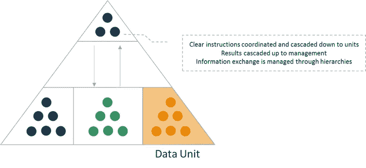
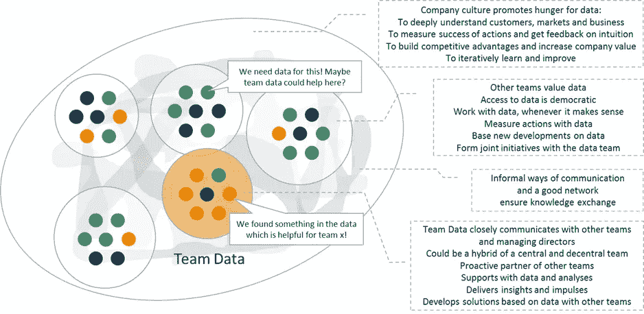

# 如何在你的公司做数据科学才能发挥最大作用？

> 原文：<https://towardsdatascience.com/how-to-do-data-science-in-your-company-to-get-the-most-out-of-it-aba8f011b749?source=collection_archive---------6----------------------->

## **建立数据科学团队，营造健康的数据文化**

年轻的公司从一开始就吸收了精益开发、以客户为中心和数据驱动的设计。然而，充分利用数据的潜力仍然非常困难。这一步对于传统企业来说更是难上加难。配备了多个创业公司的资源，数据的使用似乎要困难得多。由于公司文化和技术领域的必要变化，数据计划没有取得成功(根据 Brynjolfsson 2011 年的研究，即使简单的数据驱动决策在几年前就已经显示出可以将股票价值提高 5-6%,但情况仍然如此)。

最大的线索是，我们被大量的数据和可用的使用选项所淹没，而管理或业务部门对短期内的切实成果缺乏兴趣(Veeramachaneni 2016)。

在一家高速增长的公司建立数据科学部门，我将分享一些我个人的见解，如何克服这些困难，以及如何从贵公司的数据和数据科学中获得最大收益。

我最初是一名数据科学家，只是通过查询数据库来回答一些业务问题。我还开发了普通的 Excel 模型来模拟商业行为。只要有可能，我都支持使用数据驱动的方法和统计方法来支持决策。与此同时，与许多了不起的人一起，我们已经将几个复杂的机器学习模型投入生产，我正在组建一个团队，该团队将与产品经理、开发人员和我们的管理层合作，以更多地利用数据。

接下来，我将发布几个故事，揭示我在这段旅程中的许多收获。首先，我会建议一个做数据科学的潜在结构和有利条件(**组件**)。在下一个故事中，我将展示一些数据科学项目的结果和验收驱动的项目模式(**流程**)。最后，我将介绍一些数据科学的总体知识和成功因素(**油脂**)。为了简化，因为大多数发现适用于这两种团队焦点，我将使用术语数据单位/团队，而不是数据科学单位/团队。

太棒了，我们开始吧！

## 成功的数据驱动型组织是什么样的？

首先，我们遵循这个简单的模式从数据驱动的组织开始:我们将数据集成到我们的战略核心愿景中，并将其视为竞争优势。在公司层面，我们决定在任何有意义的时候用数据挑战直觉。这样，我们可以专注于上下文、案例和手头的客户，避免机械地使用过去的经验和其他领域的经验而产生的偏见。听起来不错！

然后，我们在公司设立了一个新的数据部门，作为另一个业务部门来执行我们自己制定的计划。会出什么问题呢？

Figure 1: Top-down structure for a data unit with the goal to provide additional business value.

显然，**会出现很多问题**。首先，由于新成立的部门是一个孤岛，与其他业务部门没有紧密联系，任何分析、建议的方法或结果的接受度都将非常低，因为它不是一个合资企业。第二，因为数据部门不参与价值创造链，所以数据部门对业务的了解不足以成为业务部门的积极合作伙伴。因此，利用数据集*可能得到的解决方案并没有*启动。最后，由于业务单位将数据单位视为他们需要协调的另一个单位(这甚至适用于更多的 todos)，他们会将潜在的数据解决方案推到只需要日常工作所需的报告或分析的边缘。

那听起来不令人满意。有更好的方法吗？根据我的个人经验，从结构的角度来看，对于一个成功的数据驱动型组织来说，有几个要素是必不可少的。组成部分是**文化**、**融合**、**赋能**。在下文中，我将强调所有三个方面的关键因素，以使数据驱动的计划取得更好的结果。

Figure 2: More informal network structure that integrates a data unit with potential true business impact.

先说**文化**。对于一个数据驱动的企业来说，文化显然必须是数据驱动的(见图 2)。公司中的大多数人至少应该接受和重视数据支持的见解，即使他们不能在自己的影响范围内使用它们。然而，如果对数据的渴望根植于企业文化中，事情就会简单得多。这意味着人们天生希望更好地了解市场、客户和基于数据的衡量标准。公司应该高度重视数据，即使不把数据视为塑造业务的一种强大优势，因为它们反映了客户的信念、态度和行为。

问题来了，“一种文化是如何形成的？文化是人们从生活价值观和行为中汲取的东西，它不能直接形成”。然而，雕刻文化有一个众所周知的秘密。通过以身作则，可以做出改变。在我们的例子中，这意味着公司内有影响力的人和高管正在展示对数据和数据产品潜力的认真关注。为了克服一个主要的惯性，一个可见的和实质性的团体需要将数据置于直觉之上，寻求数据解决方案，并分别从所有的度量中寻求可测量的结果。

第二个也可能是最重要的组成部分是公司中数据团队或数据部门的**集成**(同样，我包含了数据科学)。有效的数据单元不是简单地添加到现有的结构中(参见图 1 和图 2)。如果将数据单元放在一个孤岛中，则存在与其他单元和业务目标不平衡和不一致的高风险。相反，如果数据单元与业务单元(最重要的是顶层决策)紧密联系和集成，新的见解和中断就有可能揭示隐藏在公司数据中的真正价值。简而言之:数据成功的真正秘诀是在组织的其他地方感知数据，而不是在数据团队本身(Newman 2015)。

只有决策者和产品经理了解数据模型的全部潜力，重视从争论的数据和数据解决方案中产生的洞察力，任何计划才会成功。最大的危险是，数据团队只被视为一个被动的团队，提供按需报告或分析。一个关注面如此狭窄的团队，效果将非常有限。此外，数据团队必须能够利用业务知识来开发可行的解决方案。如果数据团队一方面能够利用所有数据科学方法解决更大的问题，另一方面能够充分理解给定的业务环境，就可以找到新的有效解决方案。通过与利益相关者紧密合作，创建协作解决方案并促进数据和业务知识的交流，输出将成为在内部、面向市场或面向客户的产品中可见的结果。有了这样的端到端结果，数据可以产生真正的业务影响。

毕竟，成功的数据计划的最后一个要素是**授权**。这包括培养正确的技能并相应地定义角色。先说技巧。鉴于上述观点，最重要的技能是数据人员能够(也确实)承担责任，表达和沟通复杂的问题，并且是自我组织的。由于拥有丰富数据技能的人往往在细节层次上变得有些数学化和复杂化，这显然不是一个容易实现的需求。对于喜欢细枝末节的人来说，另一项重要技能变得清晰起来。能够走捷径并在数据争论的某一点停止的能力足以刺激业务。这需要高度的结果导向。如果你足够幸运，能为你的团队找到具备这些技能的球员，你就可以大显身手了。如果没有，最重要的任务之一就是每天练习这些技能。

这就引出了最后一点。为了从非凡的成果中获益，数据处理人员的角色需要以这样一种方式定义，即他们能够从一端到另一端自主工作。这意味着发现和解决任务或问题的责任必须完全委托给负责人，包括他或她会做正确事情的信心。此外，必须确保所有必要和有用的资源可用(例如，所有必要的数据和上下文信息)。只有消除障碍(即知识、结果和数据可以容易地获得)，才能取得优异的成果。

顺便说一句，我认为这些成功要素中的大部分以类似的方式适用于许多其他类型的团队和任务！

暂时就这样了。敬请期待第二部。在第二个故事中，我将阐述使数据驱动的计划成功的程序因素(即项目流程):

阅读第二部分:

[https://medium . com/@ till . grupp/how-to-do-data-science-in-your-company-to-get-out-of-it-part-ii-73d 7 f 7 c 86 e 51](https://medium.com/@till.grupp/how-to-do-data-science-in-your-company-to-get-the-most-out-of-it-part-ii-73d7f7c86e51)