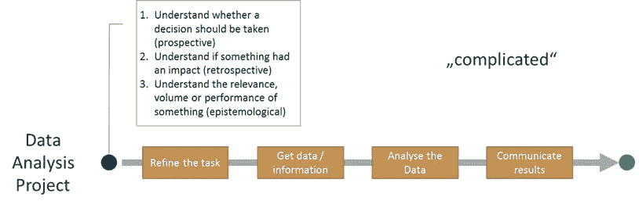
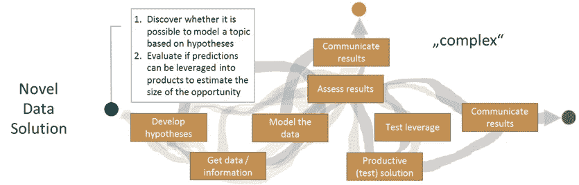
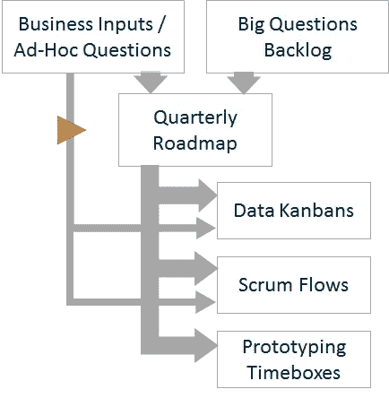

# 如何在你的公司做数据科学才能发挥最大作用？第二部分。

> 原文：<https://towardsdatascience.com/how-to-do-data-science-in-your-company-to-get-the-most-out-of-it-part-ii-73d7f7c86e51?source=collection_archive---------14----------------------->

## 定义数据项目的流程并理解它们的双峰性质

在一家快速发展的公司中建立数据科学团队，我将分享一些我个人对如何克服困难并从贵公司的数据中获得最大价值的见解。在上一个故事中，我提出了进行数据科学的潜在结构和有利条件(**组件**):

阅读第一部分:
[https://towards data science . com/how-to-do-data-science-in-your-company-to-get-out-of-it-aba8f 011 b 749](/how-to-do-data-science-in-your-company-to-get-the-most-out-of-it-aba8f011b749)

在这个故事中，我将为数据科学项目呈现一些面向结果的项目模式( **Flow** )。在下一个故事中，我将总结数据科学的知识和成功因素(**油脂**)。所有这三个故事都传达了在实现数据计划成果最大化的道路上取得的经验。

但是让我们现在就开始。下面我将概述我们如何管理和领导数据项目。这不是一项容易的任务，因为数据项目的性质可能非常不同:有些简明的问题需要快速清晰地回答，有些非常抽象的问题需要更广泛的理解和更全面的解决方案。为了描述数据项目的这种双峰性质，我将区分两种类型的项目:数据分析项目和新颖的数据解决方案。

# 数据分析项目

什么是数据分析项目？公司的努力应该以其对公司绩效 KPI 的影响来衡量。这对于学习采取什么行动是很重要的。根据我的观察，有前瞻性和回顾性思维的人:前者首先想了解一个主题，然后启动精心选择的措施，后者想快速跟随直觉，稍后才确认结果。两种观点有相似的要求:需要对一些 KPI 的一些问题进行分析，以了解范围、变化、绩效或差异，从而支持决策并消除偏见。但是，需要分析数据的时间点和问题类型不同。

数据分析项目有一定的特点:需求可以提前设定，有明确的预期结果，必要的努力在一定程度上可以提前预估。这是一个重要的特征，因为结果与决策者非常相关，并且是及时需要的。由于数据分析项目的要求有些固定，即使有时很复杂，也可以应用预定义的工作流来管理它们。这降低了风险，为请求者提供了透明性，并支持快速迭代。

Pipeline Flow of a Data Analysis Project

**我们如何处理数据分析项目？**

为了能够有效地处理分析数据项目，我们试图以面向过程的方式来管理它们。虽然我们通过不同的联系点和不同的团队收到请求，但我们会很好地协调它们。分析请求得到细化、优先化和规划。首先，我们试图理解哪个数据集市可以回答这个问题，需要什么样的分析，然后我们决定哪个团队处理这个分析。然后我们给请求者第一次反馈。当任务被执行时，我们获得数据，分析数据，与请求者一起审查结果，根据需要迭代，并快速及时地交流结果。对于大多数任务，我们使用标准流程。这不同于需要不同过程的新颖的数据解决方案，我将在下面进行描述。

# 新颖的数据解决方案

什么是新颖的数据解决方案？当我谈到这些 moonshot 项目之一时，我指的是新颖的数据解决方案，例如，试图预测具有特定属性和价格的产品是否会被销售，或者产品类型是否可以通过其图像来识别。与数据分析项目不同，人们对如何完成项目知之甚少。关注公司的模糊、复杂和一般性问题(例如，“我们想了解我们的产品”，“客户想要什么？”).我们称之为大问题。通过回答这些问题，可以开发出对业务和客户价值有重大影响的新产品和解决方案。

尽管新颖的数据解决方案为公司提供了很高的价值，但它们有着非常不同的性质:时间表通常不明确，难以估计。然而，需要付出巨大的努力才能获得初步的成果(有时是正常努力的 10 倍)。获得结果的方式是不明确的和探索性的，结果是非常不确定的。总之，这些类型的项目构成了高风险高收益的特征:它们可能被证明是根本不可行的，例如，因为所需的信息不包括在数据中，但是它们也可能对业务产生强烈的影响。这意味着他们甚至有可能扰乱和改变整个行业。结果，这些项目感觉像是“实验”,有些不寻常和独立，但是有许多依赖关系。

Explorative and Complex Flow of a Novel Data Solution

我们如何处理新奇的数据解决方案？

新颖的数据解决方案由于其非常复杂的性质和高度依赖性，只能被引导而不能被管理。提前计划并设定最后期限似乎会适得其反。然而，从我们最初的试点项目中获得一些经验后，我们开始通过一些深思熟虑的优化来管理风险。首先，我们从非常有选择性的优先级开始，只允许一些精心挑选的项目开始。这有助于保持注意力高度集中。其次，我们已经开始与**的时间盒**和**的初始快速迭代**(比如一个两周的原型)一起工作，以便在我们忙于它之前获得一些经验和对问题的理解。最后，我们已经成为了**早期失败**的忠实粉丝。这就是为什么我们从一开始就开始从端到端地切入项目的初始版本，以查看陷阱在哪里。

从完整的新数据解决方案项目组合的角度来看，我们在早期阶段就开始收集和酝酿广泛的主题，与来自产品管理、开发、营销、客户关系和管理的所有关键利益相关方进行讨论。这体现在我们定期修订的一系列大问题中。这个列表帮助我们首先对一个主题进行初步的思考和假设，包括专家的观点和市场势头，直到我们决定下一个要关注的项目。我们已经学会了一步一步地“发展”新的数据解决方案，而不是计划太难。但是我们总是与正在运行的项目仔细协调，看看我们站在哪里，并且能够控制努力和风险。我们由此采用一种**播种**、**育种**、**剔除**或**收获的方法。**分享这一点很重要:**不要固定长期路线图！**由于这类项目的本质，只需计划下一步并定期(至少每季度一次)修改现状，然后再计划下一个项目。然而，我们在我们同时运行的精选 moonshots 的明确投资组合上分散风险，因为在某些情况下，结果可能是零，但在其他情况下，结果可能是一切。

在整个过程中与所有利益相关者进行良好的沟通是非常重要的。开始时，主要目标是将商业知识和背景带入项目。随后，我们希望将风险透明化，找到潜在障碍的解决方案，并明确目标。在原型开发接近尾声时，可能的结果必须作为公司产品的一部分进行整合或测试，概念和数据模型必须投入生产。然而，由于新数据解决方案项目的模糊性，预先规划是非常困难的，因此与所有利益相关者的良好沟通必须对此进行补偿。

# 如何连接两部分

显然，这两种类型的项目很难组织在一起，因为它们会将紧急和重要之间的冲突推向极端。因此，优先考虑和保护所需数量的开放和更不确定的新数据解决方案非常重要。这可以通过“强门”来实现，即通过限制目前运行的项目总数和严格限制接受的特别问题的数量。这有助于“大问题”以集中的方式得到解决，并且正在进行的项目不会被更紧急和更实际的事情所阻碍。

How to Organize a Bimodal Data Project Pipeline

从我们的第一个数据项目中，我们开发了以下程序(见上图):

首先，评估来自业务部门或管理层的请求。在这一步，我们了解任务是需要统计模型支持还是需要以更线性的方式进行分析，哪个团队能最好地完成任务，任务有多复杂，任务的优先级如何，以及需要什么数据源。之后，我们可以将任务转给合适的人/团队(绕过季度路线图)，或者如果是更复杂的任务，将任务安排在下一季度(通过季度路线图)，或者如果是不需要立即解决的较难问题，我们可以将任务放在大问题列表中。

我们定期审查和更新包含“可以用数据回答的基本业务问题”的大问题列表。该列表包含我们多年来从利益相关者、集思广益、最佳实践和许多其他来源收集的潜在项目。该列表包含许多可能提供真正潜力的项目，但同时解决起来非常复杂(例如，了解用户、预测市场等等)。这些大题都是在迭代中逐步复习和提炼的。

其次，根据新兴的业务目标，我们每个季度都从列表中获得最有希望的大问题(“backlog”)，并在我们的季度路线图中计划其中的一些问题(尽管我们知道有些问题可能需要一个季度以上的时间来解决，但这是限制首先投入的时间量的一个很好的方法，只有在审查后才继续)。季度路线图的剩余部分将由其他计划填充。

路线图中的主题和已经通过特别旁路的任务然后或者(1)在分析的情况下通过看板在数据团队中简单地执行，或者(2)为开发和机器学习团队的流程安排(如果任务需要更多的开发或机器学习工作)，或者(3)为主题的第一个原型创建时间盒(如果它非常复杂并且需要首先开发更好的理解)。这个时间盒直接分配给个人或项目团队，其他任务的日程为分配的时间盒留出了空间。

为了让事情变得透明，backlog 和 boards 是开放的。此外，正在进行的和计划中的下一次迭代的项目会在公司内部定期交流。此外，如果需要保持信息流，直接受影响的产品经理或开发人员可以通过站立协调。

到目前为止，这些是我对如何组织数据项目的发现。在下一部分中，我将总结使数据驱动计划成功的一般见解和成功因素。敬请期待！