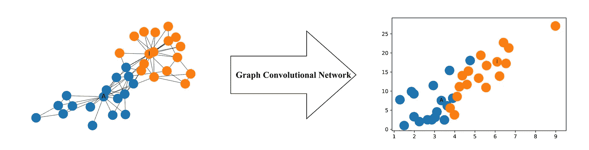
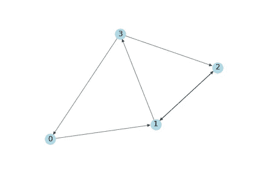
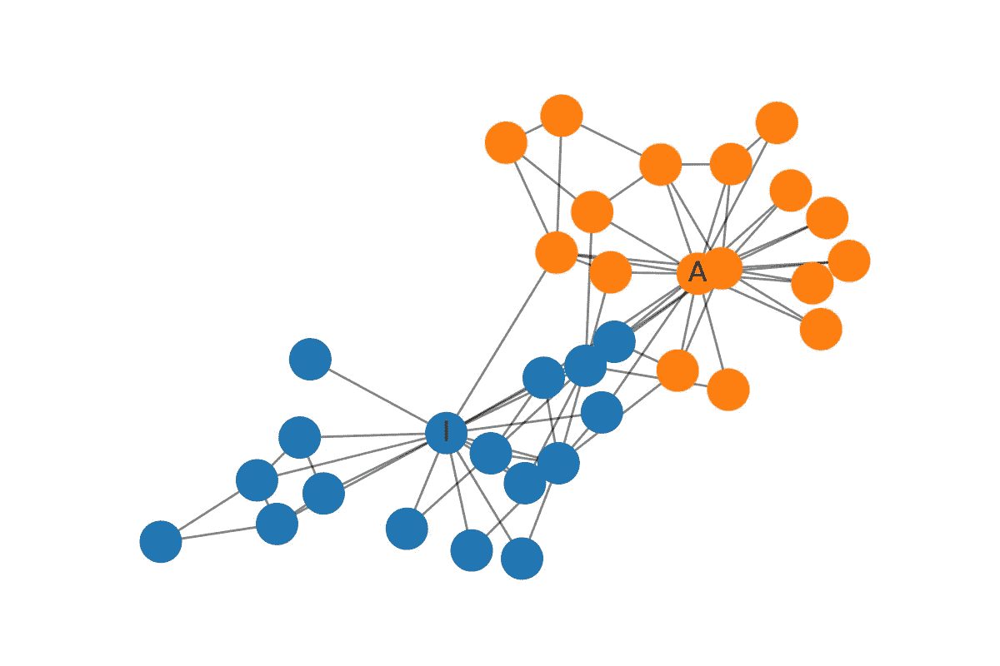
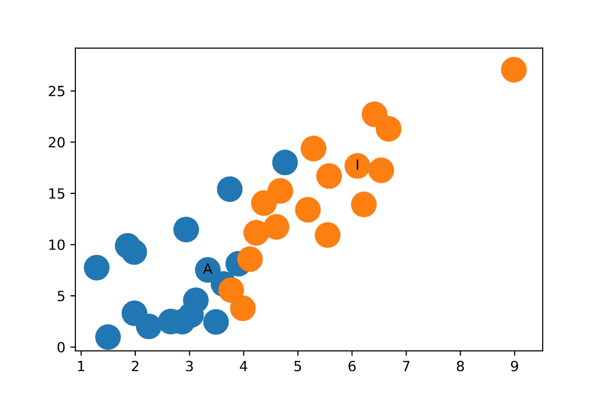

# 如何用图卷积网络在图上做深度学习

> 原文：<https://towardsdatascience.com/how-to-do-deep-learning-on-graphs-with-graph-convolutional-networks-7d2250723780?source=collection_archive---------0----------------------->

## 第 1 部分:图卷积网络的高级介绍

图的机器学习是一项困难的任务，因为图的结构非常复杂，但也能提供丰富的信息。本文是关于如何使用图形卷积网络(GCNs)对图形进行深度学习的系列文章中的第一篇，图形卷积网络是一种强大的神经网络，旨在直接对图形进行处理并利用其结构信息。系列文章包括:

1.  图卷积网络的高级介绍(this)
2.  [利用谱图卷积的半监督学习](/how-to-do-deep-learning-on-graphs-with-graph-convolutional-networks-62acf5b143d0)

在本帖中，我将介绍 GCNs，并使用编码示例说明信息如何通过 GCN 的隐藏层传播。我们将了解 GCN 如何聚合来自之前图层的信息，以及这种机制如何在图表中生成有用的节点要素表示。

# 什么是图卷积网络？

GCNs 是一种非常强大的神经网络架构，用于在图上进行机器学习。事实上，它们是如此强大，甚至*一个随机启动的 2 层 GCN* 也能产生网络中节点的有用特征表示。下图显示了由这种 GCN 产生的网络中每个节点的二维表示。注意，即使没有任何训练，网络中节点的相对接近度也保留在二维表示中。



更正式地说，*图卷积网络(GCN)* 是一种对图进行操作的神经网络。给定一个图 *G = (V，E)* ，一个 GCN 取为输入

*   输入特征矩阵 *N × F⁰* 特征矩阵， ***X，*** 其中 *N* 是节点的数量， *F⁰* 是每个节点的输入特征的数量，并且
*   图结构的一个 *N* × *N* 矩阵表示如 g[1]的邻接矩阵 ***A***

GCN 中的一个隐藏层因此可以写成**= f(****h****【ⁱ⁻】，****a****)*其中***h****⁰=****x***和 *f* 为每层*对应一个*n*×*f****ⁱ***特征矩阵，其中每一行都是一个节点的特征表示。在每一层，使用传播规则 *f* 聚集这些特征以形成下一层的特征。通过这种方式，每个连续层的特征变得越来越抽象。在这个框架中，GCN 的变体仅仅在传播规则的选择上有所不同。**

# **一个简单的传播规则**

**一个最简单的可能传播规则是[1]:**

***f(****hⁱ****，****a****)=σ(****ahⁱwⁱ****)***

**其中 ***Wⁱ*** 是层 *i* 的权重矩阵，而 *σ* 是非线性激活函数，例如 [ReLU 函数](https://en.wikipedia.org/wiki/Rectifier_(neural_networks))。权重矩阵有维度*f****ⁱ****×fⁱ*⁺*；换句话说，权重矩阵的第二维的大小决定了下一层的特征数量。如果你熟悉[卷积神经网络](https://en.wikipedia.org/wiki/Convolutional_neural_network)，这个操作类似于过滤操作，因为这些权重在图中的节点间共享。***

## ***简单化***

***让我们从最简单的层面来研究传播规则。让***

*   ****i = 1* ，s.t. *f* 是输入特征矩阵的函数，***
*   ***σ* 是[恒等函数](https://en.wikipedia.org/wiki/Identity_function)，并且**
*   **选择权重 s . t .***ah***⁰***w***⁰=***axw***⁰=***ax***。**

**换句话说，*f(****X****，****A****)=****AX***。这个传播规则可能有点太简单了，但是我们稍后会添加缺少的部分。作为旁注， **AX** 现在相当于一个多层感知器的输入层。**

## **一个简单的图表示例**

**作为一个简单的例子，我们将使用下图:**

****

**A simple directed graph.**

**而下面是它的`numpy`邻接矩阵表示。**

```
**A = np.matrix([
    [0, 1, 0, 0],
    [0, 0, 1, 1], 
    [0, 1, 0, 0],
    [1, 0, 1, 0]],
    dtype=float
)**
```

**接下来，我们需要特性！我们基于其索引为每个节点生成 2 个整数特征。这使得稍后手动确认矩阵计算变得容易。**

```
**In [3]: X = np.matrix([
            [i, -i]
            **for** i **in** range(A.shape[0])
        ], dtype=float)
        XOut[3]: matrix([
           [ 0.,  0.],
           [ 1., -1.],
           [ 2., -2.],
           [ 3., -3.]
        ])**
```

## **应用传播规则**

**好吧！我们现在有一个图，它的邻接矩阵`A`和一组输入特征`X`。让我们看看应用传播规则时会发生什么:**

```
**In [6]: A * X
Out[6]: matrix([
            [ 1., -1.],
            [ 5., -5.],
            [ 1., -1.],
            [ 2., -2.]]**
```

**发生了什么事？每个节点(每行)的表示现在是其相邻要素的总和！换句话说，图形卷积层将每个节点表示为其邻域的集合。我鼓励你自己检查计算。注意，在这种情况下，如果存在从 *v* 到 *n* 的边，则节点 *n* 是节点 *v* 的邻居。**

# **啊哦！即将出现的问题！**

**您可能已经发现了问题:**

*   **一个节点的聚合表示不包括它自己的特性！该表示是相邻节点的特征的集合，因此只有具有自环的节点才会将它们自己的特征包括在集合中。[1]**
*   **度数较大的结点在其要素制图表达中将具有较大的值，而度数较小的结点将具有较小的值。这可能导致梯度消失或爆炸[1，2]，但对于通常用于训练此类网络的随机梯度下降算法来说也是一个问题，该算法对每个输入要素的比例(或取值范围)非常敏感。**

**下面，我将分别讨论这些问题。**

## **添加自循环**

**为了解决第一个问题，可以简单地给每个节点添加一个自环[1，2]。实际上，这是通过在应用传播规则之前将单位矩阵`I`添加到邻接矩阵`A`来完成的。**

```
**In [4]: I = np.matrix(np.eye(A.shape[0]))
        IOut[4]: matrix([
            [1., 0., 0., 0.],
            [0., 1., 0., 0.],
            [0., 0., 1., 0.],
            [0., 0., 0., 1.]
        ])In [8]: A_hat = A + I
        A_hat * X
Out[8]: matrix([
            [ 1., -1.],
            [ 6., -6.],
            [ 3., -3.],
            [ 5., -5.]])**
```

**由于该节点现在是其自身的邻居，所以在对其邻居的特征求和时包括了该节点自身的特征！**

## **标准化要素制图表达**

**通过将邻接矩阵`A`乘以逆矩阵`D`【1】来转换邻接矩阵`A`，可以通过节点度来归一化特征表示。因此，我们简化的传播规则如下所示[1]:**

***f(* ***X*** *，****a****)=****d****⁻****ax*****

**让我们看看会发生什么。我们首先计算度矩阵。**

```
**In [9]: D = np.array(np.sum(A, axis=0))[0]
        D = np.matrix(np.diag(D))
        D
Out[9]: matrix([
            [1., 0., 0., 0.],
            [0., 2., 0., 0.],
            [0., 0., 2., 0.],
            [0., 0., 0., 1.]
        ])**
```

**在应用规则之前，让我们看看变换后邻接矩阵会发生什么变化。**

****在**之前**

```
**A = np.matrix([
    [0, 1, 0, 0],
    [0, 0, 1, 1], 
    [0, 1, 0, 0],
    [1, 0, 1, 0]],
    dtype=float
)**
```

****在**之后**

```
**In [10]: D**-1 * A
Out[10]: matrix([
             [0\. , 1\. , 0\. , 0\. ],
             [0\. , 0\. , 0.5, 0.5],
             [0\. , 0.5, 0\. , 0\. ],
             [0.5, 0\. , 0.5, 0\. ]
])**
```

**注意，邻接矩阵的每一行中的权重(值)已经除以了对应于该行的节点的度数。我们用转换后的邻接矩阵应用传播规则**

```
**In [11]: D**-1 * A * X
Out[11]: matrix([
             [ 1\. , -1\. ],
             [ 2.5, -2.5],
             [ 0.5, -0.5],
             [ 2\. , -2\. ]
         ])**
```

**并且获得对应于相邻节点的特征的平均值的节点表示。这是因为(经变换的)邻接矩阵中的权重对应于相邻节点特征的加权和中的权重。我再次鼓励你亲自验证这个观察结果。**

# **把所有的放在一起**

**我们现在将自循环和规范化技巧结合起来。此外，我们将重新引入之前为了简化讨论而放弃的权重和激活函数。**

****加回重量****

**首先要做的是应用权重。注意，这里的`D_hat`是`A_hat = A + I`的度矩阵，即带有强制自循环的`A`的度矩阵。**

```
**In [45]: W = np.matrix([
             [1, -1],
             [-1, 1]
         ])
         D_hat**-1 * A_hat * X * W
Out[45]: matrix([
            [ 1., -1.],
            [ 4., -4.],
            [ 2., -2.],
            [ 5., -5.]
        ])**
```

**如果我们想要减少输出特征表示的维数，我们可以减少权重矩阵的大小`W`:**

```
**In [46]: W = np.matrix([
             [1],
             [-1]
         ])
         D_hat**-1 * A_hat * X * W
Out[46]: matrix([[1.],
        [4.],
        [2.],
        [5.]]
)**
```

## **添加激活功能**

**我们选择保留特征表示的维度，并应用 [ReLU](https://en.wikipedia.org/wiki/Rectifier_(neural_networks)) 激活函数。**

```
**In [51]: W = np.matrix([
             [1, -1],
             [-1, 1]
         ])
         relu(D_hat**-1 * A_hat * X * W)
Out[51]: matrix([[1., 0.],
        [4., 0.],
        [2., 0.],
        [5., 0.]])**
```

**瞧啊。一个完整的隐藏层，有邻接矩阵，输入特征，权重和激活函数！**

# **回到现实**

**现在，最后，我们可以将一个图卷积网络应用到一个真实的图上。我将向您展示如何生成我们在本文前面看到的要素制图表达。**

## **扎卡里空手道俱乐部**

**扎卡里的空手道俱乐部是一个常用的社交网络，其中节点代表空手道俱乐部的成员，边代表他们的相互关系。当扎卡里在学习空手道俱乐部时，管理员和教练之间发生了冲突，导致俱乐部一分为二。下图显示了网络的图形表示，节点根据俱乐部的位置进行标记。管理员和讲师分别标有“A”和“I”。**

****

**Zachary’s Karate Club**

## **建造 GCN**

**现在让我们建立图形卷积网络。我们实际上不会训练网络，只是简单地随机初始化它，以生成我们在本文开头看到的要素制图表达。我们将使用`networkx`，它有一个很容易得到的俱乐部的图形表示，并计算`A_hat`和`D_hat`矩阵。**

```
**from networkx import karate_club_graph, to_numpy_matrixzkc = karate_club_graph()
order = sorted(list(zkc.nodes()))A = to_numpy_matrix(zkc, nodelist=order)
I = np.eye(zkc.number_of_nodes())A_hat = A + I
D_hat = np.array(np.sum(A_hat, axis=0))[0]
D_hat = np.matrix(np.diag(D_hat))**
```

**接下来，我们将随机初始化权重。**

```
**W_1 = np.random.normal(
    loc=0, scale=1, size=(zkc.number_of_nodes(), 4))
W_2 = np.random.normal(
    loc=0, size=(W_1.shape[1], 2))**
```

**堆叠 GCN 层。我们这里只使用单位矩阵作为特征表示，也就是说，每个节点被表示为一个独热编码的分类变量。**

```
**def gcn_layer(A_hat, D_hat, X, W):
    return relu(D_hat**-1 * A_hat * X * W)H_1 = gcn_layer(A_hat, D_hat, I, W_1)
H_2 = gcn_layer(A_hat, D_hat, H_1, W_2)output = H_2**
```

**我们提取特征表示。**

```
**feature_representations = {
    node: np.array(output)[node] 
    for node in zkc.nodes()}**
```

**瞧啊。将扎卡里空手道俱乐部的社区很好地分开的特征表示。我们甚至还没有开始训练！**

****

**Feature Representations of the Nodes in Zachary’s Karate Club**

**我应该注意到，对于这个例子，随机初始化的权重很可能在 x 轴或 y 轴上给出 0 值，作为 ReLU 函数的结果，所以需要一些随机初始化来产生上面的图。**

# **结论**

**在这篇文章中，我对图卷积网络进行了高度的介绍，并举例说明了 GCN 中每一层节点的特征表示是如何基于其邻域的聚合的。我们看到了如何使用 numpy 构建这些网络，以及它们有多么强大:即使是随机初始化的 gcn 也可以在 Zachary 的空手道俱乐部中分离社区。**

**在下一篇文章中，我将更深入地介绍技术细节，并展示如何使用半监督学习来实现和训练最近发布的 GCN。**你在这里** **找到系列** [**的下一篇帖子。**](/how-to-do-deep-learning-on-graphs-with-graph-convolutional-networks-62acf5b143d0)**

***喜欢你读的书吗？考虑在*[*Twitter*](https://twitter.com/TobiasSJepsen)*上关注我，在那里，除了我自己的帖子之外，我还会分享与数据科学和机器学习的实践、理论和伦理相关的论文、视频和文章。***

***如需专业咨询，请在*[*LinkedIn*](https://www.linkedin.com/in/tobias-skovgaard-jepsen/)*上联系我，或在*[*Twitter*](https://twitter.com/TobiasSJepsen)*上直接留言。***

# **参考**

**[1][Thomas Kipf 关于图卷积网络的博文](https://tkipf.github.io/graph-convolutional-networks/)。**

**[2][Thomas Kipf 和 Max Welling 的论文](https://arxiv.org/abs/1609.02907)称为*图卷积网络半监督分类*。**