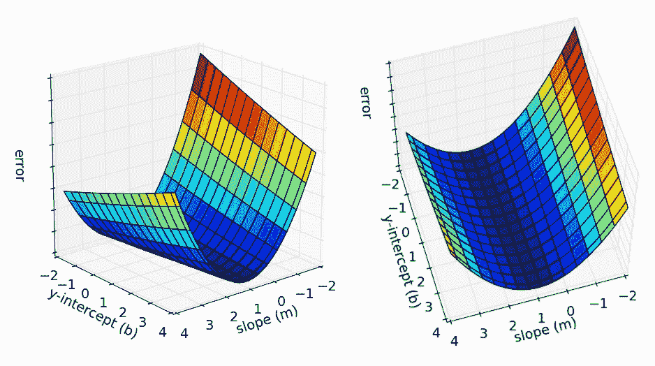
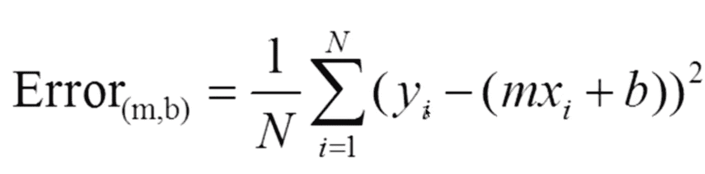
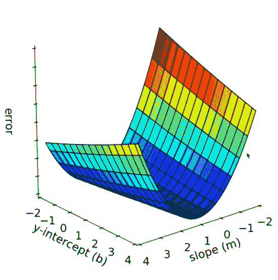
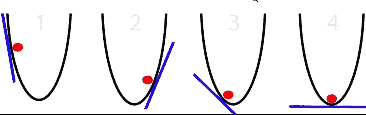
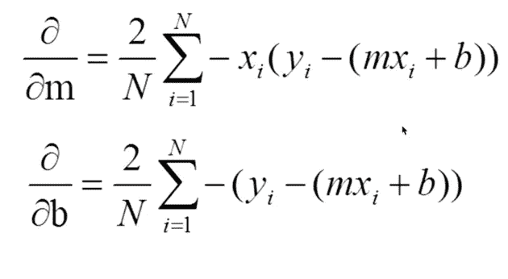

# 如何使用梯度下降进行线性回归

> 原文：<https://towardsdatascience.com/how-to-do-linear-regression-using-gradient-descent-79a2ff4ace05?source=collection_archive---------3----------------------->



梯度下降是我从 Siraj Raval 的[深度学习基础纳米学位](https://www.udacity.com/course/deep-learning-nanodegree-foundation--nd101)中学到的第一个有趣的话题。这个练习的回购可以在[这里](https://github.com/llSourcell/linear_regression_live)找到

这个练习的目的是研究学生的考试成绩和学习时间之间的关系。为了实现这一目标，我们使用称为线性回归的策略来模拟因变量(学生的考试成绩)和解释变量(学习时间)之间的关系。我们还使用梯度下降来进一步优化我们的模型。梯度下降可能是机器学习和深度学习中最流行的方法。

我们的[数据集](https://raw.githubusercontent.com/llSourcell/linear_regression_live/master/data.csv)包含 x-y 平面中的 x 和 y 数据点的集合，其中 x 是学生的考试分数，y 是学生学习的小时数。

我们使用 *Python* 以编程方式计算最佳拟合线，该线描述了学生学习的小时数和学生在测试中获得的分数之间的线性关系。我们使用 *Python* 是因为它被认为是最流行和最具语言性的机器学习框架。

我们将从一个非常标准的起始代码开始。

```
if __name__ = '__main__':
    run()
```

然后，我们使用 *numpy* 在内存中提取并解析我们的数据集，以在其上运行算法。我们使用分隔符'，'，意思是用来在。csv 文件

学习率是超级参数(即我们用作模型的调谐旋钮，或者模型学习的速度)

如果学习率太低，我们的模型将太慢而无法收敛，如果学习率太高，它将永远无法收敛。我们想要达到一个平衡，一个最佳的学习速度。在机器学习中，我们并不总是知道最佳学习速率会是多少，所以猜测和检查是获得该值的最佳方式

我们从初始 m 和 b 值= 0 *(方程 y = mx+b)* 开始。我们从 0 开始，因为我们将随着时间的推移学习这些值。迭代次数= 1000(即我们希望从每个训练步骤中学习多少次迭代)。我们选择 1000 步，因为我们数据集很小。随着数据集变大，考虑到 CPU 等因素，迭代次数应该是 10K 或 100K

我们通过使用*gradient _ descent _ runner*函数计算 b 和 m，函数的输入为“点”——x，y 点数组，初始 b 值为起始 b 值，初始 m 值为初始 m 值，学习速率和上面定义的迭代次数

```
from numpy import *def run(): points = genfromtext('data.csv', delimiter=',')
    learning_rate = 0.0001 #y = mx + b (slope formula) initial_b = 0
    initial_m = 0 # ideal slope, will start with 0 num_iterations = 1000

    [b, m] = gradient_descent_runner(points, initial_b, initial_m, learning_rate, num_iterations)

    print "After {0} iterations b = {1}, m = {2}, error = {3}".format(num_iterations, b, m, compute_error_for_line_given_points(b, m, points))
```

*gradient_descent_runner* 函数定义如下:

```
def gradient_descent_runner(points, starting_b, starting_m, learning_rate, num_iterations):

    b = starting_b
    m = starting_m for i in range(num_iterations):
        b, m = step_gradient(b,m, array(points), learning_rate return [b, m]
```

这里，我们将 starting_b 和 starting_m 值赋给 b 和 m，对于每次迭代，我们将通过将 b 和 m 的先前值输入 step_gradient 函数来计算 b 和 m，该函数接受 b、m 的值、点 x、y 的数组和学习速率

然后我们返回这个最佳对 b 和 m。

在我们编写“step_gradient”函数之前，我们将编写另一个函数，该函数计算给定一组点的 b 和 m 的线性模型的误差平方和的平均值:



```
def compute_error_for_line_given_points(b, m, points):
    totalError = 0
    for i in range(0, len(points)):
    x = points[i, 0]
    y = points[i, 1] totalError += (y - (m * x + b)) ** 2 return totalError / float(len(points))
```

为了确定如何用给定的点集来最好地拟合我们的模型，我们希望最小化这些点到我们的线性模型之间的距离。计算总误差有助于我们确定我们的模型有多差，这样我们就可以每一步都更新它。“y”是真实数据，mx+b 是我们的模型用来预测“y”的数据，取这些值之间的差值，就得到我们模型的正(或负)误差值。我们迭代地对这些平方差求和，并除以点数，以便获得我们的线性模型的误差平方和。3D 下图显示了所有可能的 x 轴截距、y 轴截距和误差值。我们想找到误差最小的点，即曲线的底部(或局部最小值)



然后，我们继续为我们的模型编写阶跃梯度函数。梯度可以最好地理解为斜率、切线或移动方向(向上或向下),以便最小化误差。



为了计算梯度，我们计算 b 和 m 的偏导数。然后，我们通过从学习率和每个值的梯度值的乘积中减去 b 和 m 的当前值来计算新的 b 和 m 值



```
def step_gradient(b_current, m_current, points, learning_rate):

    b_gradient = 0
    m_gradient = 0
    N = float(len(points)) for i in range(0, len(points)):
        x = points[i, 0]
        y = points[i, 1] b_gradient += -(2/N) * (y - ((m_current * x) + b_current))
        m_gradient += -(2/N) * x * (y - ((m_current * x) + b_current)) new_b = b_current - (learning_rate * b_gradient)
    new_m = m_current - (learning_rate * m_gradient) return [new_b, new_m]
```

这里的学习率允许我们的模型学习并收敛于 b 和 m 的新的优化值，然后用于根据给定的学习小时数预测测试分数

完整代码如下:

```
from numpy import *def compute_error_for_line_given_points(b, m, points):
    totalError = 0
    for i in range(0, len(points)):
        x = points[i, 0]
        y = points[i, 1] totalError += (y - (m * x + b)) ** 2 return totalError / float(len(points))def step_gradient(b_current, m_current, points, learning_rate):

    b_gradient = 0
    m_gradient = 0
    N = float(len(points)) for i in range(0, len(points)):
        x = points[i, 0]
        y = points[i, 1] b_gradient += -(2/N) * (y - ((m_current * x) + b_current))
        m_gradient += -(2/N) * x * (y - ((m_current * x) + b_current)) new_b = b_current - (learning_rate * b_gradient)
    new_m = m_current - (learning_rate * m_gradient) return [new_b, new_m]def gradient_descent_runner(points, starting_b, starting_m, learning_rate, num_iterations):

    b = starting_b
    m = starting_m for i in range(num_iterations):
        b, m = step_gradient(b,m, array(points), learning_rate return [b, m]def run(): points = genfromtext('data.csv', delimiter=',')
    learning_rate = 0.0001 #y = mx + b (slope formula) initial_b = 0
    initial_m = 0 # ideal slope, will start with 0 num_iterations = 1000

    [b, m] = gradient_descent_runner(points, initial_b, initial_m, learning_rate, num_iterations)

    print "After {0} iterations b = {1}, m = {2}, error = {3}".format(num_iterations, b, m, compute_error_for_line_given_points(b, m, points))if __name__ = '__main__':
    run()
```

来源:

1/ Siraj Raval 的《如何用梯度下降法做线性回归:【https://www.youtube.com/watch?v=XdM6ER7zTLk

2/深度学习纳米度:

[https://www . uda city . com/course/deep-learning-nano degree-foundation-nd 101](https://www.udacity.com/course/deep-learning-nanodegree-foundation--nd101)