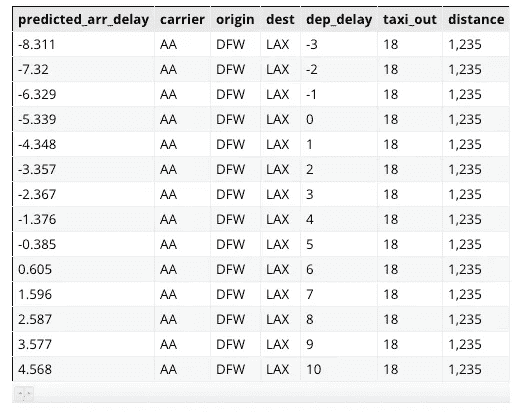

# 如何用 BigQuery ML 做在线预测

> 原文：<https://towardsdatascience.com/how-to-do-online-prediction-with-bigquery-ml-db2248c0ae5?source=collection_archive---------10----------------------->

BigQuery ML 是一种在 Google Cloud 上的 Pb 级交互式数据仓库中直接进行机器学习的方法。你可以在几分钟内在数百万行上训练机器学习模型，而不必四处移动数据。

***注意:BigQuery ML 现在支持将训练好的模型提取为 TensorFlow SavedModel。所以你可以简单的*** [***导出模型，然后将它***](/how-to-export-a-bigquery-ml-model-and-deploy-it-for-online-prediction-a7e4d44c4c93) ***部署到云 AI 平台预测。也就是说，这篇文章仍然是有用的，它提醒我们如何看待权重，并重申 BQML 是一个开放系统的观点。***

不过，训练完模型后，你需要用它来预测。开箱即用的 BigQuery 支持批量预测——这适用于报告和仪表板应用程序。但是，BigQuery 查询通常有 1-2 秒的延迟，因此批量预测功能不能用于在线预测(例如从 web 或移动应用程序)。


Sometimes your predictions need to return immediately

在本文中，我将向您展示如何从训练输出表中提取必要的权重和缩放参数，并自己计算预测。这些代码可以包装在 web 应用程序框架中，或者您希望预测代码存在的任何地方。

本文的完整代码在 GitHub 上的[。](https://github.com/GoogleCloudPlatform/training-data-analyst/blob/master/blogs/bqml/online_prediction.ipynb)

# 创建模型

让我们首先创建一个简单的预测模型来预测飞机的到达延迟(更多详细信息，[参见本文](/how-to-train-and-predict-regression-and-classification-ml-models-using-only-sql-using-bigquery-ml-f219b180b947))。我将使用这个模型来说明这个过程。

```
CREATE OR REPLACE MODEL flights.arrdelay
OPTIONS
  (model_type='linear_reg', input_label_cols=['arr_delay']) AS
SELECT
  arr_delay,
  carrier,
  origin,
  dest,
  dep_delay,
  taxi_out,
  distance
FROM
  `cloud-training-demos.flights.tzcorr`
WHERE
  arr_delay IS NOT NULL
```

这花了我大约 6 分钟，在 600 万行和 267 MB 数据上训练，花费大约 1.25 美元。( [BigQuery 的自由层](https://cloud.google.com/bigquery/pricing#free-tier)可能会帮你解决这个问题；为了降低成本，使用较小的表)。

# 模型批量预测

一旦有了训练好的模型，就可以在 BigQuery 内部进行批量预测。例如，要查找从 DFW 到洛杉矶国际机场的航班在一系列出发延迟时间内的预计到达延迟时间，您可以运行以下查询:

```
SELECT * FROM ml.PREDICT(MODEL flights.arrdelay, (
SELECT 
  'AA' as carrier,
  'DFW' as origin,
  'LAX' as dest,
  dep_delay,
  18 as taxi_out,
  1235 as distance
FROM
  UNNEST(GENERATE_ARRAY(-3, 10)) as dep_delay
))
```

在上面的查询中，我硬编码了承运人、原产地等的输入值。并使用 GENERATE_ARRAY 函数生成-3 分钟到 10 分钟范围内的出发延迟。这产生了一个表，该表具有每个出发延迟的预测到达延迟:



Predicted arrival delay if a flight from Dallas to Los Angeles departs 3 minutes early (dep_delay=-3) to 10 minutes late (dep_delay=10)

批量预测成本低。上面的查询处理了 16 KB，花费了 0.000008 美分。

虽然这种预测机制适用于离线预测，但实际上您不能将其用于在线预测。如果预测是作为网站或移动应用程序中用户交互的结果来显示的，那么您无法承受与每个 BigQuery 调用相关的 1-2 秒的延迟。您通常希望延迟在几毫秒的数量级，因此您需要一个更快的推理解决方案。

# 重量和比例

幸运的是，BigQuery 公开了自己计算预测值所需的所有信息。您可以将这些代码直接嵌入到您的应用程序中。我用 Python 来说明这一点，但是你可以用任何你想用的语言来说明。

你需要获取 3 条信息:

*   使用此查询可以获得的每个数字列的权重:

```
SELECT
  processed_input AS input,
  model.weight AS input_weight
FROM
  ml.WEIGHTS(MODEL flights.arrdelay) AS model
```

*   使用以下查询可以获得的每个数字列的缩放比例:

```
SELECT
  input, min, max, mean, stddev
FROM
  ml.FEATURE_INFO(MODEL flights.arrdelay) AS model
```

*   使用该查询可以获得的每个分类列的词汇和权重(如果您不熟悉 [UNNEST，请参阅本文](https://medium.freecodecamp.org/exploring-a-powerful-sql-pattern-array-agg-struct-and-unnest-b7dcc6263e36)):

```
SELECT
  processed_input AS input,
  model.weight AS input_weight,
  category.category AS category_name,
  category.weight AS category_weight
FROM
  ml.WEIGHTS(MODEL flights.arrdelay) AS model,
  UNNEST(category_weights) AS category
```

假设您已经将所有这三个查询的结果读入三个独立的 Pandas 数据帧，下面是一个计算预测的函数:

我正在做的是:我遍历每个数字列，并找到与该列相关的权重。然后，我取出平均值和标准差，用它们来调整输入值。两者的乘积就是与本专栏相关的贡献。然后，我遍历分类列。对于每个分类列，该列采用的每个值都有一个单独的权重。因此，我找到了与输入值相关联的权重，这就是贡献。所有贡献的总和就是预测。

上面的代码假设您训练了一个回归模型。如果你训练了一个分类模型，你需要对预测应用一个逻辑函数来得到概率(为了避免溢出，在 GitHub 上处理 pred < -500 as zero):

```
prob = (1.0/(1 + np.exp(-pred)) if (-500 < pred) else 0)
```

Here is an example of predicting the arrival delay of a specific flight:

```
rowdict = {
  'carrier' : 'AA',
  'origin': 'DFW',
  'dest': 'LAX',
  'dep_delay': -3,
  'taxi_out': 18,
  'distance': 1235
}
predicted_arrival_delay = compute_prediction(
  rowdict, numeric_weights,  scaling_df, categorical_weights)
```

This yields the following columns and their contributions:

```
col=dep_delay wt=36.5569545237 scaled_value=-0.329782492822 contrib=-12.0558435928
col=taxi_out wt=8.15557957221 scaled_value=0.213461991601 contrib=1.74090625815
col=distance wt=-1.88324519311 scaled_value=0.672196648431 contrib=-1.26591110699
col=__INTERCEPT__ wt=1.09017737502 scaled_value=1.0 contrib=1.09017737502
col=carrier wt=-0.0548843604154 value=AA contrib=-0.0548843604154
col=origin wt=0.966535564037 value=DFW contrib=0.966535564037
col=dest wt=1.26816262538 value=LAX contrib=1.26816262538
```

The total of the contributions is -8.31 minutes, which matches the batch prediction value, confirming that the code is correct.

The full code for this article is [的概率)。尽情享受吧！](https://github.com/GoogleCloudPlatform/training-data-analyst/blob/master/blogs/bqml/online_prediction.ipynb)