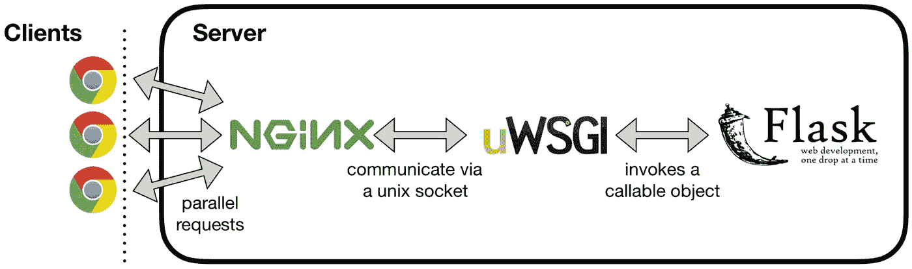

# 如何在 OpenShift 上使用 Flask、uWSGI、NGINX 和 Docker 进行快速原型制作

> 原文：<https://towardsdatascience.com/how-to-do-rapid-prototyping-with-flask-uwsgi-nginx-and-docker-on-openshift-f0ef144033cb?source=collection_archive---------4----------------------->

这篇文章将详细介绍将你的原型放入 Docker 容器的技术方面(带有参考代码), Docker 容器可以使用任意用户 id 在 OpenShift 上运行。

如果你像我一样，你喜欢一头扎进去，然后弄清楚它是如何工作的。为此，请随意查看 [**源代码**](https://github.com/szelenka/openshift-prototype) 和 [**图像**](https://hub.docker.com/r/szelenka/prototype/) 然后回来理解它是如何工作的。

对于我收集的许多数据科学原型，它们通常属于基本的 [Flask](http://flask.pocoo.org/) 应用程序。就我个人而言，比起 Django，我更喜欢 Flask，因为同样的原因，在设计乐高雕塑时，我更喜欢单独的乐高积木，而不是 BURP 和 LURP。如果你感兴趣的话，这篇关于 [Flask vs Django](http://www.mindfiresolutions.com/blog/2018/05/flask-vs-django/) 的博客很好地展示了 web 框架的差异。


LEGO Brick, which do you prefer using when building?

为了在一个我们可以从对原型输出感兴趣的涉众那里获得反馈的环境中建立并运行原型，我们需要一个 web 服务器。为此，我们需要在网络上的真实 web 服务器中运行 Flask 应用程序。输入 NGINX 和 uWSGI！其他帖子详细介绍了这三个组件如何协同工作来服务您的 webapp，我们将探索如何让它在 Docker 和 OpenShift 中运行。



[A Guide to Scaling Machine Learning Models in Production](https://hackernoon.com/a-guide-to-scaling-machine-learning-models-in-production-aa8831163846)

有很多 Docker 教程，但是没有几个遵循 Docker 最佳实践。要让 Docker 映像在 OpenShift 这样的 Kubernetes 环境中运行，可能需要遵循更严格的最佳实践。我最近遇到的主要最佳实践是，您的容器应该作为“非根”(或任意)用户启动！

现在，让我们来看看让您的原型在这种类型的环境中运行所需的最低要求。为此，我们将定义一组配置文件，然后将它们合并到一个 Docker 映像中。

# 项目布局

```
$ tree .
.
├── deploy.sh
├── deployment
│   ├── docker-entrypoint.sh
│   ├── Dockerfile
│   ├── nginx.conf
│   ├── supervisord.conf
│   └── uwsgi.ini
└── src
    ├── __init__.py
    ├── static
    │   └── index.html
    └── wsgi.py
```

上述结构将所有的容器信息推送到“ **deployment** 文件夹，而所有的 Python 代码和资产作为伪[模块](https://docs.python.org/3/tutorial/modules.html)放入“ **src** 文件夹。想象您的数据科学代码位于 **src** 下，并在 **wsgi.py** 文件中定义端点。在以后的文章中，我将介绍如何用 [cookiecutter](https://github.com/audreyr/cookiecutter) 标准化项目布局。

在这个结构中，要在调试模式下运行 Flask，我们可以简单地从命令行执行以下命令

```
$ python ./src/wsgi.py
```

在尝试将 Flask 应用程序放入 uWSGI、NGINX 和 Docker 映像之前，您应该使用上述命令进行所有本地验证测试，以确保 Flask 应用程序可以按预期运行和操作。

# uWSGI 配置

在这篇文章中，我们想在 OpenShift 上运行 NGINX 和 uWSGI 中的 Flask 应用程序。所以我们需要首先配置 uWSGI，让它能够找到 Flask 应用程序。这在**中完成。/deployment/uwsgi.ini** 配置文件。

```
[uwsgi]
chdir=/opt/repo/src
chdir2=/opt/repo/src
master = true
module=wsgi
callable=app
buffer-size=65535
lazy=true
socket = /run/uwsgi.sock
```

这里我们定义了标准的 [uWSGI 选项](https://uwsgi-docs.readthedocs.io/en/latest/Options.html)。要注意的主要选项是**模块**和**可调用**。这两个参数指示 uWSGI 服务在哪里寻找要执行的 Python 代码。在我们的例子中，我们告诉它在“ **/opt/repo/src** ”文件夹中查找“ **wsgi.py** ”文件，以及该文件中的“ **app** ”变量(这是我们的主 Flask 可调用变量)。我们还为这个服务明确指定了套接字文件的位置，这需要与 NGINX 配置相匹配。

# NGINX 配置

接下来，我们需要告诉 NGINX 它可以在哪里找到 uWSGI 套接字文件，这样当新的请求进入它正在监听的端口时，它知道如何相应地路由请求。这是在**中完成的。/deployment/nginx.conf** 文件。

```
pid /run/nginx.pid;
error_log /var/log/nginx/error.log;

events {
    worker_connections 1024;
}

http {
    include /etc/nginx/mime.types;
    default_type application/octet-stream;
    sendfile on;
    tcp_nopush on;

    client_body_temp_path /spool/nginx/client_temp 1 2;
    fastcgi_temp_path /spool/nginx/fastcgi_temp 1 2;
    proxy_temp_path /spool/nginx/proxy_temp 1 2;
    scgi_temp_path /spool/nginx/scgi_temp 1 2;
    uwsgi_temp_path /spool/nginx/uwsgi_temp 1 2;

    server {
        listen 8080;
        server_name localhost;

        access_log /var/log/nginx/access.log;

        location / {
            try_files $uri @app;
        }
        location @app {
            include uwsgi_params;
            uwsgi_pass unix:///run/uwsgi.sock;
        }
        location /static {
            alias /opt/repo/src/static;
            expires 1d;
        }
    }
}
```

在这里，我们明确定义了 NGINX 服务应该在哪里创建日志、临时文件，以及监听哪些端口。因为 OpenShift 将以任意用户的身份启动这个映像，所以我们不能使用任何低于 1024 的端口号(即[特权端口](https://www.w3.org/Daemon/User/Installation/PrivilegedPorts.html)，比如标准的 HTTP 80 或 HTTPS 443)。所以我们告诉服务监听端口 **8080** 。然后在位置路由中，我们告诉 NGINX 将所有请求路由到 uWSGI 套接字和 Python 应用程序(即“ **@app** ”)，除了任何静态文件，它们应该直接进入磁盘上的那个文件夹。

# 超级用户配置

我们需要配置的最后一件事是让所有这些在单个映像中运行的方法。Docker 最佳实践强烈建议每个图像一个应用程序，但是在我们的例子中，我们需要 uWSGI 来运行我们的 Python 代码，NGINX 路由到 uWSGI。因此，我们将使用启动 [Supervisord](http://supervisord.org/) 的技巧来处理多个并发服务。这是在**中完成的。/deployment/super visor . conf**文件。

```
[unix_http_server]
file=/run/supervisor.sock
chmod=0770

[supervisord]
nodaemon=true
pidfile=/run/pid/supervisord.pid
logfile=/var/log/supervisor/supervisord.log
childlogdir=/var/log/supervisor
logfile_maxbytes=50MB
logfile_backups=1

[rpcinterface:supervisor]
supervisor.rpcinterface_factory = supervisor.rpcinterface:make_main_rpcinterface

[supervisorctl]
serverurl=unix:///run/supervisor.sock

[program:nginx]
command=/usr/sbin/nginx -g "daemon off;" -c /etc/nginx/nginx.conf
stdout_logfile=/dev/stdout
stdout_logfile_maxbytes=0
stderr_logfile=/dev/stderr
stderr_logfile_maxbytes=0

[program:uwsgi]
command=/usr/local/bin/uwsgi --ini /etc/uwsgi/apps-enabled/uwsgi.ini
stdout_logfile=/dev/stdout
stdout_logfile_maxbytes=0
stderr_logfile=/dev/stderr
stderr_logfile_maxbytes=0
```

在这里，我们明确了要为每个“服务”执行哪些命令，以及我们前面详述的配置文件的位置。通常，您可以以 root 用户身份启动 supervisord 或 systemd，并切换用户以执行特定的服务。然而，对于 OpenShift 上的任意用户 id，我们需要允许这些服务作为“root”组中的任何用户启动。这就是为什么我们没有在[配置文件](http://supervisord.org/configuration.html)中指定任何用户参数，而是将日志路由到 **/dev/stdout** (这将允许它们在映像运行时显示在 Docker 日志文件中)。

# 码头入口点

配置文件都设置好了，我们只需要告诉 Docker 运行映像时要执行什么。在一些 Python 应用程序中使用任意用户 id 给这些计划带来了麻烦。此问题在[问题 10496](https://bugs.python.org/issue10496) 中有详细记录。

好消息是有一个简单的解决方法。每次运行 Docker 映像时，我们只需要添加一个检查来验证任意用户在 **/etc/passwd** 文件中有一个条目。这在**中完成。/deployment/docker-entry point . sh**文件。

```
#!/bin/bash
set -e

# if the running user is an Arbitrary User ID
if ! whoami &> /dev/null; then
  # make sure we have read/write access to /etc/passwd
  if [ -w /etc/passwd ]; then
    # write a line in /etc/passwd for the Arbitrary User ID in the 'root' group
    echo "${USER_NAME:-default}:x:$(id -u):0:${USER_NAME:-default} user:${HOME}:/sbin/nologin" >> /etc/passwd
  fi
fiif [ "$1" = 'supervisord' ]; then
    exec /usr/bin/supervisord
fi

exec "$@"
```

但是，为了使其正确工作，我们需要设置 Docker 映像，以允许所有用户对/etc/passwd 文件进行写访问。一旦准备就绪，我们指定第二个条件来捕捉何时执行“supervisord”应用程序(它将依次执行 uWSGI 和 NGINX)作为任意用户 id，并将所有日志传送到/dev/stdout。

# Dockerfile 文件

部署这个原型的最后一步是告诉 Docker 如何用我们上面指定的配置文件构建和配置映像。最好的部分是，一旦我们这样做了一次，我们就可以在多个项目的未来迭代中重用这个结构/映像！这是在**中完成的。/deployment/Dockerfile** 文件。

```
# Use the standard Nginx image from Docker Hub
FROM nginx

ENV HOME=/opt/repo

# install python, uwsgi, and supervisord
RUN apt-get update && apt-get install -y supervisor uwsgi python python-pip procps vim && \
    /usr/bin/pip install uwsgi==2.0.17 flask==1.0.2

# Source code file
COPY ./src ${HOME}/src

# Copy the configuration file from the current directory and paste 
# it inside the container to use it as Nginx's default config.
COPY ./deployment/nginx.conf /etc/nginx/nginx.conf

# setup NGINX config
RUN mkdir -p /spool/nginx /run/pid && \
    chmod -R 777 /var/log/nginx /var/cache/nginx /etc/nginx /var/run /run /run/pid /spool/nginx && \
    chgrp -R 0 /var/log/nginx /var/cache/nginx /etc/nginx /var/run /run /run/pid /spool/nginx && \
    chmod -R g+rwX /var/log/nginx /var/cache/nginx /etc/nginx /var/run /run /run/pid /spool/nginx && \
    rm /etc/nginx/conf.d/default.conf

# Copy the base uWSGI ini file to enable default dynamic uwsgi process number
COPY ./deployment/uwsgi.ini /etc/uwsgi/apps-available/uwsgi.ini
RUN ln -s /etc/uwsgi/apps-available/uwsgi.ini /etc/uwsgi/apps-enabled/uwsgi.ini

COPY ./deployment/supervisord.conf /etc/supervisor/conf.d/supervisord.conf
RUN touch /var/log/supervisor/supervisord.log

EXPOSE 8080:8080

# setup entrypoint
COPY ./deployment/docker-entrypoint.sh /usr/local/bin/docker-entrypoint.sh

# https://github.com/moby/moby/issues/31243#issuecomment-406879017
RUN ln -s /usr/local/bin/docker-entrypoint.sh / && \
    chmod 777 /usr/local/bin/docker-entrypoint.sh && \
    chgrp -R 0 /usr/local/bin/docker-entrypoint.sh && \
    chown -R nginx:root /usr/local/bin/docker-entrypoint.sh

# https://docs.openshift.com/container-platform/3.3/creating_images/guidelines.html
RUN chgrp -R 0 /var/log /var/cache /run/pid /spool/nginx /var/run /run /tmp /etc/uwsgi /etc/nginx && \
    chmod -R g+rwX /var/log /var/cache /run/pid /spool/nginx /var/run /run /tmp /etc/uwsgi /etc/nginx && \
    chown -R nginx:root ${HOME} && \
    chmod -R 777 ${HOME} /etc/passwd

# enter
WORKDIR ${HOME}
ENTRYPOINT ["docker-entrypoint.sh"]
CMD ["supervisord"]
```

这篇文章并不打算遍历 Dockerfile 文件的每一行。只需知道我们是从官方的 NGINX 构建(已经安装了 NGINX)开始，通过 PIP 添加几个 Python 包，并显式设置 NGINX、uWSGI 和 Supervisord 在执行期间需要接触的所有文件夹的权限，以便“root”组中的任意用户 id 拥有它需要的权限。最后，我们告诉映像查看默认运行的每个映像上的“ **docker-entrypoint.sh** ”文件以启动“ **supervisord** ”。

# 建立码头形象

要将上述所有构建块组合在一起，我们只需执行 Docker 映像的构建。这可以在您的本地计算机上通过以下方式完成:

```
$ cd {{project root directory}}
$ docker build -f ./deployment/Dockerfile -t prototype:latest .
```

在上面的例子中，我们需要从根目录执行构建，这样构建上下文就可以访问两个**。/部署**和**。/src** 文件夹。

# 测试 Docker 图像作为任意用户 id

成功构建 Docker 映像是一回事，让它以任意用户 id 在 OpenShift 中运行则完全是另一回事。好消息是，我们可以在本地机器上用用户标志测试这一点

```
$ docker run -p 8080:8080 -u 112233 prototype:latest
```

在上面的例子中，我们选择了“ **112233** 的任意用户 id，但是使用什么号码并不重要。您应该能够将其更改为任何数值，并且您的图像应该仍然能够正确运行(因此在 OpenShift 的任意用户 id 中是“任意的”)。

此外，我们将本地机器上的端口 **8080** 路由到容器内的 NGINX 服务，这意味着我们应该能够在本地机器上打开 web 浏览器，并在这些端点查看我们的简单原型:

*   [http://localhost:8080/static/index . html](http://localhost:8080/static/index.html):从 NGINX 加载静态 HTML 页面
*   [http://localhost:8080/](http://localhost:8080/) :从 Flask 加载通用 home 端点
*   [http://localhost:8080/Echo _ request](http://localhost:8080/echo_request):将请求头从 Flask 中回显给调用者

# Docker 映像故障排除

如果上述方法不起作用，您需要在本地进行调试，以确定您的应用程序需要什么权限，并相应地修改 docker 文件。要调试映像，可以用以下内容覆盖 entrypoint 命令:

```
$ docker run -it -p 8080:8080 -u 0 prototype:latest /bin/bash
```

这将使您以 root 用户身份进入交互式 bash 命令提示符，以便您在本地挖掘映像内部的问题。您可能还需要切换-u 参数中使用的用户 id。使用 **CTRL+D** 或**退出**终止图像。

要测试 supervisord 的执行情况，可以在 bash 命令提示符下执行以下命令来查看日志，以确定问题可能是什么。

```
$ supervisorctl [start|stop|restart] nginx # NGINX service
$ supervisorctl [start|stop|restart] uwsgi # uWSGI service
```

有时，您的构建状态会因为一堆您不再需要的映像而变得“脏”，从而消耗 Docker 守护进程的磁盘空间。要清理这种情况，您可以运行:

```
$ docker system prune
```

# 部署到容器存储库

在我们修改了任意用户 id 几次，并且对单个图像原型的执行有信心之后，是时候将它推到容器存储库中进行部署了。

在 OpenShift 中有多种构建和部署映像的方法。在这篇文章中，我们不打算讨论部署管道。相反，我们需要做的只是将我们的映像推送到一个容器存储库(比如 Docker Hub)，然后指示 OpenShift 提取并部署该映像。

首先，我们需要对我们的容器存储库进行认证。其中 **yourhubusername** 是你在容器库中的用户名，而**youremail@company.com**是你在容器库中指定的电子邮件地址。

```
$ docker login --username=yourhubusername --email=youremail@example.com
```

然后构建/标记/推送我们图像到容器存储库。其中 **yourhubusername** 是您在容器存储库上的用户名，您向其进行了身份验证。

```
$ docker build -f ./deployment/Dockerfile -t prototype:latest . 
$ docker tag $(docker images | grep ^prototype |awk '{print $3}') yourhubusername/prototype:latest
$ docker push yourhubusername/prototype:latest
```

现在图像应该在您的容器存储库中了！如果您使用的是 public Docker Hub，您可以通过此 URL 导航到您的存储库(在鉴定之后)，并查看您的新图像:

[https://hub.docker.com/](https://hub.docker.com/)

# 部署到 OpenShift

接下来，让我们告诉 OpenShift 从该映像进行部署。为此，我们将使用[open shift CLI](https://docs.openshift.com/enterprise/3.2/cli_reference/get_started_cli.html)工具。首先，我们需要认证我们的 OpenShift 服务器。只需用您的 OpenShift 服务器替换 URL，用您的 OpenShift 令牌替换< MY_TOKEN >。

```
$ oc login https://my.openshift-servername.com --token=<MY_TOKEN>
```

为了从 CLI 创建部署，我们只需要告诉 OpenShift 在哪里定位我们的 Docker 映像。有关 OpenShift 配置的详细信息，请访问他们的[部署如何工作](https://docs.openshift.com/container-platform/3.3/dev_guide/deployments/how_deployments_work.html)页面。本质上，只需将它指向我们刚刚创建的容器存储库上的图像。

```
$ oc new-app yourhubusername/prototype
```

接下来，我们需要告诉 OpenShift 添加一条路线，这样我们的 web 流量就可以到达我们的图像。在下面，我们告诉它将流量路由到“prototype.example.com ”,以使用 TCP 8080 端口上的“prototype”服务。这有效地告诉 OpenShift 如何将流量路由到我们刚刚创建的 NGINX 映像。

```
$ oc create route edge --service=prototype --hostname=prototype.example.com --port=8080-tcp
```

现在，您应该能够导航到 hostname:port 组合，以任意用户身份查看在 OpenShift 上运行的应用程序！

# 神奇的迭代时间

现在我们已经完成了所有的配置和构建，我们可以快速迭代原型了！因为我们的 over 文件只是从**复制了我们的 Python 代码。/src** 文件夹中，要更新我们的映像，我们只需确保我们的新代码在**中。/src** 文件夹，并使用我们的 debug Flask 命令进行本地测试:

```
$ python ./src/wsgi.py
```

一旦我们对新功能感到满意，我们就可以用一个简单的**来构建和推送图像。/deploy.sh** 命令:

```
$ bash ./deploy.sh yourhubusername prototype latest
```

一旦该命令完成，您在 OpenShift 中的 URL 将对服务执行滚动更新，并在短短 5 分钟内**在您的原型中展示您的新功能**！

# 源代码回购

这篇文章中引用的代码和配置的一个例子在我的 [**GitHub 页面这里**](https://github.com/szelenka/openshift-prototype) 。