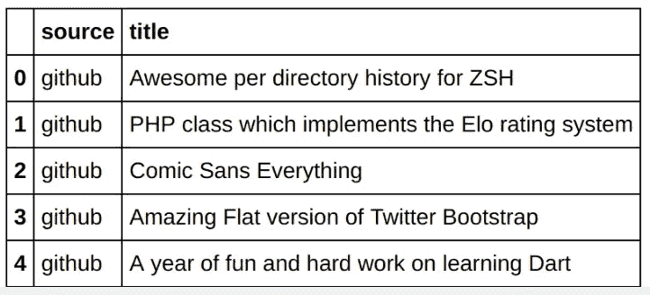

# 如何用 CNN，TensorFlow，单词嵌入做文本分类

> 原文：<https://towardsdatascience.com/how-to-do-text-classification-using-tensorflow-word-embeddings-and-cnn-edae13b3e575?source=collection_archive---------0----------------------->

假设我给你一篇文章的标题“Twitter Bootstrap 的惊人扁平版本”，并问你这篇文章出现在哪个出版物上:纽约时报、TechCrunch 或 GitHub。你的猜测是什么？一篇题为“最高法院审理党派选区重大案件”的文章怎么样？

你猜到 GitHub 和纽约时报了吗？为什么？像 Twitter 和 Major 这样的词很可能出现在任何出版物中，但像 Twitter Bootstrap 和 Supreme Court 这样的词序列更有可能分别出现在 GitHub 和纽约时报中。我们能训练一个神经网络来学习这个吗？

> 注意:评估者现在已经进入核心张量流。 [*更新了使用 tf.estimator 而不是 tf.contrib.learn.estimator 的代码现已在 GitHub*](https://github.com/GoogleCloudPlatform/training-data-analyst/tree/master/courses/machine_learning/deepdive/09_sequence/txtclsmodel/trainer)*——以更新后的代码为起点。*

# 创建数据集

机器学习就是从例子中学习。为了了解给定标题的文章的可能来源，我们需要大量文章标题及其来源的示例。尽管它存在严重的选择偏差(因为只包括 HN 书呆子成员感兴趣的文章)，但黑客新闻文章的 [BigQuery 公共数据集](https://cloud.google.com/bigquery/public-data/hacker-news)是这一信息的合理来源。

```
query="""
SELECT source, REGEXP_REPLACE(title, '[^a-zA-Z0-9 $.-]', ' ') AS title FROM
(SELECT
  ARRAY_REVERSE(SPLIT(REGEXP_EXTRACT(url, '.*://(.[^/]+)/'), '.'))[OFFSET(1)] AS source,
  title
FROM
  `bigquery-public-data.hacker_news.stories`
WHERE
  REGEXP_CONTAINS(REGEXP_EXTRACT(url, '.*://(.[^/]+)/'), '.com$')
  AND LENGTH(title) > 10
)
WHERE (source = 'github' OR source = 'nytimes' OR source = 'techcrunch')
"""
traindf = bq.Query(query + " AND MOD(ABS(FARM_FINGERPRINT(title)),4) > 0").execute().result().to_dataframe()
evaldf  = bq.Query(query + " AND MOD(ABS(FARM_FINGERPRINT(title)),4) = 0").execute().result().to_dataframe()
```

本质上，我从 BigQuery 中的黑客新闻故事数据集中提取 URL 和标题，并将其分离到一个训练和评估数据集中(完整代码请参见 [Datalab 笔记本](https://github.com/GoogleCloudPlatform/training-data-analyst/blob/master/blogs/textclassification/txtcls.ipynb))。可能的标签是 github、纽约时报或 techcrunch。以下是生成的数据集的外观:



Training dataset

我将两只熊猫的数据帧写成 CSV 文件(总共有 72，000 个训练样本，大约平均分布在纽约时报、github 和 techcrunch 上)。

# 创造词汇

我的训练数据集由标签(“源”)和单个输入列(“标题”)组成。然而，标题不是数字，神经网络需要数字输入。因此，我们需要将文本输入列转换为数字。怎么会？

最简单的方法是对标题进行一次性编码。假设数据集中有 72，000 个唯一的标题，我们将得到 72，000 列。如果我们随后就此训练一个神经网络，这个神经网络基本上必须记住标题——没有进一步推广的可能。

为了让网络通用化，我们需要将标题转换成数字，使得相似的标题以相似的数字结束。一种方法是找到标题中的单个单词，并将这些单词映射到唯一的数字。然后，有相同单词的标题在这部分序列中会有相似的数字。训练数据集中的唯一单词集被称为*词汇*。

假设我们有四个标题:

```
lines = ['Some title', 
         'A longer title', 
         'An even longer title', 
         'This is longer than doc length']
```

因为这些标题都有不同的长度，所以我会用一个虚拟单词来填充短标题，并截断很长的标题。这样，我就可以处理长度相同的标题了。

我可以使用下面的代码创建词汇表(这并不理想，因为词汇表处理器将所有内容都存储在内存中；对于更大的数据集和更复杂的预处理，比如合并停用词和不区分大小写， [tf.transform](https://github.com/tensorflow/transform) 是更好的解决方案——这是另一篇博文的主题):

```
**import** **tensorflow** **as** **tf**
**from** **tensorflow.contrib** **import** lookup
**from** **tensorflow.python.platform** **import** gfile

MAX_DOCUMENT_LENGTH = 5  
PADWORD = 'ZYXW'

*# create vocabulary*
vocab_processor = tf.contrib.learn.preprocessing.VocabularyProcessor(MAX_DOCUMENT_LENGTH)
vocab_processor.fit(lines)
**with** gfile.Open('vocab.tsv', 'wb') **as** f:
    f.write("{}**\n**".format(PADWORD))
    **for** word, index **in** vocab_processor.vocabulary_._mapping.iteritems():
      f.write("{}**\n**".format(word))
N_WORDS = len(vocab_processor.vocabulary_)
```

在上面的代码中，我会用一个填充词填充简短的标题，我希望它不会出现在实际的文本中。标题将被填充或截短至 5 个单词的长度。我传入训练数据集(上面示例中的“lines”)，然后写出结果词汇。词汇变成了:

```
ZYXW
A
even
longer
title
This
doc
is
Some
An
length
than
<UNK>
```

注意，我添加了 padword，词汇处理器在这组行中找到了所有独特的单词。最后，在评估/预测期间遇到的不在训练数据集中的单词将被替换为<unk>，因此这也是词汇表的一部分。</unk>

根据上面的词汇表，我们可以将任何标题转换成一组数字:

```
table = lookup.index_table_from_file(
  vocabulary_file='vocab.tsv', num_oov_buckets=1, vocab_size=None, default_value=-1)
numbers = table.lookup(tf.constant(**'Some title'**.split()))
**with** tf.Session() **as** sess:
  tf.tables_initializer().run()
  **print** "{} --> {}".format(lines[0], numbers.eval())
```

上面的代码将查找单词“Some”和“title ”,并根据词汇返回索引[8，4]。当然，在实际的训练/预测图中，我们还需要确保填充/截断。让我们看看接下来该怎么做。

# 文字处理

首先，我们从行(每行是一个标题)开始，将标题拆分成单词:

```
*# string operations*
titles = tf.constant(lines)
words = tf.string_split(titles)
```

这导致:

```
titles= ['Some title' 'A longer title' 'An even longer title'
 'This is longer than doc length']
words= SparseTensorValue(indices=array([[0, 0],
       [0, 1],
       [1, 0],
       [1, 1],
       [1, 2],
       [2, 0],
       [2, 1],
       [2, 2],
       [2, 3],
       [3, 0],
       [3, 1],
       [3, 2],
       [3, 3],
       [3, 4],
       [3, 5]]), values=array(['Some', 'title', 'A', 'longer', 'title', 'An', 'even', 'longer',
       'title', 'This', 'is', 'longer', 'than', 'doc', 'length'], dtype=object), dense_shape=array([4, 6]))
```

TensorFlow 的 string_split()函数最终创建了一个 SparseTensor。谈论一个过于有用的 API。但是我不希望自动创建映射，所以我将把稀疏张量转换成密集张量，然后从我自己的词汇表中查找索引:

```
*# string operations*
titles = tf.constant(lines)
words = tf.string_split(titles)
densewords = tf.sparse_tensor_to_dense(words, default_value=PADWORD)
numbers = table.lookup(densewords)
```

现在，densewords 和 numbers 与预期的一样(注意填充的 PADWORD:

```
dense= [['Some' 'title' 'ZYXW' 'ZYXW' 'ZYXW' 'ZYXW']
 ['A' 'longer' 'title' 'ZYXW' 'ZYXW' 'ZYXW']
 ['An' 'even' 'longer' 'title' 'ZYXW' 'ZYXW']
 ['This' 'is' 'longer' 'than' 'doc' 'length']]
numbers= [[ 8  4  0  0  0  0]
 [ 1  3  4  0  0  0]
 [ 9  2  3  4  0  0]
 [ 5  7  3 11  6 10]]
```

还要注意，数字矩阵具有数据集中最长标题的宽度。因为这个宽度会随着处理的每一批而变化，所以它并不理想。为了保持一致，让我们将其填充到 MAX_DOCUMENT_LENGTH，然后将其截断:

```
padding = tf.constant([[0,0],[0,MAX_DOCUMENT_LENGTH]])
padded = tf.pad(numbers, padding)
sliced = tf.slice(padded, [0,0], [-1, MAX_DOCUMENT_LENGTH])
```

这会创建一个 batchsize x 5 矩阵，其中较短的标题用零填充:

```
padding= [[0 0]
 [0 5]] 
padded= [[ 8  4  0  0  0  0  0  0  0  0  0]
 [ 1  3  4  0  0  0  0  0  0  0  0]
 [ 9  2  3  4  0  0  0  0  0  0  0]
 [ 5  7  3 11  6 10  0  0  0  0  0]] 
sliced= [[ 8  4  0  0  0]
 [ 1  3  4  0  0]
 [ 9  2  3  4  0]
 [ 5  7  3 11  6]]
```

在上面的例子中，我使用的 MAX_DOCUMENT_LENGTH 为 5，这样我可以向您展示正在发生的事情。在真实数据集中，标题长于 5 个单词。所以，在我会用

```
MAX_DOCUMENT_LENGTH = 20
```

*切片*矩阵的形状将是 batchsize x MAX_DOCUMENT_LENGTH，即 batchsize x 20。

# 把...嵌入

既然我们的单词已经被数字取代，我们可以简单地进行一次性编码，但这将导致非常广泛的输入——在标题数据集中有数千个独特的单词。一个更好的方法是减少输入的维度——这是通过嵌入层来实现的(参见[完整代码](https://github.com/GoogleCloudPlatform/training-data-analyst/blob/master/blogs/textclassification/txtcls1/trainer/model.py)):

```
EMBEDDING_SIZE = 10
embeds = tf.contrib.layers.embed_sequence(sliced, 
                 vocab_size=N_WORDS, embed_dim=EMBEDDING_SIZE)
```

一旦有了嵌入，我们现在就有了标题中每个单词的表示。嵌入的结果是一个 batch SIZE x MAX_DOCUMENT_LENGTH x EMBEDDING_SIZE 张量，因为一个标题由 MAX _ DOCUMENT _ LENGTH 个单词组成，每个单词现在用 EMBEDDING _ SIZE 个数字表示。(养成在 TensorFlow 代码的每一步计算张量形状的习惯——这将帮助你理解代码在做什么，维度意味着什么)。

如果我们愿意，我们可以简单地将嵌入的单词连接到一个深度神经网络中，训练它，然后开始我们的快乐之路。但是仅仅使用单词本身并没有利用单词序列具有特定含义的事实。毕竟，“最高法院”可以出现在许多场合，但是“最高法院”有更具体的含义。我们如何学习单词序列？

# 盘旋

学习序列的一种方法是不仅嵌入独特的单词，还嵌入二元模型(单词对)、三元模型(单词三元组)等。然而，对于相对较小的数据集，这开始变得类似于对数据集中的每个唯一单词进行一次性编码。

更好的方法是增加一个卷积层。卷积只是一种将移动窗口应用于输入数据并让神经网络学习应用于相邻单词的权重的方法。虽然在处理图像数据时更常见，但这是帮助任何神经网络了解附近输入之间的相关性的便捷方式:

```
WINDOW_SIZE = EMBEDDING_SIZE
STRIDE = int(WINDOW_SIZE/2)
conv = tf.contrib.layers.conv2d(embeds, 1, WINDOW_SIZE, 
                stride=STRIDE, padding='SAME') # (?, 4, 1)    
conv = tf.nn.relu(conv) # (?, 4, 1)    
words = tf.squeeze(conv, [2]) # (?, 4)
```

回想一下，嵌入的结果是一个 20 x 10 的张量(我们暂且忽略 batchsize 这里的所有操作都是一次对一个标题进行的)。我现在将 10x10 窗口中的加权平均值应用于标题的嵌入表示，将窗口移动 5 个单词(步幅=5)，然后再次应用它。所以，我会有 4 个这样的卷积结果。然后，我对卷积结果应用非线性变换(relu)。

我现在有四个结果。我可以简单地将它们通过密集层连接到输出层:

```
n_classes = len(TARGETS)     
logits = tf.contrib.layers.fully_connected(words, n_classes, 
                                    activation_fn=None)
```

如果你习惯于图像模型，你可能会感到惊讶，我用了卷积层，但没有最大池层。使用 maxpool 图层的原因是为了增加网络的空间不变性-直观地说，您希望找到一只猫，而不管这只猫在图像中的位置。然而，标题中的空间位置非常重要。很有可能《纽约时报》文章的标题与 GitHub 文章的标题有所不同。因此，我没有在这个任务中使用 maxpool 层。

给定 logit，我们可以通过执行 TARGETS[max(logit)]来找出源。在 TensorFlow 中，这是使用 tf.gather 完成的:

```
predictions_dict = {      
'source': tf.gather(TARGETS, tf.argmax(logits, 1)),      
'class': tf.argmax(logits, 1),      
'prob': tf.nn.softmax(logits)    
}
```

为了完整起见，我还发送了实际的类索引和每个类的概率。

# 培训和部署

代码都写好了(见[完整代码这里](https://github.com/GoogleCloudPlatform/training-data-analyst/tree/master/blogs/textclassification))，我就可以在 Cloud ML 引擎上训练它了:

```
OUTDIR=gs://${BUCKET}/txtcls1/trained_model
JOBNAME=txtcls_$(date -u +%y%m%d_%H%M%S)
echo $OUTDIR $REGION $JOBNAME
gsutil -m rm -rf $OUTDIR
gsutil cp txtcls1/trainer/*.py $OUTDIR
gcloud ml-engine jobs submit training $JOBNAME \
   --region=$REGION \
   --module-name=trainer.task \
   --package-path=$(pwd)/txtcls1/trainer \
   --job-dir=$OUTDIR \
   --staging-bucket=gs://$BUCKET \
   --scale-tier=BASIC --runtime-version=1.2 \
   -- \
   --bucket=${BUCKET} \
   --output_dir=${OUTDIR} \
   --train_steps=36000
```

数据集非常小，所以训练不到五分钟就结束了，我在评估数据集上获得了 73%的准确率。

然后，我可以将该模型作为微服务部署到云 ML 引擎:

```
MODEL_NAME="txtcls"
MODEL_VERSION="v1"
MODEL_LOCATION=$(gsutil ls \
     gs://${BUCKET}/txtcls1/trained_model/export/Servo/ | tail -1)
gcloud ml-engine models create ${MODEL_NAME} --regions $REGION
gcloud ml-engine versions create ${MODEL_VERSION} --model \
     ${MODEL_NAME} --origin ${MODEL_LOCATION}
```

# 预言；预测；预告

为了让模型进行预测，我们可以向它发送一个 JSON 请求:

```
**from** **googleapiclient** **import** discovery
**from** **oauth2client.client** **import** GoogleCredentials
**import** **json**

credentials = GoogleCredentials.get_application_default()
api = discovery.build('ml', 'v1beta1', credentials=credentials,
            discoveryServiceUrl='https://storage.googleapis.com/cloud-ml/discovery/ml_v1beta1_discovery.json')

request_data = {'instances':
  [
      {
        'title': 'Supreme Court to Hear Major Case on Partisan Districts'
      },
      {
        'title': 'Furan -- build and push Docker images from GitHub to target'
      },
      {
        'title': 'Time Warner will spend $100M on Snapchat original shows and ads'
      },
  ]
}

parent = 'projects/**%s**/models/**%s**/versions/**%s**' % (PROJECT, 'txtcls', 'v1')
response = api.projects().predict(body=request_data, name=parent).execute()
**print** "response={0}".format(response)
```

这会产生一个 JSON 响应:

```
response={u'predictions': [{u'source': u'nytimes', u'prob': [**0.777**5614857673645, 5.86951500736177e-05, 0.22237983345985413], u'class': 0}, {u'source': u'github', u'prob': [0.1087314561009407, **0.890**9648656845093, 0.0003036781563423574], u'class': 1}, {u'source': u'techcrunch', u'prob': [0.0021869686897844076, 1.563105769264439e-07, **0.997**8128671646118], u'class': 2}]}
```

经过训练的模型预测，最高法院的文章有 78%的可能性来自《纽约时报》。根据该服务，Docker 的文章 89%可能来自 GitHub，而时代华纳的文章 100%可能来自 TechCrunch。那是 3/3。

**资源:**所有代码都在 GitHub 这里:[https://GitHub . com/Google cloud platform/training-data-analyst/tree/master/blogs/text classification](https://github.com/GoogleCloudPlatform/training-data-analyst/tree/master/blogs/textclassification)