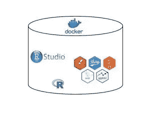
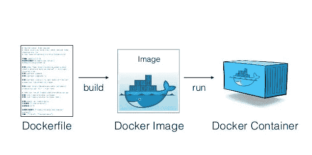
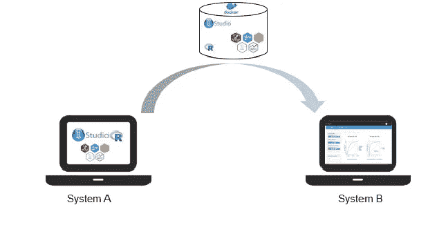

# 如何将闪亮的应用程序分类——第 1 部分

> 原文：<https://towardsdatascience.com/how-to-dockerize-an-r-shiny-app-part-1-d4267659312a?source=collection_archive---------2----------------------->

**Docker : Representational Image**

在我之前的[帖子](/how-to-host-a-r-shiny-app-on-aws-cloud-in-7-simple-steps-5595e7885722)中，我写了如何在 AWS cloud 上托管一个 R shiny 应用程序。成功托管应用后，您的终端用户可以轻松访问该应用。但是，如果您的最终用户希望在他们的系统中本地托管应用程序，并可能对应用程序本身进行更改，该怎么办呢？

虽然我在上一篇文章中展示了一个“Hello world”版本，但在真实的工作环境中，R shiny 应用程序可能会变得非常复杂。一些闪亮的应用程序可以在后端运行复杂的算法，例如客户流失预测、设备故障概率、天气预测等。所有这些用 R 写的算法都调用了很多包。这些软件包中的一些可能与接收者系统中安装的 R 版本不兼容。

当我在真实环境中托管一个闪亮的应用程序时，我也面临着许多障碍，包括缺少数据文件、缺少工作空间、缺少闪亮的应用程序组件(UI。R &服务器。r ),当然更不用说各种缺失或不是“最新”的库包了。我希望有一种方法，负责开发 R shiny 应用程序的人只需给我一个 zip 文件，去掉所有依赖项，我所要做的就是解压缩并运行代码来托管应用程序。有些人可能会说这是痴心妄想，但事实并非如此。**进入‘码头工人’。**

**什么是码头工人？**

尽管软件工程人员可能已经知道了 Docker，但我将尝试用通俗的语言为不熟悉它的人解释。所以它开始了

想象你在地球上某个偏远的小镇。你希望用乐高搭建一个玩具建筑，但是你所在的城镇既没有乐高，也不知道如何把积木拼起来搭建一个建筑。

Image source : [http://www.thinkgeek.com/product/edab/](http://www.thinkgeek.com/product/edab/)

输入您的朋友“码头工人”。码头工人已经用乐高积木预建了这座建筑，并将其包装在一个礼品盒中。谈论理想的圣诞礼物😉。现在你要做的就是打开包装，把它放在你的桌子上。Tada！！！你的愿望实现了。

你刚刚避免了哪些麻烦

> 购买正确的乐高积木，帮助你建造玩具建筑
> 
> 将乐高积木拼在一起
> 
> 故意拖延时间

现在让我们扩展乐高类比，更深入地研究 Docker。

> 乐高积木类似于您的代码及其依赖项(包、库)和环境(操作系统、软件版本、IDE)。
> 
> 礼品盒是安全地包含所有组件的“容器”。
> 
> 你打开包装并安全地把它放在桌子上就是代码的部署。

进行上述操作时，您的优势是

> 您不必安装该语言的最新版本或其包/库
> 
> 您不必配置您的环境
> 
> 你可以直接部署代码，是的，你节省了很多时间

好了，现在我们对 Docker 有了一个直观的概念，让我们更进一步，从技术上探索它。

**引擎盖下的 Docker:**

Docker 基本上是一个容器。容器是图像的运行实例。

Image 是运行代码的环境的快照。它包含操作系统、软件和库包。

dockerfile 文件有助于定义图像。这是创建图像的一系列步骤。它将包含加载哪些库包、从哪里复制文件以及将文件复制到哪个位置的详细信息。

下图恰当地说明了这一过程

Picture adapted from [Slideshare](https://www.slideshare.net/vincenzoferme/using-docker-containers-to-improve-reproducibility-in-software-and-web-engineering)

杰克·赖特写的关于码头工人的优秀教程可以在下面的链接中看到。

所以伙计们，Docker 帮助托管一个 R shiny 应用程序，如下图所示。多亏了 Docker，系统 B 成功托管了闪亮的应用程序。

**Representational image of R shiny app hosted successfully**

希望你喜欢我的文章。这里是[第二部](https://medium.com/@venksaiyan/how-to-dockerize-an-r-shiny-app-part-2-b029d915e6ac)

你可以联系我

[领英](http://www.linkedin.com/in/venkat-raman-Analytics)

[推特](https://twitter.com/venksaiyan)