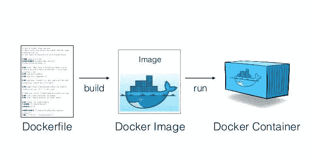
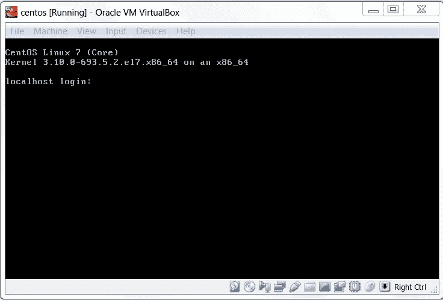
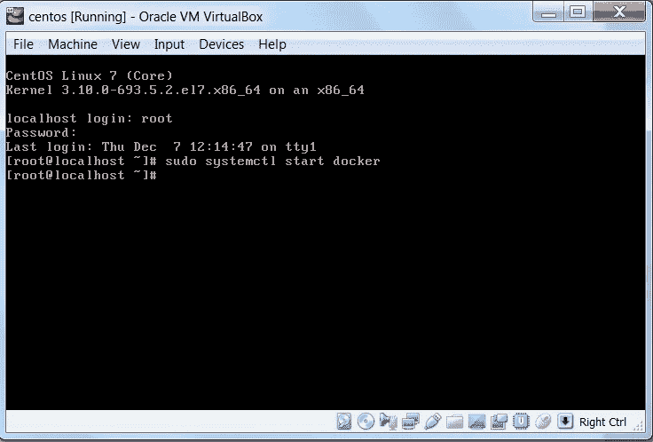
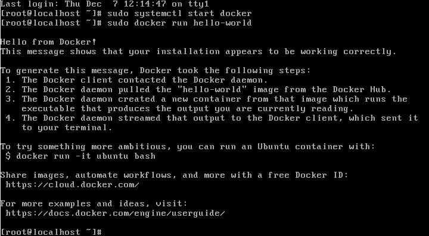
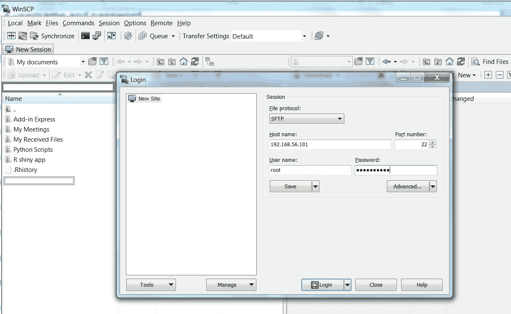
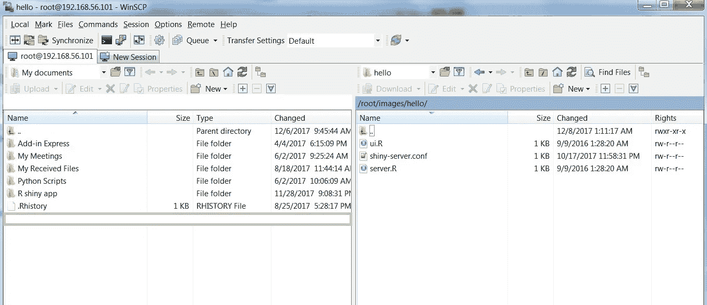
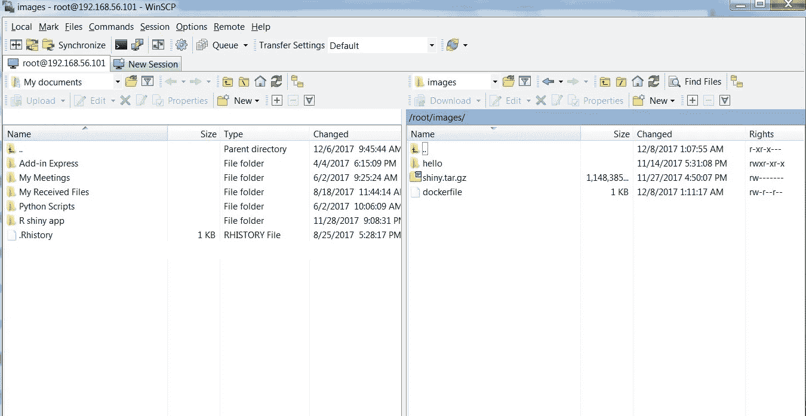
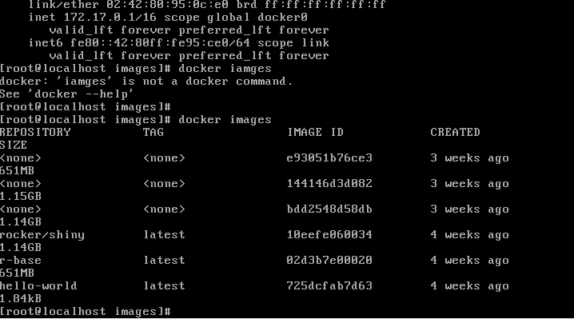
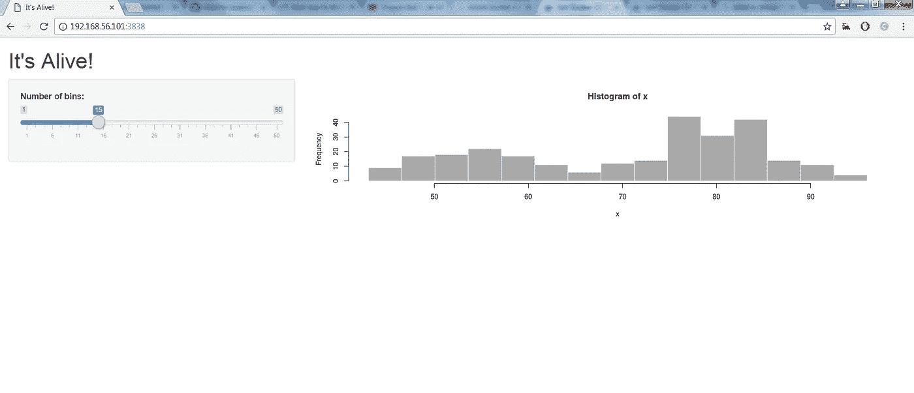

# 如何将一个闪亮的应用程序分类——第二部分

> 原文：<https://towardsdatascience.com/how-to-dockerize-an-r-shiny-app-part-2-b029d915e6ac?source=collection_archive---------12----------------------->

大家好！！

首先，我想为第二部分的出版延迟道歉。延迟的原因是第 2 部分的一些博客材料(命令、快照)在我的笔记本电脑中被意外删除了。

由于时间不够，而且我的工作性质变得更像数据科学，而不是开发工作/数据工程，不允许我将这些碎片拼凑起来，使之成为一篇有价值的文章。

然而，自从我读完第一部分后，我已经收到了很多读者关于第二部分的询问。我最终决定写第二部分。

所以，读者们，感谢你们的耐心。让我们从我在第 1 部分留下的地方开始阅读这篇文章。

好吧，那么，快速复习一下 Docker 及其概念。

# **什么是 Docker、Container 和 Dockerfile？**

Docker 基本上是一个容器。容器是图像的运行实例。

Image 是运行代码的环境的快照。它包含操作系统、软件和库包。

Dockerfile 文件有助于定义图像。这是创建图像的一系列步骤。它将包含加载哪些库包、从哪里复制文件以及将文件复制到哪个位置的详细信息。

下图恰当地说明了这一过程

Picture adapted from [Slideshare](https://www.slideshare.net/vincenzoferme/using-docker-containers-to-improve-reproducibility-in-software-and-web-engineering)

# **如何将一个 R 闪亮的 App Dockerize**

因此，这里有一系列的步骤来解释如何做到这一点。

**第一步**:安装 Oracle VM 虚拟箱

**第二步**:安装 Centos，也可以使用 ubuntu。

给出用户名和密码

你会看到如下图片

**第三步**:获取 docker CE for centos([https://docs . docker . com/engine/installation/Linux/docker-CE/centos/](https://docs.docker.com/engine/installation/linux/docker-ce/centos/))

**第四步**:启动 docker(见下图)

**第五步**:运行 hello world(见下图)

**第六步**:创建文件夹。例如图像

通过命令:*须藤 mkdir 图片*

**步骤 7** :创建 docker 文件(如 dock)

命令: *Vi dock*

按 I 键开始进入文件。输入详细信息后

按 esc -> : wq

docker 文件如下所示。这个 [dockerfile](https://hub.docker.com/r/rocker/shiny/~/dockerfile/) (摇滚/闪亮)我是从 dockerhub 本身拿的。你可以调整 docker 文件例如，你可以安装一个你选择的 R 版本。

请注意，需要在 docker 文件中设置代理。

接下来的步骤将告诉你如何将 R Shiny 应用程序的内容复制到“images”文件夹中

**第八步**:输入 *ip add* 命令，获取虚拟机的 Ip 地址

**第九步:**打开 winscp 输入 ip

单击登录

**步骤 10** :现在将 R shiny app 内容 s 复制到文件夹中

**步骤 11** :现在输入 docker 图片

**步骤 12** :复制图像 ID 或标签(在我的例子中，图像 ID 是 144146d3d082)

**步骤 13** :运行以下命令

*docker run--RM-p 3838:3838 144146 d3d 082*

**第 14 步**:使用 vm 后缀:3838 的 ip，然后按回车键，你闪亮的 app 托管成功，对接成功！！。

见下图

现在你可能会问，用户如何在他/她的系统中部署 R shiny 应用程序？要做到这一点，需要采取以下步骤。

**第 15 步**:加载图像并放入 tar 文件格式(使用下面的命令:用你的应用程序的名称替换‘App ’)

> *docker save-o ~/App . tar App*

**步骤 16** :把这个 tar 文件交给安装了 docker 的用户就可以了。

**步骤 17** :用户只需加载图片，然后运行 app。

**步骤 18** :闪亮的 app 成功托管在用户系统上！！

伙计们，就是这样。再次感谢你的耐心。有很多种方法可以将一个 R Shiny App docker ize。本文采用虚拟机路线，也有其他方法。一个很好的来源是这个博客。

希望你喜欢这篇文章。如果你做了，你可以给它一些掌声。

你可以联系我

[领英](http://www.linkedin.com/in/venkat-raman-Analytics)

[推特](https://twitter.com/venksaiyan)