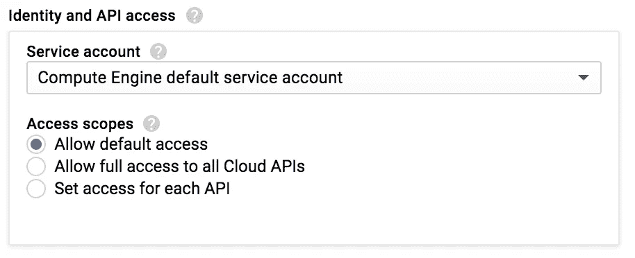
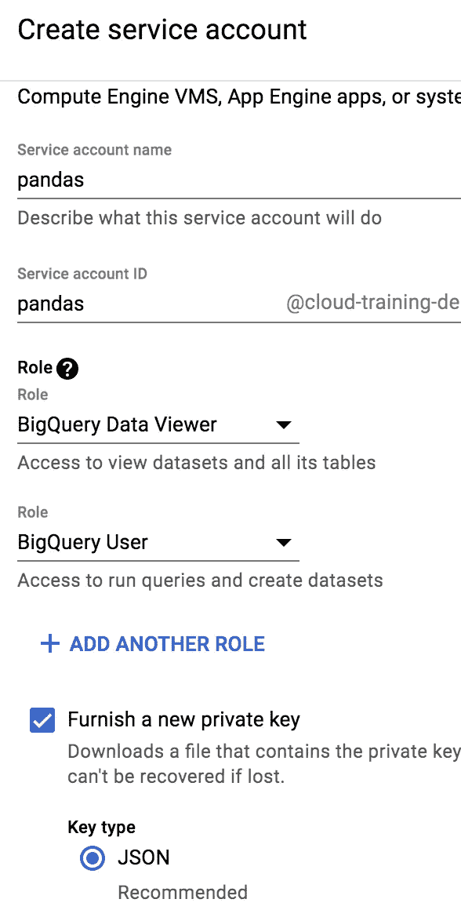

# 如何让 Pandas 从服务帐户访问 BigQuery

> 原文：<https://towardsdatascience.com/how-to-enable-pandas-to-access-bigquery-from-a-service-account-205a216f0f68?source=collection_archive---------7----------------------->

服务账户是一种严格控制你的应用程序在谷歌云平台上做什么的方式。您通常希望应用程序对组织资源的访问受到严格限制，而不是使用您的用户帐户拥有的所有权限来运行应用程序。


How to use a private key in a service account to access BigQuery from Pandas

假设您希望 Pandas 针对 BigQuery 运行一个查询。您可以使用熊猫的 [read_gbq(在 pandas-gbq 包中提供):](https://pandas.pydata.org/pandas-docs/version/0.21/generated/pandas.read_gbq.html)

```
import pandas as pdquery = """
SELECT
  year,
  COUNT(1) as num_babies
FROM
  publicdata.samples.natality
WHERE
  year > 2000
GROUP BY
  year
"""df = pd.read_gbq(query,
                     project_id='MY_PROJECT_ID',
                     dialect='standard') print(df.head())
```

如果您在本地运行它，这将会起作用(因为它使用您的身份，并且假设您有能力在您的项目中运行查询)。

但是，如果您尝试从一个基本帐户运行上面的代码，它将不起作用。您将被要求通过一个 OAuth2 工作流来专门授权该应用程序。为什么？因为您不希望一个任意的应用程序运行一个 BigQuery 账单(或者更糟，访问您的公司数据)，所以您必须为它提供所需的权限。

让我们试一试。

# 1.创建 GCE 实例

要跟随我，使用 GCP web 控制台并创建一个具有默认访问权限的 Google 计算引擎实例(这通常只包括最基本的内容，不包括对 BigQuery 的访问权限):



Creating a Google Compute Engine instance with restricted access

# 2.创建一个准系统服务帐户

从 GCP web 控制台，创建一个新的服务帐户。这是您将为其生成私钥的帐户。为了额外的安全性和审计，我建议为每个应用程序创建一个全新的服务帐户，并且不要在应用程序之间重用服务帐户。

进入 IAM & Admin，选择“服务帐户”,然后点击+创建服务帐户。按如下方式填写表格:



Creating a barebones service account for Pandas

上述角色允许服务帐户运行查询，并将这些查询记入项目。但是，数据集所有者仍然需要允许服务帐户查看他们的数据集。

如果您使用非公共的 BigQuery 数据集，请通过转到 BigQuery 控制台并与服务帐户的电子邮件地址共享数据集，授予服务帐户对该数据集的适当(通常只是查看)访问权限。出于本教程的目的，我将使用一个公共的 BigQuery 数据集，所以我们可以跳过这一步。

# 3.将示例代码放在 GCE 实例上

SSH 到 GCE 实例，并在命令行中键入以下命令:

```
sudo apt-get install -y git python-pipgit clone [https://github.com/GoogleCloudPlatform/training-data-analyst](https://github.com/GoogleCloudPlatform/training-data-analyst)sudo pip install pandas-gbq==0.4.1
```

# 4.不使用默认凭据运行

更改 [nokey_query.py](https://github.com/GoogleCloudPlatform/training-data-analyst/blob/master/blogs/pandas-pvtkey/nokey_query.py) 中的项目 id，然后运行它:

```
cd training-data-analyst/blogs/pandas-pvtkey# EDIT nokey_query.py to set the PROJECT IDpython nokey_query.py
```

它将要求您完成一个 OAuth2 工作流。按 Ctrl-C 退出。您不希望此应用程序使用*您的*凭据运行。

遇到这种错误时，您会听到一个常见的建议，那就是运行:

```
# BAD IDEA! DO NOT DO THIS
gcloud auth application-default login
```

并在启动应用程序之前在 shell 中完成交互式 OAuth 2 工作流。要小心这样做:(1)上面的命令是一个火箭筒，允许应用程序做你能做的任何事情。(2)不可脚本化。每次运行应用程序时，您都必须这样做。

最好的方法是创建计算引擎虚拟机，不是使用最基本的服务帐户，而是使用您已经授予 BigQuery 查看器权限的服务帐户。换句话说，交换步骤 1 和 2，当您创建 GCE 实例时，使用新创建的服务帐户。

但是，如果您不在 GCP 上(因此您的机器不是由服务帐户 auth 创建的)或者您正在使用云数据流或云 ML 引擎等托管服务(因此虚拟机是由该服务的服务帐户创建的)，该怎么办呢？在这种情况下，更好的方法是按如下方式更改熊猫代码:

```
 df = pd.read_gbq(query,
                     project_id='MY_PROJECT_ID',
                    ** private_key='path_to/privatekey.json',**
                     dialect='standard',
                     verbose=False)
```

应用程序现在将使用与该私钥相关联的权限。

# 5.不使用私钥运行

在 [query.py](https://github.com/GoogleCloudPlatform/training-data-analyst/blob/master/blogs/pandas-pvtkey/query.py) 中更改项目 id，然后运行它:

```
cd training-data-analyst/blogs/pandas-pvtkey# EDIT query.py to set the PROJECT IDpython query.py 
```

它会失败，说找不到私钥

# 6.为服务帐户生成私钥

还记得在创建服务帐户时创建了一个 JSON 私有密钥吗？你需要把它上传到 GCE 虚拟机。(如果您没有创建密钥文件，请导航到 IAM >服务帐户，并为 pandas 服务帐户创建一个私钥。这将创建一个 JSON 文件，并将其下载到您的本地计算机。您也可以从这里撤销密钥。)

在 SSH 窗口的右上角，有一个上传文件的方法。将生成的 JSON 文件上传到 GCE 实例，并将其移动到位:

```
mv ~/*.json trainer/privatekey.json
```

# 7.用私钥运行

```
python query.py
```

现在它可以工作了，您将得到查询的结果。

# 8.将私钥放入 Python 包中

如果您没有使用 GCE，而是使用托管服务(云数据流、云 ML 引擎等),该怎么办？)反而？

在这种情况下，您将提交一个 Python 包。使用 package_data 属性在 setup.py 中将私钥标记为资源:

```
from setuptools import setupsetup(name='trainer',
      version='1.0',
      description='Showing how to use private key',
      url='[http://github.com/GoogleCloudPlatform/training-data-analyst'](http://github.com/GoogleCloudPlatform/training-data-analyst'),
      author='Google',
      [author_email='nobody@google.com](mailto:author_email='nobody@google.com)',
      license='Apache2',
      packages=['trainer'],
      **## WARNING! Do not upload this package to PyPI
      ## BECAUSE it contains a private key**
      **package_data={'trainer': ['privatekey.json']},**
      install_requires=[
          'pandas-gbq==0.4.1',
          'urllib3',
          'google-cloud-bigquery'
      ],
      zip_safe=False)
```

然后，执行以下操作，而不是硬编码 privatekey.json 文件的路径:

```
private_key = pkgutil.get_data('trainer', 'privatekey.json')
```

这里有一个[更完整的例子](https://github.com/GoogleCloudPlatform/training-data-analyst/tree/master/blogs/sklearn)。注意 Python 没有将包标记为私有的方法，所以您应该小心不要错误地将这个包发布在公共存储库中，比如 PyPI。

# 9.保护私钥

私钥实质上为提供它的任何人解锁了已经可用的资源。在这种情况下，任何提供私钥的人都可以进行 BigQuery 查询。没有第二种形式的身份验证(IP 地址、用户登录、硬件令牌等)。)是必需的。因此，要注意如何/在哪里存储私钥。我的建议是:

(1)确保 Python 包中有一个显式忽略私钥的. gitignore:

```
$cat trainer/.gitignore
privatekey.json
```

(2)使用 [git 秘密](https://github.com/awslabs/git-secrets)来帮助防止密钥泄漏

(3)旋转你的钥匙。详见本[博客](https://cloudplatform.googleblog.com/2017/07/help-keep-your-Google-Cloud-service-account-keys-safe.html?m=1)。

(4)确保不要将 Python 包发布到任何 Python 包的存储库中，因为您的存储库中包含私钥。

# 摘要

*   使用 JSON private_key 属性来限制 Pandas 代码对 BigQuery 的访问。
*   创建具有准系统权限的服务帐户
*   与服务帐户共享特定的 BigQuery 数据集
*   为服务帐户生成私钥
*   将私钥上传到 GCE 实例或将私钥添加到可提交的 Python 包中
*   确保不要将私钥签入代码或包存储库中。使用密钥旋转器和 git 机密。

下面是 GitHub 中这篇文章的[示例代码。编码快乐！](https://github.com/GoogleCloudPlatform/training-data-analyst/tree/master/blogs/pandas-pvtkey)

鸣谢:感谢我的同事 Tim Swast 和 Grace Mollison 的帮助和建议。文章中的任何错误都是我自己的。