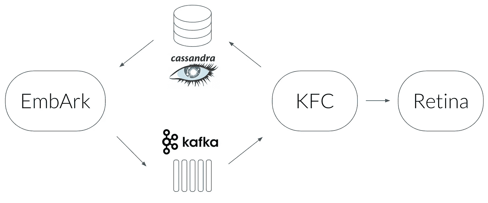

# 如何走出缓慢的模式

> 原文：<https://towardsdatascience.com/how-to-engineer-your-way-out-of-slow-models-e62568f02fde?source=collection_archive---------8----------------------->

你刚刚完成了你那个伟大的神经网络架构的设计。它有数量惊人的 300 个完全连接的层，与 200 个各有 20 个通道的卷积层交织在一起，其结果被作为一个光荣的[双向](https://en.wikipedia.org/wiki/Bidirectional_recurrent_neural_networks) [堆叠](https://machinelearningmastery.com/stacked-long-short-term-memory-networks/) [LSTM](http://colah.github.io/posts/2015-08-Understanding-LSTMs/) 的种子，并受到少量[关注](http://www.wildml.com/2016/01/attention-and-memory-in-deep-learning-and-nlp/)。训练后，你获得了 99.99%的准确率，你就可以把它投入生产了。

但是随后您意识到生产约束不允许您使用这个工具进行推理。你需要在 200 毫秒内完成推断。

换句话说，你需要砍掉一半的层，放弃使用卷积，让我们不要开始昂贵的 LSTM…

要是你能让那个神奇的模型更快就好了！

# 有时候你可以

在塔布拉，我们做到了。嗯，不完全是…让我解释一下。

我们的一个模型必须预测一个项目的点击率，或者换句话说，用户喜欢一篇推荐文章并点击它的概率。

该模型有多个模态作为输入，每个模态都经历不同的转换。其中一些是:

*   分类特征:这些特征[嵌入](https://engineering.taboola.com/using-word2vec-better-embeddings-categorical-features/)到一个密集的表示中
*   图像:像素通过卷积层和全连接层
*   文本:在被标记后，文本通过 LSTM，接着是[自我关注](https://arxiv.org/abs/1703.03130)

然后，这些处理过的模态通过完全连接的层，以学习模态之间的交互，最后，它们通过 [MDN](https://engineering.taboola.com/uncertainty-ctr-prediction-one-model-clarify) 层。

可想而知，这种模式很慢。

我们决定坚持模型的预测能力，而不是修整组件，并提出了一个工程解决方案。

# 如果可以的话，请把我藏起来

让我们把重点放在图像组件上。该组件的输出是图像的学习表示。换句话说，给定一个图像，图像组件输出一个嵌入。

该模型是确定性的，因此给定相同的图像将导致相同的嵌入。这是很昂贵的，所以我们可以缓存它。我来详细说说我们是怎么实现的。

# (缓存的，而不是模型的)架构

*   我们使用一个 [Cassandra](http://cassandra.apache.org/) 数据库作为缓存，将图像 URL 映射到它的嵌入。
*   查询 Cassandra 的服务叫做 EmbArk(嵌入存档，[当然拼错了](https://techcrunch.com/2017/05/20/the-bizarre-naming-trends-that-modern-startups-follow/))。这是一个 [gRPC](https://grpc.io/) 服务器，它从客户端获取图像 URL，并从 Cassandra 检索嵌入内容。在缓存未命中时，EmbArk 发送一个异步请求来嵌入该映像。为什么是异步？因为我们需要尽可能快地对结果做出反应。鉴于它不能等待图像被嵌入，它返回一个特殊的 OOV(不在词汇表中)嵌入。
*   我们选择使用的异步机制是[Kafka](https://kafka.apache.org/)——一个用作消息队列的流媒体平台。
*   下一个链接是 KFC (Kafka 前端客户端)—我们实现的 Kafka 消费者，用于将消息同步传递到嵌入服务，并将结果嵌入保存在 Cassandra 中。
*   嵌入服务被称为视网膜。它从肯德基获得一个图像 URL，下载它，预处理它，并评估卷积层以获得最终的嵌入。
*   使用[链接器](https://linkerd.io/)完成所有组件的负载平衡。
*   EmbArk，KFC，Retina，Linkerd 在 [Docker](https://www.docker.com/) 内部运行，由 [Nomad](https://www.nomadproject.io/) 编排。这使我们可以根据自己的需要轻松扩展每个组件。

这种架构最初用于图像。在证明了它的价值之后，我们决定将它用于其他组件，比如文本。

EmbArk 对迁移学习来说也是一个很好的解决方案。假设我们相信图像的内容具有预测 CTR 的良好信号。因此，一个被训练用来对图像中的物体进行分类的模型，比如[《盗梦空间》](https://ai.googleblog.com/2016/03/train-your-own-image-classifier-with.html)，对于我们的需求来说是有价值的。我们可以将 Inception 加载到 Retina 中，告诉我们打算训练的模型，我们要使用 Inception 嵌入，就这样。

不仅提高了推理时间，还改进了训练过程。只有当我们不想进行端到端的训练时，这才是可能的，因为梯度不能通过 EmbArk 反向传播。

所以当你在生产中使用模型时，你应该使用 EmbArk，对吗？嗯，不总是…

# 警告

这里有三个非常严格的假设。

## 1.新输入的 OOV 嵌入不是一件大事

当我们第一次看到一幅图像时，我们不会有它的嵌入，这不会伤害我们。

在我们的生产系统中，这是可以的，因为在很短的时间内，同一项目的 CTR 会被评估多次。我们每隔几分钟就创建一个我们想要推荐的商品列表，所以即使一个商品因为非最佳点击率预测而没有进入列表，它也会在下一个周期出现。

## 2.新投入的比率很低

的确，在 Taboola，我们一直都有很多新商品。但是相对于我们需要对已知项目进行的推理数量来说，这并不算多。

## 3.嵌入不会经常改变

因为嵌入是缓存的，所以我们相信它们不会随时间而改变。如果是这样，我们将需要执行缓存失效，并使用 Retina 重新计算嵌入。如果这种情况经常发生，我们将失去架构的优势。对于像 inception 或语言建模这样的情况，这种假设成立，因为语义不会随着时间的推移而显著改变。

# 一些最后的想法

有时，使用最先进的模型会因其计算需求而产生问题。通过缓存中间结果(嵌入),我们能够克服这一挑战，并且仍然享受最先进的结果。

这种解决方案并不适合所有人，但是如果上述三个假设适用于您的应用程序，您可以考虑使用类似的架构。

通过使用微服务范式，该公司的其他团队能够使用 EmbArk 来满足 CTR 预测之外的需求。例如，一个团队使用 EmbArk 来获得图像和文本嵌入，以检测不同项目之间的重复。但是我会把这个故事留给另一篇文章…

【engineering.taboola.com】**最初由我在* [*发表。*](https://engineering.taboola.com/engineer-way-slow-models)*